<p align="center">
  
</p>

<h3 align="center"> Universidad Peruana de Ciencias Aplicadas</h3> 
<h4 align="center"> Ingeniería de Sistemas y Computación | Ingeniería de Software  </h4>
<h4 align="center"> Desarrollo de Soluciones IOT </h4>
<h4 align="center"> Informe de Trabajo Parcial  </h4>

### Startup: OneUp
#### Team Members 
+ Liberato Susanibar, Piero Anthony_U20181H057
+ Farro Caballero, Alfredo Nolberto_201911924
+ Orosco Orcotuma, Cristhian_U201921031 
+ Nuñez Martinez, Anthony Samir_U
+ Llatas Flores, Enrique Aldhair_U20201F172 
#### Sección: WS71
#### Profesor: Angel Augusto Velasquez Nuñez 
#### Producto: ElderlyCare                         
#### Ciclo: 2024-01
<h4 align="center "> Junio, 2024</h4>  

_____________________
## Registro de versiones del informe 
<table>
<thead>
  <tr>
    <th>Versión </th>
    <th>Fecha</th>
    <th>Autor</th>
    <th>Descripción de modificación</th>
  </tr>
</thead>
<tbody>
  <tr>
    <td>V1.0</td>
    <td>13/04/2024</td>
    <td>OneUp</td>
    <td>Se agregaron las siguientes secciones: 
  Contenido, Student Outcome, Capítulo I, Capítulo II, Capítulo III, Capítulo IV  
  </td>
  </tr>
  <tr>
    <td>V 1.1</td>
    <td>29/04/2024</td>
    <td>OneUp</td>
    <td>Se agrego el contenido que faltaba en la TB1 y se aplico del Capítulo I hasta el Capítulo IV las correcciones</td>
  </tr>
  <tr>
    <td>V2.0</td>
    <td>02/05/2024</td>
    <td>OneUp</td>
    <td>Se agregaron las siguientes secciones:
    Capítulo V, Capítulo VI, Avance de Conclusiones, Bibliografía y Anexos</td>
  </tr>
  <tr>
    <td>V2.1</td>
    <td>08/06/2024</td>
    <td>OneUp</td>
    <td>Se agregaron las siguientes secciones: Capitulo 6.2,Capitulo 6.3, Capitulo 6.4, Conclusiones, Recomendaciones</td>
  </tr>
  <tr>
    <td></td>
    <td></td>
    <td></td>
    <td></td>
  </tr>
  <tr>
    <td></td>
    <td></td>
    <td></td>
    <td></td>
  </tr>
</tbody>
</table>

## Project Report Collaboration Insights
+ Link del repositorio Github:  [Github](https://github.com/OneUp-WS71) / https://github.com/OneUp-WS71 

  **Desarrollo de las actividades del informe:**  
  + TB1: Para esta entrega se desarrollaron las secciones del capitulo I al capitulo IV, cada miembro desarrollo el avance del infome en el repositorio de Github realizando sus commits en la rama respectivo de cada capitulo, luego se realizo el merge en la rama develop, a continuacion las capturas de imagen de los commits.
  
  + TP: Para la entrega del TP se desarrollo las secciones del capitulo V al capitulo VI, cada miembro desarrollo el avance del infome en el repositorio de Github realizando sus commits en la rama respectivo de cada capitulo, luego se realizo el merge en la rama develop, a continuacion las capturas de imagen de los commits.
  
  + TB2: Para la entrega del TB2 se desarrollo las secciones del capitulo 6.2 al capitulo 6.4, cada miembro desarrollo el avance del infome en el repositorio de Github realizando sus commits en la rama respectivo de cada capitulo, luego se realizo el merge en la rama develop, a continuacion las capturas de imagen de los commits.
 

## Contenido 
- [Capítulo I: Introducción](/README.md#capítulo-i-introducción)
  - [1.1. Startup Profile](/README.md#11-startup-profile)
    - [1.1.1. Descripción de la Startup](/README.md#111-descripción-de-la-startup)
    - [1.1.2. Perfiles de integrantes del equipo](/README.md#112-perfiles-de-integrantes-del-equipo)
  - [1.2. Solution Profile](/README.md#12-solution-profile)
    - [1.2.1 Antecedentes y problemática](/README.md#121-antecedentes-y-problemática)
    - [1.2.2 Lean UX Process](/README.md#122-lean-ux-process)
      - [1.2.2.1. Lean UX Problem Statements](/README.md#1221-lean-ux-problem-statements)
      - [1.2.2.2. Lean UX Assumptions](/README.md#1222-lean-ux-assumptions)
      - [1.2.2.3. Lean UX Hypothesis Statements](/README.md#1223-lean-ux-hypothesis-statements)
      - [1.2.2.4. Lean UX Canvas](/README.md#1224-lean-ux-canvas)
  - [1.3. Segmentos objetivo](/README.md#13-segmentos-objetivo)
- [Capítulo II: Requirements Elicitation \& Analysis](/README.md#capítulo-ii-requirements-elicitation--analysis)
  - [2.1. Competidores](/README.md#21-competidores)
    - [2.1.1. Análisis competitivo](/README.md#211-análisis-competitivo)
    - [2.1.2. Estrategias y tácticas frente a competidores](/README.md#212-estrategias-y-tácticas-frente-a-competidores)
  - [2.2. Entrevistas](/README.md#22-entrevistas)
    - [2.2.1. Diseño de entrevistas](/README.md#221-diseño-de-entrevistas)
    - [2.2.2. Registro de entrevistas](/README.md#222-registro-de-entrevistas)
    - [2.2.3. Análisis de entrevistas](/README.md#223-análisis-de-entrevistas)
  - [2.3. Needfinding](/README.md#23-needfinding)
    - [2.3.1. User Personas](/README.md#231-user-personas)
    - [2.3.2. User Task Matrix](/README.md#232-user-task-matrix)
    - [2.3.3. Empathy Mapping](/README.md#233-empathy-mapping)
    - [2.3.4. As-is Scenario Mapping](/README.md#234-as-is-scenario-mapping)
  - [2.4. Ubiquitous Language](/README.md#24-ubiquitous-language)
- [Capítulo III: Requirements Specification](/README.md#capítulo-iii-requirements-specification)
  - [3.1. To-Be Scenario Mapping](/README.md#31-to-be-scenario-mapping)
  - [3.2. User Stories](/README.md#32-user-stories)
  - [3.3. Impact Mapping](/README.md#33-impact-mapping)
  - [3.4. Product Backlog](/README.md#34-product-backlog)
- [Capítulo IV: Solution Software Design](/README.md#capítulo-iv-solution-software-design)
  - [4.1. Strategic-Level Domain-Driven Design](/README.md#41-strategic-level-domain-driven-design)
    - [4.1.1. EventStorming](/README.md#411-eventstorming)
      - [4.1.1.1 Candidate Context Discovery](/README.md#4111-candidate-context-discovery)
      - [4.1.1.2.  Domain Message Flows Modeling](/README.md#4112-domain-message-flows-modeling)
      - [4.1.1.3. Bounded Context Canvases](/README.md#4113-bounded-context-canvases)
    - [4.1.2. Context Mapping](/README.md#412-context-mapping)
    - [4.1.3. Software Architecture](/README.md#413-software-architecture)
    - [4.1.3.1. Software Architecture System Landscape Diagram](/README.md#4131-software-architecture-system-landscape-diagram)
    - [4.1.3.2. Software Architecture Context Level Diagrams](/README.md#4132-software-architecture-context-level-diagrams)
    - [4.1.3.3. Software Architecture Container Level Diagrams](/README.md#4133-software-architecture-container-level-diagrams)
    - [4.1.3.4. Software Architecture Deployment Diagrams](/README.md#4134-software-architecture-deployment-diagrams)
  - [4.2. Tactical-Level Domain-Driven Design](/README.md#42-tactical-level-domain-driven-design)
- [Capítulo V: Solution UI/UX Design](/README.md#capítulo-v-solution-ui-ux-design)
  - [5.1. Style Guidelines](/README.md#51-style-guidelines)
    - [5.1.1. General Style Guideline](/README.md#511-general-style-guideline)
    - [5.1.2. Web, Mobile and IoT Style Guidelines](/README.md#512-web-mobile-and-iot-style-guidelines)
  - [5.2. Information Architecture](/README.md#52-information-architecture)
    - [5.2.1. Organization Systems](/README.md#521-organization-systems)
    - [5.2.2. Labeling Systems](/README.md#522-labeling-systems)
    - [5.2.3. SEO Tags and Meta Tags](/README.md#523-seo-tags-and-meta-tags)
    - [5.2.4. Searching Systems](/README.md#524-searching-systems)
    - [5.2.5. Navigation Systems](/README.md#525-navigation-systems)
  - [5.3. Landing Page UI Design](/README.md#53-landing-page-ui-design)
    - [5.3.1. Landing Page Wireframe](/README.md#531-landing-page-wireframe)
    - [5.3.2. Landing Page Mock-up](/README.md#532-landing-page-mock-up)
  - [5.4. Applications UX/UI Design](/README.md#54-applications-ux-ui-design)
    - [5.4.1. Applications Wireframes](/README.md#541-applications-wireframes)
    - [5.4.2. Applications Wireflow Diagrams](/README.md#542-applications-wireflow-diagrams)
    - [5.4.3. Applications Mock-ups](/README.md#543-applications-mock-ups)
    - [5.4.4. Applications User Flow Diagrams](/README.md#544-applications-user-flow-diagrams)
  - [5.5. Applications Prototyping](/README.md#53-applications-prototyping)
  - [6.1. Software Configuration Management](/README.md#61-software-configuration-management)
    - [6.1.1. Software Development Environment Configuration](/README.md#611-software-development-environment-configuration)
    - [6.1.2. Source Code Management](/README.md#612-source-code-management)
    - [6.1.3. Source Code Style Guide & Conventions](/README.md#613-source-code-style-guide--conventions)
    - [6.1.4. Software Deployment Configuration](/README.md#614-software-deployment-configuration)
  - [6.2. Landing Page, Services & Applications Implementation](/README.md#62-landing-page-services--applications-implementation)
    - [6.2.1. Sprint 1](/README.md#621-sprint-1)
      - [6.2.1.1 Sprint Planning 1](/README.md#6211-sprint-planning-1)
      - [6.2.1.2. Sprint Backlog 1](/README.md#6212-sprint-backlog-1)
      - [6.2.1.3. Development Evidence for Sprint Review](/README.md#6213-development-evidence-for-sprint-review)
      - [6.2.1.4. Testing Suite Evidence for Sprint Review](/README.md#6214-testing-suite-evidence-for-sprint-review)
      - [6.2.1.5. Execution Evidence for Sprint Review](/README.md#6215-execution-evidence-for-sprint-review)
      - [6.2.1.6. Services Documentation Evidence for Sprint Review](/README.md#6216-services-documentation-evidence-for-sprint-review)
      - [6.2.1.7. Software Deployment Evidence for Sprint Review](/README.md#6217-software-deployment-evidence-for-sprint-review)
      - [6.2.1.8. Team Collaboration Insights during Sprint](/README.md#6218-team-collaboration-insights-during-sprint)


## Student Outcome 
<table><thead>
  <tr>
    <th>Criterio específico</th>
    <th>Acciones realizada</th>
    <th>Conclusiones</th>
  </tr></thead>
<tbody>
  <tr>
    <td>Participa en equipos multidisciplinarios con eficacia, eficiencia y objetividad, en el marco de un proyecto en soluciones de ingeniería de software</td>
    <td>-Orosco Orcotuma, Cristhian<br>TB1: <br>Se identificaron diferentes problemas en<br>base al desarrollo del trabajo tanto como la<br>identificación del producto, como la elaboración<br>del Lean ux y estructura de la aplicación, pero supimos implementar las soluciones con los compañeros a todas estas. Asimismo, Se modificó<br>los diferentes puntos del lean Ux, el canvas, los<br>assumptions y modificar nuestro objetivo<br>TP: Se identificaron diferentes problemas en base al desarrollo del trabajo de la misma manera se desarrollaron las correcciones en base al feedback de la entrega anterior, para la elaboración de esta entrega se realizó el diseño ux/ui para el wireframe y mock up de la aplicación.  <br>TB2:  Se identificaron diferentes problemas en base al desarrollo del trabajo de la misma manera se desarrollaron las correcciones en base al feedback de la entrega anterior, para la elaboración de esta entrega se realizó el desarrollo de la aplicación móvil , la integración con la base de datos y el backend desplegado de la misma manera se verificó que las funcionalidades estén correcta y se entregó la primera versión del embedded application. <br><br>-Liberato Susanibar, Piero Anthony<br>TB1:<br>Elabore el desarrollo de la descripción de la startup, Antecedentes y problemática Lean UX Problem Statements, Análisis competitivo, Estrategias y tácticas frente a competidores y Software Architecture.<br>TP:<br>Elabore el Style Guide de ElderlyCare, como el Wireframe y Mockup del landing Mobile Y desarrollo de la Landing Page<br>TB2:<br>Participe en eld desarrollo tanto del backend, frontend y mobil, como el desarrollo de la documentacio.<br>Nuñez Martinez, Anthony Samir<br>TB1:<br>Se redactaron alrededor de 10 User Stories, se desarrollaron ambos As-is y To-Be Scenario Maps, se redactó el Ubiquitous language, se hizo los Domain Message Flow Models y redactó el Bounded Context de los Reminders.<br>TP:<br>Se elaboraron correcciones diversas para la TP, se crearon varios logotipos para la marca de ElderlyCare y diseñó, con ayuda de otros integrantes, el diseño de los mockups y prototipos del Mobile Applications.<br>TB2:<br>Se implementaron ciertos Bouonded contexts en el desarrollo de Backend, Web y Mobile application, además de trabajar en equipo para el deployment del Backend.<br>Enrique Aldhair Llatas FloresTB1:Se identificó las necesidades del usuario para la página web,se hizo el bounded context,wireframes,estructura de la aplicación<br>tp:Desarrollo del  Wireframe ,mockup,diagram flow,Testing Suite evidence for sprint así como el deployment<br>tb2 Se implementaron nuevas seccion en las distintas aplicaciones ,web, backend y movil.así  como el deployment de estas<br>Farro Caballero, Alfredo<br>TB1: Se identificó los requerimientos de los usuarios para la elaboración del primer entregable.<br>TP: Se desarrolló en base a los requerimientos del usuario la Web App y Sprint 1<br>TB2: Se desarrolló siguiendo las necesidades del usuario: Front-end Application, Back-end Application, Mobile Application y la elaboración del reporte.</td>
    <td>Se evidencia la capacidad de identificar y abordar diversos problemas durante el desarrollo del trabajo. Los equipos demostraron eficacia al implementar soluciones colaborativas, adaptándose a las necesidades identificadas tanto en la etapa inicial como en las posteriores iteraciones. Además, se destaca la eficiencia al realizar ajustes basados en el feedback recibido, lo que refleja un enfoque objetivo para alcanzar los objetivos del proyecto. La colaboración entre los miembros del equipo en la elaboración de diferentes aspectos, como el diseño UX/UI, la redacción de User Stories, la creación de logotipos y el desarrollo de wireframes y mockups, demuestra una integración efectiva de habilidades y conocimientos para alcanzar resultados satisfactorios. </td>
  </tr>
  <tr>
    <td>Conoce al menos un sector empresarial o dominio de aplicación de soluciones de software.</td>
    <td>Orosco Orcotuma, Cristhian<br>TB1:<br>Para solucionar los problemas presentados<br>en el trabajo se usó las metodologías ágiles de<br>software para poder tener la mejor solución<br>posible. Asimismo, se tuvieron que aprender<br>nuevos conceptos acerca del Lean Ux, como<br>mejorar en base al trabajo anterior puntos para<br>definir mejor nuestra plataforma.<br>TP:<br>Para solucionar los problemas presentados en el trabajo se usó las metodologías de diseño,  para el desarrollo de la aplicación,  Ui/Ux  para el mock up y los wireframes. <br>TB2: Para solucionar los problemas presentados<br>En el trabajo se usó la metodología DDD, para el desarrollo de la aplicación móvil, y su integración con el backend de la misma manera para el desarrollo del embedded application.<br>-Liberato Susanibar, Piero Anthony<br>TB1:<br>Para este trabajo he realizado investigaciones para conocer nuestro mercado, competidores, etc. Asimismo entrevistar personas para conocer de primera mano sus necesidades y facilitarnos el proceso de desarrollo de nuestra organización.<br>TP: <br>Para solucionar los problemas presentados en el trabajo se usó las metodologías de diseño,  para el desarrollo de la aplicación,  Ui/Ux  para el mock up y los wireframes. <br>TB2:<br>Para solucionar los problemas presentados en este trabajo se usó la metodología DDD, y lectura de documentación para cumplir con todos los parámetros necesarios para esta entrega<br>Nuñez Martinez, Anthony Samir<br>TB1:<br>Se tuvo que desarrollar nuevas habilidades para complementar al equipo. Entre estas, se tuvo que entrevistar a personas que corresponden a nuestro público objetivo.<br>TP:<br>Para el desarrollo de la nueva entrega, se tuvo que aprender a utilizar nuevas herramientas para el desarrollo del producto, como Uxpressia.<br>TB2:<br>Para el desarrollo de la nueva entrega, se redactó lo que se haría en el segundo Sprint con respecto al Backend<br>Llatas Flores Enrique Aldhair<br>TB1:Se desarrolló el trabajo usando los márgenes ágiles de software como lo es SCRUM,investigamos más acerca del negocio y las personas involucradas para así poder crear una mejor solución.<br>TP : Elaboramos un website intuitivo  para los usuarios ,creamos los UX/UI que contienen los mockup y wireframes<br>TB2:  Para esta entrega se definió las mejoras que se harían en el sprint2 con respecto al backend<br>Farro Caballero, Alfredo<br>TB1: Se identificó el sector al cual pertenece el usuario. Además de las herramientas para lograr satisfacer sus necesidades.<br>TP: Se desarrolló en base a los requerimientos del usuario la Web App y Sprint 1, utilizando herramientas como vue, PrimeVue, axios, entre otras. <br>TB2: Se desarrolló siguiendo las necesidades del usuario: Front-end Application, Back-end Application, Mobile Application y la elaboración del reporte, utilizando herramientas como vue, PrimeVue, axios, entre otras.</td>
    <td>Se evidencia el esfuerzo por comprender profundamente el entorno en el que se desenvuelve el proyecto. Los equipos demostraron una dedicación notable al investigar y familiarizarse con el mercado, los competidores y las necesidades de los usuarios. Esta investigación directa, que incluyó entrevistas con personas del público objetivo, permitió una comprensión más completa de los desafíos y oportunidades dentro del sector específico.</td>
  </tr>
</tbody></table>

## Capítulo I: Introducción

# 1.1. Startup Profile

## 1.1.1. Descripción de la Startup
Nuestra startup se enfoca en mejorar la calidad de vida y la seguridad de las personas mayores a través de una solución integral de cuidado y seguimiento. Desarrollamos una aplicación móvil y una pulsera inteligente que permiten el seguimiento de la salud, recordatorios de medicamentos, ubicación en tiempo real, recordatorios generales y acceso rápido a números de emergencia.

Nuestra solución no solo beneficia a las personas mayores, sino que también proporciona tranquilidad a sus familiares y cuidadores, quienes pueden estar al tanto del bienestar de sus seres queridos en todo momento. En caso de emergencia, nuestra
aplicación permite un acceso rápido a ayuda, lo que puede marcar la diferencia en situaciones críticas.

## 1.1.2. Perfiles de integrantes del equipo

+ **Piero Anthony Liberato Susanibar:**
Universitario que cursa el 8to ciclo de, teniendo 22 años. En mis ratos libres me pongo a desarrollar un startup, hacer ejercicio, escuchar música, estudiar sobre temas de desarrollo personal y rara vez jugar videojuegos. Para mí la honestidad es uno de los valores más importantes en toda persona, siendo uno de mis valores principales, trabajador, amable y colaborativo. Mis habilidades son sobre todo cognitivas para la programación en React, Next y Flutter, aparte tengo conocimientos de oratoria y crear y pitchear una startup.

<br>

+ **Cristhian Orosco Orcotuma:** Estudio la carrera de Ingeniería de Software en la UPC. Me considero una persona detallista, amante de los animales, la música, sobre todo la tecnología y los videojuegos, en el futuro me gustaría crear un videojuego y tener mi propia empresa de videojuegos. Soy un chico al cual le gusta aprender todo tipo de cosas, porque considero que siempre uno debe estar preparado para todo. 


    <br>

+ **Anthony Samir Nuñez Martinez:** <br>
Estudiante de Ingeniería de Software de 19 años en la Universidad Peruana de Ciencias y Tecnología, nacido el 15 de julio del 2004. Me gusta la música punk y desarrollo videojuegos en mi tiempo libre. Me gusta resolver problemas y buscar soluciones creativas o únicas a las cosas, inclusive cuando no es la forma más eficiente de hacerla, y soy una persona muy obsecionada con la puntualidad.

    <br> 

+ **Enrique Aldhair Llatas Flores:** <br>
Mi nombre es Enrique Aldhair Llatas Flores , estoy en el 7mo ciclo de la carrera de Ingeniería de Software  tengo habilidades en frontend y backend, también cuento con conocimiento en margenes ágiles y otros lenguajes como C++ y C#. Espero seguir aumentando mis conocimientos durante este ciclo.En mis tiempos libres me gusta investigar sobre margenes agiles ,jugar  y hacer ejercicio. Me gusta escuchar rock

  <br>
  
+ **Alfredo Farro Caballero:**
Soy Alfredo Farro, actualmente me encuentro cursando el séptimo ciclo de la carrera de Ingeniería de Software. Me considero una persona con gran potencial para trabajar en grupo, ya que siempre buscó entregar todo a tiempo.

  <br>


# 1.2. Solution Profile

## 1.2.1 Antecedentes y problemática

Nuestra startup se enfoca en mejorar la calidad de vida y la seguridad de las personas mayores a través de una solución integral de cuidado y seguimiento. Desarrollamos una aplicación móvil y una pulsera inteligente que permiten el seguimiento de la salud, recordatorios de medicamentos, ubicación en tiempo real, recordatorios generales y acceso rápido a números de emergencia.

Nuestra solución no solo beneficia a las personas mayores, sino que también proporciona tranquilidad a sus familiares y cuidadores, quienes pueden estar al tanto del bienestar de sus seres queridos en todo momento. En caso de emergencia, nuestra

aplicación permite un acceso rápido a ayuda, lo que puede marcar la diferencia en situaciones críticas.

Con respecto a nuestra propuesta, nuestra competencia es la siguiente:

MyTherapy es una aplicación útil tanto para cuidadores como para personas mayores. Actúa como un recordatorio de medicación, enviando alertas cuando es el momento de tomarla y manteniendo un registro de lo que ya se ha consumido. También almacena otros datos de salud importantes.

Safe365 es una aplicación de teleasistencia que permite mantener a las personas mayores localizadas en todo momento. En caso de emergencia, envía la posición con coordenadas GPS y crea alertas cuando entran o salen de áreas preestablecidas.

MiCuidum es una aplicación para familias que han contratado servicios de cuidado a domicilio. Ofrece un mayor control sobre las tareas diarias y la calidad de la asistencia, proporcionando diferentes planes de cuidado adaptados a las necesidades de cada persona mayor y facilitando el contacto con médicos especializados.

<u>**Problemática**</u>

**What(Qué)**

Deseamos crear una aplicación integral que combine las características de otras plataformas de cuidado para adultos mayores e incorpore dispositivos IoT para mejorar la vigilancia y el seguimiento de su salud.

**When(Cuándo)**

La necesidad de nuestra aplicación surge cuando las personas tienen a su cargo el cuidado de un adulto mayor y no pueden brindar una vigilancia continúa debido a errores de memoria o limitaciones de tiempo.

**Where(Donde)**

Esta problemática es global, ya que el envejecimiento de la población y la disminución de las tasas de natalidad están incrementando la demanda de cuidados para los adultos mayores.

**Who(quién)**

Los afectados son los cuidadores que no pueden llevar un registro y una vigilancia constante del adulto mayor, lo que puede llevar a equivocaciones y descuidos.

**Why(por qué)**

Esta causa surge porque los adultos mayores a menudo necesitan asistencia y cuidados constantes, incluso las 24 horas del día, y no pueden valerse por sí mismos.

**How (cómo)**

Nuestro objetivo es que tanto los cuidadores como los familiares puedan estar más tranquilos y seguir el estado del adulto mayor de manera continua, permitiéndoles tener más tiempo para dedicarse a sus actividades diarias.

**How much (cuánto)**

El cuidado del adulto mayor es una tarea frecuente y de gran magnitud. Por ejemplo:

 “En 2020, > 40 millones de cuidadores en los Estados Unidos proporcionaron atención no remunerada a un miembro de su familia o a otra persona ≥ 50 años”

Merckmanuals (abril 2023) Cuidado del anciano por parte de su familia. Recuperado el 1 de abril de 2024, de Cuidado del anciano por parte de su familia - Geriatría - Manual Merck versión para profesionales (merckmanuals.com)

Esto demuestra la importancia y la extensión de la problemática.

## 1.2.2 Lean UX Process.

### 1.2.2.1. Lean UX Problem Statements.
El estado actual del cuidado del adulto mayor se ha centrado principalmente en recordar, contratar cuidador y seguito a tiempo real, pero de forma individual.

Lo que los servicios existentes no abordan es un seguimiento mas completo e individual o colectivo, del adulto mayor.

Nuestro servicio e producto abordará esta carencia mediante una aplicación que posee todas estas funciones e conectarlo con dispositivos iot para el monitoreo.

Nuestro objetivo inicial será personas que cuidan del adulto mayor, tanto familiares como cuidadores.
sabremos que hemos tenido éxito cuando veamos un uso de nuestro producto por 3 o 4 meses.

### 1.2.2.2. Lean UX Assumptions.
**User Assumptions**
1. ¿Quiénes son nuestros usuarios?
    + Cuidadores de adultos mayores que buscan una solución práctica y efectiva para monitorear la salud y seguridad de sus seres queridos.

    + Familiares de adultos mayores que desean estar informados sobre el bienestar de sus seres queridos y poder actuar rápidamente en caso de emergencia.

2. ¿Dónde encaja nuestro servicio para los usuarios?
   + Nuestro servicio se integra perfectamente en la vida diaria de los cuidadores, proporcionándoles una herramienta fácil de usar para supervisar el bienestar de los adultos mayores a su cargo.

    + Para los familiares de adultos mayores, nuestro servicio representa una forma de mantenerse conectados y cuidar de sus seres queridos a pesar de las limitaciones de tiempo y distancia.

    + Para los profesionales de la salud, nuestra aplicación les brinda una herramienta adicional para monitorear la salud de sus pacientes y ofrecer un cuidado más personalizado.

3. ¿Qué problemas resuelve nuestro producto?
    + Simplifica el proceso de cuidado al proporcionar información en tiempo real sobre la salud y la ubicación del adulto mayor.

    + Brinda tranquilidad a los cuidadores al ofrecer un sistema confiable de alerta en caso de emergencia o anomalía en la salud del adulto mayor.

    + Facilita la coordinación entre los cuidadores y otros miembros de la familia, permitiendo una respuesta rápida y efectiva en situaciones de emergencia.

4. ¿Cuándo y cómo es usado nuestro producto?

   + Nuestro producto es utilizado por los cuidadores durante períodos en los que no pueden estar físicamente presentes con el adulto mayor, como durante el trabajo o cuando viajan.

    + Se utiliza a través de una aplicación móvil que permite a los cuidadores monitorear remotamente la salud y la ubicación del adulto mayor en tiempo real.

    + Por los familiares de adultos mayores para mantenerse informados sobre el bienestar de sus seres queridos, incluso cuando no pueden estar presentes físicamente.

5. ¿Qué características son importantes?

    + La precisión y confiabilidad de los datos recopilados por los sensores integrados en la pulsera inteligente.
    
    + La facilidad de uso de la aplicación móvil, con una interfaz intuitiva que permita a los usuarios acceder rápidamente a la información relevante.

    + La capacidad de personalización para adaptar el sistema a las necesidades específicas de cada usuario y adulto mayor.

    + La capacidad de personalización es esencial para adaptar el producto a las necesidades específicas de cada usuario y adulto mayor, asegurando así una experiencia de usuario óptima.

6.   ¿Cómo debe verse y comportarse nuestro producto?
     + La pulsera inteligente debe tener un diseño ergonómico y atractivo que la haga cómoda de llevar durante períodos prolongados.

     +  La aplicación móvil debe tener una interfaz intuitiva y fácil de usar, con características visuales claras y una navegación sencilla.

     +  Es importante que tanto la pulsera como la aplicación transmitan una sensación de seguridad y confianza, tanto en su diseño como en su funcionamiento.


**Business Assumptions**
+ Creo que mis clientes tienen la necesidad de una herramienta para mejorar la calidad de vida y la seguridad de las personas mayores, lo que puede resultar en una disminución de los incidentes médicos graves y una mayor tranquilidad para los cuidadores.
+ Estas necesidades se pueden solucionar con un software de uso seguro que permita a los miembros de la familia compartir información relevante y tomar decisiones informadas sobre alguna situacion de riesgo como caidas, cambios bruscos de temperatura, entre otros.
+ Mis clientes iniciales son familiares de adultos mayores que desean estar informados sobre el bienestar de sus seres queridos y poder actuar rápidamente en caso de emergencia. demás, incluimos a cuidadores de adultos mayores que buscan una solución práctica y efectiva para monitorear la salud y seguridad de los adultos mayores. 
+ El valor #1 que un cliente quiere obtener de mi servicio es la certeza de que el estado del adulto mayor monitoreado es preciso, confiable, seguro y en tiempo real.
+ También pueden obtener estos beneficios adicionales: Acceso a información detallada sobre la salud y bienestar del adulto mayor, mayor tranquilidad y seguridad al recibir alertas de emergencia en tiempo real, y facilitación de la coordinación y colaboración entre cuidadores familiares.
+ Adquiriré la mayoría de mis clientes a través de: La promoción del producto en redes sociales como TikTok, Facebook, Instagram y YouTube, la colaboración con residencias de ancianos y hospitales para promover la adopción del producto, y estrategias de marketing digital dirigidas a personas responsables del cuidado de adultos mayores.
+ Ganaré dinero de la siguiente manera: Ventas directas de pulseras inteligentes y suscripciones mensuales para obtener información sobre múltiples adultos mayores, y publicidad de otros productos y servicios relacionados con el cuidado de personas mayores en la aplicación.
+ Mi principal competencia en el mercado será: Aplicaciones similares como Medisafe, Life360 y FallSafety Pro, que también se centran en el cuidado del adulto mayor.
+ Les ganaremos debido a que nuestra aplicacion esta adaptado a las necesidades y  habilidades tecnológicas de nuestro público objetivo, ofreciendo un monitoreo en tiempo real comprensible y notificaciones de problemas inmediatas, y mejorando continuamente la seguridad y efectividad del producto.
+ Mi mayor riesgo de producto es que la pulsera se desprenda o se dañe, lo que podría impedir la detección oportuna de problemas y la notificación instantánea al cuidador.
+ Sabremos que tenemos éxito cuando veamos los siguientes cambios en el comportamiento de los clientes: Aumento en el número de usuarios que utilizan activamente la aplicación para monitorear la salud de adultos mayores, reducción en el número de incidentes médicos graves reportados por los usuarios, y mayor satisfacción y fidelidad del cliente.
+ Qué otros supuestos tenemos que, si se demuestra que son falsos, harán que nuestro negocio/proyecto fracase: 
 La aceptación del mercado para este tipo de solución tecnológica, la disposición de los usuarios para pagar por el servicio de monitoreo y cuidado de adultos mayores, y la capacidad de la pulsera inteligente para proporcionar datos precisos y confiables en tiempo real.

### 1.2.2.3. Lean UX Hypothesis Statements.

+  Creemos que si nuestra solución integral de cuidado y seguimiento mejora la calidad de vida y seguridad de los adultos mayores.Entonces veremos una disminución en los incidentes médicos graves y una mayor tranquilidad para los cuidadores.
+  Creemos que si nuestra plataforma permite a los miembros de la familia compartir información relevante y tomar decisiones informadas de manera conjunta sobre el cuidado de los adultos mayores,Entonces veremos una mejora en la coordinación y comunicación entre los cuidadores familiares, lo que resultará en un cuidado más efectivo.
+  Creemos que si nuestra solución reduce el tiempo dedicado a tareas administrativas y aumenta el enfoque en la atención directa y el bienestar de los adultos mayores,Entonces observaremos una mejora en la eficiencia del proceso de cuidado, liberando tiempo y recursos para una atención más personalizada

### 1.2.2.4. Lean UX Canvas.

El siguiente artefacto es la síntesis del Lean UX, este nos ayudará a identificar el problema que
tratamos de resolver, así como tener más claro nuestro modelo de negocio.

 


# 1.3. Segmentos objetivo.
La aplicación tiene como segmentos objetivos a dos grupos en particular: Personas responsables del cuidado de adultos mayores y Miembros de familias con adultos mayores a su cargo.
Inicialmente, la aplicación estará disponible únicamente en Perú.

+ **Personas responsables del cuidado de adultos mayores (Supervisores):**
 
    Este segmento comprende usuarios encargados del cuidado y atención de adultos mayores. Según datos del Instituto Nacional de Estadística e Informática (INEI), en Perú existen aproximadamente entre 410 y 415 geriatras. Estos usuarios, en su mayoría, son técnicos enfermeros con formación básica en diversas áreas relacionadas con el cuidado del paciente, incluyendo higiene, terapia ocupacional, prevención de accidentes y atención de emergencias.

+ **Personas que tienen un adulto mayor en su familia (Cuidadores):**
 
    Este grupo incluye a aquellos usuarios que conviven con adultos mayores en su entorno familiar y son responsables de su cuidado. Según el INEI, en Perú hay aproximadamente 4 millones 598,000 personas de 60 años en adelante. Los datos de la Encuesta Nacional de Hogares (ENAHO) indican que el 80% de los adultos mayores a nivel nacional sufren de problemas de salud crónicos, que incluyen artritis, hipertensión, asma, reumatismo, diabetes, tuberculosis, colesterol elevado, entre otros. Además, el 85.1% de las mujeres y el 74.2% de los hombres adultos mayores presentan al menos un problema de salud crónico.
## Capítulo II: Requirements Elicitation & Analysi

# 2.1. Competidores

+ **MyTherapy** 

    MyTherapy es una aplicación diseñada para asistir en el seguimiento del plan de medicación prescrito, ofreciendo recordatorios programados para tomar pastillas y comprimidos a tiempo. Además de los recordatorios, MyTherapy incluye un diario integrado que permite a los usuarios registrar mediciones, síntomas y citas médicas. Esta aplicación también ofrece la funcionalidad de recordar al usuario que controle su peso, mida su presión arterial o la saturación de oxígeno en sangre. Los datos de peso, presión arterial y saturación de oxígeno pueden ingresarse directamente en el diario de salud de MyTherapy.

    


+ **Safe365**

    Safe es una aplicación diseñada para brindar cuidado y atención a padres, abuelos y familiares mayores. Permite a los usuarios localizar a sus seres queridos en tiempo real, establecer rutinas diarias, fomentar hábitos saludables y mantenerse conectados con ellos. La aplicación también ofrece la función de recibir notificaciones cuando los familiares mayores ingresan o salen de ciertos lugares, así como un botón de emergencia/pánico para recibir alertas en caso de que necesiten ayuda urgente.

    
   
+ **MiCuidum** 

    La aplicación MiCuidum está especialmente diseñada para familias que necesitan cuidados domiciliarios para personas mayores. Sus diversas funciones permiten un seguimiento más detallado de las rutinas diarias y la calidad de la atención recibida. Ofrece una variedad de planes de cuidado adaptados a las necesidades específicas de cada adulto mayor y facilita la comunicación con profesionales médicos especializados para abordar cualquier preocupación o pregunta que surja.

    
## 2.1.1. Análisis competitivo
|                       | Competitive Analysis Landsacape                                                          |
| --------------------- | ---------------------------------------------------------------------------------------- |
| ¿Por qué llevar       | Escriba en el recuadro la pregunta que busca responder o el objetivo de este análisis.   |
| a cabo este análisis? | Conocer  las diferencias entre nuestro servicio brindado comparandola con la competencia |

|                     |                                                       | OneUp                                                                          | MyTherapy                                                                                                                                                                   | Safe365                                                                                                                                                             | MiCuidum                                                                                                                                                      |
| ------------------- | ----------------------------------------------------- | ------------------------------------------------------------------------------ | --------------------------------------------------------------------------------------------------------------------------------------------------------------------------- | ------------------------------------------------------------------------------------------------------------------------------------------------------------------- | ------------------------------------------------------------------------------------------------------------------------------------------------------------- |
| Perfil              | Overview                                              | Aplicación en seguimiento de salud del anciano con dispositivos iot            | Aplicación que brinda recordatorios medicos, enviando alertas cuando es el momento de tomarla y manteniendo un registro. También almacena otros datos de salud importantes. | Aplicación de teleasistencia que permite mantener a las personas mayores localizadas en todo momento. En caso de emergencia, envía la posición con coordenadas GPS. | Aplicación para familias que han contratado servicios de cuidado a domicilio. Ofrece un mayor control sobre las tareas diarias y la calidad de la asistencia. |
|                     | Ventaja competitiva ¿Qué valor ofrece a los clientes? | Seguimiento del estado del adulto mayor.                                       | Recordatorios medicos y seguimiento del tratamiento.                                                                                                                        | Ubicación a tiempo real, ante una emergencia o si se escapa.                                                                                                        | Seguimiento del cuidador a domicilio.                                                                                                                         |
| Perfil de Marketing | Mercado objetivo                                      | Personas que cuidan al adulto mayor                                            | Personas que cuidan al adulto mayor                                                                                                                                         | Personas que cuidan al adulto mayor                                                                                                                                 | Personas que cuidan al adulto mayor                                                                                                                           |
|                     | Estrategias de marketing                              | Publicidad por medio de las redes sociales                                     | Publicidad mediante su web                                                                                                                                                  | Publicidad mediante su web                                                                                                                                          | Publicidad mediante su web                                                                                                                                    |
| Perfil de Producto  | Productos & Servicios                                 | Servicio de seguimiento del estado de salud.                                   | Servicio de recordatorio medico y seguimiento                                                                                                                               | Servicio de ubicacion a tiempo real del adulto mayor                                                                                                                | Servicio de seguimiento del adulto mayor                                                                                                                      |
|                     | Precios & Costos                                      | -Pago inicial por la herramienta iot<br/>-Plan premium con mas funcionalidades | Gratuito                                                                                                                                                                    | Gratuita                                                                                                                                                            | 2.619,26 dolares mensuales por 40h semanales tratamiento interno                                                                                              |
|                     | Canales de distribución (Web y/o Móvil)               | Aplicación web                                                                 | Aplicación móvil                                                                                                                                                            | Redes sociales y pagina web.                                                                                                                                        | Redes sociales y pagina web.                                                                                                                                  |
| Análisis SWOT       | Fortalezas                                            | Permite realizar un seguimiento de salud a tiempo real.                        | Sistema de recordatorio de toma de medicinas y recordatorio de analisis que se ralizo                                                                                       | Seguimiento del adulto mayor las 24 horas del dia                                                                                                                   | Permite conseguir un cuidador a medida y con seguimiento de lo que realiza                                                                                    |
|                     | Debilidades                                           | Dependemos de un dispositivo externo                                           | Solo ofrece esas funciones y no hay otros planes al cual acceder                                                                                                            | No tiene otro plan o seguimiento por otro dispositivo                                                                                                               | No muestra el precio real de contratarlos                                                                                                                     |
|                     | Oportunidades                                         | Aplicamos seguimiento constante                                                | Aplica recordatorios de medicina y de tratamientos realizados                                                                                                               | Facilitar la tranquilidad de la familia que no se pierda                                                                                                            | Personal especializados en el cuidado y reporte.                                                                                                              |
|                     | Amenazas                                              | Que la pulsera iot fuera incomoda y no la quieran usar                         | Facilidad de copiar la aplicación.                                                                                                                                          | Es necesario que el adulto mayor tenga en todo momento su celular                                                                                                   | Su precio suele ser mas caro de lo usual                                                                                                                      |

## 2.1.2. Estrategias y tácticas frente a competidores

1. *Ventaja Competitiva*: OneUp ofrece un seguimiento del estado de salud del adulto mayor con dispositivos IoT. Esta característica puede destacarse como una ventaja clave sobre competidores como MyTherapy y Safe365, que se centran en recordatorios médicos y ubicación en tiempo real, respectivamente.

2. *Marketing*: Utilizar estrategias de marketing enfocadas en resaltar la capacidad de OneUp para ofrecer un seguimiento del estado de salud en tiempo real, lo cual brinda una mayor tranquilidad a los cuidadores. Publicitar en redes sociales y mediante la aplicación web para llegar al mercado objetivo.

3. *Desarrollo de Producto*: Continuar mejorando la integración y funcionalidades de los dispositivos IoT para ofrecer un seguimiento aún más detallado y efectivo del estado de salud del adulto mayor. Esto podría incluir la incorporación de sensores adicionales para monitorear otros aspectos de la salud.

4. *Precios y Costos*: Considerar la posibilidad de ofrecer planes más flexibles y accesibles para los cuidadores, como planes de suscripción mensuales o anuales, además del pago inicial por el dispositivo IoT.

# 2.2. Entrevistas

## 2.2.1. Diseño de entrevistas

Segmento principal: Cuidadores de adultos mayores 

1.	¿Cuál es tu nombre? ¿Cuál es tu edad?
2.	¿Estudias o trabajas?
3.	¿Cuántas horas al día estás alejado de tu hogar?
4.	¿Quién es la persona a la que estás cuidando o supervisando? ¿Cuántos años tiene?
5.	¿Esta persona cuenta con alguna discapacidad?
6.	¿Tienes alguien que te pueda ayudar? ¿Estas personas también tienen trabajos o estudios qué atender?
7.	Cuénteme sobre algún incidente que haya ocurrido con la persona que está cuidando.
8.	¿Qué tipo de tecnología usa frecuentemente? Algo así como celular, laptop o televisión.
*Luego de las preguntas anteriores, se le resume el proyecto*
9.	¿Qué opina del proyecto? ¿Le gustó la propuesta?
10.	¿Ha oído de alguna propuesta similar?
11.	Cuéntenos de alguna sugerencia o añadido que le gustaría ver en la propuesta.


## 2.2.2. Registro de entrevistas

En esta sección se presenta la información recolectada en las entrevistas realizadas a los usuarios de los segmentos objetivo.

### Segmento: Cuidadores
**Nombre y Apellidos :** Norma Ismary Martinez Lozano <br>
**Edad &nbsp; &nbsp; &nbsp; &nbsp; &nbsp; &nbsp; &nbsp; &nbsp; &nbsp; &nbsp; &nbsp; &nbsp; &nbsp;:** 51 años <br>
**Distrito &nbsp; &nbsp; &nbsp; &nbsp; &nbsp; &nbsp; &nbsp; &nbsp; &nbsp; &nbsp; &nbsp;:** Villa María, Nuevo Chimbote <br>

<br>

**Enlace &nbsp; &nbsp; &nbsp; &nbsp; &nbsp; &nbsp; &nbsp; &nbsp; &nbsp; &nbsp; &nbsp;:** [https://tinyurl.com/bdzku79j](https://tinyurl.com/bdzku79j)<br>
**Inicio &nbsp; &nbsp; &nbsp; &nbsp; &nbsp; &nbsp; &nbsp; &nbsp; &nbsp; &nbsp; &nbsp; &nbsp;:** Al minuto 30:57 <br>
**Duración &nbsp; &nbsp; &nbsp; &nbsp; &nbsp; &nbsp; &nbsp; &nbsp; &nbsp;:** 5:41 minutos <br>

Norma es una profesora de primaria, que se mantiene trabajando 8 horas, que se acumulan con otras actividades por lo que<br>
no puede mantenerse mucho tiempo en su domicilio. La persona a su cuidado es su madre, la cual tiene presión alta<br>
y varias enfermedades degenerativas que han estado bajando su calidad de vida. Norma parece muy enfocada en que siempre<br>
exista alguien presente al lado de su madre para que la cuide en caso que algún incidente le ocurra para ella.<br>
Norma utiliza mayormente su celular, su laptop y una cámara que tiene en el centro de la sala para vigilar a su<br>
madre, y hablar con ella.<br>
Norma tiene un celular android y su explorador principal es Google Chrome.<br>

**Nombre y Apellidos :** Juan Diego Ponce Arasaki <br>
**Edad &nbsp; &nbsp; &nbsp; &nbsp; &nbsp; &nbsp; &nbsp; &nbsp; &nbsp; &nbsp; &nbsp; &nbsp; &nbsp;:** 21 años <br>
**Distrito &nbsp; &nbsp; &nbsp; &nbsp; &nbsp; &nbsp; &nbsp; &nbsp; &nbsp; &nbsp; &nbsp;:** Ancon, Lima <br>

 <br>

**Enlace &nbsp; &nbsp; &nbsp; &nbsp; &nbsp; &nbsp; &nbsp; &nbsp; &nbsp; &nbsp; &nbsp;:** [https://tinyurl.com/bdzku79j](https://tinyurl.com/bdzku79j)<br>
**Inicio &nbsp; &nbsp; &nbsp; &nbsp; &nbsp; &nbsp; &nbsp; &nbsp; &nbsp; &nbsp; &nbsp; &nbsp;:** Al minuto 28:16 <br>
**Duración &nbsp; &nbsp; &nbsp; &nbsp; &nbsp; &nbsp; &nbsp; &nbsp; &nbsp;:** 2:40 minutos <br>

Nuestro entrevistado fue Juan Ponce, estudiante de ingeniería de sistemas que está interesado en la propuesta ya que cuida a un adulto mayor. Nos explicó sobre su situación y la preocupacion que tiene al momento de salir ,dejando a su abuela sola .Por eso nos comento que si existiera una forma de mantener supervision constante sobre su abuela le serviria de mucha ayuda.Así mismo nos conto sobre una mala experiencia que tuvo cuando la dejo sola y  su abuela se cayo ,por suerte el habia avisado a un vecino si pudiera estar viendola cada cierto tiempo  siendo de mucha utilidad.Finalmente nos menciono el sistema operativo de su celular y el navegador de su preferencia siendo android y Google Chrome.

**Nombre y Apellidos :** Jonatan Curi 

**Edad &nbsp; &nbsp; &nbsp; &nbsp; &nbsp; &nbsp; &nbsp; &nbsp; &nbsp; &nbsp; &nbsp; &nbsp; &nbsp;:** 22 años 

**Distrito &nbsp; &nbsp; &nbsp; &nbsp; &nbsp; &nbsp; &nbsp; &nbsp; &nbsp; &nbsp; &nbsp;:** Carabayllo, Lima 


**Enlace &nbsp; &nbsp; &nbsp; &nbsp; &nbsp; &nbsp; &nbsp; &nbsp; &nbsp; &nbsp; &nbsp;:** [https://tinyurl.com/bdzku79j](https://tinyurl.com/bdzku79j)<br>
**Inicio &nbsp; &nbsp; &nbsp; &nbsp; &nbsp; &nbsp; &nbsp; &nbsp; &nbsp; &nbsp; &nbsp; &nbsp;:** Al minuto 07:30 <br>
**Duración &nbsp; &nbsp; &nbsp; &nbsp; &nbsp; &nbsp; &nbsp; &nbsp; &nbsp;:** 6:13 minutos <br>

Jonatan, estudiante de la UPC, enfrenta el desafío de equilibrar sus estudios con el cuidado especializado de un familiar de edad avanzada. Aunque se compromete con esta responsabilidad debido a su estrecha relación con su ser querido, reconoce las limitaciones de tiempo que le impone. 

Jonatan sugiere mejoras para facilitar su situación, como la flexibilización de horarios académicos y el acceso a recursos de apoyo para estudiantes en circunstancias similares. Su experiencia resalta la importancia de considerar las necesidades de aquellos que enfrentan responsabilidades de cuidado familiar mientras persiguen sus objetivos educativos.

### Segmento: Supervisores
 
**Nombre y Apellidos :** Raquel Lili Melany Romero Martinez <br>
**Edad &nbsp; &nbsp; &nbsp; &nbsp; &nbsp; &nbsp; &nbsp; &nbsp; &nbsp; &nbsp; &nbsp; &nbsp; &nbsp;:** 24 años <br>
**Distrito &nbsp; &nbsp; &nbsp; &nbsp; &nbsp; &nbsp; &nbsp; &nbsp; &nbsp; &nbsp; &nbsp;:** Villa María, Nuevo Chimbote <br>

<br>

**Enlace &nbsp; &nbsp; &nbsp; &nbsp; &nbsp; &nbsp; &nbsp; &nbsp; &nbsp; &nbsp; &nbsp;:** [https://tinyurl.com/bdzku79j](https://tinyurl.com/bdzku79j)<br>
**Inicio &nbsp; &nbsp; &nbsp; &nbsp; &nbsp; &nbsp; &nbsp; &nbsp; &nbsp; &nbsp; &nbsp; &nbsp;:** Al minuto 22:53 <br>
**Duración &nbsp; &nbsp; &nbsp; &nbsp; &nbsp; &nbsp; &nbsp; &nbsp; &nbsp;:** 4:04 minutos <br>

Raquel es una estudiante de medicina que está alrededor de 5 o 6 horas al día fuera de su domicilio.<br>
Actualmente está cuidando de su abuelo, que tiene 85 años y tiene problemas de movilidadad.<br>
Mientras conversaba con ella, se puede notar un tanto de melancolía al pensar en la situación de<br>
su padre, especialmente por su dificultad en moverse o levantarse de la cama. A pesar de estos<br>
problemas de movilidad, él siempre encuentra como escaparse.<br>
Raquel usa más frecuentemente su celular Android y su laptop, y su principal navegador de uso es Google Chrome.<br>


**Nombre y Apellidos :** Jordi Jesus Carhuachin <br>
**Edad &nbsp; &nbsp; &nbsp; &nbsp; &nbsp; &nbsp; &nbsp; &nbsp; &nbsp; &nbsp; &nbsp; &nbsp; &nbsp;:** 23 años <br>
**Distrito &nbsp; &nbsp; &nbsp; &nbsp; &nbsp; &nbsp; &nbsp; &nbsp; &nbsp; &nbsp; &nbsp;:** Huaral, Lima <br>

<br>

**Enlace &nbsp; &nbsp; &nbsp; &nbsp; &nbsp; &nbsp; &nbsp; &nbsp; &nbsp; &nbsp; &nbsp;:** [https://tinyurl.com/bdzku79j](https://tinyurl.com/bdzku79j)<br>
**Inicio &nbsp; &nbsp; &nbsp; &nbsp; &nbsp; &nbsp; &nbsp; &nbsp; &nbsp; &nbsp; &nbsp; &nbsp;:** Al minuto 00:00 <br>
**Duración &nbsp; &nbsp; &nbsp; &nbsp; &nbsp; &nbsp; &nbsp; &nbsp; &nbsp;:** 7:30 minutos <br>

Jordi es un estudiante de enfermo (Universidad Jose Faustino Sanchez Carrión) en el ultimo ciclo de internado, con relacionado al adulto mayor, realizo practicas en un asilo San Judas Tadeo, en donde tenian los adultos mayores que ser cuidados por expertos, en el curso del cuidado del adulto mayor. Existian muchos tipos de personas mayores, donde guardan esa información es por historial clinicas , tiene el historial de la enfermedades, tratamientos y doctores, examenes auxiliares y entre otros.<br>
Lo importante a realizar a un abuelo es que no les genere ulceras por presión, esto sucede porque para mucho tiempo postrados en cama o sentados, sus huesos comiencen a rozar con su piel. Por eso si se usaran una pulsera deben ser productos no lacerantes, algodón estaria bien<br>
En caso de que los abuelos quieran irse es una constante cuando se les saca de paseo, ya que necesitan estimulación tanto fisica como mental. <br>
En caso del producto es necesario para los pacientes de hipertensión, ya que es necesario revisar su presión o que tomen sus pastillas a tiempo, sino podrian caer en un taquicardia o un paro cardiaco. En estos casos es una revisión cada 8 horas o 3 veces al dia. <br>
Ante la diferenciación la competencia dijo que serian los relojos pero algo que no tienen es la presión, eso seria relevante<br>


**Nombre y Apellidos :** Maryfe Pamela Cortez Menguay <br>
**Edad &nbsp; &nbsp; &nbsp; &nbsp; &nbsp; &nbsp; &nbsp; &nbsp; &nbsp; &nbsp; &nbsp; &nbsp; &nbsp;:** 26 años <br>
**Distrito &nbsp; &nbsp; &nbsp; &nbsp; &nbsp; &nbsp; &nbsp; &nbsp; &nbsp; &nbsp; &nbsp;:** Callao, Lima <br>


**Enlace &nbsp; &nbsp; &nbsp; &nbsp; &nbsp; &nbsp; &nbsp; &nbsp; &nbsp; &nbsp; &nbsp;:** [https://tinyurl.com/bdzku79j](https://tinyurl.com/bdzku79j)<br>
**Inicio &nbsp; &nbsp; &nbsp; &nbsp; &nbsp; &nbsp; &nbsp; &nbsp; &nbsp; &nbsp; &nbsp; &nbsp;:** Al minuto 13:43 <br>
**Duración &nbsp; &nbsp; &nbsp; &nbsp; &nbsp; &nbsp; &nbsp; &nbsp; &nbsp;:** 10:30 minutos <br>

Maryfe es una enfermera que cuida a una paciente mayor con diversas complicaciones de salud, incluyendo fibrosis pulmonar. Maryfe trabaja junto a otra persona para atender las necesidades de la paciente las 24 horas del día. La paciente es dependiente de sus cuidadores debido a su condición médica y no puede caminar ni alimentarse sola.
Maryfe no observa ninguna discapacidad adicional en la paciente aparte de sus problemas de salud. Ella utiliza principalmente su teléfono celular para tecnología y encuentra interesante el proyecto, que propone una aplicación móvil y una pulsera inteligente para monitorear a adultos mayores. Sugiere que la aplicación también registre la frecuencia cardíaca, ya que es un indicador importante de la salud del paciente. 

## 2.2.3. Análisis de entrevistas.
De acuerdo a las entrevistas realizadas, los cuidadores de adultos mayores hacen uso de la tecnologia, se observa que los dispositivos que utilizan principalmente son las computadoras, laptops asi como los celulares. 

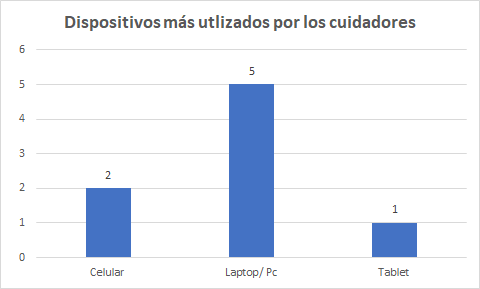

De la misma manera, se observa que los cuidadores de adultos mayores utilizan en su mayoria marcas de celulares con el sistema operativo Android.

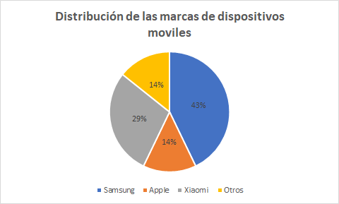

En cuanto a los navegadores web, los cuidadores de adultos mayores utilizan principalmente Google Chrome.

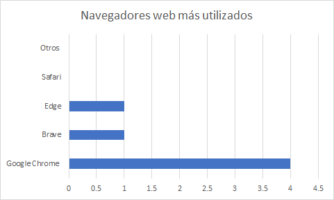

En base las entrevistas se determino el segmento demografico de la siguiente manera: 


De la misma manera, se determino las habilidades personales de los segmentos objetivos en base a la observación y comportamiento en las entrevistas realizadas.


Asimismo, se destaca la importancia del monitoreo de diferentes aspectos de la salud de los adultos mayores, como la presión arterial y la frecuencia cardíaca. Los entrevistados resaltan la relevancia de incluir estos parámetros en la aplicación móvil y la pulsera inteligente para proporcionar un monitoreo integral de la salud de los pacientes. 
# 2.3. Needfinding

## 2.3.1. User Personas

A continuación, se construirán los User Persona de cada segmento objetivo de nuestra plataforma. Para ello, se utilizarán los datos recolectados de las entrevistas realizadas.

**User Persona – Cuidador**

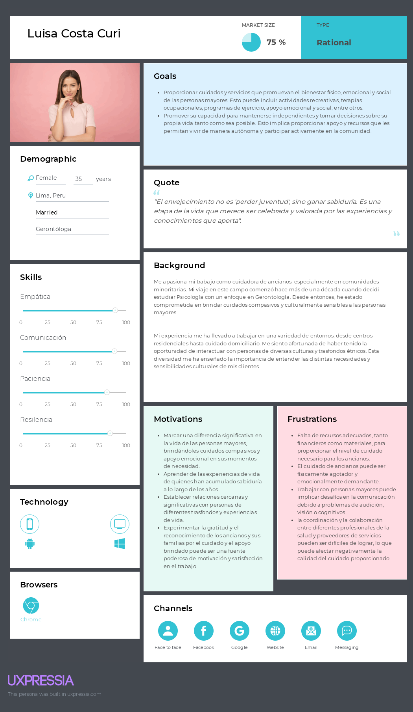

**User Persona – Supervisor**

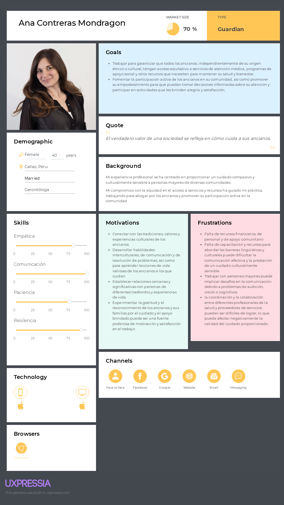

## 2.3.2. User Task Matrix

En esta sección, se describirán las actividades que realizarían los usuarios con respecto al cuidado de un adulto mayor. En el primer caso, se usa al user persona relacionado al cuidado de adultos en minorías. En el segundo aso, se usa al user persona relacionado al cuidado de adultos en mayorías.

<br>

<table><thead><tr><th rowspan="2"><br><br>User Task Matrix   <br><br></th><th colspan="2">Luisa Costa   <br></th><th colspan="2">Ana Contreras<br></th></tr><tr><th>Frecuencia<br></th><th>Importancia<br></th><th>Frecuencia<br></th><th>Importancia<br></th></tr></thead><tbody><tr><td><br>Monitorear signos vitales<br></td><td><br>Often</td><td><br>High</td><td><br>Often</td><td><br>High</td></tr><tr><td><br>Comunicarse con familiares y otros profesionales</td><td><br>Often<br></td><td><br>Medium</td><td><br>Often<br></td><td><br>Medium</td></tr><tr><td><br>Mantener registros y documentación<br></td><td><br>Often</td><td><br>High</td><td><br>Often</td><td><br>High</td></tr><tr><td><br>Administrar medicamentos<br></td><td><br>Often<br></td><td><br>High<br></td><td><br>Often<br></td><td><br>High<br></td></tr><tr><td><br>Facilitar actividades recreativas<br></td><td><br>Rarely<br></td><td><br>Medium<br></td><td><br>Rarely</td><td><br>Medium<br></td></tr></tbody></table>

<br>

## 2.3.3. User Journey Mapping

**User Journey Mapping – Cuidador**

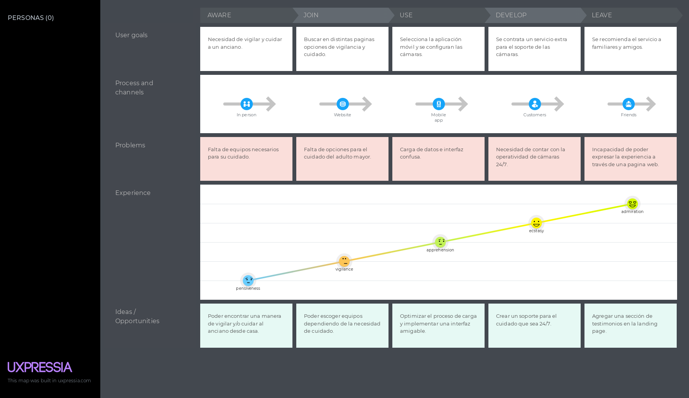

**User Journey Mapping – Supervisor**


## 2.3.4. Empathy Mapping

**Empathy Mapping – Cuidador**

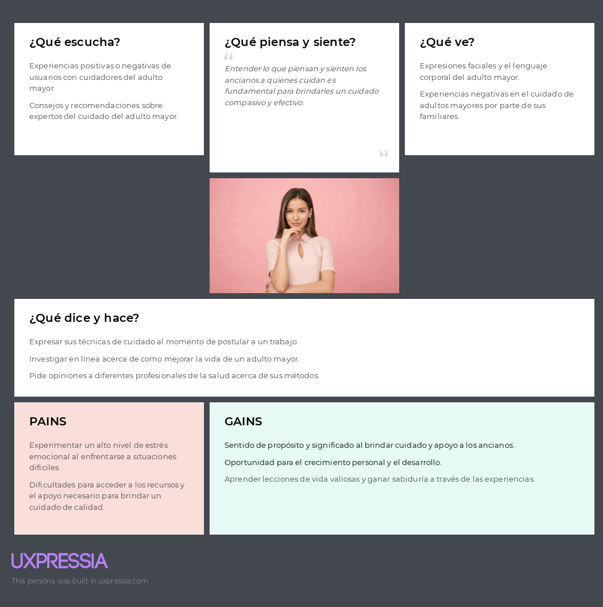

**Empathy Mapping – Supervisor**

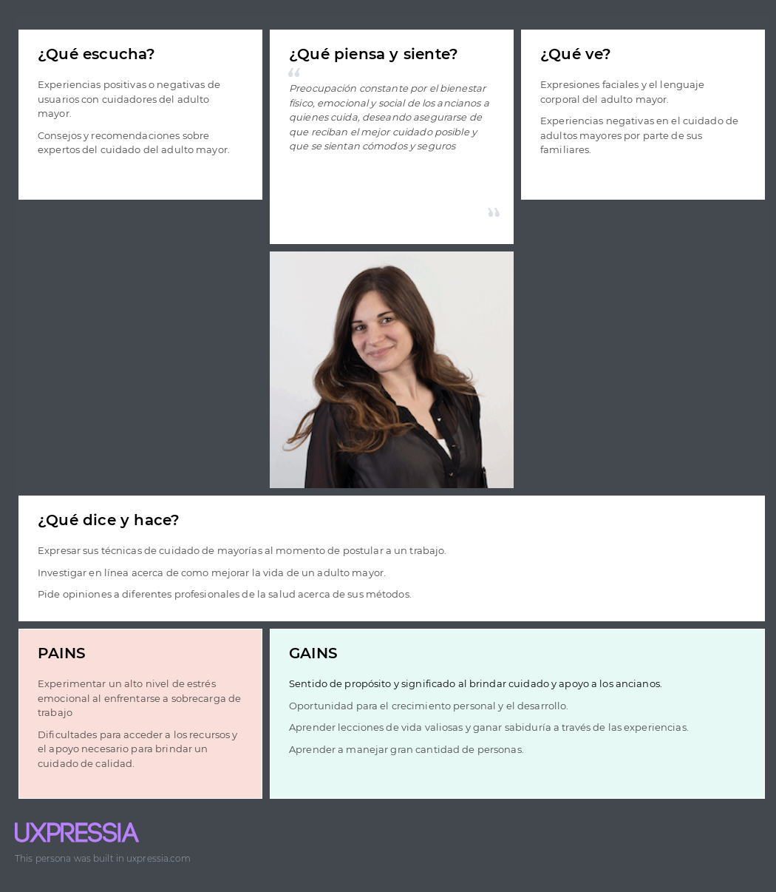

## 2.3.5. As-is Scenario Mapping

User - Cuidador


User - Supervisor


# 2.4. Ubiquitous Language

+ **Elderly (Adulto mayor):**     
  Una persona de la tercera edad (60 años a más).

+ **Keeper (Cuidador):**     
  Persona individual responsable del cuidado y atención de un adulto mayor, principalmente un familiar.

+ **Supervisor (Supervisor):**     
  Persona individual responsable del cuidado y atención de varios adultos mayores, este supervisor representaría a un profesional de la salud.

+ **Real time ubication (Ubicación en Tiempo Real):**     
  Capacidad de rastrear la ubicación exacta del adulto mayor en todo momento, proporcionando tranquilidad al cuidador y permitiendo una respuesta rápida en caso de emergencia.

+ **Reminder (Recordatorio):**     
  Recordatorio constante del consumo de consumo de medicina o de asistencia a una cita médica. Este recordatorio puede ser ya sea cada día, cada mes, o cada año.

  + **Device purchase (Compra de dispositivo):**     
  Se refiere al proceso de compra del dispositivo a través de medios oficiales, como podría ser nuestra aplicación web.

  # Capítulo III: Requirements Specification

# 3.1. To-Be Scenario Mapping


User - Cuidador


User - Supervisor


# 3.2. User Stories

<table>
<thead>
  <tr>
    <th>&nbsp;&nbsp;&nbsp;<br>Epic ID&nbsp;&nbsp;&nbsp;</th>
    <th>&nbsp;&nbsp;&nbsp;<br>Título&nbsp;&nbsp;&nbsp;&nbsp;</th>
    <th>&nbsp;&nbsp;&nbsp;<br>Descripción&nbsp;&nbsp;&nbsp;&nbsp;</th>
  </tr>
</thead>
<tbody>
  <tr>
    <td>&nbsp;&nbsp;&nbsp;<br>EP01&nbsp;&nbsp;&nbsp;</td>
    <td>&nbsp;&nbsp;&nbsp;<br>Desarrollo del Landing&nbsp;&nbsp;&nbsp;page&nbsp;&nbsp;&nbsp;&nbsp;</td>
    <td>&nbsp;&nbsp;&nbsp;<br>Se centra en el&nbsp;&nbsp;&nbsp;desarrollo del sitio web estático para la empresa. Incluye la creación de las&nbsp;&nbsp;&nbsp;diferentes secciones y funcionalidades necesarias para proporcionar&nbsp;&nbsp;&nbsp;información relevante sobre la empresa y el producto.&nbsp;&nbsp;&nbsp;</td>
  </tr>
  <tr>
    <td>&nbsp;&nbsp;&nbsp;<br>EP02&nbsp;&nbsp;&nbsp;</td>
    <td>&nbsp;&nbsp;&nbsp;<br>Autenticación y&nbsp;&nbsp;&nbsp;Registro de Usuarios&nbsp;&nbsp;&nbsp;</td>
    <td>&nbsp;&nbsp;&nbsp;<br>Abarca las&nbsp;&nbsp;&nbsp;funcionalidades relacionadas con la autenticación y el registro de usuarios&nbsp;&nbsp;&nbsp;en la aplicación, tanto en la versión web como móvil.&nbsp;&nbsp;&nbsp;</td>
  </tr>
  <tr>
    <td>&nbsp;&nbsp;&nbsp;<br>EP03&nbsp;&nbsp;&nbsp;</td>
    <td>&nbsp;&nbsp;&nbsp;<br>Monitorización y&nbsp;&nbsp;&nbsp;Seguimiento de la Persona Cuidada&nbsp;&nbsp;&nbsp;</td>
    <td>&nbsp;&nbsp;&nbsp;<br>Se enfoca en las&nbsp;&nbsp;&nbsp;funcionalidades relacionadas con la monitorización y seguimiento en tiempo&nbsp;&nbsp;&nbsp;real de la persona a cuidar, así como la visualización de datos históricos y&nbsp;&nbsp;&nbsp;la configuración de alertas.&nbsp;&nbsp;&nbsp;</td>
  </tr>
  <tr>
    <td>&nbsp;&nbsp;&nbsp;<br>EP04&nbsp;&nbsp;&nbsp;</td>
    <td>&nbsp;&nbsp;&nbsp;<br>Gestión de&nbsp;&nbsp;&nbsp;Configuraciones y Notificaciones&nbsp;&nbsp;&nbsp;</td>
    <td>&nbsp;&nbsp;&nbsp;<br>Las&nbsp;&nbsp;&nbsp;funcionalidades relacionadas con la configuración de notificaciones y alertas&nbsp;&nbsp;&nbsp;personalizadas, así como la gestión de configuraciones de cuenta y&nbsp;&nbsp;&nbsp;medicamentos.&nbsp;&nbsp;&nbsp;</td>
  </tr>
  <tr>
    <td>&nbsp;&nbsp;&nbsp;<br>EP05&nbsp;&nbsp;&nbsp;</td>
    <td>&nbsp;&nbsp;&nbsp;<br>Desarrollo del&nbsp;&nbsp;&nbsp;Back-end&nbsp;&nbsp;&nbsp;</td>
    <td>&nbsp;&nbsp;&nbsp;<br>Se enfoca en el&nbsp;&nbsp;&nbsp;desarrollo del back-end de la aplicación&nbsp;&nbsp;&nbsp;</td>
  </tr>
  <tr>
    <td>&nbsp;&nbsp;&nbsp;<br>EP06&nbsp;&nbsp;&nbsp;</td>
    <td>&nbsp;&nbsp;&nbsp;<br>Conexión con&nbsp;&nbsp;&nbsp;Dispositivos de Monitoreo&nbsp;&nbsp;&nbsp;</td>
    <td>&nbsp;&nbsp;&nbsp;<br>La integración con&nbsp;&nbsp;&nbsp;dispositivos de monitoreo de salud externos, así como la implementación de&nbsp;&nbsp;&nbsp;notificaciones push y análisis de datos.&nbsp;&nbsp;&nbsp;</td>
  </tr>
</tbody>
</table>

<table>
<thead>
  <tr>
    <th>&nbsp;&nbsp;&nbsp;<br>User Story ID&nbsp;&nbsp;&nbsp;</th>
    <th>&nbsp;&nbsp;&nbsp;<br>Título&nbsp;&nbsp;&nbsp;</th>
    <th>&nbsp;&nbsp;&nbsp;<br>Descripción&nbsp;&nbsp;&nbsp;</th>
    <th>&nbsp;&nbsp;&nbsp;<br>Criterios de Aceptación&nbsp;&nbsp;&nbsp;</th>
    <th>&nbsp;&nbsp;&nbsp;<br>EPIC ID&nbsp;&nbsp;&nbsp;</th>
  </tr>
</thead>
<tbody>
  <tr>
    <td>&nbsp;&nbsp;&nbsp;<br>US01&nbsp;&nbsp;&nbsp;</td>
    <td>&nbsp;&nbsp;&nbsp;<br>Acceso a la cuenta<br>&nbsp;&nbsp;&nbsp;(Web application)&nbsp;&nbsp;&nbsp;</td>
    <td>&nbsp;&nbsp;&nbsp;<br>Como usuario de la aplicación.<br>&nbsp;&nbsp;&nbsp;Quiero acceder a mi cuenta de usuario.<br>&nbsp;&nbsp;&nbsp;Para poder verificar mi identidad<br>&nbsp;&nbsp;&nbsp;Y ver los datos de la persona cuidada.&nbsp;&nbsp;&nbsp;</td>
    <td>   <br>Escenario: Ingreso incorrecto de datos  <br> Dado que el usuario está en la pantalla de acceso.<br>   Cuando ingresa la contraseña y/o usuario incorrecto.<br>   Entonces la página muestra un mensaje de<br>   "Datos incorrectos".<br>   <br>   Escenario: Ingreso correcto de datos<br>   Dado que el usuario está en la pantalla de acceso.<br>   Cuando ingresa la contraseña y/o usuario correcto.<br>   Entonces el usuario es enviado a la página<br>   principal.<br>   Y se envia un mensaje al correo electrónico<br>   afiliado.   </td>
    <td>&nbsp;&nbsp;&nbsp;<br>EP02&nbsp;&nbsp;&nbsp;</td>
  </tr>
  <tr>
    <td>&nbsp;&nbsp;&nbsp;<br>US02&nbsp;&nbsp;&nbsp;</td>
    <td>&nbsp;&nbsp;&nbsp;<br>Acceso a la cuenta<br>&nbsp;&nbsp;&nbsp;(Mobile application)&nbsp;&nbsp;&nbsp;</td>
    <td>&nbsp;&nbsp;&nbsp;<br>Como usuario de la aplicación.<br>&nbsp;&nbsp;&nbsp;Quiero acceder a mi cuenta de usuario.<br>&nbsp;&nbsp;&nbsp;Para poder verificar mi identidad<br>&nbsp;&nbsp;&nbsp;Y ver los datos de la persona cuidada.&nbsp;&nbsp;&nbsp;</td>
    <td>   <br>Escenario: Ingreso incorrecto de datos   <br>Dado que el usuario está en la pantalla de acceso.<br>   Cuando ingresa la contraseña y/o usuario incorrecto.<br>   Entonces la página mosuestra un mensaje de<br>   "Datos incorrectos".<br>   <br>   Escenario: Ingreso correcto de datos<br>   Dado que el usuario está en la pantalla de acceso.<br>   Cuando ingresa la contraseña y/o usuario correcto.<br>   Entonces el usuario es enviado a la página<br>   principal.<br>   Y se envia un mensaje al correo electrónico<br>   afiliado.   </td>
    <td>&nbsp;&nbsp;&nbsp;<br>EP02&nbsp;&nbsp;&nbsp;</td>
  </tr>
  <tr>
    <td>&nbsp;&nbsp;&nbsp;<br>US03&nbsp;&nbsp;&nbsp;</td>
    <td>&nbsp;&nbsp;&nbsp;<br>Registro de cuenta.<br>&nbsp;&nbsp;&nbsp;(Web Application)&nbsp;&nbsp;&nbsp;</td>
    <td>&nbsp;&nbsp;&nbsp;<br>Como usuario de la aplicación.<br>&nbsp;&nbsp;&nbsp;Quiero poder registrarme en la aplicación.<br>&nbsp;&nbsp;&nbsp;Para poder comenzar con el monitoreo de<br>&nbsp;&nbsp;&nbsp;la persona a cuidar.&nbsp;&nbsp;&nbsp;</td>
    <td>   <br>Escenario: Creación de la cuenta   <br>Dado que el usuario está en la pantalla de registro.<br>   Cuando el usuario ingresa datos como correo<br>   electrónico, nombre de usuario y contraseña<br>   Entonces una nueva cuenta se crea<br>   Y el usuario es llevado a la página principal.<br>   <br>   Escenario: Activación de la pulsera.<br>   Dado que el usuario tiene una cuenta<br>   Y hay una pulsera afiliada a la cuenta.<br>   Cuando la pulsera está prendida.<br>   Entonces la pulsera actualiza los datos en la<br>   base de datos.   </td>
    <td>&nbsp;&nbsp;&nbsp;<br>EP02&nbsp;&nbsp;&nbsp;</td>
  </tr>
  <tr>
    <td>&nbsp;&nbsp;&nbsp;<br>US04&nbsp;&nbsp;&nbsp;</td>
    <td>&nbsp;&nbsp;&nbsp;<br>Registro de cuenta.<br>&nbsp;&nbsp;&nbsp;(Mobile Application)&nbsp;&nbsp;&nbsp;</td>
    <td>&nbsp;&nbsp;&nbsp;<br>Como usuario de la aplicación.<br>&nbsp;&nbsp;&nbsp;Quiero poder registrarme en la aplicación.<br>&nbsp;&nbsp;&nbsp;Para poder comenzar con el monitoreo de<br>&nbsp;&nbsp;&nbsp;la persona a cuidar.&nbsp;&nbsp;&nbsp;</td>
    <td>   <br>Escenario: Creación de la cuenta   <br>Dado que el usuario está en la pantalla de registro.<br>   Cuando el usuario ingresa datos como correo<br>   electrónico, nombre de usuario y contraseña<br>   Entonces una nueva cuenta se crea<br>   Y el usuario es llevado a la página principal.<br>   <br>   Escenario: Activación de la pulsera.<br>   Dado que el usuario tiene una cuenta<br>   Y hay una pulsera afiliada a la cuenta.<br>   Cuando la pulsera está prendida.<br>   Entonces la pulsera actualiza los datos en la<br>   base de datos.   </td>
    <td>&nbsp;&nbsp;&nbsp;<br>EP02&nbsp;&nbsp;&nbsp;</td>
  </tr>
  <tr>
    <td>&nbsp;&nbsp;&nbsp;<br>US05&nbsp;&nbsp;&nbsp;</td>
    <td>&nbsp;&nbsp;&nbsp;<br>Edición de datos de la cuenta.&nbsp;&nbsp;&nbsp;</td>
    <td>&nbsp;&nbsp;&nbsp;<br>Como usuario de la aplicación.<br>&nbsp;&nbsp;&nbsp;Quiero poder editar ciertos datos<br>&nbsp;&nbsp;&nbsp;de mi cuenta como contraseña.<br>&nbsp;&nbsp;&nbsp;Para poder corregir errores<br>&nbsp;&nbsp;&nbsp;Y renovar la contraseña.&nbsp;&nbsp;&nbsp;</td>
    <td>&nbsp;&nbsp;&nbsp;<br>Escenario: Editar nombre de usuario.&nbsp;&nbsp;&nbsp;Dado que el usuario está en la pantalla de actualización<br>&nbsp;&nbsp;&nbsp;de datos.<br>&nbsp;&nbsp;&nbsp;Cuando el usuario ingresa el nombre actualizado.<br>&nbsp;&nbsp;&nbsp;Entonces el nombre del usuario es actualizado.<br>&nbsp;&nbsp;&nbsp;<br>&nbsp;&nbsp;&nbsp;Escenario: Editar contraseña.<br>&nbsp;&nbsp;&nbsp;Dado que el usuario está en la pantalla de actualización<br>&nbsp;&nbsp;&nbsp;de datos.<br>&nbsp;&nbsp;&nbsp;Cuando el usuario ingresa la contraseña actualizada.<br>&nbsp;&nbsp;&nbsp;Y ingresa la contraseña anterior<br>&nbsp;&nbsp;&nbsp;Y verifica a través de un correo electrónico.<br>&nbsp;&nbsp;&nbsp;Entonces se actualiza la contraseña de la cuenta.<br>&nbsp;&nbsp;&nbsp;<br>&nbsp;&nbsp;&nbsp;Escenario: Editar el correo electrónico<br>&nbsp;&nbsp;&nbsp;afiliado.<br>&nbsp;&nbsp;&nbsp;Dado que el usuario está en la pantalla de actualización<br>&nbsp;&nbsp;&nbsp;de datos.<br>&nbsp;&nbsp;&nbsp;Cuando el usuario reingrese el correo electrónico<br>&nbsp;&nbsp;&nbsp;anterior<br>&nbsp;&nbsp;&nbsp;Y ingrese la contraseña para verificar<br>&nbsp;&nbsp;&nbsp;Entonces se actualizará el correo electrónico afiliado.&nbsp;&nbsp;&nbsp;</td>
    <td>&nbsp;&nbsp;&nbsp;<br>EP04&nbsp;&nbsp;&nbsp;</td>
  </tr>
  <tr>
    <td>&nbsp;&nbsp;&nbsp;<br>US06&nbsp;&nbsp;&nbsp;</td>
    <td>&nbsp;&nbsp;&nbsp;<br>Obtención de la información<br>&nbsp;&nbsp;&nbsp;sobre la persona cuidada.&nbsp;&nbsp;&nbsp;</td>
    <td>&nbsp;&nbsp;&nbsp;<br>Como usuario de la aplicación.<br>&nbsp;&nbsp;&nbsp;Quiero poder recibir información de la<br>&nbsp;&nbsp;&nbsp;pulsera.<br>&nbsp;&nbsp;&nbsp;Para poder tener constancia de la situación<br>&nbsp;&nbsp;&nbsp;de la persona que estoy cuidando.&nbsp;&nbsp;&nbsp;</td>
    <td>   <br>Escenario: Conexión con la pulsera.   <br>Dado que la pulsera está prendida<br>   Cuando recibe una confirmación de afiliación con<br>   una cuenta de un usuario.<br>   Entonces la pulsera se afilia con la cuenta de tal<br>   usuario.<br>   <br>   Escenario: Guardado de los datos<br>   en una base de datos local.<br>   Dado que la pulsera está afiliada a una cuenta<br>   Y se encuentra prendida.<br>   Cuando se detecta algún cambio en el pulso cardiaco,<br>   presión arterial o distancia de cierto punto.<br>   Entonces se actualizan los datos dentro de la base<br>   de datos local.   </td>
    <td>&nbsp;&nbsp;&nbsp;<br>EP03&nbsp;&nbsp;&nbsp;</td>
  </tr>
  <tr>
    <td>&nbsp;&nbsp;&nbsp;<br>US07&nbsp;&nbsp;&nbsp;</td>
    <td>&nbsp;&nbsp;&nbsp;<br>Visualización de la información sobre<br>&nbsp;&nbsp;&nbsp;la persona cuidada.<br>&nbsp;&nbsp;&nbsp;(Web application)&nbsp;&nbsp;&nbsp;</td>
    <td>&nbsp;&nbsp;&nbsp;<br>Como usuario de la aplicación.<br>&nbsp;&nbsp;&nbsp;Quiero poder visualizar la información de la<br>&nbsp;&nbsp;&nbsp;pulsera.<br>&nbsp;&nbsp;&nbsp;Para poder tener constancia de la situación<br>&nbsp;&nbsp;&nbsp;de la persona que estoy cuidando<br>&nbsp;&nbsp;&nbsp;Y poder tomar medidas al respecto.&nbsp;&nbsp;&nbsp;</td>
    <td>   <br>Escenario: Acceso a la pantalla de datos   <br>Dado a que el usuario se encuentra en la pantalla<br>   principal.<br>   Cuando el usuario seleccione la opción de visualizar la<br>   información.<br>   Entonces el usuario es enviado a una pantalla en dónde<br>   de visualiza en tiempo real la presión arterial,<br>   el pulso cardiaco y la distancia a cierto punto de la<br>   pulsera.<br>   <br>   Escenario: Línea de tiempo de presión arterial<br>   Dado a que el usuario se encuentra en la pantalla de<br>   visualización de datos.<br>   Cuando presiona en la sección de presión arterial.<br>   Entonces es llevado a una pantalla dónde hay una línea<br>   de tiempo que recopila la presión arterial de los dos<br>   últimos días.<br>   <br>   Escenario: Línea de tiempo de pulso cardiaco<br>   Dado a que el usuario se encuentra en la pantalla de<br>   visualización de datos.<br>   Cuando presiona en la sección de pulso cardiaco.<br>   Entonces es llevado a una pantalla dónde hay<br>   una línea de tiempo que recopila el pulso<br>   cardiaco los dos últimos días.   </td>
    <td>&nbsp;&nbsp;&nbsp;<br>EP03&nbsp;&nbsp;&nbsp;</td>
  </tr>
  <tr>
    <td>&nbsp;&nbsp;&nbsp;<br>US08&nbsp;&nbsp;&nbsp;</td>
    <td>&nbsp;&nbsp;&nbsp;<br>Visualización de la información sobre<br>&nbsp;&nbsp;&nbsp;la persona cuidada.<br>&nbsp;&nbsp;&nbsp;(Mobile application)&nbsp;&nbsp;&nbsp;</td>
    <td>&nbsp;&nbsp;&nbsp;<br>Como usuario de la aplicación.<br>&nbsp;&nbsp;&nbsp;Quiero poder visualizar la información de la<br>&nbsp;&nbsp;&nbsp;pulsera.<br>&nbsp;&nbsp;&nbsp;Para poder tener constancia de la situación<br>&nbsp;&nbsp;&nbsp;de la persona que estoy cuidando<br>&nbsp;&nbsp;&nbsp;Y poder tomar medidas al respecto.&nbsp;&nbsp;&nbsp;</td>
    <td>   <br>Escenario: Acceso a la pantalla de datos  <br> Dado a que el usuario se encuentra en la pantalla<br>   principal.<br>   Cuando el usuario seleccione la opción de visualizar la<br>   información.<br>   Entonces el usuario es enviado a una pantalla en dónde<br>   de visualiza en tiempo real la presión arterial,<br>   el pulso cardiaco y la distancia a cierto punto de la<br>   pulsera.<br>   <br>   Escenario: Línea de tiempo de presión arterial<br>   Dado a que el usuario se encuentra en la pantalla de<br>   visualización de datos.<br>   Cuando presiona en la sección de presión arterial.<br>   Entonces es llevado a una pantalla dónde hay una línea<br>   de tiempo que recopila la presión arterial de los dos<br>   últimos días.<br>   <br>   Escenario: Línea de tiempo de pulso cardiaco<br>   Dado a que el usuario se encuentra en la pantalla de<br>   visualización de datos.<br>   Cuando presiona en la sección de pulso cardiaco.<br>   Entonces es llevado a una pantalla dónde hay<br>   una línea de tiempo que recopila el pulso<br>   cardiaco los dos últimos días.   </td>
    <td>&nbsp;&nbsp;&nbsp;<br>EP03&nbsp;&nbsp;&nbsp;</td>
  </tr>
  <tr>
    <td>&nbsp;&nbsp;&nbsp;<br>US09&nbsp;&nbsp;&nbsp;</td>
    <td>&nbsp;&nbsp;&nbsp;<br>Generar alarmas cuando se detecten<br>&nbsp;&nbsp;&nbsp;emergencias en la persona cuidada.&nbsp;&nbsp;&nbsp;</td>
    <td>&nbsp;&nbsp;&nbsp;<br>Como usuario de la aplicación.<br>&nbsp;&nbsp;&nbsp;Quiero recibir alarmas en caso que se suceda<br>&nbsp;&nbsp;&nbsp;alguna emergencia.<br>&nbsp;&nbsp;&nbsp;Para poder tomar medidas al respecto.&nbsp;&nbsp;&nbsp;</td>
    <td>   <br>Escenario: Lectura anormal de pulso cardiaco.  <br> Dado a que la pulsera se encuentra afiliada a una cuenta<br>   Y está prendida.<br>   Cuando detecta una pulso cardiaco alto o bajo<br>   (mayor a 100bpm o menor a 60 bpm).<br>   Entonces la pulsera envía una notificación con alarma<br>   al usuario con detalles del incidente, incluyendo<br>   posición, pulso cardiaco y hora del incidente.<br>   <br>   Escenario: Lectura de presión arterial alta.<br>   Dado a que la pulsera se encuentra afiliada a una cuenta<br>   Y está prendida.<br>   Cuando detecta una presión arterial alta o baja (mayor a<br>   140/90 mmHG o menor a 90/60 mmHG)<br>   Entonces la pulsera envía una notificación con alarma<br>   al usuario con detalles del incidente, incluyendo<br>   posición, presión arterial y hora del incidente.<br>   <br>   Escenario: Lectura de distancia límite.<br>   Dado a que la pulsera se encuentra afiliada a una cuenta<br>   Y está prendida<br>   Y tiene un punto de referencia al cual referir la<br>   distancia.<br>   Cuando detecta que el punto de referencia está a una<br>   distancia mayor (alrededor de 15 metros, pero<br>   depende del usuario)<br>   Entonces la pulsera envía una notificación con alarma<br>   al usuario con detalles del incidente, incluyendo posición<br>   al momento de generarse la emergencia, presión arterial,<br>   pulso cardiaco y hora del incidente.   </td>
    <td>&nbsp;&nbsp;&nbsp;<br>EP03&nbsp;&nbsp;&nbsp;</td>
  </tr>
  <tr>
    <td>&nbsp;&nbsp;&nbsp;<br>US10&nbsp;&nbsp;&nbsp;</td>
    <td>&nbsp;&nbsp;&nbsp;<br>Sección About Us&nbsp;&nbsp;&nbsp;</td>
    <td>&nbsp;&nbsp;&nbsp;<br>Como visitante de la página destino<br>&nbsp;&nbsp;&nbsp;Quiero poder visualizar la información<br>&nbsp;&nbsp;&nbsp;del grupo de desarrolladores<br>&nbsp;&nbsp;&nbsp;Para poder confirmar que los desarrolladores<br>&nbsp;&nbsp;&nbsp;tienen experiencia anterior en el<br>&nbsp;&nbsp;&nbsp;desarrollo de software.&nbsp;&nbsp;&nbsp;</td>
    <td>   <br>Escenario: Misión de la empresa  <br> Dado a que el visitante se encuentra en la página<br>   de destino<br>   Cuando baja a la sección sobre la empresa<br>   Entonces el visitante visualiza un párrafo sobre la<br>   misión de la empresa.<br>   <br>   Escenario: Visión de la empresa<br>   Dado a que el visitante se encuentra en la página<br>   de destino<br>   Cuando baja a la sección sobre la empresa<br>   Entonces el visitante visualiza un párrafo sobre<br>   la visión de la empresa.<br>   <br>   Escenario: Integrantes de la empresa<br>   Dado a que el visitante se encuentra en la página<br>   de destino<br>   Cuando baja a la sección sobre la empresa<br>   Entonces el visitante visualiza varios párrafos<br>   sobre cada uno de los desarrolladores de la<br>   aplicación.   </td>
    <td>&nbsp;&nbsp;&nbsp;<br>EP01&nbsp;&nbsp;&nbsp;</td>
  </tr>
  <tr>
    <td>&nbsp;&nbsp;&nbsp;<br>US11&nbsp;&nbsp;&nbsp;</td>
    <td>&nbsp;&nbsp;&nbsp;<br>Sección About the Product&nbsp;&nbsp;&nbsp;</td>
    <td>&nbsp;&nbsp;&nbsp;<br>Como visitante de la página de destino<br>&nbsp;&nbsp;&nbsp;Quiero poder visualizar la información<br>&nbsp;&nbsp;&nbsp;del producto<br>&nbsp;&nbsp;&nbsp;Para poder verificar las funcionalidades de<br>&nbsp;&nbsp;&nbsp;la aplicación antes de probarla.&nbsp;&nbsp;&nbsp;</td>
    <td>   <br>Escenario: Descripción general de la aplicación   <br>Dado a que el visitante se encuentra en la página<br>   de destino<br>   Cuando baja a la sección sobre la empresa<br>   Entonces el visitante visualiza un párrafo corto<br>   sobre el valor principal de la aplicación.<br>   <br>   Escenario: Funcionalidades de la aplicación<br>   Dado a que el visitante se encuentra en la página<br>   de destino<br>   Cuando baja a la sección sobre la empresa<br>   Entonces el visitante visualiza varios párrafos sobre<br>   funcionalidades de la aplicación.   </td>
    <td>&nbsp;&nbsp;&nbsp;<br>EP01&nbsp;&nbsp;&nbsp;</td>
  </tr>
  <tr>
    <td>&nbsp;&nbsp;&nbsp;<br>US12&nbsp;&nbsp;&nbsp;</td>
    <td>&nbsp;&nbsp;&nbsp;<br>Sección Contacto&nbsp;&nbsp;&nbsp;</td>
    <td>&nbsp;&nbsp;&nbsp;<br>Como visitante de la página de destino<br>&nbsp;&nbsp;&nbsp;Quiero poder enviar un mensaje<br>&nbsp;&nbsp;&nbsp;Para poder informar de errores o problemas<br>&nbsp;&nbsp;&nbsp;con la aplicación con el equipo<br>&nbsp;&nbsp;&nbsp;desarrollador.&nbsp;&nbsp;&nbsp;</td>
    <td>   <br>Escenario: Insertar mensaje.   <br>Dado a que el visitante se encuentra en la página<br>   de destino<br>   Cuando baja a la sección de contacto<br>   E ingresa un texto<br>   Y envía el mensaje<br>   Entonces un mensaje es enviado   </td>
    <td>&nbsp;&nbsp;&nbsp;<br>EP01&nbsp;&nbsp;&nbsp;</td>
  </tr>
  <tr>
    <td>&nbsp;&nbsp;&nbsp;<br>US13&nbsp;&nbsp;&nbsp;</td>
    <td>&nbsp;&nbsp;&nbsp;<br>Sección de Redes Sociales&nbsp;&nbsp;&nbsp;</td>
    <td>&nbsp;&nbsp;&nbsp;<br>Como visitante de la página<br>&nbsp;&nbsp;&nbsp;Quiero poder acceder a las redes sociales<br>&nbsp;&nbsp;&nbsp;de la empresa<br>&nbsp;&nbsp;&nbsp;Para poder ver distintas novedades<br>&nbsp;&nbsp;&nbsp;relacionadas a políticas de la empresa<br>&nbsp;&nbsp;&nbsp;o cambios en la aplicación.&nbsp;&nbsp;&nbsp;</td>
    <td>   <br>Escenario: Facebook  <br> Dado a que el visitante se encuentra en la página<br>   de destino<br>   Cuando baja al pie de la página<br>   y seleccione la opción de Facebook<br>   Entonces el visitante es dirigido a la página de Facebook<br>   de la empresa.<br>   <br>   Escenario: Instagram<br>   Dado a que el visitante se encuentra en la página<br>   de destino<br>   Cuando baja al pie de la página<br>   y seleccione la opción de Instagram<br>   Entonces el visitante es dirigido a la página de<br>   Instagram de la empresa.<br>   <br>   Escenario: Twitter<br>   Dado a que el visitante se encuentra en la página<br>   de destino<br>   Cuando baja al pie de la página<br>   y seleccione la opción de Twitter<br>   Entonces el visitante es dirigido a la página de Twitter<br>   de la empresa.   </td>
    <td>&nbsp;&nbsp;&nbsp;<br>EP01&nbsp;&nbsp;&nbsp;</td>
  </tr>
  <tr>
    <td>&nbsp;&nbsp;&nbsp;<br>US014&nbsp;&nbsp;&nbsp;</td>
    <td>&nbsp;&nbsp;&nbsp;<br>Configuración de Notificaciones de Medicamentos<br>&nbsp;&nbsp;&nbsp;(Mobile application)&nbsp;&nbsp;&nbsp;</td>
    <td>&nbsp;&nbsp;&nbsp;<br>Como usuario de la aplicación móvil,&nbsp;&nbsp;&nbsp;quiero poder configurar los recordatorios de medicamentos del adulto mayor,&nbsp;&nbsp;&nbsp;para asegurarme que se administren a tiempo.&nbsp;&nbsp;&nbsp;</td>
    <td>&nbsp;&nbsp;&nbsp;<br>Escenario:&nbsp;&nbsp;&nbsp;Configurar Recordatorio<br>&nbsp;&nbsp;&nbsp;<br>Dado que&nbsp;&nbsp;&nbsp;el usuario está gestionando la lista de medicamentos.<br>&nbsp;&nbsp;&nbsp;<br>Cuando el&nbsp;&nbsp;&nbsp;usuario quiere modificar un recordatorio de algún medicamento.<br>&nbsp;&nbsp;&nbsp;<br>Entonces&nbsp;&nbsp;&nbsp;se le solicita modificar el nombre del medicamento, la dosis, la frecuencia y&nbsp;&nbsp;&nbsp;la hora de administración.<br>&nbsp;&nbsp;&nbsp;<br> <br>&nbsp;&nbsp;&nbsp;<br>Escenario:&nbsp;&nbsp;&nbsp;Activar Notificaciones<br>&nbsp;&nbsp;&nbsp;<br>Dado que&nbsp;&nbsp;&nbsp;el usuario agrega un nuevo medicamento.<br>&nbsp;&nbsp;&nbsp;<br>Cuando el&nbsp;&nbsp;&nbsp;usuario activa las notificaciones para ese medicamento.<br>&nbsp;&nbsp;&nbsp;<br>Entonces&nbsp;&nbsp;&nbsp;se programan automáticamente notificaciones diarias para recordar la&nbsp;&nbsp;&nbsp;administración del medicamento.&nbsp;&nbsp;&nbsp;</td>
    <td>&nbsp;&nbsp;&nbsp;<br>EP04&nbsp;&nbsp;&nbsp;</td>
  </tr>
  <tr>
    <td>&nbsp;&nbsp;&nbsp;<br>US015&nbsp;&nbsp;&nbsp;</td>
    <td>&nbsp;&nbsp;&nbsp;<br>Configuración de notificaciones<br>&nbsp;&nbsp;&nbsp;(Mobile application)&nbsp;&nbsp;&nbsp;</td>
    <td>&nbsp;&nbsp;&nbsp;<br>Como usuario de la aplicación móvil,&nbsp;&nbsp;&nbsp;quiero poder configurar las notificaciones de emergencia para adaptarlas a&nbsp;&nbsp;&nbsp;mis preferencias y necesidades específicas.&nbsp;&nbsp;&nbsp;</td>
    <td>&nbsp;&nbsp;&nbsp;<br>Escenario:&nbsp;&nbsp;&nbsp;Configuración de Preferencias de Notificación<br>&nbsp;&nbsp;&nbsp;<br>Dado que&nbsp;&nbsp;&nbsp;el usuario está en la sección de configuración.<br>&nbsp;&nbsp;&nbsp;<br>Cuando&nbsp;&nbsp;&nbsp;ajusta las preferencias de notificación.<br>&nbsp;&nbsp;&nbsp;<br>Entonces&nbsp;&nbsp;&nbsp;se presenta la posibilidad de activar o desactivar notificaciones para&nbsp;&nbsp;&nbsp;diferentes tipos de emergencias.<br>&nbsp;&nbsp;&nbsp;<br> <br>&nbsp;&nbsp;&nbsp;<br>Escenario:&nbsp;&nbsp;&nbsp;Guardado de Preferencias de Notificación<br>&nbsp;&nbsp;&nbsp;<br>Dado que&nbsp;&nbsp;&nbsp;el usuario configura sus preferencias de notificación.<br>&nbsp;&nbsp;&nbsp;<br>Cuando&nbsp;&nbsp;&nbsp;guarda los cambios realizados.<br>&nbsp;&nbsp;&nbsp;<br>Entonces&nbsp;&nbsp;&nbsp;las preferencias de notificación se guardan y se aplican en futuras&nbsp;&nbsp;&nbsp;situaciones de emergencia.&nbsp;&nbsp;&nbsp;</td>
    <td>&nbsp;&nbsp;&nbsp;<br>EP04&nbsp;&nbsp;&nbsp;</td>
  </tr>
  <tr>
    <td>&nbsp;&nbsp;&nbsp;<br>US016&nbsp;&nbsp;&nbsp;</td>
    <td>&nbsp;&nbsp;&nbsp;<br>Acceso a registros históricos<br>&nbsp;&nbsp;&nbsp;(Mobile application)&nbsp;&nbsp;&nbsp;</td>
    <td>&nbsp;&nbsp;&nbsp;<br>Como usuario de la aplicación móvil,&nbsp;&nbsp;&nbsp;quiero  poder acceder a registros históricos de la salud del adulto&nbsp;&nbsp;&nbsp;mayor para realizar un seguimiento a largo plazo y detectar tendencias.&nbsp;&nbsp;&nbsp;</td>
    <td>&nbsp;&nbsp;&nbsp;<br>Escenario:&nbsp;&nbsp;&nbsp;Acceder a Registros Históricos de Salud<br>&nbsp;&nbsp;&nbsp;<br>Dado que&nbsp;&nbsp;&nbsp;el usuario desea revisar datos históricos.<br>&nbsp;&nbsp;&nbsp;<br>Cuando&nbsp;&nbsp;&nbsp;busca los registros de salud.<br>&nbsp;&nbsp;&nbsp;<br>Entonces&nbsp;&nbsp;&nbsp;puede seleccionar una fecha para ver los datos registrados en esa fecha.<br>&nbsp;&nbsp;&nbsp;<br> <br>&nbsp;&nbsp;&nbsp;<br>Escenario:&nbsp;&nbsp;&nbsp;Acceder a Registros Históricos de Ubicación<br>&nbsp;&nbsp;&nbsp;<br>Dado que&nbsp;&nbsp;&nbsp;el usuario desea revisar datos históricos.<br>&nbsp;&nbsp;&nbsp;<br>Cuando&nbsp;&nbsp;&nbsp;busca los registros de salud en una fecha que no tiene registros.<br>&nbsp;&nbsp;&nbsp;<br>Entonces&nbsp;&nbsp;&nbsp;el usuario deberá visualizar una advertencia que no se encuentra registrada&nbsp;&nbsp;&nbsp;en la fecha específica.&nbsp;&nbsp;&nbsp;</td>
    <td>&nbsp;&nbsp;&nbsp;<br>EP02&nbsp;&nbsp;&nbsp;</td>
  </tr>
  <tr>
    <td>&nbsp;&nbsp;&nbsp;<br>US017&nbsp;&nbsp;&nbsp;</td>
    <td>&nbsp;&nbsp;&nbsp;<br>Registro de múltiples cuentas de cuidadores (Mobile application)&nbsp;&nbsp;&nbsp;</td>
    <td>&nbsp;&nbsp;&nbsp;<br>Como usuario de la aplicación móvil ,&nbsp;&nbsp;&nbsp;quiero  poder registrar y alternar entre múltiples cuentas de cuidadores&nbsp;&nbsp;&nbsp;para supervisar a diferentes adultos mayores a mi cargo.&nbsp;&nbsp;&nbsp;</td>
    <td>&nbsp;&nbsp;&nbsp;<br>Escenario:&nbsp;&nbsp;&nbsp;Registro de una Nueva Cuenta de Cuidador<br>&nbsp;&nbsp;&nbsp;<br>Dado que&nbsp;&nbsp;&nbsp;el usuario está gestionando cuentas.<br>&nbsp;&nbsp;&nbsp;<br>Cuando&nbsp;&nbsp;&nbsp;agrega una nueva cuenta de cuidador.<br>&nbsp;&nbsp;&nbsp;<br>Entonces&nbsp;&nbsp;&nbsp;se le solicitan los datos necesarios para crear la cuenta.<br>&nbsp;&nbsp;&nbsp;<br> <br>&nbsp;&nbsp;&nbsp;<br>Escenario:&nbsp;&nbsp;&nbsp;Alternar entre Cuentas de Cuidadores<br>&nbsp;&nbsp;&nbsp;<br>Dado que&nbsp;&nbsp;&nbsp;el usuario tiene múltiples cuentas de cuidador registradas.<br>&nbsp;&nbsp;&nbsp;<br>Cuando selecciona&nbsp;&nbsp;&nbsp;la opción para cambiar de cuenta.<br>&nbsp;&nbsp;&nbsp;<br>Entonces&nbsp;&nbsp;&nbsp;se presenta una lista de las cuentas registradas y puede seleccionar la que&nbsp;&nbsp;&nbsp;desea utilizar.&nbsp;&nbsp;&nbsp;</td>
    <td>&nbsp;&nbsp;&nbsp;<br>EP02&nbsp;&nbsp;&nbsp;</td>
  </tr>
  <tr>
    <td>&nbsp;&nbsp;&nbsp;<br>US018&nbsp;&nbsp;&nbsp;</td>
    <td>&nbsp;&nbsp;&nbsp;<br>Configurar alertas personalizadas<br>&nbsp;&nbsp;&nbsp;(Mobile application)&nbsp;&nbsp;&nbsp;</td>
    <td>&nbsp;&nbsp;&nbsp;<br>Como usuario de la&nbsp;&nbsp;&nbsp;aplicación móvil, quiero poder configurar las  alertas  para&nbsp;&nbsp;&nbsp;recibir notificaciones específicas sobre la salud y seguridad del adulto&nbsp;&nbsp;&nbsp;mayor según mis necesidades y preferencias.&nbsp;&nbsp;&nbsp;</td>
    <td>&nbsp;&nbsp;&nbsp;<br>Escenario:&nbsp;&nbsp;&nbsp;Configurar Alertas de Medicamentos<br>&nbsp;&nbsp;&nbsp;<br>Dado que&nbsp;&nbsp;&nbsp;el usuario está en la sección de configuración.<br>&nbsp;&nbsp;&nbsp;<br>Cuando el&nbsp;&nbsp;&nbsp;usuario quiere modificar las alertas de medicamentos.<br>&nbsp;&nbsp;&nbsp;<br>Entonces&nbsp;&nbsp;&nbsp;se le presenta la posibilidad de cambiar el tono de la alerta en base a su&nbsp;&nbsp;&nbsp;preferencia.<br>&nbsp;&nbsp;&nbsp;<br> <br>&nbsp;&nbsp;&nbsp;<br>Escenario:&nbsp;&nbsp;&nbsp;Configurar Alertas de Actividades<br>&nbsp;&nbsp;&nbsp;<br>Dado que&nbsp;&nbsp;&nbsp;el usuario está en la sección de configuración.<br>&nbsp;&nbsp;&nbsp;<br>Cuando&nbsp;&nbsp;&nbsp;quiere modificar las alertas de actividades, como citas médicas o ejercicios.<br>&nbsp;&nbsp;&nbsp;<br>Entonces&nbsp;&nbsp;&nbsp;se le presenta la posibilidad de ingresar los detalles de la actividad y&nbsp;&nbsp;&nbsp;recibir recordatorios en el momento deseado.&nbsp;&nbsp;&nbsp;</td>
    <td>&nbsp;&nbsp;&nbsp;<br>EP04&nbsp;&nbsp;&nbsp;</td>
  </tr>
  <tr>
    <td>&nbsp;&nbsp;&nbsp;<br>US019&nbsp;&nbsp;&nbsp;</td>
    <td>&nbsp;&nbsp;&nbsp;<br>Seguimiento de la ubicación del adulto mayor<br>&nbsp;&nbsp;&nbsp;(Mobile application)&nbsp;&nbsp;&nbsp;</td>
    <td>&nbsp;&nbsp;&nbsp;<br>Como usuario de la aplicación móvil,&nbsp;&nbsp;&nbsp;quiero poder realizar un seguimiento de la ubicación del adulto mayor en&nbsp;&nbsp;&nbsp;tiempo real para garantizar su seguridad y poder responder rápidamente en&nbsp;&nbsp;&nbsp;caso de emergencia.&nbsp;&nbsp;&nbsp;</td>
    <td>&nbsp;&nbsp;&nbsp;<br>Escenario:&nbsp;&nbsp;&nbsp;Visualizar Ubicación en el Mapa<br>&nbsp;&nbsp;&nbsp;<br>Dado que&nbsp;&nbsp;&nbsp;el usuario ha accedido a la aplicación.<br>&nbsp;&nbsp;&nbsp;<br>Cuando&nbsp;&nbsp;&nbsp;quiere visualizar la ubicación del adulto mayor.<br>&nbsp;&nbsp;&nbsp;<br>Entonces&nbsp;&nbsp;&nbsp;se muestra un mapa con la ubicación actual del adulto mayor en tiempo real.<br>&nbsp;&nbsp;&nbsp;<br> <br>&nbsp;&nbsp;&nbsp;<br>Escenario:&nbsp;&nbsp;&nbsp;Notificación de Salida de Zona Segura<br>&nbsp;&nbsp;&nbsp;<br>Dado que&nbsp;&nbsp;&nbsp;el usuario ha establecido una zona segura para el adulto mayor.<br>&nbsp;&nbsp;&nbsp;<br>Cuando el&nbsp;&nbsp;&nbsp;adulto mayor sale de esta zona.<br>&nbsp;&nbsp;&nbsp;<br>Entonces&nbsp;&nbsp;&nbsp;el usuario recibe una notificación en su dispositivo móvil para informarle&nbsp;&nbsp;&nbsp;sobre la salida de la zona segura.&nbsp;&nbsp;&nbsp;</td>
    <td>&nbsp;&nbsp;&nbsp;<br>EP03&nbsp;&nbsp;&nbsp;</td>
  </tr>
  <tr>
    <td>&nbsp;&nbsp;&nbsp;<br>US020&nbsp;&nbsp;&nbsp;</td>
    <td>&nbsp;&nbsp;&nbsp;<br>Agregar lista de medicamentos con recordatorio<br>&nbsp;&nbsp;&nbsp;(Mobile application)&nbsp;&nbsp;&nbsp;</td>
    <td>&nbsp;&nbsp;&nbsp;<br>Como usuario de la aplicación, quiero&nbsp;&nbsp;&nbsp;agregar y gestionar una lista de medicamentos del adulto mayor, para administrarlo&nbsp;&nbsp;&nbsp;correctamente a tiempo.&nbsp;&nbsp;&nbsp;</td>
    <td>&nbsp;&nbsp;&nbsp;<br>Escenario:&nbsp;&nbsp;&nbsp;Agregar Medicamento a la Lista<br>&nbsp;&nbsp;&nbsp;<br>Dado que&nbsp;&nbsp;&nbsp;el usuario ingresa a la aplicación.<br>&nbsp;&nbsp;&nbsp;<br>Cuando el&nbsp;&nbsp;&nbsp;usuario quiere agregar un nuevo medicamento.<br>&nbsp;&nbsp;&nbsp;<br>Entonces&nbsp;&nbsp;&nbsp;se le solicita que ingrese el nombre del medicamento, la dosis, la frecuencia&nbsp;&nbsp;&nbsp;y los horarios de administración.<br>&nbsp;&nbsp;&nbsp;<br> <br>&nbsp;&nbsp;&nbsp;<br>Escenario:&nbsp;&nbsp;&nbsp;Agregar Cita médica a la Lista<br>&nbsp;&nbsp;&nbsp;<br>Dado que&nbsp;&nbsp;&nbsp;el usuario ingresa a la aplicación.<br>&nbsp;&nbsp;&nbsp;<br>Cuando el&nbsp;&nbsp;&nbsp;usuario quiere agregar una cita médica.<br>&nbsp;&nbsp;&nbsp;<br>Entonces&nbsp;&nbsp;&nbsp;se le solicita que ingrese el horario de la cita, y detalles de este.&nbsp;&nbsp;&nbsp;</td>
    <td>&nbsp;&nbsp;&nbsp;<br>EP04&nbsp;&nbsp;&nbsp;</td>
  </tr>
  <tr>
    <td>&nbsp;&nbsp;&nbsp;<br>US021&nbsp;&nbsp;&nbsp;</td>
    <td>&nbsp;&nbsp;&nbsp;<br>Historial de ubicaciones del adulto mayor<br>&nbsp;&nbsp;&nbsp;(Mobile application)&nbsp;&nbsp;&nbsp;</td>
    <td>&nbsp;&nbsp;&nbsp;<br>Como usuario de la aplicación móvil,&nbsp;&nbsp;&nbsp;quiero poder acceder al historial de ubicaciones del adulto mayor para poder&nbsp;&nbsp;&nbsp;realizar un seguimiento de sus movimientos y patrones de comportamiento a lo&nbsp;&nbsp;&nbsp;largo del tiempo.&nbsp;&nbsp;&nbsp;</td>
    <td>&nbsp;&nbsp;&nbsp;<br>Escenario:&nbsp;&nbsp;&nbsp;Acceder al Historial de Ubicaciones<br>&nbsp;&nbsp;&nbsp;<br>Dado que&nbsp;&nbsp;&nbsp;el usuario desea revisar datos históricos.<br>&nbsp;&nbsp;&nbsp;<br>Cuando&nbsp;&nbsp;&nbsp;busca los registros de ubicaciones.<br>&nbsp;&nbsp;&nbsp;<br>Entonces&nbsp;&nbsp;&nbsp;puede elegir una fecha para ver el historial de ubicaciones del adulto mayor.<br>&nbsp;&nbsp;&nbsp;<br> <br>&nbsp;&nbsp;&nbsp;<br>Escenario:&nbsp;&nbsp;&nbsp;Filtrar el Historial de Ubicaciones<br>&nbsp;&nbsp;&nbsp;<br>Dado que&nbsp;&nbsp;&nbsp;el usuario está revisando el historial de ubicaciones del adulto mayor.<br>&nbsp;&nbsp;&nbsp;<br>Cuando el&nbsp;&nbsp;&nbsp;usuario quiere filtrar por fecha o ubicación específica.<br>&nbsp;&nbsp;&nbsp;<br>Entonces&nbsp;&nbsp;&nbsp;se muestra una lista filtrada que cumple con los criterios seleccionados por&nbsp;&nbsp;&nbsp;el usuario.&nbsp;&nbsp;&nbsp;</td>
    <td>&nbsp;&nbsp;&nbsp;<br>EP05&nbsp;&nbsp;&nbsp;</td>
  </tr>
  <tr>
    <td>&nbsp;&nbsp;&nbsp;<br>US022&nbsp;&nbsp;&nbsp;</td>
    <td>&nbsp;&nbsp;&nbsp;<br>Registrar un nuevo usuario(Back-end)&nbsp;&nbsp;&nbsp;</td>
    <td>&nbsp;&nbsp;&nbsp;<br>Como desarrollador, quiero poder agregar un nuevo usuario al sistema&nbsp;&nbsp;&nbsp;mediante una solicitud POST “API/V1/user”, proporcionando detalles como&nbsp;&nbsp;&nbsp;nombre, correo electrónico y contraseña, para permitir el login de nuevos&nbsp;&nbsp;&nbsp;usuarios en la plataforma.&nbsp;&nbsp;&nbsp;</td>
    <td>&nbsp;&nbsp;&nbsp;<br>Escenario:Ingreso de correo invalido<br>&nbsp;&nbsp;&nbsp;Dado que el usuario está registrándose<br>&nbsp;&nbsp;&nbsp;Cuando ingresa un correo invalido<br>&nbsp;&nbsp;&nbsp;Entonces la página muestra un mensaje de"correo invalido ".<br>&nbsp;&nbsp;&nbsp;Escenario: Ingreso correcto de correo.<br>&nbsp;&nbsp;&nbsp;Dado que el usuario está registrándose.<br>&nbsp;&nbsp;&nbsp;Cuando ingresa el correo correctamente.<br>&nbsp;&nbsp;&nbsp;Entonces el usuario es enviado a la página<br>&nbsp;&nbsp;&nbsp;principal.<br>&nbsp;&nbsp;&nbsp;Y se envía un mensaje al correo electrónico afiliado.&nbsp;&nbsp;&nbsp;</td>
    <td>&nbsp;&nbsp;&nbsp;<br>EP05&nbsp;&nbsp;&nbsp;</td>
  </tr>
  <tr>
    <td>&nbsp;&nbsp;&nbsp;<br>US023&nbsp;&nbsp;&nbsp;</td>
    <td>&nbsp;&nbsp;&nbsp;<br>Agregar personas enfermas (back-end)&nbsp;&nbsp;&nbsp;</td>
    <td>&nbsp;&nbsp;&nbsp;<br>Como desarrollador, quiero poder agregar una persona al cuidado de un&nbsp;&nbsp;&nbsp;usuario mediante una solicitud POST “API/V1/user/patient”, proporcionando&nbsp;&nbsp;&nbsp;detalles como nombre, dirección, edad, sexo y enfermedad, para que el usuario&nbsp;&nbsp;&nbsp;pueda cuidar de ellos con mayor facilidad.&nbsp;&nbsp;&nbsp;</td>
    <td>&nbsp;&nbsp;&nbsp;<br>Escenario: Ingreso de usuario<br>&nbsp;&nbsp;&nbsp;Dado que el usuario está registrándose<br>&nbsp;&nbsp;&nbsp;Cuando ingresa un correo invalido<br>&nbsp;&nbsp;&nbsp;Entonces la página muestra un mensaje de"correo invalido ".<br>&nbsp;&nbsp;&nbsp;Escenario: Ingreso correcto de correo.<br>&nbsp;&nbsp;&nbsp;Dado que el usuario está registrándose.<br>&nbsp;&nbsp;&nbsp;Cuando ingresa el correo correctamente.<br>&nbsp;&nbsp;&nbsp;Entonces el usuario es enviado a la página principal.<br>&nbsp;&nbsp;&nbsp;Y se envía un mensaje al correo electrónico afiliado.&nbsp;&nbsp;&nbsp;</td>
    <td>&nbsp;&nbsp;&nbsp;<br>EP05&nbsp;&nbsp;&nbsp;</td>
  </tr>
  <tr>
    <td>&nbsp;&nbsp;&nbsp;<br>US024&nbsp;&nbsp;&nbsp;</td>
    <td>&nbsp;&nbsp;&nbsp;<br>Iniciar sesión (backend)&nbsp;&nbsp;&nbsp;</td>
    <td>&nbsp;&nbsp;&nbsp;<br>Como desarrollador, quiero implementar un endpoint en el backend para&nbsp;&nbsp;&nbsp;que los usuarios inicien sesión enviando una solicitud POST a&nbsp;&nbsp;&nbsp;"/API/V1/usuarios/login", permitiendo un acceso seguro a la&nbsp;&nbsp;&nbsp;plataforma.&nbsp;&nbsp;&nbsp;</td>
    <td>&nbsp;&nbsp;&nbsp;<br>Escenario: Inicio de sesión exitoso<br>&nbsp;&nbsp;&nbsp;Dado que el usuario ha ingresado sus credenciales correctamente<br>&nbsp;&nbsp;&nbsp;Cuando envía una solicitud POST a "/API/V1/usuarios/login" con su&nbsp;&nbsp;&nbsp;correo electrónico y contraseña válidos<br>&nbsp;&nbsp;&nbsp;Entonces el backend verifica las credenciales<br>&nbsp;&nbsp;&nbsp;Y devuelve un código de estado 200 junto con un token de sesión válido<br>&nbsp;&nbsp;&nbsp;Escenario: Inicio de sesión fallido<br>&nbsp;&nbsp;&nbsp;Dado que el usuario ha ingresado credenciales incorrectas<br>&nbsp;&nbsp;&nbsp;Cuando envía una solicitud POST a "/API/V1/usuarios/login" con&nbsp;&nbsp;&nbsp;información incorrecta<br>&nbsp;&nbsp;&nbsp;Entonces el backend rechaza la solicitud<br>&nbsp;&nbsp;&nbsp;Y devuelve un mensaje de error indicando que las credenciales son inválidas&nbsp;&nbsp;&nbsp;</td>
    <td>&nbsp;&nbsp;&nbsp;<br>EP05&nbsp;&nbsp;&nbsp;</td>
  </tr>
  <tr>
    <td>&nbsp;&nbsp;&nbsp;<br>US025&nbsp;&nbsp;&nbsp;</td>
    <td>&nbsp;&nbsp;&nbsp;<br>Recuperar contraseña (Backend)&nbsp;&nbsp;&nbsp;</td>
    <td>&nbsp;&nbsp;&nbsp;<br>Como desarrollador, quiero diseñar un endpoint en el backend para&nbsp;&nbsp;&nbsp;permitir que los usuarios recuperen su contraseña mediante una solicitud POST&nbsp;&nbsp;&nbsp;a "/API/V1/usuarios/recuperar-contraseña", para proporcionar una&nbsp;&nbsp;&nbsp;solución efectiva en caso de olvido de la contraseña..&nbsp;&nbsp;&nbsp;</td>
    <td>&nbsp;&nbsp;&nbsp;<br>Escenario: Recuperación de contraseña exitosa<br>&nbsp;&nbsp;&nbsp;Dado que el usuario ha olvidado su contraseña y desea restablecerla.Cuando&nbsp;&nbsp;&nbsp;envía una solicitud POST a "/API/V1/usuarios/recuperar-contraseña"&nbsp;&nbsp;&nbsp;proporcionando su correo electrónico registrado<br>&nbsp;&nbsp;&nbsp;Entonces el backend genera un enlace de restablecimiento de contraseña y lo&nbsp;&nbsp;&nbsp;envía al correo electrónico registrado del usuario<br>&nbsp;&nbsp;&nbsp;Escenario: Correo electrónico no registrado<br>&nbsp;&nbsp;&nbsp;Dado que el usuario proporciona un correo electrónico que no está registrado&nbsp;&nbsp;&nbsp;en la plataforma<br>&nbsp;&nbsp;&nbsp;Cuando envía una solicitud POST a&nbsp;&nbsp;&nbsp;"/API/V1/usuarios/recuperar-contraseña".Entonces el backend&nbsp;&nbsp;&nbsp;responde con un mensaje indicando que el correo electrónico no está asociado&nbsp;&nbsp;&nbsp;a ninguna cuenta&nbsp;&nbsp;&nbsp;</td>
    <td>&nbsp;&nbsp;&nbsp;<br>EP05&nbsp;&nbsp;&nbsp;</td>
  </tr>
  <tr>
    <td>&nbsp;&nbsp;&nbsp;<br>US26&nbsp;&nbsp;&nbsp;</td>
    <td>&nbsp;&nbsp;&nbsp;<br>Actualizar Información (backend)&nbsp;&nbsp;&nbsp;</td>
    <td>&nbsp;&nbsp;&nbsp;<br>Como desarrollador, quiero crear&nbsp;&nbsp;&nbsp;un endpoint en el backend para permitir que los usuarios&nbsp;&nbsp;&nbsp;actualicen su información personal mediante una solicitud PUT a&nbsp;&nbsp;&nbsp;"/API/V1/usuarios/informacion", para mantener actualizados sus&nbsp;&nbsp;&nbsp;perfiles.&nbsp;&nbsp;&nbsp;</td>
    <td>&nbsp;&nbsp;&nbsp;<br>Escenario: Actualización exitosa de información<br>&nbsp;&nbsp;&nbsp;<br>Dado que el usuario desea actualizar su información personal.Cuando&nbsp;&nbsp;&nbsp;envía una solicitud PUT a"/API/V1/usuarios/informacion" con los&nbsp;&nbsp;&nbsp;campos a actualizar<br>&nbsp;&nbsp;&nbsp;<br>Entonces el backend actualiza la información del usuario en la base de&nbsp;&nbsp;&nbsp;datos<br>&nbsp;&nbsp;&nbsp;<br>Y devuelve un código de estado 200 junto con un mensaje de éxito<br>&nbsp;&nbsp;&nbsp;<br>Escenario: Campos inválidos<br>&nbsp;&nbsp;&nbsp;<br>Dado que el usuario proporciona campos inválidos o incompletos para la actualización&nbsp;&nbsp;&nbsp;.Cuando envía una solicitud PUT a"/API/V1/usuarios/informacion"<br>&nbsp;&nbsp;&nbsp;<br>Entonces el backend responde con un mensaje de error indicando los&nbsp;&nbsp;&nbsp;campos que deben corregirse&nbsp;&nbsp;&nbsp;</td>
    <td>&nbsp;&nbsp;&nbsp;<br>EP06&nbsp;&nbsp;&nbsp;</td>
  </tr>
  <tr>
    <td>&nbsp;&nbsp;&nbsp;<br>US27&nbsp;&nbsp;&nbsp;</td>
    <td>&nbsp;&nbsp;&nbsp;<br>Eliminar Cuenta(backend)&nbsp;&nbsp;&nbsp;</td>
    <td>&nbsp;&nbsp;&nbsp;<br>Como desarrollador, quiero implementar&nbsp;&nbsp;&nbsp;un endpoint en el backend para permitir que los usuarios&nbsp;&nbsp;&nbsp;eliminen su cuenta mediante una solicitud DELETE a&nbsp;&nbsp;&nbsp;"/API/V1/usuarios/cuenta", asegurando la integridad de los datos y&nbsp;&nbsp;&nbsp;la privacidad del usuario.&nbsp;&nbsp;&nbsp;</td>
    <td>&nbsp;&nbsp;&nbsp;<br>Escenario: Eliminación exitosa de la cuenta<br>&nbsp;&nbsp;&nbsp;<br>Dado que el usuario desea eliminar permanentemente su cuenta<br>&nbsp;&nbsp;&nbsp;<br>Cuando envía una solicitud DELETE a&nbsp;&nbsp;&nbsp;"/API/V1/usuarios/cuenta"<br>&nbsp;&nbsp;&nbsp;<br>Entonces el backend elimina todos los datos asociados con la cuenta&nbsp;&nbsp;&nbsp;del usuario<br>&nbsp;&nbsp;&nbsp;<br>Y devuelve un código de estado 200 junto con un mensaje de&nbsp;&nbsp;&nbsp;confirmación<br>&nbsp;&nbsp;&nbsp;<br>Escenario: Error en la eliminación de cuenta<br>&nbsp;&nbsp;&nbsp;<br>Dado que ocurre un error durante el proceso de eliminación de la&nbsp;&nbsp;&nbsp;cuenta<br>&nbsp;&nbsp;&nbsp;<br>Cuando envía una solicitud DELETE a "/API/V1/usuarios/cuenta"<br>&nbsp;&nbsp;&nbsp;<br>Entonces el backend responde con un mensaje de error indicando que la&nbsp;&nbsp;&nbsp;eliminación de la cuenta no fue exitosa&nbsp;&nbsp;&nbsp;</td>
    <td>&nbsp;&nbsp;&nbsp;<br>EP06&nbsp;&nbsp;&nbsp;</td>
  </tr>
  <tr>
    <td>&nbsp;&nbsp;&nbsp;<br>US28&nbsp;&nbsp;&nbsp;</td>
    <td>&nbsp;&nbsp;&nbsp;<br>Endpoint Soporte (backend)&nbsp;&nbsp;&nbsp;</td>
    <td>&nbsp;&nbsp;&nbsp;<br>Como desarrollador, quiero diseñar&nbsp;&nbsp;&nbsp;un endpoint en el backend para permitir que los usuarios&nbsp;&nbsp;&nbsp;envíen una solicitud de ayuda mediante una solicitud POST a&nbsp;&nbsp;&nbsp;"/API/V1/usuarios/solicitar-ayuda", para ofrecer un soporte&nbsp;&nbsp;&nbsp;eficiente y satisfactorio.&nbsp;&nbsp;&nbsp;</td>
    <td>&nbsp;&nbsp;&nbsp;<br>Escenario: Solicitud de ayuda enviada con éxito<br>&nbsp;&nbsp;&nbsp;<br>Dado que el usuario necesita ayuda o asistencia técnica<br>&nbsp;&nbsp;&nbsp;<br>Cuando envía una solicitud POST a&nbsp;&nbsp;&nbsp;"/API/V1/usuarios/solicitar-ayuda" proporcionando detalles del&nbsp;&nbsp;&nbsp;problema<br>&nbsp;&nbsp;&nbsp;<br>Entonces el backend registra la solicitud de ayuda y la asigna al&nbsp;&nbsp;&nbsp;departamento correspondiente<br>&nbsp;&nbsp;&nbsp;<br>Y devuelve un código de estado 200 junto con un mensaje de&nbsp;&nbsp;&nbsp;confirmación<br>&nbsp;&nbsp;&nbsp;<br>Escenario: Campos vacíos en la solicitud de ayuda<br>&nbsp;&nbsp;&nbsp;<br>Dado que el usuario envía una solicitud de ayuda con campos vacíos<br>&nbsp;&nbsp;&nbsp;<br>Cuando envía una solicitud POST a&nbsp;&nbsp;&nbsp;"/API/V1/usuarios/solicitar-ayuda" sin proporcionar detalles del&nbsp;&nbsp;&nbsp;problema<br>&nbsp;&nbsp;&nbsp;<br>Entonces el backend responde con un mensaje de error indicando que los&nbsp;&nbsp;&nbsp;campos son obligatorios y deben completarse&nbsp;&nbsp;&nbsp;</td>
    <td>&nbsp;&nbsp;&nbsp;<br>EP06&nbsp;&nbsp;&nbsp;</td>
  </tr>
  <tr>
    <td>&nbsp;&nbsp;&nbsp;<br>US29&nbsp;&nbsp;&nbsp;</td>
    <td>&nbsp;&nbsp;&nbsp;<br>Proceso de ventas&nbsp;&nbsp;&nbsp;</td>
    <td>&nbsp;&nbsp;&nbsp;<br>Como desarrollador, quiero implementar&nbsp;&nbsp;&nbsp;un endpoint en el backend para procesar las ventas&nbsp;&nbsp;&nbsp;realizadas por los usuarios, de modo que se actualicen los registros de&nbsp;&nbsp;&nbsp;inventario y se registren las transacciones correspondientes en la base de&nbsp;&nbsp;&nbsp;datos.&nbsp;&nbsp;&nbsp;</td>
    <td>&nbsp;&nbsp;&nbsp;<br>Escenario: Procesamiento exitoso de una venta<br>&nbsp;&nbsp;&nbsp;<br>Dado que un usuario realiza una compra de un producto en la plataforma<br>&nbsp;&nbsp;&nbsp;<br>Cuando se envía una solicitud POST a "/API/V1/ventas" con&nbsp;&nbsp;&nbsp;los detalles de la venta, incluyendo el ID del usuario, el ID del producto y&nbsp;&nbsp;&nbsp;la cantidad comprada<br>&nbsp;&nbsp;&nbsp;<br>Entonces el backend actualiza el inventario<br>&nbsp;&nbsp;&nbsp;<br>Y registra la transacción de venta en la base de datos, incluyendo&nbsp;&nbsp;&nbsp;detalles como el usuario que realizó la compra, el producto comprado, la&nbsp;&nbsp;&nbsp;cantidad adquirida y la dirección.<br>&nbsp;&nbsp;&nbsp;<br>Escenario: Error en el procesamiento de la venta<br>&nbsp;&nbsp;&nbsp;<br>Dado que ocurre un error durante el procesamiento de la venta, como un&nbsp;&nbsp;&nbsp;producto fuera de stock o un error interno del servidor<br>&nbsp;&nbsp;&nbsp;<br>Cuando se envía una solicitud POST a "/API/V1/ventas" con&nbsp;&nbsp;&nbsp;los detalles de la venta<br>&nbsp;&nbsp;&nbsp;<br>Entonces el backend responde con un código 400<br>&nbsp;&nbsp;&nbsp;<br>Y devuelve un mensaje de error descriptivo indicando la causa del problema.&nbsp;&nbsp;&nbsp;</td>
    <td>&nbsp;&nbsp;&nbsp;<br>EP06&nbsp;&nbsp;&nbsp;</td>
  </tr>
</tbody>
</table>


# 3.3. Impact Mapping
<br>
<br>

# 3.4. Product Backlog
<table>
<thead>
  <tr>
    <th>&nbsp;&nbsp;&nbsp;<br># Orden&nbsp;&nbsp;&nbsp;</th>
    <th>&nbsp;&nbsp;&nbsp;<br>User Story Id&nbsp;&nbsp;&nbsp;</th>
    <th>&nbsp;&nbsp;&nbsp;<br>Título&nbsp;&nbsp;&nbsp;</th>
    <th>&nbsp;&nbsp;&nbsp;<br>Descripción&nbsp;&nbsp;&nbsp;&nbsp;</th>
    <th>&nbsp;&nbsp;&nbsp;<br>Story Points&nbsp;&nbsp;&nbsp;(1/2/3/5/8)&nbsp;&nbsp;&nbsp;</th>
  </tr>
</thead>
<tbody>
  <tr>
    <td>&nbsp;&nbsp;&nbsp;<br>1&nbsp;&nbsp;&nbsp;</td>
    <td>&nbsp;&nbsp;&nbsp;<br>US10&nbsp;&nbsp;&nbsp;</td>
    <td>&nbsp;&nbsp;&nbsp;<br>Sección About Us&nbsp;&nbsp;&nbsp;</td>
    <td>&nbsp;&nbsp;&nbsp;<br>Como&nbsp;&nbsp;&nbsp;visitante de la página destino<br>&nbsp;&nbsp;&nbsp;Quiero poder visualizar la información<br>&nbsp;&nbsp;&nbsp;del grupo de desarrolladores<br>&nbsp;&nbsp;&nbsp;Para poder confirmar que los desarrolladores<br>&nbsp;&nbsp;&nbsp;tienen experiencia anterior en el<br>&nbsp;&nbsp;&nbsp;desarrollo de software.&nbsp;&nbsp;&nbsp;</td>
    <td>&nbsp;&nbsp;&nbsp;<br>3&nbsp;&nbsp;&nbsp;</td>
  </tr>
  <tr>
    <td>&nbsp;&nbsp;&nbsp;<br>2&nbsp;&nbsp;&nbsp;</td>
    <td>&nbsp;&nbsp;&nbsp;<br>US11&nbsp;&nbsp;&nbsp;</td>
    <td>&nbsp;&nbsp;&nbsp;<br>Sección About the&nbsp;&nbsp;&nbsp;Product&nbsp;&nbsp;&nbsp;</td>
    <td>&nbsp;&nbsp;&nbsp;<br>Como visitante de la página de&nbsp;&nbsp;&nbsp;destino<br>&nbsp;&nbsp;&nbsp;Quiero poder visualizar la información<br>&nbsp;&nbsp;&nbsp;del producto<br>&nbsp;&nbsp;&nbsp;Para poder verificar las funcionalidades de<br>&nbsp;&nbsp;&nbsp;la aplicación antes de probarla.&nbsp;&nbsp;&nbsp;</td>
    <td>&nbsp;&nbsp;&nbsp;<br>3&nbsp;&nbsp;&nbsp;</td>
  </tr>
  <tr>
    <td>&nbsp;&nbsp;&nbsp;<br>3&nbsp;&nbsp;&nbsp;</td>
    <td>&nbsp;&nbsp;&nbsp;<br>US12&nbsp;&nbsp;&nbsp;</td>
    <td>&nbsp;&nbsp;&nbsp;<br>Sección Contacto&nbsp;&nbsp;&nbsp;</td>
    <td>&nbsp;&nbsp;&nbsp;<br>Como visitante de la página de&nbsp;&nbsp;&nbsp;destino<br>&nbsp;&nbsp;&nbsp;Quiero poder enviar un mensaje<br>&nbsp;&nbsp;&nbsp;Para poder informar de errores o problemas<br>&nbsp;&nbsp;&nbsp;con la aplicación con el equipo<br>&nbsp;&nbsp;&nbsp;desarrollador.&nbsp;&nbsp;&nbsp;</td>
    <td>&nbsp;&nbsp;&nbsp;<br>3&nbsp;&nbsp;&nbsp;</td>
  </tr>
  <tr>
    <td>&nbsp;&nbsp;&nbsp;<br>4&nbsp;&nbsp;&nbsp;</td>
    <td>&nbsp;&nbsp;&nbsp;<br>US13&nbsp;&nbsp;&nbsp;</td>
    <td>&nbsp;&nbsp;&nbsp;<br>Sección de Redes&nbsp;&nbsp;&nbsp;Sociales&nbsp;&nbsp;&nbsp;</td>
    <td>&nbsp;&nbsp;&nbsp;<br>Como visitante de la página<br>&nbsp;&nbsp;&nbsp;Quiero poder acceder a las redes sociales<br>&nbsp;&nbsp;&nbsp;de la empresa<br>&nbsp;&nbsp;&nbsp;Para poder ver distintas novedades<br>&nbsp;&nbsp;&nbsp;relacionadas a políticas de la empresa<br>&nbsp;&nbsp;&nbsp;o cambios en la aplicación.&nbsp;&nbsp;&nbsp;</td>
    <td>&nbsp;&nbsp;&nbsp;<br>2&nbsp;&nbsp;&nbsp;</td>
  </tr>
  <tr>
    <td>&nbsp;&nbsp;&nbsp;<br>5&nbsp;&nbsp;&nbsp;</td>
    <td>&nbsp;&nbsp;&nbsp;<br>US01&nbsp;&nbsp;&nbsp;</td>
    <td>&nbsp;&nbsp;&nbsp;<br>Acceso a la cuenta&nbsp;&nbsp;&nbsp;(Web application)&nbsp;&nbsp;&nbsp;</td>
    <td>&nbsp;&nbsp;&nbsp;<br>Como usuario de la aplicación.<br>&nbsp;&nbsp;&nbsp;Quiero acceder a mi cuenta de usuario.<br>&nbsp;&nbsp;&nbsp;Para poder verificar mi identidad<br>&nbsp;&nbsp;&nbsp;Y ver los datos de la persona cuidada.&nbsp;&nbsp;&nbsp;</td>
    <td>&nbsp;&nbsp;&nbsp;<br>5&nbsp;&nbsp;&nbsp;</td>
  </tr>
  <tr>
    <td>&nbsp;&nbsp;&nbsp;<br>6&nbsp;&nbsp;&nbsp;</td>
    <td>&nbsp;&nbsp;&nbsp;<br>US02&nbsp;&nbsp;&nbsp;</td>
    <td>&nbsp;&nbsp;&nbsp;<br>Acceso a la cuenta&nbsp;&nbsp;&nbsp;(Mobile application)&nbsp;&nbsp;&nbsp;</td>
    <td>&nbsp;&nbsp;&nbsp;<br>Como usuario de la aplicación.<br>&nbsp;&nbsp;&nbsp;Quiero acceder a mi cuenta de usuario.<br>&nbsp;&nbsp;&nbsp;Para poder verificar mi identidad<br>&nbsp;&nbsp;&nbsp;Y ver los datos de la persona cuidada.&nbsp;&nbsp;&nbsp;</td>
    <td>&nbsp;&nbsp;&nbsp;<br>5&nbsp;&nbsp;&nbsp;</td>
  </tr>
  <tr>
    <td>&nbsp;&nbsp;&nbsp;<br>7&nbsp;&nbsp;&nbsp;</td>
    <td>&nbsp;&nbsp;&nbsp;<br>US03&nbsp;&nbsp;&nbsp;</td>
    <td>&nbsp;&nbsp;&nbsp;<br>Registro de cuenta&nbsp;&nbsp;&nbsp;(Web Application)&nbsp;&nbsp;&nbsp;</td>
    <td>&nbsp;&nbsp;&nbsp;<br>Como usuario de la aplicación.<br>&nbsp;&nbsp;&nbsp;Quiero poder registrarme en la aplicación.<br>&nbsp;&nbsp;&nbsp;Para poder comenzar con el monitoreo de<br>&nbsp;&nbsp;&nbsp;la persona a cuidar.&nbsp;&nbsp;&nbsp;</td>
    <td>&nbsp;&nbsp;&nbsp;<br>5&nbsp;&nbsp;&nbsp;</td>
  </tr>
  <tr>
    <td>&nbsp;&nbsp;&nbsp;<br>8&nbsp;&nbsp;&nbsp;</td>
    <td>&nbsp;&nbsp;&nbsp;<br>US04&nbsp;&nbsp;&nbsp;</td>
    <td>&nbsp;&nbsp;&nbsp;<br>Registro de cuenta&nbsp;&nbsp;&nbsp;(Mobile Application)&nbsp;&nbsp;&nbsp;</td>
    <td>&nbsp;&nbsp;&nbsp;<br>Como usuario de la aplicación.<br>&nbsp;&nbsp;&nbsp;Quiero poder registrarme en la aplicación.<br>&nbsp;&nbsp;&nbsp;Para poder comenzar con el monitoreo de<br>&nbsp;&nbsp;&nbsp;la persona a cuidar.&nbsp;&nbsp;&nbsp;</td>
    <td>&nbsp;&nbsp;&nbsp;<br>5&nbsp;&nbsp;&nbsp;</td>
  </tr>
  <tr>
    <td>&nbsp;&nbsp;&nbsp;<br>9&nbsp;&nbsp;&nbsp;</td>
    <td>&nbsp;&nbsp;&nbsp;<br>US05&nbsp;&nbsp;&nbsp;</td>
    <td>&nbsp;&nbsp;&nbsp;<br>Edición de datos&nbsp;&nbsp;&nbsp;de la cuenta&nbsp;&nbsp;&nbsp;</td>
    <td>&nbsp;&nbsp;&nbsp;<br>Como usuario de la aplicación.<br>&nbsp;&nbsp;&nbsp;Quiero poder editar ciertos datos<br>&nbsp;&nbsp;&nbsp;de mi cuenta como contraseña.<br>&nbsp;&nbsp;&nbsp;Para poder corregir errores<br>&nbsp;&nbsp;&nbsp;Y renovar la contraseña.&nbsp;&nbsp;&nbsp;</td>
    <td>&nbsp;&nbsp;&nbsp;<br>3&nbsp;&nbsp;&nbsp;</td>
  </tr>
  <tr>
    <td>&nbsp;&nbsp;&nbsp;<br>10&nbsp;&nbsp;&nbsp;</td>
    <td>&nbsp;&nbsp;&nbsp;<br>US06&nbsp;&nbsp;&nbsp;</td>
    <td>&nbsp;&nbsp;&nbsp;<br>Obtención de la&nbsp;&nbsp;&nbsp;información sobre la persona cuidada&nbsp;&nbsp;&nbsp;</td>
    <td>&nbsp;&nbsp;&nbsp;<br>Como usuario de la aplicación.<br>&nbsp;&nbsp;&nbsp;Quiero poder recibir información de la<br>&nbsp;&nbsp;&nbsp;pulsera.<br>&nbsp;&nbsp;&nbsp;Para poder tener constancia de la situación<br>&nbsp;&nbsp;&nbsp;de la persona que estoy cuidando.&nbsp;&nbsp;&nbsp;</td>
    <td>&nbsp;&nbsp;&nbsp;<br>8&nbsp;&nbsp;&nbsp;</td>
  </tr>
  <tr>
    <td>&nbsp;&nbsp;&nbsp;<br>11&nbsp;&nbsp;&nbsp;</td>
    <td>&nbsp;&nbsp;&nbsp;<br>US07&nbsp;&nbsp;&nbsp;</td>
    <td>&nbsp;&nbsp;&nbsp;<br>Visualización de&nbsp;&nbsp;&nbsp;la información sobre la persona cuidada (Web application)&nbsp;&nbsp;&nbsp;</td>
    <td>&nbsp;&nbsp;&nbsp;<br>Como usuario de la aplicación.<br>&nbsp;&nbsp;&nbsp;Quiero poder visualizar la información de la<br>&nbsp;&nbsp;&nbsp;pulsera.<br>&nbsp;&nbsp;&nbsp;Para poder tener constancia de la situación<br>&nbsp;&nbsp;&nbsp;de la persona que estoy cuidando<br>&nbsp;&nbsp;&nbsp;Y poder tomar medidas al respecto.&nbsp;&nbsp;&nbsp;</td>
    <td>&nbsp;&nbsp;&nbsp;<br>8&nbsp;&nbsp;&nbsp;</td>
  </tr>
  <tr>
    <td>&nbsp;&nbsp;&nbsp;<br>12&nbsp;&nbsp;&nbsp;</td>
    <td>&nbsp;&nbsp;&nbsp;<br>US08&nbsp;&nbsp;&nbsp;</td>
    <td>&nbsp;&nbsp;&nbsp;<br>Visualización de&nbsp;&nbsp;&nbsp;la información sobre la persona cuidada (Mobile application)&nbsp;&nbsp;&nbsp;</td>
    <td>&nbsp;&nbsp;&nbsp;<br>Como usuario de la aplicación.<br>&nbsp;&nbsp;&nbsp;Quiero poder visualizar la información de la<br>&nbsp;&nbsp;&nbsp;pulsera.<br>&nbsp;&nbsp;&nbsp;Para poder tener constancia de la situación<br>&nbsp;&nbsp;&nbsp;de la persona que estoy cuidando<br>&nbsp;&nbsp;&nbsp;Y poder tomar medidas al respecto.&nbsp;&nbsp;&nbsp;</td>
    <td>&nbsp;&nbsp;&nbsp;<br>8&nbsp;&nbsp;&nbsp;</td>
  </tr>
  <tr>
    <td>&nbsp;&nbsp;&nbsp;<br>13&nbsp;&nbsp;&nbsp;</td>
    <td>&nbsp;&nbsp;&nbsp;<br>US09&nbsp;&nbsp;&nbsp;</td>
    <td>&nbsp;&nbsp;&nbsp;<br>Generar alarmas&nbsp;&nbsp;&nbsp;cuando se detecten emergencias en la persona cuidada&nbsp;&nbsp;&nbsp;</td>
    <td>&nbsp;&nbsp;&nbsp;<br>Como usuario de la aplicación.<br>&nbsp;&nbsp;&nbsp;Quiero recibir alarmas en caso de que suceda<br>&nbsp;&nbsp;&nbsp;alguna emergencia.<br>&nbsp;&nbsp;&nbsp;Para poder tomar medidas al respecto.&nbsp;&nbsp;&nbsp;</td>
    <td>&nbsp;&nbsp;&nbsp;<br>8&nbsp;&nbsp;&nbsp;</td>
  </tr>
  <tr>
    <td>&nbsp;&nbsp;&nbsp;<br>14&nbsp;&nbsp;&nbsp;</td>
    <td>&nbsp;&nbsp;&nbsp;<br>US14&nbsp;&nbsp;&nbsp;</td>
    <td>&nbsp;&nbsp;&nbsp;<br>Configuración de&nbsp;&nbsp;&nbsp;Notificaciones de Medicamentos (Mobile application)&nbsp;&nbsp;&nbsp;</td>
    <td>&nbsp;&nbsp;&nbsp;<br>Como&nbsp;&nbsp;&nbsp;usuario de la aplicación móvil, quiero poder configurar los recordatorios de&nbsp;&nbsp;&nbsp;medicamentos del adulto mayor, para asegurarme que se administren a tiempo.&nbsp;&nbsp;&nbsp;</td>
    <td>&nbsp;&nbsp;&nbsp;<br>5&nbsp;&nbsp;&nbsp;</td>
  </tr>
  <tr>
    <td>&nbsp;&nbsp;&nbsp;<br>15&nbsp;&nbsp;&nbsp;</td>
    <td>&nbsp;&nbsp;&nbsp;<br>US15&nbsp;&nbsp;&nbsp;</td>
    <td>&nbsp;&nbsp;&nbsp;<br>Configuración de&nbsp;&nbsp;&nbsp;notificaciones (Mobile application)&nbsp;&nbsp;&nbsp;</td>
    <td>&nbsp;&nbsp;&nbsp;<br>Como&nbsp;&nbsp;&nbsp;usuario de la aplicación móvil, quiero poder configurar las notificaciones de&nbsp;&nbsp;&nbsp;emergencia para adaptarlas a mis preferencias y necesidades específicas.&nbsp;&nbsp;&nbsp;</td>
    <td>&nbsp;&nbsp;&nbsp;<br>5&nbsp;&nbsp;&nbsp;</td>
  </tr>
  <tr>
    <td>&nbsp;&nbsp;&nbsp;<br>16&nbsp;&nbsp;&nbsp;</td>
    <td>&nbsp;&nbsp;&nbsp;<br>US16&nbsp;&nbsp;&nbsp;</td>
    <td>&nbsp;&nbsp;&nbsp;<br>Acceso a registros&nbsp;&nbsp;&nbsp;históricos (Mobile application)&nbsp;&nbsp;&nbsp;</td>
    <td>&nbsp;&nbsp;&nbsp;<br>Como&nbsp;&nbsp;&nbsp;usuario de la aplicación móvil, quiero  poder acceder a registros&nbsp;&nbsp;&nbsp;históricos de la salud del adulto mayor para realizar un seguimiento a largo&nbsp;&nbsp;&nbsp;plazo y detectar tendencias.&nbsp;&nbsp;&nbsp;</td>
    <td>&nbsp;&nbsp;&nbsp;<br>5&nbsp;&nbsp;&nbsp;</td>
  </tr>
  <tr>
    <td>&nbsp;&nbsp;&nbsp;<br>17&nbsp;&nbsp;&nbsp;</td>
    <td>&nbsp;&nbsp;&nbsp;<br>US17&nbsp;&nbsp;&nbsp;</td>
    <td>&nbsp;&nbsp;&nbsp;<br>Registro de&nbsp;&nbsp;&nbsp;múltiples cuentas de cuidadores (Mobile application)&nbsp;&nbsp;&nbsp;</td>
    <td>&nbsp;&nbsp;&nbsp;<br>Como&nbsp;&nbsp;&nbsp;usuario de la aplicación móvil, quiero  poder registrar y alternar entre&nbsp;&nbsp;&nbsp;múltiples cuentas de cuidadores para supervisar a diferentes adultos mayores&nbsp;&nbsp;&nbsp;a mi cargo.&nbsp;&nbsp;&nbsp;</td>
    <td>&nbsp;&nbsp;&nbsp;<br>5&nbsp;&nbsp;&nbsp;</td>
  </tr>
  <tr>
    <td>&nbsp;&nbsp;&nbsp;<br>18&nbsp;&nbsp;&nbsp;</td>
    <td>&nbsp;&nbsp;&nbsp;<br>US18&nbsp;&nbsp;&nbsp;</td>
    <td>&nbsp;&nbsp;&nbsp;<br>Configurar alertas&nbsp;&nbsp;&nbsp;personalizadas (Mobile application)&nbsp;&nbsp;&nbsp;</td>
    <td>&nbsp;&nbsp;&nbsp;<br>Como usuario de la aplicación móvil, quiero poder configurar las&nbsp;&nbsp;&nbsp;alertas  para recibir notificaciones específicas sobre la salud y&nbsp;&nbsp;&nbsp;seguridad del adulto mayor según mis necesidades y preferencias.<br>&nbsp;&nbsp;&nbsp;<br> &nbsp;&nbsp;&nbsp;</td>
    <td>&nbsp;&nbsp;&nbsp;<br>5&nbsp;&nbsp;&nbsp;</td>
  </tr>
  <tr>
    <td>&nbsp;&nbsp;&nbsp;<br>19&nbsp;&nbsp;&nbsp;</td>
    <td>&nbsp;&nbsp;&nbsp;<br>US19&nbsp;&nbsp;&nbsp;</td>
    <td>&nbsp;&nbsp;&nbsp;<br>Seguimiento de la&nbsp;&nbsp;&nbsp;ubicación del adulto mayor (Mobile application)&nbsp;&nbsp;&nbsp;</td>
    <td>&nbsp;&nbsp;&nbsp;<br>Como&nbsp;&nbsp;&nbsp;usuario de la aplicación móvil, quiero poder realizar un seguimiento de la&nbsp;&nbsp;&nbsp;ubicación del adulto mayor en tiempo real para garantizar su seguridad y&nbsp;&nbsp;&nbsp;poder responder rápidamente en caso de emergencia.&nbsp;&nbsp;&nbsp;</td>
    <td>&nbsp;&nbsp;&nbsp;<br>8&nbsp;&nbsp;&nbsp;</td>
  </tr>
  <tr>
    <td>&nbsp;&nbsp;&nbsp;<br>20&nbsp;&nbsp;&nbsp;</td>
    <td>&nbsp;&nbsp;&nbsp;<br>US20&nbsp;&nbsp;&nbsp;</td>
    <td>&nbsp;&nbsp;&nbsp;<br>Agregar lista de&nbsp;&nbsp;&nbsp;medicamentos con recordatorio (Mobile application)&nbsp;&nbsp;&nbsp;</td>
    <td>&nbsp;&nbsp;&nbsp;<br>Como&nbsp;&nbsp;&nbsp;usuario de la aplicación, quiero agregar y gestionar una lista de&nbsp;&nbsp;&nbsp;medicamentos del adulto mayor, para administrarlo correctamente a tiempo.&nbsp;&nbsp;&nbsp;</td>
    <td>&nbsp;&nbsp;&nbsp;<br>5&nbsp;&nbsp;&nbsp;</td>
  </tr>
  <tr>
    <td>&nbsp;&nbsp;&nbsp;<br>21&nbsp;&nbsp;&nbsp;</td>
    <td>&nbsp;&nbsp;&nbsp;<br>US21&nbsp;&nbsp;&nbsp;</td>
    <td>&nbsp;&nbsp;&nbsp;<br>Historial de&nbsp;&nbsp;&nbsp;ubicaciones del adulto mayor (Mobile application)&nbsp;&nbsp;&nbsp;</td>
    <td>&nbsp;&nbsp;&nbsp;<br>Como&nbsp;&nbsp;&nbsp;usuario de la aplicación móvil, quiero poder acceder al historial de&nbsp;&nbsp;&nbsp;ubicaciones del adulto mayor para poder realizar un seguimiento de sus&nbsp;&nbsp;&nbsp;movimientos y patrones de comportamiento a lo largo del tiempo.&nbsp;&nbsp;&nbsp;</td>
    <td>&nbsp;&nbsp;&nbsp;<br>5&nbsp;&nbsp;&nbsp;</td>
  </tr>
  <tr>
    <td>&nbsp;&nbsp;&nbsp;<br>22&nbsp;&nbsp;&nbsp;</td>
    <td>&nbsp;&nbsp;&nbsp;<br>US29&nbsp;&nbsp;&nbsp;</td>
    <td>&nbsp;&nbsp;&nbsp;<br>Proceso de ventas&nbsp;&nbsp;&nbsp;</td>
    <td>&nbsp;&nbsp;&nbsp;<br>Como desarrollador, quiero implementar&nbsp;&nbsp;&nbsp;un endpoint en el backend para procesar las ventas&nbsp;&nbsp;&nbsp;realizadas por los usuarios, de modo que se actualicen los registros de&nbsp;&nbsp;&nbsp;inventario y se registren las transacciones correspondientes en la base de&nbsp;&nbsp;&nbsp;datos.&nbsp;&nbsp;&nbsp;</td>
    <td>&nbsp;&nbsp;&nbsp;<br>8&nbsp;&nbsp;&nbsp;</td>
  </tr>
  <tr>
    <td>&nbsp;&nbsp;&nbsp;<br>23&nbsp;&nbsp;&nbsp;</td>
    <td>&nbsp;&nbsp;&nbsp;<br>US24&nbsp;&nbsp;&nbsp;</td>
    <td>&nbsp;&nbsp;&nbsp;<br>Iniciar sesión de&nbsp;&nbsp;&nbsp;usuario (Back-end)&nbsp;&nbsp;&nbsp;</td>
    <td>&nbsp;&nbsp;&nbsp;<br>Como desarrollador, quiero&nbsp;&nbsp;&nbsp;implementar un endpoint en el backend para que los usuarios inicien sesión&nbsp;&nbsp;&nbsp;enviando una solicitud POST a "/API/V1/usuarios/login", permitiendo&nbsp;&nbsp;&nbsp;un acceso seguro a la plataforma.&nbsp;&nbsp;&nbsp;</td>
    <td>&nbsp;&nbsp;&nbsp;<br>3&nbsp;&nbsp;&nbsp;</td>
  </tr>
  <tr>
    <td>&nbsp;&nbsp;&nbsp;<br>24&nbsp;&nbsp;&nbsp;</td>
    <td>&nbsp;&nbsp;&nbsp;<br>US23&nbsp;&nbsp;&nbsp;</td>
    <td>&nbsp;&nbsp;&nbsp;<br>Agregar personas enfermas&nbsp;&nbsp;&nbsp;(back-end)&nbsp;&nbsp;&nbsp;</td>
    <td>&nbsp;&nbsp;&nbsp;<br>Como desarrollador, quiero&nbsp;&nbsp;&nbsp;poder agregar una persona al cuidado de un usuario mediante una solicitud&nbsp;&nbsp;&nbsp;POST “API/V1/user/patient”, proporcionando detalles como nombre, dirección,&nbsp;&nbsp;&nbsp;edad, sexo y enfermedad, para que el usuario pueda cuidar de ellos con mayor facilidad.&nbsp;&nbsp;&nbsp;</td>
    <td>&nbsp;&nbsp;&nbsp;<br>3&nbsp;&nbsp;&nbsp;</td>
  </tr>
  <tr>
    <td>&nbsp;&nbsp;&nbsp;<br>25&nbsp;&nbsp;&nbsp;</td>
    <td>&nbsp;&nbsp;&nbsp;<br>US25&nbsp;&nbsp;&nbsp;</td>
    <td>&nbsp;&nbsp;&nbsp;<br>Recuperar contraseña (Backend)&nbsp;&nbsp;&nbsp;</td>
    <td>&nbsp;&nbsp;&nbsp;<br>Como desarrollador, quiero&nbsp;&nbsp;&nbsp;diseñar un endpoint en el backend para permitir que los usuarios recuperen su&nbsp;&nbsp;&nbsp;contraseña mediante una solicitud POST a&nbsp;&nbsp;&nbsp;"/API/V1/usuarios/recuperar-contraseña", para proporcionar una&nbsp;&nbsp;&nbsp;solución efectiva en caso de olvido de la contraseña.&nbsp;&nbsp;&nbsp;</td>
    <td>&nbsp;&nbsp;&nbsp;<br>5&nbsp;&nbsp;&nbsp;</td>
  </tr>
  <tr>
    <td>&nbsp;&nbsp;&nbsp;<br>26&nbsp;&nbsp;&nbsp;</td>
    <td>&nbsp;&nbsp;&nbsp;<br>US26&nbsp;&nbsp;&nbsp;</td>
    <td>&nbsp;&nbsp;&nbsp;<br>Actualizar Información&nbsp;&nbsp;&nbsp;(backend)&nbsp;&nbsp;&nbsp;</td>
    <td>&nbsp;&nbsp;&nbsp;<br>Como desarrollador, quiero crear&nbsp;&nbsp;&nbsp;un endpoint en el backend para permitir que los usuarios&nbsp;&nbsp;&nbsp;actualicen su información personal mediante una solicitud PUT a&nbsp;&nbsp;&nbsp;"/API/V1/usuarios/informacion", para mantener actualizados sus&nbsp;&nbsp;&nbsp;perfiles.&nbsp;&nbsp;&nbsp;</td>
    <td>&nbsp;&nbsp;&nbsp;<br>8&nbsp;&nbsp;&nbsp;</td>
  </tr>
  <tr>
    <td>&nbsp;&nbsp;&nbsp;<br>27&nbsp;&nbsp;&nbsp;</td>
    <td>&nbsp;&nbsp;&nbsp;<br>US27&nbsp;&nbsp;&nbsp;</td>
    <td>&nbsp;&nbsp;&nbsp;<br>Eliminar Cuenta(backend)&nbsp;&nbsp;&nbsp;</td>
    <td>&nbsp;&nbsp;&nbsp;<br>Como desarrollador, quiero implementar&nbsp;&nbsp;&nbsp;un endpoint en el backend para permitir que los usuarios&nbsp;&nbsp;&nbsp;eliminen su cuenta mediante una solicitud DELETE a&nbsp;&nbsp;&nbsp;"/API/V1/usuarios/cuenta", asegurando la integridad de los datos y&nbsp;&nbsp;&nbsp;la privacidad del usuario.&nbsp;&nbsp;&nbsp;</td>
    <td>&nbsp;&nbsp;&nbsp;<br>5&nbsp;&nbsp;&nbsp;</td>
  </tr>
  <tr>
    <td>&nbsp;&nbsp;&nbsp;<br>28&nbsp;&nbsp;&nbsp;</td>
    <td>&nbsp;&nbsp;&nbsp;<br>US28&nbsp;&nbsp;&nbsp;</td>
    <td>&nbsp;&nbsp;&nbsp;<br>Endpoint Soporte (backend)&nbsp;&nbsp;&nbsp;</td>
    <td>&nbsp;&nbsp;&nbsp;<br>Como desarrollador, quiero diseñar&nbsp;&nbsp;&nbsp;un endpoint en el backend para permitir que los usuarios&nbsp;&nbsp;&nbsp;envíen una solicitud de ayuda mediante una solicitud POST a&nbsp;&nbsp;&nbsp;"/API/V1/usuarios/solicitar-ayuda", para ofrecer un soporte&nbsp;&nbsp;&nbsp;eficiente y satisfactorio.&nbsp;&nbsp;&nbsp;</td>
    <td>&nbsp;&nbsp;&nbsp;<br>8&nbsp;&nbsp;&nbsp;</td>
  </tr>
  <tr>
    <td>&nbsp;&nbsp;&nbsp;<br>29&nbsp;&nbsp;&nbsp;</td>
    <td>&nbsp;&nbsp;&nbsp;<br>US22&nbsp;&nbsp;&nbsp;</td>
    <td>&nbsp;&nbsp;&nbsp;<br>Registrar un nuevo&nbsp;&nbsp;&nbsp;usuario (Back-end)&nbsp;&nbsp;&nbsp;</td>
    <td>&nbsp;&nbsp;&nbsp;<br>Como desarrollador, quiero&nbsp;&nbsp;&nbsp;poder agregar un nuevo usuario al sistema mediante una solicitud POST&nbsp;&nbsp;&nbsp;“API/V1/user”, proporcionando detalles como nombre, correo electrónico y&nbsp;&nbsp;&nbsp;contraseña, para permitir el login de nuevos usuarios en la plataforma.&nbsp;&nbsp;&nbsp;</td>
    <td>&nbsp;&nbsp;&nbsp;<br>3&nbsp;&nbsp;&nbsp;</td>
  </tr>
</tbody>
</table>

## Capítulo IV: Solution Software Design

# 4.1. Strategic-Level Domain-Driven Design.

## 4.1.1. EventStorming.
<br>

### 4.1.1.1 Candidate Context Discovery.

Step1: <br>
<br>
Step2: <br>
<br>
Step3: <br>
<br>
Step4: <br>
<br>
Step5: <br>
<br>
Step6: <br>
<br>
Step7: <br>
<br>
Step8: <br>
<br>
Step9: <br>
<br>
Step10: <br>
<br>


### 4.1.1.2 Domain Message Flows Modeling.

### Leyenda 
<br>

### Scenario: Inicio de sesión (Móvil).
<br>

### Scenario: Inicio de sesión (Web).
<br>

### Scenario: Registro de usuario (Móvil).
<br>

### Scenario: Registro de usuario (Web).
<br>

### Scenario: Visualización de datos de la pulsera en la aplicación (Móvil).
<br>

### Scenario: Visualización de datos de la pulsera en la aplicación (Web).
<br>

### Scenario: Visualización de datos del historial médico del adulto mayor (Web).
<br>

### Scenario: Recordatorio de Cita médica activada.
<br>

### Scenario: Recordatorio sobre consumo de medicina activada.
<br>

### Scenario: Alarma de Emergencia activada.
<br>

### 4.1.1.3 Bounded Context Canvases.

<br>
<br>
<br>
<br>
<br>
<br>

## 4.1.2. Context Mapping
<br>

## 4.1.3. Software Architecture.

### 4.1.3.1. Software Architecture System Landscape Diagram.
<br>

### 4.1.3.2. Software Architecture Context Level Diagrams.
<br>
### 4.1.3.3. Software Architecture Container Level Diagrams.
<br>

### 4.1.3.4. Software Architecture Deployment Diagrams.
En esta sección nos enfocamos en modelar la distribución física de los componentes de un sistema de
software en un entorno de ejecución. 
<br><br>

# 4.2. Tactical-Level Domain-Driven Design


## 4.2.1. Bounded Context: Device
Este bounded context abarca todas las funcionalidades relacionadas con la pulsera de monitoreo. Incluye la gestión de sensores, recolección y envío de datos, así como la sincronización con la aplicación móvil y web.


<table class="tg">
<thead>
  <tr>
    <th class="tg-fymr" colspan="2">Nombre</th>
    <th class="tg-0pky" colspan="2">Device</th>
    <th class="tg-0pky"></th>
  </tr>
</thead>
<tbody>
  <tr>
    <td class="tg-fymr" colspan="2">Descripción</td>
    <td class="tg-0pky" colspan="2">Representa el dispositivo de monitoreo(pulsera)</td>
    <td class="tg-0pky"></td>
  </tr>
  <tr>
    <td class="tg-fymr" colspan="2">Atributos</td>
    <td class="tg-fymr" colspan="2">Relaciones</td>
    <td class="tg-fymr" rowspan="2">Metodos</td>
  </tr>
  <tr>
    <td class="tg-1wig">Nombre</td>
    <td class="tg-1wig">Tipo de dato</td>
    <td class="tg-1wig">Tipo</td>
    <td class="tg-1wig">Clases/Enums</td>
  </tr>
  <tr>
    <td class="tg-0lax">deviceID</td>
    <td class="tg-0lax">String</td>
    <td class="tg-0lax">Composicón</td>
    <td class="tg-0lax">BatteryDevice</td>
    <td class="tg-0lax">connect()</td>
  </tr>
  <tr>
    <td class="tg-0lax">deviceName</td>
    <td class="tg-0lax">String</td>
    <td class="tg-0lax">Composición</td>
    <td class="tg-0lax">LocationSensor</td>
    <td class="tg-0lax">disconnect()</td>
  </tr>
  <tr>
    <td class="tg-0lax">deviceType</td>
    <td class="tg-0lax">String</td>
    <td class="tg-0lax">Agregación</td>
    <td class="tg-0lax">DataManager</td>
    <td class="tg-0lax">activate()</td>
  </tr>
  <tr>
    <td class="tg-0lax">bateryDevice</td>
    <td class="tg-0lax">BatteryDevice</td>
    <td class="tg-0lax"></td>
    <td class="tg-0lax"></td>
    <td class="tg-0lax">deactivate()</td>
  </tr>
  <tr>
    <td class="tg-0lax">locationSensor</td>
    <td class="tg-0lax">LocationSensor</td>
    <td class="tg-0lax"></td>
    <td class="tg-0lax"></td>
    <td class="tg-0lax">sendData()</td>
  </tr>
  <tr>
    <td class="tg-0pky">dataManager</td>
    <td class="tg-0pky">DataManager</td>
    <td class="tg-0pky"></td>
    <td class="tg-0pky"></td>
    <td class="tg-0pky">updateBatteryStatus()</td>
  </tr>
  <tr>
    <td class="tg-0lax">lastConnectionTime</td>
    <td class="tg-0lax">Date</td>
    <td class="tg-0lax"></td>
    <td class="tg-0lax"></td>
    <td class="tg-0lax">visualizeData()</td>
  </tr>
  <tr>
    <td class="tg-0lax">isConnected</td>
    <td class="tg-0lax">boolean</td>
    <td class="tg-0lax"></td>
    <td class="tg-0lax"></td>
    <td class="tg-0lax">processData()</td>
  </tr>
  <tr>
    <td class="tg-0lax">isActive</td>
    <td class="tg-0lax">boolean</td>
    <td class="tg-0lax"></td>
    <td class="tg-0lax"></td>
    <td class="tg-0lax"></td>
  </tr>
</tbody>
</table>


<table class="tg">
<thead>
  <tr>
    <th class="tg-0pky">Nombre</th>
    <th class="tg-0pky" colspan="2">BatteryDevice</th>
  </tr>
</thead>
<tbody>
  <tr>
    <td class="tg-0pky">Descripcion</td>
    <td class="tg-0pky" colspan="2">Representa el nivel de batería de la pulsera </td>
  </tr>
  <tr>
    <td class="tg-c3ow" colspan="2">Atributos </td>
    <td class="tg-0pky" rowspan="2">Metodos</td>
  </tr>
  <tr>
    <td class="tg-0pky">Nombre</td>
    <td class="tg-0pky">Tipo de dato</td>
  </tr>
  <tr>
    <td class="tg-0lax">batteryLevel</td>
    <td class="tg-0lax">int</td>
    <td class="tg-0lax">getBatteryLevel()</td>
  </tr>
  <tr>
    <td class="tg-0lax"></td>
    <td class="tg-0lax"></td>
    <td class="tg-0lax">setBatteryLevel()</td>
  </tr>
</tbody>
</table>


<table class="tg">
<thead>
  <tr>
    <th class="tg-0pky">Nombre</th>
    <th class="tg-0pky" colspan="4">DataManager</th>
  </tr>
</thead>
<tbody>
  <tr>
    <td class="tg-0pky">Descripcion</td>
    <td class="tg-0pky" colspan="4">Representa la gestión de los datos del sensor</td>
  </tr>
  <tr>
    <td class="tg-c3ow" colspan="2">Atributos </td>
    <td class="tg-c3ow" rowspan="2">Metodos</td>
    <td class="tg-baqh" colspan="2" rowspan="2">Relaciones</td>
  </tr>
  <tr>
    <td class="tg-0pky">Nombre</td>
    <td class="tg-0pky">Tipo de dato</td>
  </tr>
  <tr>
    <td class="tg-0pky">sensor</td>
    <td class="tg-0pky">Sensor</td>
    <td class="tg-0pky">removeSensor()</td>
    <td class="tg-0lax">Sensor</td>
    <td class="tg-0lax">Agregación</td>
  </tr>
  <tr>
    <td class="tg-0pky"></td>
    <td class="tg-0pky"></td>
    <td class="tg-0pky">getSensors()</td>
    <td class="tg-0lax"></td>
    <td class="tg-0lax"></td>
  </tr>
  <tr>
    <td class="tg-0lax"></td>
    <td class="tg-0lax"></td>
    <td class="tg-0lax">getData(String)</td>
    <td class="tg-0lax"></td>
    <td class="tg-0lax"></td>
  </tr>
  <tr>
    <td class="tg-0lax"></td>
    <td class="tg-0lax"></td>
    <td class="tg-0lax">generateReport()</td>
    <td class="tg-0lax"></td>
    <td class="tg-0lax"></td>
  </tr>
</tbody>
</table>


<table class="tg">
<thead>
  <tr>
    <th class="tg-0pky">Nombre</th>
    <th class="tg-0pky" colspan="2">Sensor</th>
  </tr>
</thead>
<tbody>
  <tr>
    <td class="tg-0pky">Descripcion</td>
    <td class="tg-0pky" colspan="2">Representa los datos&nbsp;&nbsp;obtenidos del sensor</td>
  </tr>
  <tr>
    <td class="tg-c3ow" colspan="2">Atributos </td>
    <td class="tg-c3ow" rowspan="2">Metodos</td>
  </tr>
  <tr>
    <td class="tg-0pky">Nombre</td>
    <td class="tg-0pky">Tipo de dato</td>
  </tr>
  <tr>
    <td class="tg-0pky">sensorType</td>
    <td class="tg-0pky">String</td>
    <td class="tg-0pky">getSensorType</td>
  </tr>
  <tr>
    <td class="tg-0pky">status</td>
    <td class="tg-0pky">String</td>
    <td class="tg-0pky">getData</td>
  </tr>
  <tr>
    <td class="tg-0lax">data</td>
    <td class="tg-0lax">Object</td>
    <td class="tg-0lax">updateStatus</td>
  </tr>
  <tr>
    <td class="tg-0lax">sensorID</td>
    <td class="tg-0lax">String</td>
    <td class="tg-0lax">updateData</td>
  </tr>
</tbody>
</table>


<table class="tg">
<thead>
  <tr>
    <th class="tg-0pky">Nombre</th>
    <th class="tg-0pky" colspan="2">LocationSensor</th>
  </tr>
</thead>
<tbody>
  <tr>
    <td class="tg-0pky">Descripcion</td>
    <td class="tg-0pky" colspan="2">Representa la localización de la pulsera</td>
  </tr>
  <tr>
    <td class="tg-c3ow" colspan="2">Atributos </td>
    <td class="tg-0pky" rowspan="2">Metodos</td>
  </tr>
  <tr>
    <td class="tg-0pky">Nombre</td>
    <td class="tg-0pky">Tipo de dato</td>
  </tr>
  <tr>
    <td class="tg-0lax">longitude</td>
    <td class="tg-0lax">double</td>
    <td class="tg-0lax">getLocation()</td>
  </tr>
  <tr>
    <td class="tg-0lax">latitude</td>
    <td class="tg-0lax">double</td>
    <td class="tg-0lax">setLocation()</td>
  </tr>
</tbody>
</table>

### 4.2.1.1. Domain Layer.
Se identificó que la única clase que es parte del core del negocio es la clase Device, la cual es la representacion la pulsera en el sistema de monitoreo. Las reglas de negocio, es que la pulsera debe tener un sensor de localización y un sensor de batería como tambien sensores para los diferentes datos que se va a obtener como la temperatura, ritmo cardiaco, etc. Los datos siempre se van a gestionar cuando la pulsera este conectada a la aplicación móvil y este conectada con internet.

### 4.2.1.2. Interface Layer.
**Entites**
+ Device: Representa el dispositivo de monitoreo(pulsera)

**Value Objects**
+ BatteryLevel: Representa el nivel de la batería de un dispositivo.
+ Location: Representa la ubicación geográfica de un dispositivo.

**Enums**
+ SensorType: Enumera los tipos de sensores disponibles.

**Factories**
+ DeviceFactory: Fabrica para crear instancias de dispositivos.

**Interfaces**
+ DeviceRepository: Interfaz para la gestión de datos. 
### 4.2.1.3. Application Layer.
En esta sección se presentan las interfaces serán consumidas por la aplicación cliente para realizar cambios relacionados a los datos de la pulsera.

+ DeviceController: Define las funciones que serán consumidos por la aplicación cliente para realizar cambios relacionados a los datos de la pulsera.

**Aplicacition Layer**
En esta sección presentamos los commandHandlers y EventHandlers encargados de manejar los comandos y eventos respectivos tras las solicitudes realizadas a las implementaciones de las interfaces del ítem anterior.
+ CreateDeviceCommandHandler: Maneja el comando de crear un nuevo dispositivo.
+ DeviceCreatedEventHandler: Maneja el evento de creación de un nuevo dispositivo.

### 4.2.1.4. Infrastructure Layer.
En esta sección presentamos las clases que se encargan de conectar con servicios externos:

+ LocationServiceProvider: Proveedor de servicios externos para obtener datos de ubicación.

+ NotificationServiceProvider: Proveedor de servicios externos para enviar notificaciones


### 4.2.1.6. Bounded Context Software Architecture Component Level Diagrams.
A continuación, presentamos el component level diagram considerado para el Device.


### 4.2.1.7. Bounded Context Software Architecture Code Level Diagrams.

#### 4.2.1.7.1. Bounded Context Domain Layer Class Diagrams.
A continuación, presentamos el diagrama de clases del dominio considerado para el Device.


#### 4.2.1.7.2. Bounded Context Database Design Diagram.


## 4.2.2. Bounded Context: Reminder

#### **Reminder**
<table><thead><tr><th>Nombre</th><th colspan="4">Reminder</th></tr></thead><tbody><tr><td>Descripción</td><td colspan="4">Representa los recordatorios de la aplicación en general.</td></tr><tr><td colspan="2">Atributos</td><td colspan="2">Relaciones</td><td rowspan="2">Métodos<br></td></tr><tr><td>Nombre</td><td>Tipo de Dato</td><td>Tipo</td><td>Clases/Enums</td></tr><tr><td>ReminderID</td><td>ReminderID</td><td>Composition</td><td>ReminderID</td><td>Edit()</td></tr><tr><td>UserID</td><td>UserID</td><td>Composition</td><td>User</td><td>Remove()</td></tr><tr><td>Date</td><td>Date</td><td>Composition</td><td></td><td>Activate()</td></tr></tbody></table>

#### **ReminderMedicine**
<table><thead><tr><th>Nombre</th><th colspan="3">ReminderMedicine</th><th></th></tr></thead><tbody><tr><td>Descripción</td><td colspan="3">Representa los recordatorios de la aplicación en cuanto al consumo de medicamentos.</td><td></td></tr><tr><td colspan="2">Atributos</td><td colspan="2">Relaciones</td><td rowspan="2"><br>Métodos</td></tr><tr><td>Nombre</td><td>Tipo de Dato</td><td>Tipo</td><td>Classes/Enums</td></tr><tr><td>ReminderID</td><td>ReminderID</td><td>Inheritance</td><td>Reminder</td><td>Edit()</td></tr><tr><td>UserID</td><td>UserID</td><td>Inheritance</td><td>Reminder</td><td>Remove()</td></tr><tr><td>Medicine</td><td>Medicine</td><td>Composition</td><td>Medicine</td><td>ChangeMedication()</td></tr><tr><td>Date</td><td>Date</td><td>Inheritance</td><td>Reminder</td><td></td></tr></tbody></table>

#### **ReminderAppointment**
<table><thead><tr><th>Nombre</th><th colspan="3">ReminderAppointment</th><th></th></tr></thead><tbody><tr><td>Descripción</td><td colspan="3">Representa los recordatorios de la aplicación en cuanto a la asistencia a citas médicas.</td><td></td></tr><tr><td colspan="2">Atributos</td><td colspan="2">Relaciones</td><td rowspan="2"><br>Métodos</td></tr><tr><td>Nombre</td><td>Tipo de Dato</td><td>Tipo</td><td>Clases/Enums</td></tr><tr><td>ReminderID</td><td>ReminderID</td><td>Inheritance</td><td>Reminder</td><td>Edit()</td></tr><tr><td>UserID</td><td>UserID</td><td>Inheritance</td><td>Reminder</td><td>Remove()</td></tr><tr><td>Appointment</td><td>Appointment</td><td>Composition</td><td>Appointment</td><td>EditApointment()</td></tr><tr><td>Date</td><td>Date</td><td>Inheritance</td><td>Reminder</td><td></td></tr></tbody></table>

#### **Date**
<table><thead><tr><th>Nombre</th><th>Date</th></tr></thead><tbody><tr><td>Descripción</td><td>Representa la fecha y hora del recordatorio.</td></tr><tr><td colspan="2">Atributos</td></tr><tr><td>Nombre</td><td>Tipo de Dato</td></tr><tr><td>Day</td><td>Int</td></tr><tr><td>Month</td><td>Int</td></tr><tr><td>Year</td><td>Int</td></tr><tr><td>Hour</td><td>Int</td></tr><tr><td>Minute</td><td>Int</td></tr></tbody></table>

#### **Medicine**
<table><thead><tr><th>Nombre</th><th>Medicine</th></tr></thead><tbody><tr><td>Descripción</td><td>Representa el tipo de medicamento a tomar</td></tr><tr><td colspan="2">Atributos</td></tr><tr><td>Nombre</td><td>Tipo de Dato</td></tr><tr><td>MedicineID</td><td>Long</td></tr><tr><td>Name</td><td>String</td></tr><tr><td>Quantity</td><td>Int</td></tr></tbody></table>

#### **Appointment**
<table><thead><tr><th>Nombre</th><th colspan="3">Appointment</th></tr></thead><tbody><tr><td>Descripción</td><td colspan="3">Representa la información de la cita médica.</td></tr><tr><td colspan="2">Atributos</td><td colspan="2">Relaciones</td></tr><tr><td>Nombre</td><td>Tipo de Dato</td><td>Tipo</td><td>Classes/Enums</td></tr><tr><td>AppointmentID</td><td>Long</td><td></td><td></td></tr><tr><td>Location</td><td>Location</td><td>Association</td><td>Location</td></tr><tr><td>Repetition</td><td>Frequency</td><td>Composition</td><td>Frequency</td></tr><tr><td>Description</td><td>String</td><td></td><td></td></tr></tbody></table>

#### **UserID**
<table><thead><tr><th>Nombre</th><th>UserID</th></tr></thead><tbody><tr><td>Descripción</td><td>Representación del usuario de la aplicación</td></tr><tr><td colspan="2">Atributos</td></tr><tr><td>Nombre</td><td>Tipo de Dato</td></tr><tr><td>UserID</td><td>Long</td></tr></tbody></table>

#### **ReminderID**
<table><thead><tr><th>Nombre</th><th>ReminderID</th></tr></thead><tbody><tr><td>Descripción</td><td>Representación del identificador del recordatorio</td></tr><tr><td colspan="2">Atributos</td></tr><tr><td>Nombre</td><td>Tipo de Dato</td></tr><tr><td>ReminderID</td><td>Long</td></tr></tbody></table>

#### **Location**
<table><thead><tr><th>Nombre</th><th>Location</th></tr></thead><tbody><tr><td>Descripción</td><td>Representa el lugar de la cita médica</td></tr><tr><td colspan="2">Atributos</td></tr><tr><td>Nombre</td><td>Tipo de Dato</td></tr><tr><td>Country</td><td>String</td></tr><tr><td>City</td><td>String</td></tr><tr><td>Address</td><td>String</td></tr></tbody></table>

#### **Frequency**
<table><thead><tr><th>Nombre</th><th colspan="3">Frequency</th></tr></thead><tbody><tr><td>Descripción</td><td colspan="3">Representa la frecuencia de una cita. O mejor dicho, si la cita se hace anualmente o solo una vez.</td></tr><tr><td colspan="4">Valores</td></tr><tr><td colspan="4">Annual</td></tr><tr><td colspan="4">Once</td></tr></tbody></table>

### 4.2.2.1. Domain Layer.

Para el negocio, dos entidades son de suma relevancia: ReminderMedicine y ReminderAppointment, ambos clases que heredan atributos de la clase Reminder, debido a que ambos son en su núcleo, recordatorios. El objeto ReminderMedicine engloba a aquellos recordatorios enfocados en el consumo del medicamento por parte del adulto mayor a cuidar. El objeto ReminderAppointment se refiere a la fecha de una cita médica.

**Entities:**
+ Reminder (**Aggregate**): Representa los recordatorios de la aplicación en general.
+ ReminderMedicine (**Aggregate**): Representa los recordatorios de la aplicación en cuanto al consumo de medicamentos.
+ ReminderAppointment (**Aggregate**): Representa los recordatorios de la aplicación en cuanto a la asistencia a citas médicas.

**Value Objects:**
+ ReminderID (**Aggregate**): Representación del identificador del recordatorio.
+ User (**Aggregate**): Representación del usuario de la aplicación.
+ Location: Representa el lugar de la cita médica.

**Enums:**
+ Frequency: Representa la frecuencia de una cita. O mejor dicho, si la cita se hace anualmente o solo una vez.

**Factories:**
+ ReminderMedicineFactory: Nos permitirá crear un nuevo recordatorio de consumo de medicamentos.
+ ReminderAppointmentFactory: Nos permitirá crear un nuevo recordatorio de consumo de medicamentos.

**Interfaces:**
+ IReminderRepository: Interfaz del repositorio de los recordatorios.

<table><thead><tr><th>Nombre</th><th colspan="3">IReminderRepository</th></tr></thead><tbody><tr><td>Descripción</td><td colspan="3">permite la conexión con la base de datos</td></tr><tr><td colspan="4">Métodos</td></tr><tr><td colspan="4">GetAllReminder()</td></tr><tr><td colspan="4">GetByDateReminder()</td></tr><tr><td colspan="4">CreateReminder()</td></tr><tr><td colspan="4">DeleteReminder()</td></tr><tr><td colspan="4">UpdateReminder()</td></tr><tr><td colspan="4">GetReminderByID()</td></tr></tbody></table>

+ IReminderService: Interfaz del servicio de los recordatorios.

<table><thead><tr><th>Nombre</th><th colspan="3">IReminderService</th></tr></thead><tbody><tr><td>Descripción</td><td colspan="3">permite la conexión con la base de datos</td></tr><tr><td colspan="4">Métodos</td></tr><tr><td colspan="4">GetAllReminder()</td></tr><tr><td colspan="4">GetByDateReminder()</td></tr><tr><td colspan="4">CreateReminder()</td></tr><tr><td colspan="4">DeleteReminder()</td></tr><tr><td colspan="4">UpdateReminder()</td></tr><tr><td colspan="4">GetReminderByID()</td></tr></tbody></table>

### 4.2.2.2. Interface Layer.

A continuación se mostrarán interfaces utilizadas por el Backend de la aplicación, que representan el core del negocio con respecto a este Bounded Context.

+ **IReminderController:** Interfaz del repositorio de los recordatorios.

<table><thead><tr><th>Nombre</th><th colspan="3">IReminderController</th></tr></thead><tbody><tr><td>Descripción</td><td colspan="3">permite la conexión con la base de datos</td></tr><tr><td colspan="4">Métodos</td></tr><tr><td colspan="4">GetAllReminder()</td></tr><tr><td colspan="4">GetByDateReminder()</td></tr><tr><td colspan="4">CreateReminder()</td></tr><tr><td colspan="4">DeleteReminder()</td></tr><tr><td colspan="4">UpdateReminder()</td></tr><tr><td colspan="4">GetReminderByID()</td></tr></tbody></table>

### 4.2.2.3. Application Layer.

En esta sección presentamos commandHandlers y EventHandlers para hacer control de eventos y comandos para realizar a las implementaciones de las interfaces del subdominio de los reminders.

+ **CreateReminderCommandHandler**: Controla la creación y configuración de recordatorios.
+ **ReminderCreatedEventHandler**: Se encarga del evento de creación de recordatorios.

### 4.2.2.4. Infrastructure Layer.

A continuación se les presentan las clases encargadas de conectar el Frontend con los servicios del repositorio del Backend:
+ **ReminderRepository:** Intercambio de datos entre la entidad Offer con la base de datos.

### 4.2.2.6. Bounded Context Software Architecture Component Level Diagrams.


### 4.2.2.7. Bounded Context Software Architecture Code Level Diagrams.

#### 4.2.2.7.1. Bounded Context Domain Layer Class Diagrams.


#### 4.2.2.7.2. Bounded Context Database Design Diagram.


## 4.2.3. Bounded Context: Device Purchase

<table>
<thead>
  <tr>
    <th>&nbsp;&nbsp;&nbsp;<br>Nombre&nbsp;&nbsp;&nbsp;</th>
    <th colspan="3">&nbsp;&nbsp;&nbsp;<br>DevicePurchase&nbsp;&nbsp;&nbsp;</th>
    <th></th>
  </tr>
</thead>
<tbody>
  <tr>
    <td>&nbsp;&nbsp;&nbsp;<br>Descripción&nbsp;&nbsp;&nbsp;</td>
    <td colspan="3">&nbsp;&nbsp;&nbsp;<br>Representa la compra de la pulsera&nbsp;&nbsp;&nbsp;</td>
    <td></td>
  </tr>
  <tr>
    <td colspan="2">&nbsp;&nbsp;&nbsp;<br>Atributos&nbsp;&nbsp;&nbsp;</td>
    <td colspan="2">&nbsp;&nbsp;&nbsp;<br>Relaciones&nbsp;&nbsp;&nbsp;</td>
    <td rowspan="2">&nbsp;&nbsp;&nbsp;<br> <br>&nbsp;&nbsp;&nbsp;<br>Métodos&nbsp;&nbsp;&nbsp;</td>
  </tr>
  <tr>
    <td>&nbsp;&nbsp;&nbsp;<br>Nombre&nbsp;&nbsp;&nbsp;</td>
    <td>&nbsp;&nbsp;&nbsp;<br>Tipo de Dato&nbsp;&nbsp;&nbsp;</td>
    <td>&nbsp;&nbsp;&nbsp;<br>Tipo&nbsp;&nbsp;&nbsp;</td>
    <td>&nbsp;&nbsp;&nbsp;<br>Clases/Enums&nbsp;&nbsp;&nbsp;</td>
  </tr>
  <tr>
    <td>&nbsp;&nbsp;&nbsp;<br>devicePurchaseId&nbsp;&nbsp;&nbsp;</td>
    <td>&nbsp;&nbsp;&nbsp;<br>DevicePurchaseId&nbsp;&nbsp;&nbsp;</td>
    <td>&nbsp;&nbsp;&nbsp;<br>Composición&nbsp;&nbsp;&nbsp;</td>
    <td>&nbsp;&nbsp;&nbsp;<br>DevicePurchaseId&nbsp;&nbsp;&nbsp;</td>
    <td>&nbsp;&nbsp;&nbsp;<br>purchase()&nbsp;&nbsp;&nbsp;</td>
  </tr>
  <tr>
    <td>&nbsp;&nbsp;&nbsp;<br>userId&nbsp;&nbsp;&nbsp;</td>
    <td>&nbsp;&nbsp;&nbsp;<br>UserId&nbsp;&nbsp;&nbsp;</td>
    <td>&nbsp;&nbsp;&nbsp;<br>Composición&nbsp;&nbsp;&nbsp;</td>
    <td>&nbsp;&nbsp;&nbsp;<br>UserId&nbsp;&nbsp;&nbsp;</td>
    <td>&nbsp;&nbsp;&nbsp;<br>cancelPurchase ()&nbsp;&nbsp;&nbsp;</td>
  </tr>
  <tr>
    <td>&nbsp;&nbsp;&nbsp;<br>title&nbsp;&nbsp;&nbsp;</td>
    <td>&nbsp;&nbsp;&nbsp;<br>string&nbsp;&nbsp;&nbsp;</td>
    <td>&nbsp;&nbsp;&nbsp;<br>Composición&nbsp;&nbsp;&nbsp;</td>
    <td>&nbsp;&nbsp;&nbsp;<br>Catalog&nbsp;&nbsp;&nbsp;</td>
    <td>&nbsp;&nbsp;&nbsp;<br>track()&nbsp;&nbsp;&nbsp;</td>
  </tr>
  <tr>
    <td>&nbsp;&nbsp;&nbsp;<br>description&nbsp;&nbsp;&nbsp;</td>
    <td>&nbsp;&nbsp;&nbsp;<br>String&nbsp;&nbsp;&nbsp;</td>
    <td>&nbsp;&nbsp;&nbsp;<br>Composición&nbsp;&nbsp;&nbsp;</td>
    <td>&nbsp;&nbsp;&nbsp;<br>History&nbsp;&nbsp;&nbsp;</td>
    <td></td>
  </tr>
  <tr>
    <td>&nbsp;&nbsp;&nbsp;<br>date&nbsp;&nbsp;&nbsp;</td>
    <td>&nbsp;&nbsp;&nbsp;<br>Date&nbsp;&nbsp;&nbsp;</td>
    <td></td>
    <td></td>
    <td></td>
  </tr>
  <tr>
    <td>&nbsp;&nbsp;&nbsp;<br>catalog&nbsp;&nbsp;&nbsp;</td>
    <td>&nbsp;&nbsp;&nbsp;<br>Catalog&nbsp;&nbsp;&nbsp;</td>
    <td></td>
    <td></td>
    <td></td>
  </tr>
  <tr>
    <td>&nbsp;&nbsp;&nbsp;<br>history&nbsp;&nbsp;&nbsp;</td>
    <td>&nbsp;&nbsp;&nbsp;<br>History&nbsp;&nbsp;&nbsp;</td>
    <td></td>
    <td></td>
    <td></td>
  </tr>
</tbody>
</table>

<table>
<thead>
  <tr>
    <th>&nbsp;&nbsp;&nbsp;<br>Nombre&nbsp;&nbsp;&nbsp;</th>
    <th>&nbsp;&nbsp;&nbsp;<br>Catalog&nbsp;&nbsp;&nbsp;</th>
    <th colspan="2" rowspan="2"></th>
  </tr>
  <tr>
    <th>&nbsp;&nbsp;&nbsp;<br>Descripción&nbsp;&nbsp;&nbsp;</th>
    <th>&nbsp;&nbsp;&nbsp;<br>Representar el catálogo de pulseras&nbsp;&nbsp;&nbsp;</th>
  </tr>
</thead>
<tbody>
  <tr>
    <td colspan="2">&nbsp;&nbsp;&nbsp;<br>Atributos&nbsp;&nbsp;&nbsp;</td>
    <td colspan="2">&nbsp;&nbsp;&nbsp;<br>Relaciones&nbsp;&nbsp;&nbsp;</td>
  </tr>
  <tr>
    <td>&nbsp;&nbsp;&nbsp;<br>Nombre&nbsp;&nbsp;&nbsp;</td>
    <td>&nbsp;&nbsp;&nbsp;<br>Tipo de Dato&nbsp;&nbsp;&nbsp;</td>
    <td></td>
    <td></td>
  </tr>
  <tr>
    <td>&nbsp;&nbsp;&nbsp;<br>bracelet&nbsp;&nbsp;&nbsp;</td>
    <td>&nbsp;&nbsp;&nbsp;<br>Bracelet&nbsp;&nbsp;&nbsp;</td>
    <td>&nbsp;&nbsp;&nbsp;<br>Composición &nbsp;&nbsp;&nbsp;</td>
    <td>&nbsp;&nbsp;&nbsp;<br>Bracelet&nbsp;&nbsp;&nbsp;</td>
  </tr>
</tbody>
</table>

<table>
<thead>
  <tr>
    <th>&nbsp;&nbsp;&nbsp;<br>Nombre&nbsp;&nbsp;&nbsp;</th>
    <th>&nbsp;&nbsp;&nbsp;<br>Bracelet&nbsp;&nbsp;&nbsp;</th>
  </tr>
</thead>
<tbody>
  <tr>
    <td>&nbsp;&nbsp;&nbsp;<br>Descripción&nbsp;&nbsp;&nbsp;</td>
    <td>&nbsp;&nbsp;&nbsp;<br>Representar una pulsera&nbsp;&nbsp;&nbsp;</td>
  </tr>
  <tr>
    <td colspan="2">&nbsp;&nbsp;&nbsp;<br>Atributos&nbsp;&nbsp;&nbsp;</td>
  </tr>
  <tr>
    <td>&nbsp;&nbsp;&nbsp;<br>Nombre&nbsp;&nbsp;&nbsp;</td>
    <td>&nbsp;&nbsp;&nbsp;<br>Tipo de Dato&nbsp;&nbsp;&nbsp;</td>
  </tr>
  <tr>
    <td>&nbsp;&nbsp;&nbsp;<br>description&nbsp;&nbsp;&nbsp;</td>
    <td>&nbsp;&nbsp;&nbsp;<br>string&nbsp;&nbsp;&nbsp;</td>
  </tr>
</tbody>
</table>

<table>
<thead>
  <tr>
    <th>&nbsp;&nbsp;&nbsp;<br>Nombre&nbsp;&nbsp;&nbsp;</th>
    <th>&nbsp;&nbsp;&nbsp;<br>History&nbsp;&nbsp;&nbsp;</th>
  </tr>
</thead>
<tbody>
  <tr>
    <td>&nbsp;&nbsp;&nbsp;<br>Descripción&nbsp;&nbsp;&nbsp;</td>
    <td>&nbsp;&nbsp;&nbsp;<br>Representar el historial de compras&nbsp;&nbsp;&nbsp;</td>
  </tr>
  <tr>
    <td colspan="2">&nbsp;&nbsp;&nbsp;<br>Valores&nbsp;&nbsp;&nbsp;</td>
  </tr>
  <tr>
    <td colspan="2">&nbsp;&nbsp;&nbsp;<br>LessThanTwoPurchase&nbsp;&nbsp;&nbsp;</td>
  </tr>
  <tr>
    <td colspan="2">&nbsp;&nbsp;&nbsp;<br>MoreThanTwoPurchase&nbsp;&nbsp;&nbsp;</td>
  </tr>
</tbody>
</table>

<table>
<thead>
  <tr>
    <th>&nbsp;&nbsp;&nbsp;<br>Nombre&nbsp;&nbsp;&nbsp;</th>
    <th>&nbsp;&nbsp;&nbsp;<br>UserId&nbsp;&nbsp;&nbsp;</th>
  </tr>
</thead>
<tbody>
  <tr>
    <td>&nbsp;&nbsp;&nbsp;<br>Descripción&nbsp;&nbsp;&nbsp;</td>
    <td>&nbsp;&nbsp;&nbsp;<br>Representa el identificador del usuario&nbsp;&nbsp;&nbsp;</td>
  </tr>
  <tr>
    <td colspan="2">&nbsp;&nbsp;&nbsp;<br>Atributos&nbsp;&nbsp;&nbsp;</td>
  </tr>
  <tr>
    <td>&nbsp;&nbsp;&nbsp;<br>Nombre&nbsp;&nbsp;&nbsp;</td>
    <td>&nbsp;&nbsp;&nbsp;<br>Tipo de Dato&nbsp;&nbsp;&nbsp;</td>
  </tr>
  <tr>
    <td>&nbsp;&nbsp;&nbsp;<br>userId&nbsp;&nbsp;&nbsp;</td>
    <td>&nbsp;&nbsp;&nbsp;<br>long&nbsp;&nbsp;&nbsp;</td>
  </tr>
</tbody>
</table>

<table>
<thead>
  <tr>
    <th>&nbsp;&nbsp;&nbsp;<br>Nombre&nbsp;&nbsp;&nbsp;</th>
    <th>&nbsp;&nbsp;&nbsp;<br>DevicePurchaseId&nbsp;&nbsp;&nbsp;</th>
  </tr>
</thead>
<tbody>
  <tr>
    <td>&nbsp;&nbsp;&nbsp;<br>Descripción&nbsp;&nbsp;&nbsp;</td>
    <td>&nbsp;&nbsp;&nbsp;<br>Representar el identificador&nbsp;&nbsp;&nbsp;de la compra&nbsp;&nbsp;&nbsp;</td>
  </tr>
  <tr>
    <td colspan="2">&nbsp;&nbsp;&nbsp;<br>Atributos&nbsp;&nbsp;&nbsp;</td>
  </tr>
  <tr>
    <td>&nbsp;&nbsp;&nbsp;<br>Nombre&nbsp;&nbsp;&nbsp;</td>
    <td>&nbsp;&nbsp;&nbsp;<br>Tipo de Dato&nbsp;&nbsp;&nbsp;</td>
  </tr>
  <tr>
    <td>&nbsp;&nbsp;&nbsp;<br>devicePurchaseId&nbsp;&nbsp;&nbsp;</td>
    <td>&nbsp;&nbsp;&nbsp;<br>long&nbsp;&nbsp;&nbsp;</td>
  </tr>
</tbody>
</table>

### 4.2.3.1. Domain Layer.

Se identificó que la única clase que es parte del core del negocio es la clase Device Purchase, la cual es la compra de una pulsera. Las reglas de negocio, es que el cuidador del adulto mayor puede solicitar una o mas pulseras dependiendo de su situación. 

**Entities:**
+ DevicePurchase(**Agregate**): Representa la compra de la pulsera

**Value Objects:**
+ UserId (**Agregate**): Representa el identificador del usuario
+ DevicePurchaseId (**Agregate**): Representar el identificador de la compra
+ Bracelet: Representar una pulsera
+ Catalog (**Agregate**): Representar el catálogo de pulseras

**Enums:**
+ History (Agregate): Representar el historial de compras

**Factories:**
+ DevicePurchaseFactory: ayuda a la creación de una orden de compra

**Interfaces:**
+ IDevicePurchaserRepository: interfaz de la clase DevicePurchaseRepository, ayuda a mantener un bajo acoplamiento

<table>
<thead>
  <tr>
    <th>&nbsp;&nbsp;&nbsp;<br>Nombre&nbsp;&nbsp;&nbsp;</th>
    <th>&nbsp;&nbsp;&nbsp;<br>IDevicePurchaseRepository&nbsp;&nbsp;&nbsp;</th>
  </tr>
</thead>
<tbody>
  <tr>
    <td>&nbsp;&nbsp;&nbsp;<br>Descripción&nbsp;&nbsp;&nbsp;</td>
    <td>&nbsp;&nbsp;&nbsp;<br>permite la conexión con la base de datos&nbsp;&nbsp;&nbsp;</td>
  </tr>
  <tr>
    <td colspan="2">&nbsp;&nbsp;&nbsp;<br>Métodos&nbsp;&nbsp;&nbsp;</td>
  </tr>
  <tr>
    <td colspan="2">&nbsp;&nbsp;&nbsp;<br>findAll()&nbsp;&nbsp;&nbsp;</td>
  </tr>
  <tr>
    <td colspan="2">&nbsp;&nbsp;&nbsp;<br>findById()&nbsp;&nbsp;&nbsp;</td>
  </tr>
  <tr>
    <td colspan="2">&nbsp;&nbsp;&nbsp;<br>findByUserId()&nbsp;&nbsp;&nbsp;</td>
  </tr>
  <tr>
    <td colspan="2">&nbsp;&nbsp;&nbsp;<br>create()&nbsp;&nbsp;&nbsp;</td>
  </tr>
  <tr>
    <td colspan="2">&nbsp;&nbsp;&nbsp;<br>update()&nbsp;&nbsp;&nbsp;</td>
  </tr>
  <tr>
    <td colspan="2">&nbsp;&nbsp;&nbsp;<br>delete()&nbsp;&nbsp;&nbsp;</td>
  </tr>
</tbody>
</table>

+ IDevicePurchaseServices: interfaz de la clase DevicePurchaseService, ayuda a mantener un bajo acoplamiento.

<table>
<thead>
  <tr>
    <th>&nbsp;&nbsp;&nbsp;<br>Nombre&nbsp;&nbsp;&nbsp;</th>
    <th>&nbsp;&nbsp;&nbsp;<br>IDevicePurchaseService&nbsp;&nbsp;&nbsp;</th>
  </tr>
</thead>
<tbody>
  <tr>
    <td>&nbsp;&nbsp;&nbsp;<br>Descripción&nbsp;&nbsp;&nbsp;</td>
    <td>&nbsp;&nbsp;&nbsp;<br>Declara las funciones que contiene las reglas de&nbsp;&nbsp;&nbsp;negocio&nbsp;&nbsp;&nbsp;</td>
  </tr>
  <tr>
    <td colspan="2">&nbsp;&nbsp;&nbsp;<br>Métodos&nbsp;&nbsp;&nbsp;</td>
  </tr>
  <tr>
    <td colspan="2">&nbsp;&nbsp;&nbsp;<br>getAll()&nbsp;&nbsp;&nbsp;</td>
  </tr>
  <tr>
    <td colspan="2">&nbsp;&nbsp;&nbsp;<br>geById()&nbsp;&nbsp;&nbsp;</td>
  </tr>
  <tr>
    <td colspan="2">&nbsp;&nbsp;&nbsp;<br>getByUserId()&nbsp;&nbsp;&nbsp;</td>
  </tr>
  <tr>
    <td colspan="2">&nbsp;&nbsp;&nbsp;<br>create()&nbsp;&nbsp;&nbsp;</td>
  </tr>
  <tr>
    <td colspan="2">&nbsp;&nbsp;&nbsp;<br>delete()&nbsp;&nbsp;&nbsp;</td>
  </tr>
  <tr>
    <td colspan="2">&nbsp;&nbsp;&nbsp;<br>purchase()&nbsp;&nbsp;&nbsp;</td>
  </tr>
  <tr>
    <td colspan="2">&nbsp;&nbsp;&nbsp;<br>cancelPurchase ()&nbsp;&nbsp;&nbsp;</td>
  </tr>
  <tr>
    <td colspan="2">&nbsp;&nbsp;&nbsp;<br>track()&nbsp;&nbsp;&nbsp;</td>
  </tr>
</tbody>
</table>

### 4.2.3.2. Interface Layer.

En esta sección se presentan las interfaces serán consumidas por la aplicación cliente para realizar cambios relacionados a las ofertas de empleos.

+ IDevicePurchaseController:
Define las funciones que reciben las solicitudes relacionadas a la administración de órdenes.

<table>
<thead>
  <tr>
    <th>&nbsp;&nbsp;&nbsp;<br>Nombre&nbsp;&nbsp;&nbsp;</th>
    <th>&nbsp;&nbsp;&nbsp;<br>IDevicePurchaseController&nbsp;&nbsp;&nbsp;</th>
  </tr>
</thead>
<tbody>
  <tr>
    <td>&nbsp;&nbsp;&nbsp;<br>Descripción&nbsp;&nbsp;&nbsp;</td>
    <td>&nbsp;&nbsp;&nbsp;<br>define las funciones que reciben las solicitudes&nbsp;&nbsp;&nbsp;relacionadas a la administración de órdenes&nbsp;&nbsp;&nbsp;</td>
  </tr>
  <tr>
    <td colspan="2">&nbsp;&nbsp;&nbsp;<br>Métodos&nbsp;&nbsp;&nbsp;</td>
  </tr>
  <tr>
    <td colspan="2">&nbsp;&nbsp;&nbsp;<br>getAll()&nbsp;&nbsp;&nbsp;</td>
  </tr>
  <tr>
    <td colspan="2">&nbsp;&nbsp;&nbsp;<br>geById()&nbsp;&nbsp;&nbsp;</td>
  </tr>
  <tr>
    <td colspan="2">&nbsp;&nbsp;&nbsp;<br>getByUserId()&nbsp;&nbsp;&nbsp;</td>
  </tr>
  <tr>
    <td colspan="2">&nbsp;&nbsp;&nbsp;<br>create()&nbsp;&nbsp;&nbsp;</td>
  </tr>
  <tr>
    <td colspan="2">&nbsp;&nbsp;&nbsp;<br>delete()&nbsp;&nbsp;&nbsp;</td>
  </tr>
  <tr>
    <td colspan="2">&nbsp;&nbsp;&nbsp;<br>purchase()&nbsp;&nbsp;&nbsp;</td>
  </tr>
  <tr>
    <td colspan="2">&nbsp;&nbsp;&nbsp;<br>cancelPurchase ()&nbsp;&nbsp;&nbsp;</td>
  </tr>
  <tr>
    <td colspan="2">&nbsp;&nbsp;&nbsp;<br>track()&nbsp;&nbsp;&nbsp;</td>
  </tr>
</tbody>
</table>

### 4.2.3.3. Application Layer.

En esta sección presentamos los commandHandlers y EventHandlers encargados de manejar los comandos y eventos respectivos tras las solicitudes realizadas a las implementaciones de las interfaces del ítem anterior.

+ CreateDevicePurchaseCommandHandler: Maneja el comando de crear ordenes
+ DevicePurchaseCreatedEventHandler: Maneja el evento de orden creada

### 4.2.3.4. Infrastructure Layer.

En esta sección presentamos las clases que se encargan de conectar con servicios externos:

+ DevicePurchaseRepository: establece la conexión del componente DevicePurchase con la base de datos, permitiendo el intercambio de datos entre ambas partes
+ DevicePurchaseMailService: establece la conexión con el sistema de emails notifications.


### 4.2.3.6. Bounded Context Software Architecture Component Level Diagrams.

A continuación, presentamos el component level diagram considerado para el DevicePurchaseContext.


### 4.2.3.7. Bounded Context Software Architecture Code Level Diagrams.

#### 4.2.3.7.1. Bounded Context Domain Layer Class Diagrams.

A continuación, presentamos el diagrama de clases del dominio considerado para el DevicePurchaseContext.


#### 4.2.3.7.2. Bounded Context Database Design Diagram.


A continuación, presentamos el diagrama de base de datos considerado para el DevicePurchaseContext.


4\.2.4. Bounded Context: Elderly Profile


<table>
<thead>
  <tr>
    <th>   <br>Nombre   </th>
    <th>   <br>Elderly Profile   </th>
    <th></th>
    <th></th>
    <th>   <br>    </th>
  </tr>
</thead>
<tbody>
  <tr>
    <td>   <br>Descripción   </td>
    <td>   <br>Representa a los adultos mayores   </td>
    <td></td>
    <td></td>
    <td>   <br>    </td>
  </tr>
  <tr>
    <td>   <br>Atributos   </td>
    <td></td>
    <td>   <br>Relaciones   </td>
    <td></td>
    <td>   <br> <br>   <br>Métodos   </td>
  </tr>
  <tr>
    <td>   <br>Nombre   </td>
    <td>   <br>Tipo de Dato   </td>
    <td>   <br>Tipo   </td>
    <td>   <br>Clases/Enums   </td>
    <td></td>
  </tr>
  <tr>
    <td>   <br>ElderlyProfileId   </td>
    <td>   <br>ElderlyProfileId   </td>
    <td>   <br>Composición   </td>
    <td>   <br>JobOfferId   </td>
    <td>   <br>apply()   </td>
  </tr>
  <tr>
    <td>   <br>UserrId   </td>
    <td>   <br>UserrId   </td>
    <td>   <br>Composición   </td>
    <td>   <br>RecruiterId   </td>
    <td>   <br>cancelApply()   </td>
  </tr>
  <tr>
    <td>   <br>name   </td>
    <td>   <br>string   </td>
    <td>   <br>Composición   </td>
    <td>   <br>Money   </td>
    <td>   <br>disable()   </td>
  </tr>
  <tr>
    <td>   <br>          direction   </td>
    <td>   <br>String   </td>
    <td>   <br>Composición   </td>
    <td>   <br>Availability   </td>
    <td>   <br>seedirection()   </td>
  </tr>
  <tr>
    <td>   <br>initialDate   </td>
    <td>   <br>Date   </td>
    <td>   <br>Composición   </td>
    <td>   <br>UserProfile   </td>
    <td>   <br>    </td>
  </tr>
  <tr>
    <td>   <br>endDate   </td>
    <td>   <br>Date   </td>
    <td>   <br>    </td>
    <td>   <br>    </td>
    <td>   <br>    </td>
  </tr>
  <tr>
    <td>   <br>age   </td>
    <td>   <br>string   </td>
    <td>   <br>    </td>
    <td>   <br>    </td>
    <td>   <br>    </td>
  </tr>
  <tr>
    <td>   <br>disease   </td>
    <td>   <br>int   </td>
    <td>   <br>    </td>
    <td>   <br>    </td>
    <td>   <br>    </td>
  </tr>
</tbody>
</table>

<table>
<thead>
  <tr>
    <th>   <br>Nombre   </th>
    <th>   <br>Elderly Profile   </th>
    <th></th>
    <th></th>
    <th>   <br>    </th>
  </tr>
</thead>
<tbody>
  <tr>
    <td>   <br>Descripción   </td>
    <td>   <br>Representa a los adultos mayores   </td>
    <td></td>
    <td></td>
    <td>   <br>    </td>
  </tr>
  <tr>
    <td>   <br>Atributos   </td>
    <td></td>
    <td>   <br>Relaciones   </td>
    <td></td>
    <td>   <br> <br>   <br>Métodos   </td>
  </tr>
  <tr>
    <td>   <br>Nombre   </td>
    <td>   <br>Tipo de Dato   </td>
    <td>   <br>Tipo   </td>
    <td>   <br>Clases/Enums   </td>
    <td></td>
  </tr>
  <tr>
    <td>   <br>ElderlyProfileId   </td>
    <td>   <br>ElderlyProfileId   </td>
    <td>   <br>Composición   </td>
    <td>   <br>JobOfferId   </td>
    <td>   <br>apply()   </td>
  </tr>
  <tr>
    <td>   <br>UserrId   </td>
    <td>   <br>UserrId   </td>
    <td>   <br>Composición   </td>
    <td>   <br>RecruiterId   </td>
    <td>   <br>cancelApply()   </td>
  </tr>
  <tr>
    <td>   <br>name   </td>
    <td>   <br>string   </td>
    <td>   <br>Composición   </td>
    <td>   <br>Money   </td>
    <td>   <br>disable()   </td>
  </tr>
  <tr>
    <td>   <br>          direction   </td>
    <td>   <br>String   </td>
    <td>   <br>Composición   </td>
    <td>   <br>Availability   </td>
    <td>   <br>seedirection()   </td>
  </tr>
  <tr>
    <td>   <br>initialDate   </td>
    <td>   <br>Date   </td>
    <td>   <br>Composición   </td>
    <td>   <br>UserProfile   </td>
    <td>   <br>    </td>
  </tr>
  <tr>
    <td>   <br>endDate   </td>
    <td>   <br>Date   </td>
    <td>   <br>    </td>
    <td>   <br>    </td>
    <td>   <br>    </td>
  </tr>
  <tr>
    <td>   <br>age   </td>
    <td>   <br>string   </td>
    <td>   <br>    </td>
    <td>   <br>    </td>
    <td>   <br>    </td>
  </tr>
  <tr>
    <td>   <br>disease   </td>
    <td>   <br>int   </td>
    <td>   <br>    </td>
    <td>   <br>    </td>
    <td>   <br>    </td>
  </tr>
</tbody>
</table>


<table>
<thead>
  <tr>
    <th>&nbsp;&nbsp;&nbsp;<br>Nombre&nbsp;&nbsp;&nbsp;</th>
    <th>&nbsp;&nbsp;&nbsp;<br>Experience&nbsp;&nbsp;&nbsp;</th>
  </tr>
</thead>
<tbody>
  <tr>
    <td>&nbsp;&nbsp;&nbsp;<br>Descripción&nbsp;&nbsp;&nbsp;</td>
    <td>&nbsp;&nbsp;&nbsp;<br>Representar la experiencia necesaria para postular a una oferta&nbsp;&nbsp;&nbsp;</td>
  </tr>
  <tr>
    <td colspan="2">&nbsp;&nbsp;&nbsp;<br>Valores&nbsp;&nbsp;&nbsp;</td>
  </tr>
  <tr>
    <td colspan="2">&nbsp;&nbsp;&nbsp;<br>Practice&nbsp;&nbsp;&nbsp;</td>
  </tr>
  <tr>
    <td colspan="2">&nbsp;&nbsp;&nbsp;<br>Nonel&nbsp;&nbsp;&nbsp;</td>
  </tr>
  <tr>
    <td colspan="2">&nbsp;&nbsp;&nbsp;<br>LessThanThreeYears&nbsp;&nbsp;&nbsp;</td>
  </tr>
  <tr>
    <td colspan="2">&nbsp;&nbsp;&nbsp;<br>MoreThanThreeYears&nbsp;&nbsp;&nbsp;</td>
  </tr>
</tbody>
</table>

<table>
<thead>
  <tr>
    <th>&nbsp;&nbsp;&nbsp;<br>Nombre&nbsp;&nbsp;&nbsp;</th>
    <th>&nbsp;&nbsp;&nbsp;<br>Availability&nbsp;&nbsp;&nbsp;</th>
  </tr>
</thead>
<tbody>
  <tr>
    <td>&nbsp;&nbsp;&nbsp;<br>Descripción&nbsp;&nbsp;&nbsp;</td>
    <td>&nbsp;&nbsp;&nbsp;<br>Representar la disponibilidad del usuario&nbsp;&nbsp;&nbsp;</td>
  </tr>
  <tr>
    <td colspan="2">&nbsp;&nbsp;&nbsp;<br>Valores&nbsp;&nbsp;&nbsp;</td>
  </tr>
  <tr>
    <td colspan="2">&nbsp;&nbsp;&nbsp;<br>Available&nbsp;&nbsp;&nbsp;</td>
  </tr>
  <tr>
    <td colspan="2">&nbsp;&nbsp;&nbsp;<br>Unavailable&nbsp;&nbsp;&nbsp;</td>
  </tr>
</tbody>
</table>


<table>
<thead>
  <tr>
    <th>&nbsp;&nbsp;&nbsp;<br>Nombre&nbsp;&nbsp;&nbsp;</th>
    <th>&nbsp;&nbsp;&nbsp;<br>UserInfo&nbsp;&nbsp;&nbsp;</th>
  </tr>
</thead>
<tbody>
  <tr>
    <td>&nbsp;&nbsp;&nbsp;<br>Descripción&nbsp;&nbsp;&nbsp;</td>
    <td>&nbsp;&nbsp;&nbsp;<br>Representa la información del usuario cuidador&nbsp;&nbsp;&nbsp;</td>
  </tr>
  <tr>
    <td colspan="2">&nbsp;&nbsp;&nbsp;<br>Valores&nbsp;&nbsp;&nbsp;</td>
  </tr>
  <tr>
    <td colspan="2">&nbsp;&nbsp;&nbsp;<br>name&nbsp;&nbsp;&nbsp;</td>
  </tr>
  <tr>
    <td colspan="2">&nbsp;&nbsp;&nbsp;<br>age&nbsp;&nbsp;&nbsp;</td>
  </tr>
  <tr>
    <td colspan="2">&nbsp;&nbsp;&nbsp;<br>relation&nbsp;&nbsp;&nbsp;</td>
  </tr>
</tbody>
</table>

<table>
<thead>
  <tr>
    <th>&nbsp;&nbsp;&nbsp;<br>Nombre&nbsp;&nbsp;&nbsp;</th>
    <th colspan="2">&nbsp;&nbsp;&nbsp;<br>ElderlyAdulId&nbsp;&nbsp;&nbsp;</th>
  </tr>
</thead>
<tbody>
  <tr>
    <td>&nbsp;&nbsp;&nbsp;<br>Descripción&nbsp;&nbsp;&nbsp;</td>
    <td colspan="2">&nbsp;&nbsp;&nbsp;<br>Representa a la persona que necesita cuidados&nbsp;&nbsp;&nbsp;</td>
  </tr>
  <tr>
    <td colspan="3">&nbsp;&nbsp;&nbsp;<br>Atributos&nbsp;&nbsp;&nbsp;</td>
  </tr>
  <tr>
    <td colspan="2">&nbsp;&nbsp;&nbsp;<br>Nombre&nbsp;&nbsp;&nbsp;</td>
    <td>&nbsp;&nbsp;&nbsp;<br>Tipo&nbsp;&nbsp;&nbsp;de Dato<br>&nbsp;&nbsp;&nbsp;<br> &nbsp;&nbsp;&nbsp;</td>
  </tr>
  <tr>
    <td colspan="2">&nbsp;&nbsp;&nbsp;<br>ElderlyAdultid&nbsp;&nbsp;&nbsp;</td>
    <td>&nbsp;&nbsp;&nbsp;<br>int&nbsp;&nbsp;&nbsp;</td>
  </tr>
</tbody>
</table>


<table>
<thead>
  <tr>
    <th>&nbsp;&nbsp;&nbsp;<br>Nombre&nbsp;&nbsp;&nbsp;</th>
    <th colspan="2">&nbsp;&nbsp;&nbsp;<br>UserId&nbsp;&nbsp;&nbsp;</th>
  </tr>
</thead>
<tbody>
  <tr>
    <td>&nbsp;&nbsp;&nbsp;<br>Descripción&nbsp;&nbsp;&nbsp;</td>
    <td colspan="2">&nbsp;&nbsp;&nbsp;<br>Representa el identificador del cuidador&nbsp;&nbsp;&nbsp;</td>
  </tr>
  <tr>
    <td colspan="3">&nbsp;&nbsp;&nbsp;<br>Atributos&nbsp;&nbsp;&nbsp;</td>
  </tr>
  <tr>
    <td colspan="2">&nbsp;&nbsp;&nbsp;<br>Nombre&nbsp;&nbsp;&nbsp;</td>
    <td>&nbsp;&nbsp;&nbsp;<br>Tipo&nbsp;&nbsp;&nbsp;de Dato<br>&nbsp;&nbsp;&nbsp;<br> &nbsp;&nbsp;&nbsp;</td>
  </tr>
  <tr>
    <td colspan="2">&nbsp;&nbsp;&nbsp;<br>UserId&nbsp;&nbsp;&nbsp;</td>
    <td>&nbsp;&nbsp;&nbsp;<br>long&nbsp;&nbsp;&nbsp;</td>
  </tr>
</tbody>
</table>


4\.2.4.1. Domain Layer. 

Se identificó que una clase que es parte del core del negocio es la clase Elderly Adult, la cual es la cual es la persona que es cuidada por el usuario. Las reglas de negocio, es que  el usuario registra a su cuidado al Elderly Adult donde  registra su información a excepción de la fecha de inicio que se autogenera con la fecha en la que se agrega.

**Entidades:**

- ElderlyAdult **(Agregate)**: Es la representación de un adulto mayor que necesita cuidados.

**Value Objects:**

- ElderlyAdultId **(Agregate)**: Es la representación del adulto mayor que necesita cuidados.
- UserId **(Agregate)**: Es la representación del identificador del cuidador del ElderlyAdult.
- Time: Es la representación del tiempo que cuidara al ElderlyAdult.

**Enums:**

- Availability **(Agregate)**: Es la representación de la disposición que tiene el usuario con el Elderly Adult
- Experience: Es la representación de la experiencia mínima necesaria para aplicar al cuidado del ElderlyAdult
- Userinfo: Es la representación de la información del usuario cuidador.

**Interfaces:**

- ElderlyAdultRepository: interfaz de la clase ElderlyAdultRepository, ayuda a mantener un bajo acoplamiento

<table>
<thead>
  <tr>
    <th>&nbsp;&nbsp;&nbsp;<br>Nombre&nbsp;&nbsp;&nbsp;</th>
    <th>&nbsp;&nbsp;&nbsp;<br>ElderlyAdultRepository&nbsp;&nbsp;&nbsp;</th>
  </tr>
</thead>
<tbody>
  <tr>
    <td>&nbsp;&nbsp;&nbsp;<br>Descripción&nbsp;&nbsp;&nbsp;</td>
    <td>&nbsp;&nbsp;&nbsp;<br>permite la conexión con la base de datos&nbsp;&nbsp;&nbsp;</td>
  </tr>
  <tr>
    <td colspan="2">&nbsp;&nbsp;&nbsp;<br>Métodos&nbsp;&nbsp;&nbsp;</td>
  </tr>
  <tr>
    <td colspan="2">&nbsp;&nbsp;&nbsp;<br>findAll()&nbsp;&nbsp;&nbsp;</td>
  </tr>
  <tr>
    <td colspan="2">&nbsp;&nbsp;&nbsp;<br>findById()&nbsp;&nbsp;&nbsp;</td>
  </tr>
  <tr>
    <td colspan="2">&nbsp;&nbsp;&nbsp;<br>findByUserId()&nbsp;&nbsp;&nbsp;</td>
  </tr>
  <tr>
    <td colspan="2">&nbsp;&nbsp;&nbsp;<br>create()&nbsp;&nbsp;&nbsp;</td>
  </tr>
  <tr>
    <td colspan="2">&nbsp;&nbsp;&nbsp;<br>update()&nbsp;&nbsp;&nbsp;</td>
  </tr>
</tbody>
</table>

- IElderlyAdultServices: interfaz de la clase IElderlyAdultService, ayuda a mantener un bajo acoplamiento.

<table>
<thead>
  <tr>
    <th>&nbsp;&nbsp;&nbsp;<br>Nombre&nbsp;&nbsp;&nbsp;</th>
    <th>&nbsp;&nbsp;&nbsp;<br>ElderlyAdultRepository&nbsp;&nbsp;&nbsp;</th>
  </tr>
</thead>
<tbody>
  <tr>
    <td>&nbsp;&nbsp;&nbsp;<br>Descripción&nbsp;&nbsp;&nbsp;</td>
    <td>&nbsp;&nbsp;&nbsp;<br>permite la conexión con la base de datos&nbsp;&nbsp;&nbsp;</td>
  </tr>
  <tr>
    <td colspan="2">&nbsp;&nbsp;&nbsp;<br>Métodos&nbsp;&nbsp;&nbsp;</td>
  </tr>
  <tr>
    <td colspan="2">&nbsp;&nbsp;&nbsp;<br>findAll()&nbsp;&nbsp;&nbsp;</td>
  </tr>
  <tr>
    <td colspan="2">&nbsp;&nbsp;&nbsp;<br>findById()&nbsp;&nbsp;&nbsp;</td>
  </tr>
  <tr>
    <td colspan="2">&nbsp;&nbsp;&nbsp;<br>findByUserId()&nbsp;&nbsp;&nbsp;</td>
  </tr>
  <tr>
    <td colspan="2">&nbsp;&nbsp;&nbsp;<br>create()&nbsp;&nbsp;&nbsp;</td>
  </tr>
  <tr>
    <td colspan="2">&nbsp;&nbsp;&nbsp;<br>update()&nbsp;&nbsp;&nbsp;</td>
  </tr>
  <tr>
    <td colspan="2">&nbsp;&nbsp;&nbsp;<br>delete()&nbsp;&nbsp;&nbsp;</td>
  </tr>
</tbody>
</table>
<table>
<thead>
  <tr>
    <th>&nbsp;&nbsp;&nbsp;<br>Nombre&nbsp;&nbsp;&nbsp;</th>
    <th>&nbsp;&nbsp;&nbsp;<br>IElderlyAdultController&nbsp;&nbsp;&nbsp;</th>
  </tr>
</thead>
<tbody>
  <tr>
    <td>&nbsp;&nbsp;&nbsp;<br>Descripción&nbsp;&nbsp;&nbsp;</td>
    <td>&nbsp;&nbsp;&nbsp;<br>Define las funciones que reciben las solicitudes relacionadas al&nbsp;&nbsp;&nbsp;cuidado de ElderlyAdult.&nbsp;&nbsp;&nbsp;</td>
  </tr>
  <tr>
    <td colspan="2">&nbsp;&nbsp;&nbsp;<br>Métodos&nbsp;&nbsp;&nbsp;</td>
  </tr>
  <tr>
    <td colspan="2">&nbsp;&nbsp;&nbsp;<br>getAll()&nbsp;&nbsp;&nbsp;</td>
  </tr>
  <tr>
    <td colspan="2">&nbsp;&nbsp;&nbsp;<br>geById()&nbsp;&nbsp;&nbsp;</td>
  </tr>
  <tr>
    <td colspan="2">&nbsp;&nbsp;&nbsp;<br>getByUserId()&nbsp;&nbsp;&nbsp;</td>
  </tr>
  <tr>
    <td colspan="2">&nbsp;&nbsp;&nbsp;<br>state()&nbsp;&nbsp;&nbsp;</td>
  </tr>
  <tr>
    <td colspan="2">&nbsp;&nbsp;&nbsp;<br>create()&nbsp;&nbsp;&nbsp;</td>
  </tr>
  <tr>
    <td colspan="2">&nbsp;&nbsp;&nbsp;<br>delete()&nbsp;&nbsp;&nbsp;</td>
  </tr>
  <tr>
    <td colspan="2">&nbsp;&nbsp;&nbsp;<br>apply()&nbsp;&nbsp;&nbsp;</td>
  </tr>
  <tr>
    <td colspan="2">&nbsp;&nbsp;&nbsp;<br>renew()&nbsp;&nbsp;&nbsp;</td>
  </tr>
  <tr>
    <td colspan="2">&nbsp;&nbsp;&nbsp;<br>enable()&nbsp;&nbsp;&nbsp;</td>
  </tr>
  <tr>
    <td colspan="2">&nbsp;&nbsp;&nbsp;<br>disable()&nbsp;&nbsp;&nbsp;</td>
  </tr>
  <tr>
    <td colspan="2">&nbsp;&nbsp;&nbsp;<br>update()&nbsp;&nbsp;&nbsp;</td>
  </tr>
</tbody>
</table>


4\.2.4.2. Interface Layer. 

En esta sección se presentan las interfaces serán consumidas por la aplicación cliente para realizar cambios relacionados al estado de salud del ElderlyAdult.

- **IElderlyAdultController:**

- Define las funciones que reciben las solicitudes relacionadas al cuidado de ElderlyAdult.
  
<table>
<thead>
  <tr>
    <th>&nbsp;&nbsp;&nbsp;<br>Nombre&nbsp;&nbsp;&nbsp;</th>
    <th>&nbsp;&nbsp;&nbsp;<br>IElderlyAdultController&nbsp;&nbsp;&nbsp;</th>
  </tr>
</thead>
<tbody>
  <tr>
    <td>&nbsp;&nbsp;&nbsp;<br>Descripción&nbsp;&nbsp;&nbsp;</td>
    <td>&nbsp;&nbsp;&nbsp;<br>Define las funciones que reciben las solicitudes relacionadas al&nbsp;&nbsp;&nbsp;cuidado de ElderlyAdult.&nbsp;&nbsp;&nbsp;</td>
  </tr>
  <tr>
    <td colspan="2">&nbsp;&nbsp;&nbsp;<br>Métodos&nbsp;&nbsp;&nbsp;</td>
  </tr>
  <tr>
    <td colspan="2">&nbsp;&nbsp;&nbsp;<br>getAll()&nbsp;&nbsp;&nbsp;</td>
  </tr>
  <tr>
    <td colspan="2">&nbsp;&nbsp;&nbsp;<br>geById()&nbsp;&nbsp;&nbsp;</td>
  </tr>
  <tr>
    <td colspan="2">&nbsp;&nbsp;&nbsp;<br>getByUserId()&nbsp;&nbsp;&nbsp;</td>
  </tr>
  <tr>
    <td colspan="2">&nbsp;&nbsp;&nbsp;<br>state()&nbsp;&nbsp;&nbsp;</td>
  </tr>
  <tr>
    <td colspan="2">&nbsp;&nbsp;&nbsp;<br>create()&nbsp;&nbsp;&nbsp;</td>
  </tr>
  <tr>
    <td colspan="2">&nbsp;&nbsp;&nbsp;<br>delete()&nbsp;&nbsp;&nbsp;</td>
  </tr>
  <tr>
    <td colspan="2">&nbsp;&nbsp;&nbsp;<br>apply()&nbsp;&nbsp;&nbsp;</td>
  </tr>
  <tr>
    <td colspan="2">&nbsp;&nbsp;&nbsp;<br>renew()&nbsp;&nbsp;&nbsp;</td>
  </tr>
  <tr>
    <td colspan="2">&nbsp;&nbsp;&nbsp;<br>enable()&nbsp;&nbsp;&nbsp;</td>
  </tr>
  <tr>
    <td colspan="2">&nbsp;&nbsp;&nbsp;<br>disable()&nbsp;&nbsp;&nbsp;</td>
  </tr>
  <tr>
    <td colspan="2">&nbsp;&nbsp;&nbsp;<br>update()&nbsp;&nbsp;&nbsp;</td>
  </tr>
</tbody>
</table>

4\.2.4.3. Application Layer.

En esta sección presentamos los commandHandlers y EventHandlers encargados de manejar los comandos y eventos respectivos tras las solicitudes realizadas a las implementaciones de las interfaces del ítem anterior.

- **RegisterElderAdultCommandHandler**: Maneja el comando de registrar Adultos mayores
- **ElderAdultRegisteredEventHandler**: Maneja el evento de registro de un Adulto mayor

4\.2.4.4. Infrastructure Layer. 

En esta sección presentamos las clases que se encargan de conectar con servicios externos:

- **ElderlyAdultRegisterRepository**: establece la conexión del componente Offer con la base de datos, permitiendo el intercambio de datos entre ambas partes
- **ElderlyAdultRegisterMailService**: establece la conexión con el sistema de emails notifications.

4\.2.4.6. Bounded Context Software Architecture Component Level Diagrams. 

A continuación, presentamos el component level diagram considerado para el ElderlyAdultOfferContext.

<br>


4\.2.4.7. Bounded Context Software Architecture Code Level Diagrams. 

4\.3.4.7.1. Bounded Context Domain Layer Class Diagrams.

` `A continuación, presentamos el diagrama de clases del dominio considerado para el ElderlyAdultContext.

<br>

4\.3.4.7.2. Bounded Context Database Design Diagram. 

A continuación, presentamos el diagrama de base de datos considerado para el ElderlyAdultRegisterContext.

<br>

# Capítulo V: Solution UI/UX Design
## 5.1. Style Guidelines.

## 5.1.1. General Style Guidelines.
## Introducción

Las siguientes pautas de estilo han sido diseñadas para garantizar la coherencia y la claridad en la interfaz de usuario de la aplicación de cuidado de personas mayores. Estas pautas abarcan aspectos como tipografía, colores, escritura y espaciado, con el objetivo de proporcionar una experiencia de usuario intuitiva y fácil de usar para los cuidadores.

## Tipografía

- **Fuente:** Inter
- **Tamaños:** Seleccionar entre los tamaños disponibles para asegurar una legibilidad adecuada en diferentes dispositivos y tamaños de pantalla.
- **Estilos:** Utilizar estilos como negrita o cursiva para resaltar información importante.
- **Espaciado entre letras y líneas:** Ajustar según sea necesario para mejorar la legibilidad, especialmente en textos largos.

<br>

## Colores

- **Significado del color:** El índigo representa la intuición, la sabiduría y la percepción psíquica, lo que refleja la naturaleza sensible y empática del cuidado de personas mayores.
- **Paleta de colores:** Utilizar la paleta de colores Indigo 50/100/200/300/400/500/600/700/800/900 para elementos visuales como botones, barras de progreso y fondos.

<br>

## Espaciado

- **Espaciado entre componentes:** Utilizar un espaciado con métricas de 4^n (por ejemplo, 8px, 12px, 16px, 24px, 32px) para garantizar una disposición equilibrada y armoniosa de los elementos en la interfaz de usuario.

Estas pautas de estilo deben aplicarse de manera consistente en toda la aplicación para garantizar una experiencia de usuario coherente y fácil de usar para los cuidadores.

<br>

## Escritura

- **Estilo de escritura:** Utilizar una escritura clara y concisa para comunicar de manera efectiva información relevante a los cuidadores.
- **Lenguaje:** Evitar jergas o términos técnicos que puedan resultar confusos para los usuarios no especializados en el cuidado de personas mayores.
- **Consistencia:** Mantener un tono y estilo de escritura coherentes en toda la aplicación para una experiencia de usuario unificada.

## Branding

Para representar nuestro producto, se decantó por el siguiente logo, el cual representa a la pulsera inteligente cuidando de los adultos mayores que tiene encerrados. El corazón encima representaría tanto a la detección de pulso cardiaco como al cuidado que busca.

<br>

A partir de este logo, se diseñaron distintas variaciones de colores que se aplicarían de acuerdo al color que se tenga en el fondo.


<br>

Por último, también se diseño un banner que contendría el logo y nombre del producto. Para este banner, se combinaron ambos aspectos para mantener continuidad entre ambos aspectos, otorgando un logo interesante de ver.

<br>

<br>

## 5.1.2. Web, Mobile and IoT Style Guidelines.

Debido a como se maneja la aplicación, se va a tener en cuenta adaptar funcionalidades a las dos plataformas principales. Estas plataformas serían Windows en Desktop y Android en Mobile.

Para la lectura de la información, se tiene previsto que se manejará una cantidad de información que es preferible que se visualize en forma de lista. Por lo tanto, se aplicará un patrón de diseño en F. Aunque se tiene previsto también utilizar el patrón Z para visualización del landing page.

<br>

Los elementos a utilizar para las aplicación son los siguientes:


<br><br>

<br><br>

<br><br>

<br><br>

<br><br>

<br><br>

<br><br>


# 5.2. Information Architecture.
En este capítulo, exploraremos cómo la Information Architecture puede mejorar la experiencia de usuario y la eficacia de sistemas relacionados con el cuidado de personas mayores.

En particular, nos enfocaremos en cinco excepciones clave dentro de la Information Architecture aplicadas al cuidado de personas mayores:

## 5.2.1. Organization Systems.

En Organization System nos enfocamos en mejorar la calidad de vida y seguridad de las personas mayores con soluciones innovadoras. Nuestro sistema integral ofrece funciones como recordatorios de medicamentos, seguimiento de salud, ubicación en tiempo real y acceso a números de emergencia. Buscamos brindar tranquilidad a familiares y cuidadores, garantizando una atención excepcional a las necesidades de los adultos mayores.
A continuación, les presentaremos la imagen que representa visualmente el funcionamiento y beneficios de Organization System.

<br>

## 5.2.2. Labeling Systems.

Esta sección se enfoca en las etiquetas utilizadas para guiar a los posibles usuarios de las plataformas asociadas a nuestro producto, ElderlyCare.

### Landing Page

En el encabezado de la página, se pueden encontrar las siguientes opciones. Cada opción redirige a una sección específica del Landing Page.

- **Home :** Redirecciona al banner del landing page. Esta sección permitirá al usuario con solo un par de palabras y una imagen atrayente poder captar su atención, y comunicar el tipo de producto que es ElderlyCare.

- **About :** Redirecciona a la sección de About the Product. En esta sección se describe de una forma más detallada de que trata Elderlycare, el núcleo del negocio y en especial sus puntos diferenciadores de la competencia.

- **Features :** Redirecciona a la sección de features, la cual señala los diferentes servicios asociados al producto, otras funcionalidades y diversas comodidades asociadas a este. Esta sección, además de señalar beneficios globales, también señala los beneficios respectivos para cada tipo de usuario, como el keeper y el supervisor.

- **Download :** Redirecciona a la sección de descarga de la aplicación, en la cual el usuario podrá elegir que plataforma le conviene para obtener el producto promocionado.

- **Team :** Redirige a la sección "About the Team", la cual describe a los integrantes del equipo de desarrollo del producto.

- **Contact :** Redirige a la seccion de contacto, en la cual el usuario podrá enviar un correo electrónico directamente al equipo de desarrollo para esclarecer dudas.

### Web application

En el menú lateral de la aplicación web, se pueden acceder a las siguientes secciones de la aplicación:

- **Dashboard :** Es la sección correspondiente a la página principal de la aplicación, la cual muestra datos correspondientes a las personas con las pulseras asociados a la aplicación, importante especialmente para los supervisors, y las transacciones relacionadas con la compra de productos de OneUp.

- **Profile :** Es la sección relacionada a los datos del perfil del usuario, y su edición.

- **Patients :** Esta sección está relacionada a los datos de los adultos mayores que utilizan el dispositivo, como sería verificar la actividad de la pulsera y los datos recopilados.

- **Products :** Esta sección se relaciona con los productos que OneUp tiene a la venta relacionados con los servicios de ElderlyCare. El único producto que se tiene previsto es la pulsera inteligente.

- **Orders :** Esta sección permite visualizar en tiempo real el estado de la transacción y envío de los productos. Esta sección es de principal importancia para los Supervisors.

### Mobile application

En el menú inferior de la aplicación móvil, se pueden acceder a las siguientes secciones de la aplicación:

- **Home :** Zona principal la cual permite al usuario ver los datos recolectados por la pulsera. Estos datos se refieren a la rensión, temperatura y pulso cardiaco.

- **Reminders :** Es la sección para visualizar y configurar los recordatorios correspondientes al medicamento o citas médicas.

- **Location :** Sección reservada para visualizar en tiempo real la posición del adulto mayor en el mapa.

- **Device :** En esta sección se puede gestionar la conección con la pulsera.

- **Profile :** Es la sección relacionada a los datos del perfil del usuario, y su edición.

## 5.2.3. SEO Tags and Meta Tags

<br>

1. `<meta charset="utf-8">`: Esta línea especifica la codificación de caracteres utilizada en la página web, en este caso, UTF-8, que es ampliamente compatible y permite mostrar caracteres especiales y emojis correctamente.
2. `<meta content="width=device-width, initial-scale=1.0" name="viewport">`: Esta línea establece las dimensiones de la ventana gráfica (viewport) para que se ajuste al ancho del dispositivo y tenga una escala inicial de 1.0, lo que garantiza una correcta visualización en dispositivos móviles y tablets.
3. `<meta content="startup: elderly, designer: Piero Liberato, category: app" name="description">`: Aquí se proporciona una descripción de la página web, indicando que se trata de una startup enfocada en el cuidado de personas mayores, diseñada por Piero Liberato y categorizada como una aplicación.
4. `<meta content="index, nofollow, translate, snippet" name="robots">`: Esta línea especifica cómo los robots de los motores de búsqueda deben interactuar con la página. En este caso, se indica que la página puede ser indexada, pero no seguida, y puede ser traducida y mostrada como un fragmento (snippet) en los resultados de búsqueda.
5. `<meta content="ElderlyCare, TechCompany" name="copyright">`: Aquí se especifica la información de derechos de autor para la página, indicando que los derechos pertenecen a ElderlyCare y TechCompany.
6. `<meta content="elderly, supervisor, healthy, treatment, reminder, security" name="keywords">`: Esta línea proporciona una lista de palabras clave que son relevantes para la página. Estas palabras clave ayudan a los motores de búsqueda a entender de qué trata la página y a mostrarla en los resultados relevantes.
7. `<meta content="adult" name="rating">`: Esta línea especifica la clasificación de contenido de la página, indicando que es apta para adultos. Esto puede ser útil para los motores de búsqueda y los filtros de contenido.

## 5.2.4. Searching Systems.
Para mejorar la experiencia del usuario al buscar recordatorios de medicación o citas médicas, así como datos históricos de salud del adulto mayor en nuestra aplicación móvil, hemos implementado un sistema de búsqueda. Este sistema proporciona a los usuarios opciones principales para encontrar la información que necesitan de manera eficiente.
**Búsqueda por nombre de recordatorio:** Los usuarios pueden buscar recordatorios de medicación o citas médicas específicos ingresando el nombre asociado al recordatorio. Esta función permite a los usuarios encontrar rápidamente los recordatorios relacionados con un medicamento o una cita médica en particular.


**Filtro de búsqueda por fecha de los datos historicos de salud del adulto mayor:** Utilizando los datos de salud recopilados por la pulsera del adulto mayor, hemos integrado un filtro de búsqueda por fecha. Los usuarios pueden especificar un rango de fechas para buscar registros históricos de presión arterial, temperatura corporal, nivel de actividad, entre otros datos biométricos. Este filtro de búsqueda permite a los usuarios obtener información detallada sobre la salud del adulto mayor en un período específico, lo que puede ser útil para el seguimiento y la gestión de su bienestar.


Estas funciones de búsquedase han agregaron para mejorar la accesibilidad y la eficiencia en la recuperación de información relevante para el cuidado del adulto mayor. Al proporcionar tanto la opción de búsqueda por nombre como el filtro por fecha, garantizamos que los usuarios puedan acceder fácilmente a los datos específicos que necesitan, ya sea para administrar la medicación, programar citas médicas o monitorear la salud general del adulto mayor.

## 5.2.5. Navigation Systems.

Para poder navegar dentro de la aplicación, se va a añadir las siguientes secciones:

<br><br>

<br><br>

<br><br>

<br><br>

<br><br>

# 5.3. Landing Page UI Design.


Las Landing Pages se utilizan para convertir a los visitantes en clientes potenciales mediante mensajes atractivos y detalles sobre el producto, entre otras estrategias. Por eso, decidimos utilizar esta herramienta y desarrollar una versión preliminar tanto para dispositivos móviles como para computadoras.

## 5.3.1. Landing Page Wireframe.
En esta sección, vamos a establecer los fundamentos para el diseño del sitio web de nuestro software, asegurando que el contenido se presente de manera clara tanto en la versión de escritorio como en la móvil.

El diseño del Landing Page se adaptará a las diferentes pantallas de los dispositivos, asegurando que la información sea fácilmente visible para el usuario.

Nuestro objetivo es proporcionar información precisa sin abrumar al usuario. Para lograrlo, implementaremos una barra de navegación fija que facilite la exploración de la Landing Page.

<br>
<br>
<br>
<br>

## 5.3.2. Landing Page Mock-up.
Se mostrará la versión preliminar de nuestro sitio web, detallando su contenido y aplicando los colores de nuestra guía de estilos. También se incluirán imágenes relevantes para complementar la información y ofrecer una comprensión más clara de los conceptos que estamos comunicando.

<br>
<br>
<br>
<br>

# 5.4. Applications UX/UI Design.

## 5.4.1. Applications Wireframes.
A continuación, se muestran los diseños elaborados de acuerdo a las funcionalidades de la aplicación.

**Mobile Application Wireframes**  
Registro de Usuario (Cuidador)

Inicio de Sesión 

Seccion Home donde se visualiza los datos biométricos del adulto mayor
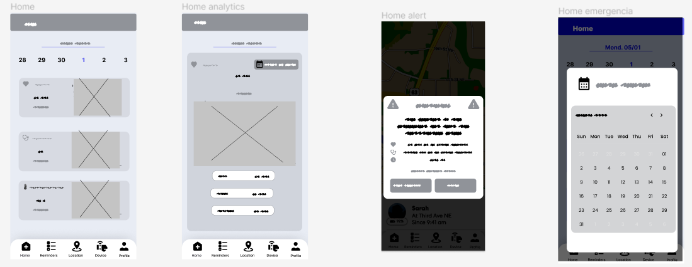
Ubicacion del Adulto Mayor

Recordatorios de las citas medicas y medicamentos

Perfil del adulto mayor

Sincronización de la pulsera


**Web Application Wireframes**<br>
Registro de usuario <br>
<br>
Compra de producto<br>
<br>
Pagina Principalz<br>
<br>
## 5.4.2. Applications Wireflow Diagrams.

**User Goal 1 : Verificar ritmo cardiaco**

- Happy Path: <br>Visualización regular. No se genera una alarma

- Unhappy Path: <br>Se ha generado una alarma de ritmo cardiaco no regular.

<br>

**User Goal 2 : Ver localización del adulto mayor**

- Happy Path: <br>Se llega a ver la posición del adulto mayor en el mapa

- Unhappy Path: <br>No se puede detectar la posición del adulto mayor, ya que este está afuera del área restringida.

<br>

**User Goal 3 : Añadir un recordatorio de medicamento**

- Happy Path: <br>Se puede añadir el recordatorio exitosamente al recordatorio.

- Unhappy Path: <br>Se cancela el añadido del recordatorio.

<br>

**User Goal 4 : Añadir un recordatorio de cita médica**

- Happy Path: <br>Se puede añadir el recordatorio exitosamente al recordatorio.

- Unhappy Path: <br>Se cancela el añadido del recordatorio.

<br>

**User Goal 5 : Connección con el dispositivo**

- Happy Path: <br>Se puede conectar exitosamente con el dispositivo

- Unhappy Path: <br>El dispositivo no llega a conectarse.

<br>

## 5.4.3. Applications Mock-ups.
A continuación, se presentan los mock-ups de la aplicación ElderlyCare, diseñados para brindar una experiencia de usuario intuitiva y atractiva.
**Mobile Application Mock-ups**  
Registro de Usuario (Cuidador)

Inicio de Sesión 

Seccion Home donde se visualiza los datos biométricos del adulto mayor
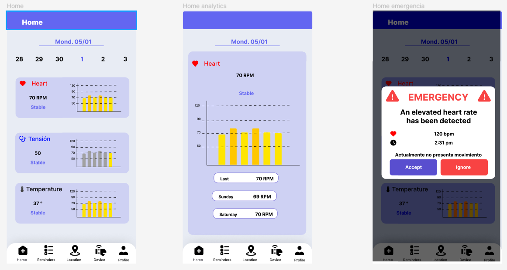
Ubicaion del Adulto Mayor

Recordatorios de las citas medicas y medicamentos

Perfil del adulto mayor

Sincronización de la pulsera


**Web Application Mock-ups**
Registro de usuario <br>
<br>
Compra de producto<br>
<br>
Pagina Principalz<br>
<br>

## 5.4.4. Applications User Flow Diagrams.

Para esta sección se visualizarán los flujos y las posibles opciones dentro del flujo para cada User Goal.

**User Goal 1 : Verificar ritmo cardiaco**

- Happy Path: <br>Visualización regular. No se genera una alarma

- Unhappy Path: <br>Se ha generado una alarma de ritmo cardiaco no regular.

<br>

**User Goal 2 : Ver localización del adulto mayor**

- Happy Path: <br>Se llega a ver la posición del adulto mayor en el mapa

- Unhappy Path: <br>No se puede detectar la posición del adulto mayor, ya que este está afuera del área restringida.

<br>

**User Goal 3 : Añadir un recordatorio de medicamento**

- Happy Path: <br>Se puede añadir el recordatorio exitosamente al recordatorio.

- Unhappy Path: <br>Se cancela el añadido del recordatorio.

<br>

**User Goal 4 : Añadir un recordatorio de cita médica**

- Happy Path: <br>Se puede añadir el recordatorio exitosamente al recordatorio.

- Unhappy Path: <br>Se cancela el añadido del recordatorio.

<br>

**User Goal 5 : Connección con el dispositivo**

- Happy Path: <br>Se puede conectar exitosamente con el dispositivo

- Unhappy Path: <br>El dispositivo no llega a conectarse.

<br>


**Web Diagram Flow**
| User Goal | Como usuario deseo poder registrarme en la aplicación para poder acceder a sus beneficios |
|-----------|-------------------------------------------------------------------------------------------|
| Task Flow |                                       |                                                                        
| User Flow |                                      |
                                                                                      

| User Goal | Como usuario deseo poder comprar  OneUp ElderlyCare en la pagina web                      |
|-----------|-------------------------------------------------------------------------------------------|
| Task Flow |                                        |                                                                        
| User Flow |                                      |


| User Goal | Como usuario quiero editar información personal .                                         |
|-----------|-------------------------------------------------------------------------------------------|
| Task Flow |                                       |                                                                        
| User Flow |                                      |


| User Goal | Como usuario deseo poder registrarme en la aplicación para poder acceder a sus beneficios |
|-----------|-------------------------------------------------------------------------------------------|
| Task Flow |                                       |                                                             
| User Flow |                                      |
                                                                                      
| User Goal | Como usuario deseo poder comprar  OneUp ElderlyCare en la pagina web                      |
|-----------|-------------------------------------------------------------------------------------------|
| Task Flow |                                        |                                                                        
| User Flow |                                      |


| User Goal | Como usuario quiero editar información personal .                                         |
|-----------|-------------------------------------------------------------------------------------------|
| Task Flow |                                       |                                                                        
| User Flow |                                      |


# 5.5. Applications Prototyping

### Prototype Mobile Application <br>

**User Goal 1 : Verificar ritmo cardiaco**

<br>

[https://tinyurl.com/4w5vfwht](https://tinyurl.com/4w5vfwht)

**User Goal 2 : Ver localización del adulto mayor**

<br>

[https://tinyurl.com/5x259srr](https://tinyurl.com/5x259srr)

**User Goal 3 : Añadir un recordatorio de medicamento**

<br>

[https://tinyurl.com/5n977ufv](https://tinyurl.com/5n977ufv)

**User Goal 4 : Añadir un recordatorio de cita médica**

<br>

[https://tinyurl.com/9uywjux7](https://tinyurl.com/9uywjux7)

**User Goal 5 : Connección con el dispositivo**

<br>

[https://tinyurl.com/bdzfrurf](https://tinyurl.com/bdzfrurf)

## Capítulo VI: Product Implementation, Validation & Deployment.

# 6.1. Software Configuration Management.

## 6.1.1. Software Development Environment Configuration.
### **Project Management**
Se emplearon herramientas de software que permiten la comunicación en tiempo real y la edición rápida y compartida, lo que facilitó el trabajo eficiente. Algunas de las herramientas utilizadas fueron los servicios de Google (Drive, Documents, Meet) y Microsoft Outlook. Para el registro de versiones y la creación de repositorios se utilizó GitHub, una plataforma que permite registrar de manera ordenada cada uno de los commits realizados y Git  una herramienta que permite el control de versiones.
 
### **Product UX/UI Design**
Se utilizó Miro y UXPressia para el desarrollo de los segmentos objetivos y sus mapeos, así como para los As-Is y To-Be Scenario Maps. Para los mockups, wireframes, wireflows y el prototipo de la aplicación web se empleó Figma.

### **Software Development**
Para el desarrollo del software se utilizó Visual Studio Code, HTML, CSS, Bootstrap y Javascript. Visual Studio Code es un software que admite muchos lenguajes de programación, incluyendo HTML y CSS, y fue utilizado principalmente para el Landing Page. HTML se utilizó para el desarrollo de la estructura de las páginas web, CSS para el diseño y presentación, Bootstrap para crear interfaces más limpias y responsive, y Javascript para implementar la interactividad dinámica y animaciones en el Landing Page.<br>
 
También se está desarrollando la aplicación móvil emppleando el framework Flutter, la cual es multiplataforma. Sin embargo, no se utiliza Flutter solo por su responsiveness, sino que se eligió por el uso de distintos componentes que permite darle una estética más personalizado. El lenguaje en uso para el desarrollo de la aplicación móvil es Dart.

Asimismo, se utilizo Vue para el desarrollo de la aplicación web, un framework progresivo de JavaScript que permite crear interfaces de usuario interactivas y dinámicas.

Para el desarrollo del backend se utilizó Node.js, un entorno de ejecución de JavaScript que permite ejecutar código JavaScript en el servidor.

### **Software Testing**
Para probar el Landing Page se utilizó la extensión LiveShare de Visual Studio Code, que permite crear un localhost para ver en tiempo real los cambios realizados. Para los test de aceptación se utilizó el lenguaje Gherkin y se subió al repositorio mencionado anteriormente.

### **Software Deployment**
Para desplegar la Landing Page, al ser una página de contenido estático que no necesita muchas actualizaciones, se utilizó GitHub Pages, que es gratuito y permite actualizar el contenido cuando sea necesario.

### **Software Documentation**
La documentación del software se realizó mediante comentarios en los archivos HTML, ya que al utilizar HTML para el desarrollo del Landing Page, un lenguaje de marcado, no era necesario crear diagramas de clases u otros tipos de documentación.

## 6.1.2. Source Code Management.

Para mantener el orden  y evitar conflictos o superposiciones de información, los proyectos se trabajaron en una
organización de GitHub y dentro de esta se encuentran los diferentes repositorios para cada proyecto cuyos enlaces de los repositorios son los
siguientes:
1. Repositorio para el landing page: https://github.com/OneUp-WS71/landign-page 
2. Repositorio de la aplicación web: https://github.com/OneUp-WS71/frontend-web-applications 
3. Repositorio de la aplicación móvil: https://github.com/OneUp-WS71/Mobile-applications 
4. Repositorio del backend: https://github.com/OneUp-WS71/web-services 

Se utilizará GitFlow para la administración de versiones del proyecto, en concreto se hará uso de las ramas main, develop and feature. 
+ Para cada commit que se realice, ya sea para el landing page o los archivos .feature, se utilizará el formato de mensaje "Conventional Commits" para ayudar a reconocer mejor lo que se hizo en los commits y de esta forma conocer mejor el estado del proyecto.
+ Cada repositorio de código tendrá sus respectivas ramas tal como lo describe Vincent Driessen, donde estará presente la rama Main (que almacenará las versiones estables y finales), Develop (donde se irán integrando los cambios implementados por cada feature y estará en constante actualización). 
+ Además, para la creación de ramas feature se utilizará el formato, feature/< user story / technical story> y para los commits Se utilizara el siguiente formato para realizar los commits: < type>[optional scope]< optional sticker>: < description> 
[optional body]
[optional footer(s)]

## 6.1.3. Source Code Style Guide & Conventions.
A continuación, se mostrarán las pautas, convenciones, estilo y principios que se utilizarán para cada uno de los lenguajes de se emplearán en la creacion y desarrollo de nuestra aplicación. La práctica de este conjunto de reglas es de suma importancia, ya que estas tienen el propósito de conservar la calidad estructural del software, dar una mayor legibilidad al código fuente y facilitar el mantenimiento del código.

**HTML:**
+ Declarar siempre el tipo de documento con <! DOCTYPE html>.
+ Utilizar nombres de etiquetas y atributos en minúscula.
+ Cerrar todas las etiquetas.
+ Siempre utilizar comillas para los valores de los atributos.
+ Especificar los atributos alt, width y height para las imágenes.
+ No omitir la etiqueta < title> ni los metadatos (< meta>).
```
<!DOCTYPE html>
<html>
<head>
  <title>Example Page</title>
  <meta charset="UTF-8">
  <meta name="description" content="This is an example page">
</head>
<body>
  
</body>
</html>

```

**CSS:**
+ Usar nombres de clases generales y descriptivos.
+ Utilizar nombres de clase cortos y concisos.
+ Separar palabras en nombres de clase con guiones.
+ Evitar los selectores de ID.
+ Usar propiedades abreviadas cuando sea posible.

**JavaScript:**
+ Usar nombres cortos y descriptivos para variables, funciones, etc.
+ Evitar el uso de variables globales (var).
+ Comentar líneas de código complejas para facilitar la comprensión.
+ Utilizar notaciones simples y comprensibles.
```
// Declaración de variables
let nombreUsuario = "Juan";

// Definición de función
function saludar() {
  return "Hola, " + nombreUsuario + "!";
}

// Uso de función
console.log(saludar());
```
**Dart:**
+ Usar nombres de clases, métodos y variables en minúsculas.
+ Utilizar nombres de clases en singular y en mayúscula.
+ Utilizar nombres de métodos y variables en minúscula.
+ Utilizar nombres de métodos en camelCase.
+ Utilizar nombres de variables en minúscula y separados por guiones bajos.
```
// Declaración de variable utilizando camelCase
String nombreUsuario = 'Juan';

// Definición de función utilizando camelCase
void saludar() {
  print('Hola, $nombreUsuario!');
}
```
**Vue:**
+ Usar nombres de componentes en singular y en mayúscula.
+ Utilizar nombres de métodos y variables en minúscula.
+ Seguir las convenciones de Vue.js para la estructura del proyecto, como el uso de componentes y la organización del código. Por ejemplo, dividir la interfaz de usuario en componentes reutilizables y mantener una estructura de carpetas lógica para los archivos de componentes.
+ Utilizar la sintaxis de Vue.js de manera consistente en los archivos de componentes. Por ejemplo, utilizar la notación v-bind para enlazar atributos y v-on para manejar eventos.
```
<!-- Ejemplo de componente Vue -->
<template>
  <div>
    <p>{{ mensaje }}</p>
    <button @click="cambiarMensaje">Cambiar Mensaje</button>
  </div>
</template>

<script>
export default {
  data() {
    return {
      mensaje: 'Hola Mundo!'
    };
  },
  methods: {
    cambiarMensaje() {
      this.mensaje = '¡Hola Vue!';
    }
  }
};
</script>
```
**Node.js:**
+ Usar nombres de variables y funciones en minúsculas.
+ Utilizar nombres descriptivos y significativos para las variables y funciones.
+ Seguir las convenciones de Node.js para la estructura del proyecto, como el uso de módulos y la organización del código. Por ejemplo, dividir la lógica de la aplicación en módulos reutilizables y mantener una estructura de carpetas lógica para los archivos de módulos.
+ Utilizar módulos npm y gestionar las dependencias de manera adecuada. Por ejemplo, especificar las dependencias en un archivo package.json y utilizar herramientas como npm o yarn para instalar y gestionar paquetes.
```
proyecto-node/
│
├── src/
│   ├── index.js
│   ├── controllers/
│   │   └── usuarioController.js
│   ├── models/
│   │   └── usuarioModel.js
│   └── routes/
│       └── usuarioRoutes.js
│
├── package.json
└── README.md
```
**Spring:** 
Se siguieron las convenciones y guías de estilo de código de la documentación oficial de Spring Boot y se destaca lo siguiente:
+ Uso de Anotaciones: Utilizar anotaciones como @Controller, @Service, @Repository y @Component para marcar clases y componentes
específicos de Spring.
+ Convención de Paquetes: Organizar los archivos y clases en carpetas que representen la estructura lógica de la aplicación, como controladores,
servicios, repositorios, etc.
+ Convención de Nombres en Bases de Datos: Utilizar la convención de nombres en bases de datos como snake_case para nombres de tablas y
columnas. Spring Boot se encargará de mapear estos nombres a objetos Java.
+ Uso de Spring Data JPA: Emplear Spring Data JPA para simplificar la interacción con la capa de persistencia y bases de datos.
+ Uso de Inyección de Dependencias: Aplicar la inyección de dependencias utilizando el constructor de las clases.
+ Uso de @RestController: Usar la anotación @RestController para marcar controladores que devuelven datos en formato JSON.
+ Seguridad con Spring Security: Implementar la seguridad en la aplicación utilizando Spring Security para autenticación y autorización.

**Java:**
+ Seguir las convenciones de nomenclatura de Java para nombres de variables, clases, métodos y paquetes. Por ejemplo, utilizar camelCase para nombres de variables y métodos, UpperCamelCase para nombres de clases, y utilizar nombres descriptivos que reflejen el propósito de la entidad.
+ Utilizar comentarios Javadoc para documentar clases y métodos públicos. Esto es fundamental para proporcionar una descripción clara de la funcionalidad de las clases y métodos, así como para generar documentación automáticamente.
+ Organizar el código en paquetes lógicos y utilizar la convención de nombres de paquetes de dominio invertido para evitar conflictos de nombres. Por ejemplo, el nombre de paquete com.ejemplo.proyecto indica que el proyecto pertenece al dominio ejemplo.com.
```
package com.ejemplo.proyecto.modelo;

/**
 * Clase que representa un usuario en el sistema.
 */
public class Usuario {
    private String nombre;
    private int edad;
    
    /**
     * Constructor de la clase Usuario.
     * @param nombre El nombre del usuario.
     * @param edad La edad del usuario.
     */
    public Usuario(String nombre, int edad) {
        this.nombre = nombre;
        this.edad = edad;
    }
    
    /**
     * Método para obtener el nombre del usuario.
     * @return El nombre del usuario.
     */
    public String getNombre() {
        return nombre;
    }
    
    /**
     * Método para establecer el nombre del usuario.
     * @param nombre El nuevo nombre del usuario.
     */
    public void setNombre(String nombre) {
        this.nombre = nombre;
    }
    
    /**
     * Método para obtener la edad del usuario.
     * @return La edad del usuario.
     */
    public int getEdad() {
        return edad;
    }
    
    /**
     * Método para establecer la edad del usuario.
     * @param edad La nueva edad del usuario.
     */
    public void setEdad(int edad) {
        this.edad = edad;
    }
    
    /**
     * Método para imprimir los datos del usuario.
     */
    public void imprimirDatos() {
        System.out.println("Nombre: " + nombre);
        System.out.println("Edad: " + edad);
    }
}
```
## 6.1.4. Software Deployment Configuration.
En este punto, se dara a conocer el proceso de despliegue de las aplicaciones, así como la configuración de los servidores y la infraestructura necesaria para su correcto funcionamiento.

**Landing Page:** 
Para desplegar la Landing Page, se utilizó GitHub Pages, una plataforma gratuita que permite alojar sitios web estáticos directamente desde un repositorio de GitHub. El proceso de despliegue fue el siguiente:
1. Crear un repositorio en GitHub con el código de la Landing Page.
2. Acceder a la configuración del repositorio y habilitar GitHub Pages.


3. Seleccionar la rama y la carpeta de origen del sitio web.
4. Guardar la configuración y obtener la URL del sitio web desplegado.
5. Finalmente, acceder a la URL del sitio web para verificar que se haya desplegado correctamente.


+ Enlace de la Landing Page desplegada: https://oneup-ws71.github.io/landign-page/

**FrontEnd:**
Para el despliegue de la aplicacion se ha usado los servicios que ofrecen netlify una plataforma de alojamiento web que ofrece integración continua y despliegue automático desde repositorios de Git. El proceso de despliegue fue el siguiente:
+ Preparación del Repositorio:
Asegúrarse que la página web esté almacenada en un repositorio Git, como GitHub, GitLab.
+ Crear una Cuenta en Netlify:
Regístrarse en la plataforma.
+ Conectar el Repositorio:
Inicia sesión en Netlify y ve al panel de control.
Hacer clic en el botón "New site from Git" (Nuevo sitio desde Git).
Selecciona tu proveedor de servicios de alojamiento de Git (por ejemplo, GitHub) y autoriza la conexión con tu cuenta.
Seleccionar el repositorio que contiene la página web.

+ Despliegue Automático:
Activa la opción de "Deploy site" (Desplegar sitio) para habilitar el despliegue automático cada vez que realices cambios en tu repositorio.
+ Verificar el Despliegue:
Una vez que se complete el despliegue, Netlify te proporcionará una URL única para acceder a tu página web.

**BackEnd:**
Para el despliegue del backend se ha utilizado los servicios de Railway, una plataforma de alojamiento de aplicaciones web que permite desplegar aplicaciones de Node.js, Python, Ruby, Java, PHP, Go y Docker. El proceso de despliegue fue el siguiente:
+ Preparación del Repositorio:
Asegúrarse de que el backend esté almacenado en un repositorio Git, como GitHub, GitLab.
+ Crear una Cuenta en Railway:
Registrarse en la plataforma.
+ Crear un Nuevo Proyecto:
Inicia sesión en Railway y ve al panel de control.
Crea un nuevo proyecto y selecciona "Backend" como tipo de proyecto.
Conectar el Repositorio:
Selecciona tu proveedor de servicios de alojamiento de Git (por ejemplo, GitHub) y autoriza la conexión con tu cuenta.
Selecciona el repositorio que contiene tu backend.

+ Configurar el Entorno:
Railway detectará automáticamente el tipo de backend que estás utilizando y configurará el entorno según sea necesario.
Si tu backend necesita variables de entorno específicas, como claves API o configuraciones de base de datos, puedes establecerlas en la sección de configuración de tu proyecto.

+ Despliegue Automático:
Activar la opción de "Auto Deploy" (Despliegue Automático) para habilitar el despliegue automático cada vez que realices cambios en tu repositorio.
+ Verificar el Despliegue:
Una vez que se complete el despliegue, Railway te proporcionará una URL única para acceder a tu backend.
# 6.2. Landing Page, Services & Applications Implementation.

## 6.2.1. Sprint 1

### 6.2.1.1. Sprint Planning 1.
Para este primer sprint opratmos por presentar el Landing Page, el cual es la primera impresión que tendrán los usuarios al visitar el sitio web. El Landing Page es una página web estática que contiene información relevante sobre el proyecto, como la descripción del servicio, las características principales, los beneficios, el equipo de desarrollo y los datos de contacto. El objetivo principal de este sprint es desarrollar y desplegar el Landing Page para que los usuarios puedan conocer más sobre el proyecto y contactar al equipo de desarrollo si es necesario. 

<table>
<thead>
  <tr>
    <th>Sprint #</th>
    <th>Sprint 1 </th>
  </tr>
</thead>
<tbody>
  <tr>
    <th colspan="2">Sprint Planning Background</th>
  </tr>
  <tr>
    <td>Date</td>
    <td>01-05-2024</td>
  </tr>
  <tr>
    <td>Time</td>
    <td>22:00</td>
  </tr>
  <tr>
    <td>Location</td>
    <td>Lima,  Perú- Reunión realizada mediante Discord </td>
  </tr>
  <tr>
    <td>Prepared By</td>
    <td>Liberato Susanibar, Piero</td>
  </tr>
  <tr>
    <td>Attendees (to planning meeting)</td>
    <td>Farro Caballero, Alfredo /<br>Orosco Orcotuma, Cristhian /<br>Nuñez Martinez, Anthony /<br>Llatas Flores, Enrique </td>
  </tr>
  <tr>
    <th colspan="2">Sprint Goal &amp; User Stories</th>
  </tr>
  <tr>
    <td>Sprint n Goal</td>
    <td>Desarrollo, despliegue del Landing Page y documentación del informe funcional </td>
  </tr>
  <tr>
    <td>Sprint n Velocity</td>
    <td>11</td>
  </tr>
  <tr>
    <td>Sum of Story Points</td>
    <td>11 story points </td>
  </tr>
</tbody>
</table>

### 6.2.1.2. Sprint Backlog 1.
Para este sprint, tuvimos como objetivo implementar el diseño de nuestra aplicación web, backend, asi como la creacion del langind page mediante el uso de HTML, CSS y JavaScript y como framework Bootstrap. A continuación, se presentan las historias de usuario y sus respectivos puntos de historia:
<table>
<thead>
  <tr>
    <th>Sprin #</th>
    <th colspan="7">Sprint 1</th>
  </tr>
</thead>
<tbody>
  <tr>
    <td colspan="2">User Story</td>
    <td colspan="6">Work-Item / Task</td>
  </tr>
  <tr>
    <td>Id</td>
    <td>Title</td>
    <td>Id</td>
    <td>Title</td>
    <td>Description</td>
    <td>Estimation (Hours)</td>
    <td>Assigned To</td>
    <td>Status<br>(To-do /<br>InProcess /<br>ToReview /<br>Done)</td>
  </tr>
  <tr>
    <td>US10</td>
    <td>Sección About Us</td>
    <td>TS01</td>
    <td>Implementación de la sección about us</td>
    <td>Desarrollo e implementación de la barra de navegación, sección about us y estilos CSS y JS</td>
    <td>3</td>
    <td>Liberato Susanibar, Piero</td>
    <td>Done</td>
  </tr>
  <tr>
    <td>US11</td>
    <td>Sección About the Product</td>
    <td>TS02</td>
    <td>Implementación de la sección about the product</td>
    <td>Desarrollo e implementación de la Sección About the Product con estilos responsive</td>
    <td>4</td>
    <td>Liberato Susanibar, Piero</td>
    <td>Done</td>
  </tr>
  <tr>
    <td>US12</td>
    <td>Sección Contacto</td>
    <td>TS03</td>
    <td>Implementación de la sección contacto</td>
    <td>Desarrollo e implementación de la Sección Contacto con estilos responsive</td>
    <td>2</td>
    <td>Liberato Susanibar, Piero</td>
    <td>Done</td>
  </tr>
  <tr>
    <td>US13</td>
    <td>Sección de Redes Sociales</td>
    <td>TS04</td>
    <td>Implementación de la sección de redes sociales</td>
    <td>Desarrollo e implementación de la Sección de Redes Sociales con estilos responsive</td>
    <td>3</td>
    <td>Liberato Susanibar, Piero</td>
    <td>Done</td>
  </tr>
  <tr>
    <td>US01</td>
    <td>Acceso a la cuenta (Web Application)</td>
    <td>TS05</td>
    <td>Implementación del login</td>
    <td>Desarrollo e implementación del Login</td>
    <td>4</td>
    <td>Farro Caballero, Alfredo</td>
    <td>Done</td>
  </tr>
  <tr>
    <td>US03</td>
    <td>Registro de cuenta (Web Application</td>
    <td>TS06</td>
    <td>Implementación del register</td>
    <td>Desarrollo e implementación del Register</td>
    <td>5</td>
    <td>Farro Caballero, Alfredo</td>
    <td>Done</td>
  </tr>
</tbody>
</table>

### 6.2.1.3. Development Evidence for Sprint Review.
En esta seccion se presenta la evidencia del progreso del desarrollo de software .Se incluye detalles sobre lo que se implemento en el sprint actual,destacando algun avance significativo para la plataforma.
Application WEB
| Repository                                              | Branch  | Commit ID                                | Commit Message | Commit Message Body                | Commite on (date) |
|---------------------------------------------------------|---------|------------------------------------------|----------------|------------------------------------|-------------------|
| https://github.com/OneUp-WS71/frontend-web-applications | develop | 4a318a2dc6d09e2dca76daaeac4f4024ce4f1717 | APP WEB V5     | Conexion del front con el fake api | 03/05/2024        |
| https://github.com/OneUp-WS71/frontend-web-applications | develop | 3f415160f06630e823394894bc6779f13f8edea0 | APP WEB V4     | Estructura del front end           | 02/05/2024        |
| https://github.com/OneUp-WS71/frontend-web-applications | develop | 8e5c3a38f19a7a1b99de732c2de5f3d719fca461 | APP WEB V3     | Diseño del front end               | 02/05/2024        |
| https://github.com/OneUp-WS71/frontend-web-applications | develop | 38eff473edf15c4082ea6147a1d7df78a8ebabb7 | APP WEB V2     | Informacion del front end          | 01/05/2024        |
| https://github.com/OneUp-WS71/frontend-web-applications | develop | ac06aaf5ebc3812f79fe557c56a07127f0f8942d | APP WEB V1     | Creacion del front end             | 01/05/2024        |


WEB SITE
| Repository                                 | Branch  | Commit ID                                | Commit Message         | Commit Message Body      | Commite on (date) |
|--------------------------------------------|---------|------------------------------------------|------------------------|--------------------------|-------------------|
| https://github.com/OneUp-WS71/landign-page | develop | 1d11330e380da7cfcb4bd64e4c248570d9d8b943 | Fix Correction Logo    | Correcion del logo       | 03/05/2024        |
| https://github.com/OneUp-WS71/landign-page | develop | 0710e061321158ff299d81426908e1134c18d47c | Fix ADD FINISH WEBSITE | Estructura del front end | 02/05/2024        |

### 6.2.1.4. Testing Suite Evidence for Sprint Review.
Aquí se proporcionara información sobre las pruebas realizadas durante el sprint.Se detallaran las pruebas funcionales,de rendimiento que se han llevado a cabo para garantizar la calidad del software .Se incluiran los resultados de estas pruebas y cualquier correcion o mejora realizada.
<br>

Link de donde se realizo el testeo: https://pagespeed.web.dev/analysis/https-oneup-ws71-github-io-landign-page/15eeol9hre?form_factor=desktop&category=performance&category=accessibility&category=best-practices&category=seo&hl=en-US&utm_source=lh-chrome-ext


### 6.2.1.5. Execution Evidence for Sprint Review.

Esta seccion se centrara en la ejecucion de la aplicación durante el sprint. Se visualizara la navegacion del landing page como la de la pagina web, de esta manera se destacaran las caracteristicas y funcionalidades implementadas en la aplicacación.
+ Landing Page: 

Enlace de la navegacion del landing page: https://upcedupe-my.sharepoint.com/:v:/g/personal/u202119276_upc_edu_pe/EZTD_-0Y6wpFu2RDXbsQZvgB9MRhNlWynKjaJBZzJ614rA?e=vLAKlw 
+ Web Application:

Enlace de la navegacion de la pagina web: https://upcedupe-my.sharepoint.com/personal/u202119276_upc_edu_pe/_layouts/15/stream.aspx?id=%2Fpersonal%2Fu202119276%5Fupc%5Fedu%5Fpe%2FDocuments%2FCiclo%207%2FSoluciones%20IOT%2FTF%2FVideos%2FVideo%5FFrontEnd%2Emp4&ga=1&referrer=StreamWebApp%2EWeb&referrerScenario=AddressBarCopied%2Eview%2E515614d5%2Dbb95%2D4b78%2D81f4%2D5dfcb0a715bb 

### 6.2.1.6. Services Documentation Evidence for Sprint Review.
Aqui se presentara la documentacion relacionada con los EndPoints de la aplicacion web, asi como la descripción de cada uno de ellos. Para este primer sprint se utilizo un Api fake para la aplicación. 

<table>
<thead>
  <tr>
    <th>EndPoint</th>
    <th>Accion Implementada</th>
    <th>Verbo </th>
    <th>Descripción de </th>
  </tr>
</thead>
<tbody>
  <tr>
    <td>https://6633c685f7d50bbd9b4aa0e7.mockapi.io/api/v1/Products</td>
    <td>Obtener las imágenes de los usuarios en base al  Api fake para la aplicación web. </td>
    <td>Get </td>
    <td>[<br>  {<br>    "name": "Lucia Kuhic",<br>    "imageproduct": "https://loremflickr.com/640/480",<br>    "price": "585.00",<br>    "description": "The automobile layout consists of a front-engine design, with transaxle-type transmissions mounted at the rear of the engine and four wheel drive",<br>    "id": "1"<br>  },<br>  {<br>    "name": "Amy Schuster",<br>    "imageproduct": "https://loremflickr.com/640/480",<br>    "price": "949.00",<br>    "description": "Carbonite web goalkeeper gloves are ergonomically designed to give easy fit",<br>    "id": "2"<br>  }<br>]</td>
  </tr>
</tbody>
</table>


### 6.2.1.7. Software Deployment Evidence for Sprint Review.
En esta seccion se describira el proceso de implementacion del software en un entorno de produccion o pruebas. Se destacaran los hitos clave alcanzados en terminos de despliegue y disponibilidad de la plataforma para los usuarios finales.
Para llevar a cabo la automatizacion del despliegue del landing page, se utilizaron las herramientas de Github Pages, esta plataforma permite alojar sitios web estáticos directamente desde un repositorio de GitHub: https://oneup-ws71.github.io/landign-page/


De la misma manera para el desarrollo del frontend se utilizo Netlify, una plataforma de alojamiento web que ofrece integración continua y despliegue automático desde repositorios de Git: https://66346fd5681906a0ebc84020--one-up-app.netlify.app/ 
 
### 6.2.1.8. Team Collaboration Insights during Sprint
Se proporcionara detalles sobre la colaboracion y comunicacion que hubo dentro del equipo de desarrollo durante el sprint .Esto incluira la colaboracion,resolucion de problemas y la gestion de tareas.
<br>

## 6.2.2. Sprint 2

### 6.2.2.1.Sprint Planning 2.
En el segundo sprint, el equipo se reunió para coordinar las actividades necesarias para el desarrollo e implementación de  de la aplicaciones. Se establecieron objetivos claros y alcanzables para cada componente, incluyendo la aplicación móvil, la aplicación web, la API RESTful, la base de datos y la aplicación embedded.

De la misma manera el equipo se comprometió a trabajar de manera colaborativa, definir tareas individuales y grupales, establecer plazos de entrega.

<table><thead>
  <tr>
    <th>Sprint #</th>
    <th>Sprint 2</th>
  </tr></thead>
<tbody>
  <tr>
    <th colspan="2">Sprint Planning Background</th>
  </tr>
  <tr>
    <td>Date</td>
    <td>07-06-2024</td>
  </tr>
  <tr>
    <td>Time</td>
    <td>22:00</td>
  </tr>
  <tr>
    <td>Location</td>
    <td>Lima,  Perú- Reunión realizada mediante Discord </td>
  </tr>
  <tr>
    <td>Prepared By</td>
    <td>Liberato Susanibar, Piero</td>
  </tr>
  <tr>
    <td>Attendees (to planning meeting)</td>
    <td>Farro Caballero, Alfredo /<br>Orosco Orcotuma, Cristhian /<br>Nuñez Martinez, Anthony /<br>Llatas Flores, Enrique </td>
  </tr>
  <tr>
    <th colspan="2">Sprint Goal & User Stories</th>
  </tr>
  <tr>
    <td>Sprint n Goal</td>
    <td>Desarrollo de la aplicación móvil, web, API, database, embedded application; despliegue del API,  aplicación web  y documentación del informe</td>
  </tr>
  <tr>
    <td>Sprint n Velocity</td>
    <td>128</td>
  </tr>
  <tr>
    <td>Sum of Story Points</td>
    <td>128 story points </td>
  </tr>
</tbody></table>

### 6.2.2.2.Sprint Backlog 2.
Para este sprint tuvimos como objetivo el desarrollo e implementación de la de la aplicación, incluyendo la aplicación móvil, la aplicación web, la API RESTful, la base de datos y la aplicación embedded para dispositivos IoT.

Adicionalmente, se realizó la comunicacion entre los diferentes componentes de la aplicación, la implementación de las funcionalidades principales, la integración de la base de datos y la configuración de la API RESTful. Asimismo el despliegue de la API, la aplicación web en Netlify, poniendo a disposición de los usuarios las funcionalidades básicas de la aplicación. 

<b>Trello</b>

<b>Enlace:</b> https://trello.com/b/dqGrz1ZG/oneup 

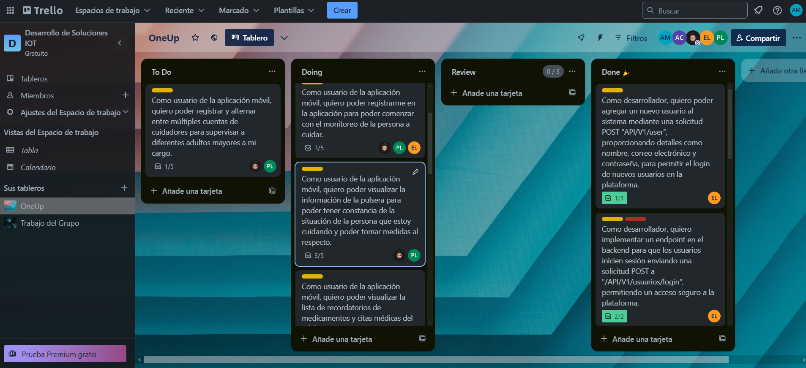<be>

<b>Mobile </b>

<table><thead>
  <tr>
    <th>Sprin #</th>
    <th colspan="7">Sprint 2</th>
  </tr></thead>
<tbody>
  <tr>
    <td colspan="2">User Story</td>
    <td colspan="6">Work-Item / Task </td>
  </tr>
  <tr>
    <td>Id</td>
    <td>Title</td>
    <td>Id</td>
    <td>Title</td>
    <td>Description</td>
    <td>Estimation (Hours)</td>
    <td>Assigned To</td>
    <td>Status<br>(To-do /<br>Doing /<br>Review /<br>Done)</td>
  </tr>
  <tr>
    <td rowspan="3">  <br>US02   </td>
    <td rowspan="3">Acceso a la cuenta   (Mobile application)   </td>
    <td>TS01</td>
    <td>Diseñar la pantalla de inicio de sesión </td>
    <td> Crear una interfaz de usuario (UI) atractiva e intuitiva que permita a los usuarios ingresar a la aplicación utilizando su correo electrónico y contraseña.</td>
    <td>2</td>
    <td>Cristhian Orosco, Piero Liberato</td>
    <td>Done</td>
  </tr>
  <tr>
    <td>TS02</td>
    <td>Desarrollar la funcionalidad de inicio de sesión</td>
    <td>Implementar la lógica necesaria para validar las credenciales de los usuarios al momento de ingresar a la aplicación.</td>
    <td>3</td>
    <td>Cristhian Orosco, Piero Liberato</td>
    <td>Done</td>
  </tr>
  <tr>
    <td>TS03</td>
    <td>Configurar la autenticación en el Backend</td>
    <td> Integrar un sistema de autenticación robusto en el Backend para verificar la identidad de los usuarios y gestionar las sesiones de acceso. </td>
    <td>3</td>
    <td>Cristhian Orosco, Piero Liberato</td>
    <td>Review </td>
  </tr>
  <tr>
    <td rowspan="3">US04   </td>
    <td rowspan="3">Registro de cuenta   (Mobile Application)   </td>
    <td>TS01</td>
    <td>Diseñar la pantalla de registro </td>
    <td> Crear una interfaz de usuario (UI) atractiva e intuitiva que permita a los nuevos usuarios crear una cuenta en la aplicación. </td>
    <td>2</td>
    <td>Cristhian Orosco, Piero Liberato, Enrique Llatas </td>
    <td>Done</td>
  </tr>
  <tr>
    <td>TS02</td>
    <td>Desarrollar la funcionalidad de registro</td>
    <td> Implementar la lógica necesaria para registrar nuevos usuarios en la aplicación. </td>
    <td>3</td>
    <td>Cristhian Orosco, Piero Liberato, Enrique Llatas </td>
    <td>Done</td>
  </tr>
  <tr>
    <td>TS03</td>
    <td>Configurar el registro de usuarios con el Backend</td>
    <td>Integrar el proceso de registro de usuarios en el Backend para almacenar la información personal de manera segura y gestionar las cuentas creadas.</td>
    <td>4</td>
    <td>Cristhian Orosco, Piero Liberato, Enrique Llatas </td>
    <td>Review </td>
  </tr>
  <tr>
    <td rowspan="3">US08   </td>
    <td rowspan="3">   Visualización de   la información sobre la persona cuidada (Mobile application)   </td>
    <td>TS01</td>
    <td>Diseñar la pantalla de información de la persona cuidada (UI/UX Design)</td>
    <td>Crear una interfaz de usuario (UI) atractiva e informativa que permita visualizar los datos relevantes sobre la persona cuidada. </td>
    <td>2</td>
    <td>Cristhian Orosco, Piero Liberato</td>
    <td>Done</td>
  </tr>
  <tr>
    <td>TS02</td>
    <td>Desarrollar la funcionalidad de visualización de información</td>
    <td>Implementar la lógica necesaria para obtener y mostrar la información de la persona cuidada en la aplicación móvil. </td>
    <td>3</td>
    <td>Cristhian Orosco, Piero Liberato</td>
    <td>Done</td>
  </tr>
  <tr>
    <td>TS03</td>
    <td>Configurar  y integrar con la base de datos</td>
    <td> Establecer la conexión entre la aplicación móvil y la base de datos para acceder a la información de la persona cuidada</td>
    <td>4</td>
    <td>Cristhian Orosco, Piero Liberato</td>
    <td>Review </td>
  </tr>
  <tr>
    <td rowspan="3">US14   </td>
    <td rowspan="3">  Visualización de la lista de recordatorios y citas médicas (Mobile application)   </td>
    <td>TS01</td>
    <td>Diseñar la pantalla de recordatorios y citas médicas (UI/UX Design)</td>
    <td>Crear una interfaz de usuario (UI) atractiva y funcional que permita visualizar la lista de recordatorios y citas médicas de manera organizada y clara.</td>
    <td>3</td>
    <td>Cristhian Orosco, Piero Liberato, Anthony Nuñez</td>
    <td>Done</td>
  </tr>
  <tr>
    <td>TS02</td>
    <td>Desarrollar la funcionalidad de visualización de recordatorios y citas</td>
    <td>Implementar la lógica necesaria para obtener y mostrar la lista de recordatorios y citas médicas en la aplicación móvil.</td>
    <td>3</td>
    <td>Cristhian Orosco, Piero Liberato, Anthony Nuñez</td>
    <td>Done</td>
  </tr>
  <tr>
    <td>TS03</td>
    <td>Configurar y integrar los recordatorios y citas  con el Backend</td>
    <td>Establecer la conexión entre la aplicación móvil y la base de datos para acceder a la información de los recordatorios y citas médicas. </td>
    <td>3</td>
    <td>Cristhian Orosco, Piero Liberato, Anthony Nuñez</td>
    <td>Review </td>
  </tr>
  <tr>
    <td rowspan="3">US15  </td>
    <td rowspan="3">   Modificación de los recordatorios (Mobile application)    </td>
    <td>TS01</td>
    <td>Diseñar la pantalla de edición de recordatorios (UI/UX Design)</td>
    <td>Crear una interfaz de usuario (UI) intuitiva y fácil de usar que permita modificar los detalles de los recordatorios existentes. </td>
    <td>2</td>
    <td>Cristhian Orosco, Piero Liberato</td>
    <td>Done</td>
  </tr>
  <tr>
    <td>TS02</td>
    <td>Desarrollar la funcionalidad de edición de recordatorios</td>
    <td>Implementar la lógica necesaria para modificar los datos de los recordatorios en la aplicación móvil. </td>
    <td>3</td>
    <td>Cristhian Orosco, Piero Liberato</td>
    <td>Done</td>
  </tr>
  <tr>
    <td>TS03</td>
    <td>Configurar y integrar la  modificación de recordatorios con el Backend</td>
    <td>Establecer la conexión entre la aplicación móvil y la base de datos para actualizar la información de los recordatorios. </td>
    <td>3</td>
    <td>Cristhian Orosco, Piero Liberato</td>
    <td>Review </td>
  </tr>
  <tr>
    <td rowspan="3">US16   <br></td>
    <td rowspan="3">Acceso a registros   históricos (Mobile application)   </td>
    <td>TS01</td>
    <td>Diseñar la pantalla de registros históricos (UI/UX Design)</td>
    <td>Crear una interfaz de usuario (UI) atractiva y organizada que permita visualizar el historial de eventos relevantes relacionados con la persona cuidada.</td>
    <td>3</td>
    <td>Cristhian Orosco, Piero Liberato</td>
    <td>Done</td>
  </tr>
  <tr>
    <td>TS02</td>
    <td>Desarrollar la funcionalidad de acceso a registros históricos</td>
    <td> Implementar la lógica necesaria para obtener y mostrar el historial de eventos en la aplicación móvil.</td>
    <td>3</td>
    <td>Cristhian Orosco, Piero Liberato</td>
    <td>Done</td>
  </tr>
  <tr>
    <td>TS03</td>
    <td>Configurar y integrar los registros históricos con el Backend</td>
    <td>Establecer la conexión entre la aplicación móvil y la base de datos para acceder al historial de eventos.</td>
    <td>3</td>
    <td>Cristhian Orosco, Piero Liberato</td>
    <td>Review </td>
  </tr>
  <tr>
    <td rowspan="3">US18   </td>
    <td rowspan="3">   Configurar alertas   personalizadas (Mobile application)   </td>
    <td>TS01</td>
    <td>Diseñar la pantalla de configuración de alertas (UI/UX Design)</td>
    <td>Crear una interfaz de usuario (UI) intuitiva y fácil de usar que permita configurar alertas personalizadas para recibir notificaciones sobre eventos relevantes.</td>
    <td>2</td>
    <td>Cristhian Orosco, Piero Liberato</td>
    <td>Done</td>
  </tr>
  <tr>
    <td>TS02</td>
    <td>Desarrollar la funcionalidad de configuración de alertas</td>
    <td>Implementar la lógica necesaria para configurar y gestionar las alertas personalizadas en la aplicación móvil. </td>
    <td>3</td>
    <td>Cristhian Orosco, Piero Liberato</td>
    <td>Done</td>
  </tr>
  <tr>
    <td>TS03</td>
    <td>Configurar y integrar  el servicio de notificaciones con el  Backend</td>
    <td>Integrar un servicio de notificaciones confiable en el Backend para enviar alertas personalizadas a los usuarios.</td>
    <td>4</td>
    <td>Cristhian Orosco, Piero Liberato</td>
    <td>Review </td>
  </tr>
  <tr>
    <td rowspan="3">US19   </td>
    <td rowspan="3">  Seguimiento de la   ubicación del adulto mayor (Mobile application)   </td>
    <td>TS01</td>
    <td>Diseñar la pantalla de seguimiento de ubicación (UI/UX Design)</td>
    <td>Crear una interfaz de usuario (UI) atractiva e informativa que permita visualizar la ubicación actual del adulto mayor en tiempo real.</td>
    <td>2</td>
    <td>Cristhian Orosco, Piero Liberato</td>
    <td>Done</td>
  </tr>
  <tr>
    <td>TS02</td>
    <td>Desarrollar la funcionalidad de seguimiento de ubicación en tiempo real</td>
    <td>Implementar la lógica necesaria para obtener y mostrar la ubicación del adulto mayor en la aplicación móvil.</td>
    <td>3</td>
    <td>Cristhian Orosco, Piero Liberato</td>
    <td>Done</td>
  </tr>
  <tr>
    <td>TS03</td>
    <td>Configurar y integrar el servicio de ubicación con el Backend</td>
    <td>Integrar un servicio de ubicación confiable en el Backend para obtener y almacenar la información de ubicación del adulto mayor.</td>
    <td>3</td>
    <td>Cristhian Orosco, Piero Liberato</td>
    <td>Review </td>
  </tr>
  <tr>
    <td rowspan="3">  US20   </td>
    <td rowspan="3">Agregar lista de   medicamentos con recordatorio (Mobile application)   </td>
    <td>TS01</td>
    <td>Diseñar la pantalla de lista de medicamentos (UI/UX Design)</td>
    <td>Crear una interfaz de usuario (UI) organizada y fácil de usar que permita gestionar una lista de medicamentos con recordatorios. </td>
    <td>2</td>
    <td>Cristhian Orosco, Piero Liberato,Alfredo Farro</td>
    <td>Done</td>
  </tr>
  <tr>
    <td>TS02</td>
    <td>Desarrollar la funcionalidad de gestión de lista de medicamentos</td>
    <td> Implementar la lógica necesaria para crear, editar y eliminar medicamentos en la lista.</td>
    <td>3</td>
    <td>Cristhian Orosco, Piero Liberato,Alfredo Farro</td>
    <td>Done</td>
  </tr>
  <tr>
    <td>TS03</td>
    <td>Configurar y integrar la lista de  medicamentos con la base de datos SQLite</td>
    <td>Establecer la conexión entre la aplicación móvil y la base de datos SQLite para almacenar la información de los medicamentos.</td>
    <td>4</td>
    <td>Cristhian Orosco, Piero Liberato,Alfredo Farro</td>
    <td>Review </td>
  </tr>
  <tr>
    <td rowspan="3">US21   </td>
    <td rowspan="3">Historial de   ubicaciones del adulto mayor (Mobile application)   </td>
    <td>TS01</td>
    <td>Diseñar la pantalla de historial de ubicaciones (UI/UX Design)</td>
    <td>Crear una interfaz de usuario (UI) atractiva e informativa que permita visualizar el historial de ubicaciones del adulto mayor.</td>
    <td>2</td>
    <td>Cristhian Orosco, Piero Liberato</td>
    <td>Done</td>
  </tr>
  <tr>
    <td>TS02</td>
    <td>Desarrollar la funcionalidad de acceso al historial de ubicaciones</td>
    <td>Implementar la lógica necesaria para obtener y mostrar el historial de ubicaciones del adulto mayor en la aplicación móvil. </td>
    <td>3</td>
    <td>Cristhian Orosco, Piero Liberato</td>
    <td>Done</td>
  </tr>
  <tr>
    <td>TS03</td>
    <td>Configurar y integrar el  historial de ubicaciones con el Backend</td>
    <td>Establecer la conexión entre la aplicación móvil y la base de datos para acceder al historial de ubicaciones del adulto mayor.</td>
    <td>3</td>
    <td>Cristhian Orosco, Piero Liberato</td>
    <td>Review </td>
  </tr>
</tbody></table>

<b>BackEnd </b>

<table><thead>
  <tr>
    <th>Sprint #</th>
    <th colspan="7">Sprint 2</th>
  </tr></thead>
<tbody>
  <tr>
    <td colspan="2">User Story</td>
    <td colspan="6">Work-Item / Task</td>
  </tr>
  <tr>
    <td>Id</td>
    <td>Title</td>
    <td>Id</td>
    <td>Title</td>
    <td>Description</td>
    <td>Estimation<br>(Hours)</td>
    <td>Assigned To</td>
    <td>Status<br>(To-do /<br>InProcess /<br>ToReview /<br>Done)</td>
  </tr>
  <tr>
    <td rowspan="2">US09</td>
    <td rowspan="2">Proceso de ventas</td>
    <td>TS01</td>
    <td>Añadido de Endpoint de<br>productos.</td>
    <td>Model, service, repository y<br>controller de Products.</td>
    <td>2</td>
    <td>Alfredo Farro</td>
    <td>Done</td>
  </tr>
  <tr>
    <td>TS02</td>
    <td>Funcionalidad de error de<br>procesamiento de venta.</td>
    <td>Error Management cuando se ingresen<br>datos incorrectos.</td>
    <td>1</td>
    <td>Alfredo Farro</td>
    <td>Done</td>
  </tr>
  <tr>
    <td rowspan="2">US24</td>
    <td rowspan="2">Iniciar sesión<br>(Back End)</td>
    <td>TS01</td>
    <td>Añadido de Endpoint de<br>usuario.</td>
    <td>Model, service, repository y<br>controller de User</td>
    <td>2</td>
    <td>Enrique Llatas</td>
    <td>Done</td>
  </tr>
  <tr>
    <td>TS02</td>
    <td>Servicio de autentificación<br>del usuario.</td>
    <td>Endpoint para verificar el registro de<br>un usuario con contraseña y<br>usuario.</td>
    <td>1</td>
    <td>Enrique Llatas</td>
    <td>Done</td>
  </tr>
  <tr>
    <td>US23</td>
    <td>Agregar personas<br>enfermas<br>(Back End)</td>
    <td>TS01</td>
    <td>Añadido de Endpoint de<br>pacientes.</td>
    <td>Model, service, repository y<br>controller de Patients</td>
    <td>2</td>
    <td>Anthony Nuñez</td>
    <td>Done</td>
  </tr>
  <tr>
    <td>US22</td>
    <td>Registrar un nuevo<br>usuario<br>(Back End)</td>
    <td>TS01</td>
    <td>Añadido de Endpoint de<br>usuario.</td>
    <td>Model, service, repository y<br>controller de User</td>
    <td>2</td>
    <td>Enrique Llatas</td>
    <td>Done</td>
  </tr>
</tbody></table>


### 6.2.2.3.Development Evidence for Sprint Review.
En esta seccion se presenta la evidencia del progreso del desarrollo de las aplicaciones. Se incluye detalles sobre lo que se implemento en el sprint actual, se mostrata un cuadro con los commits realizados en el repositorio de la aplicacion movil, web y API RESTful.

  <h4>Back end</h4>
  
 <table><thead>
  <tr>
    <th>Repository</th>
    <th>Branch</th>
    <th>Commit ID</th>
    <th>Commit Message </th>
    <th>Committed on</th>
  </tr></thead>
<tbody>
  <tr>
    <td>Oneup-WS71/back-end-application</td>
    <td>Feature/product</td>
    <td>45eae737648786dcc1d07d131ad18faf8642cd9e</td>
    <td>Add Product Service imp</td>
    <td>06/06/2024</td>
  </tr>
  <tr>
    <td>Oneup-WS71/back-end-application</td>
    <td>Feature/product</td>
    <td>c47bea0fe61be247e36d7201ffac4dff9fb579d3</td>
    <td>Add Service Product</td>
    <td>03/06/2024</td>
  </tr>
  <tr>
    <td>Oneup-WS71/back-end-application</td>
    <td>Feature/product</td>
    <td>e98d41e94002d74b9432d63e461219279c72833e</td>
    <td>add Product Controller </td>
    <td>03/06/2024</td>
  </tr>
  <tr>
    <td>Oneup-WS71/back-end-application</td>
    <td>Feature/patient</td>
    <td>b17b32dcd61cc90c634ce4f27f7e2fc48317d1769</td>
    <td>Add Patient Controller</td>
    <td>04/06/2024</td>
  </tr>
  <tr>
    <td>Oneup-WS71/back-end-application</td>
    <td>Feature/product</td>
    <td>bd4206f710d1b12cda12bea19fdccb05043c9912</td>
    <td>add Report Controller</td>
    <td>03/06/2024</td>
  </tr>
  <tr>
    <td>Oneup-WS71/back-end-application</td>
    <td>Feature/product</td>
    <td>036aaea252e55b78cd1851273f6ae995f3aba43e</td>
    <td>add Report Service </td>
    <td>03/06/2024</td>
  </tr>
  <tr>
    <td>Oneup-WS71/back-end-application</td>
    <td>Feature/product</td>
    <td>6a8cd4ab474eca2555d7779b2ff2113573b471d8</td>
    <td>add Report Service Impl</td>
    <td>30/05/2024</td>
  </tr>
  <tr>
    <td>Oneup-WS71/back-end-application</td>
    <td>Feature/product</td>
    <td>ca256740c54aef93ceea7d8901d6b575240c9c2a</td>
    <td>Add Device Controller </td>
    <td>30/05/2024</td>
  </tr>
  <tr>
    <td>Oneup-WS71/back-end-application</td>
    <td>Feature/product</td>
    <td>8a739b723e5a0fb4a17256719863117b4e55a9c6</td>
    <td>Add Model Device</td>
    <td>28/05/2024</td>
  </tr>
  <tr>
    <td>Oneup-WS71/back-end-application</td>
    <td>Feature/product</td>
    <td>1bef2656018de5ce0c19ea41381a48d8e3cb6e01</td>
    <td>Terminando user</td>
    <td>23/05/2024</td>
  </tr>
  <tr>
    <td>Oneup-WS71/back-end-application</td>
    <td>Feature/product</td>
    <td>1bef2656018de5ce0c19ea41381a48d8e3cb6c2a</td>
    <td>Agregando nuevos metodos a user</td>
    <td>20/05/2024</td>
  </tr>
</tbody></table>

  <h4>Mobile</h4>

  <table><thead>
  <tr>
    <th>Repository</th>
    <th>Branch</th>
    <th>Commit ID</th>
    <th>Commit Message</th>
    <th>Commit Message Body</th>
    <th>Commite on (date)</th>
  </tr></thead>
<tbody>
  <tr>
    <td>OneUp-WS71/mobile-application</td>
    <td>feature/TEAC-02</td>
    <td>7a8997bf3f40344f68d9b2b012e12d72b7066094 </td>
    <td>feat: add login screen </td>
    <td>Se agregó la vista de login  </td>
    <td>28/05/24</td>
  </tr>
  <tr>
    <td>OneUp-WS71/mobile-application</td>
    <td>feature/TEAC-02</td>
    <td>9d3602e7182026d96b2978533bc2c44aa8237f4f</td>
    <td>feat: Add register screen</td>
    <td>Se agregó la vista de register para nuevos usuarios </td>
    <td>31/05/24</td>
  </tr>
  <tr>
    <td>OneUp-WS71/mobile-application </td>
    <td>feature/TEAC-03</td>
    <td>1d08962e7d1712fec84c7e0d24e937b355e70861</td>
    <td>feat: profile screen </td>
    <td>Se agregó la vista profile de los adultos mayores </td>
    <td>31/05/24</td>
  </tr>
  <tr>
    <td>OneUp-WS71/mobile-application </td>
    <td>feature/TEAC-03</td>
    <td>08af574f2b2d34d5ecc9f2b013bfd73cd0adcdb4</td>
    <td>feat: mobile router page </td>
    <td>Se agregó las rutas de navegación para las vistas profile, login y register</td>
    <td>31/05/24</td>
  </tr>
  <tr>
    <td>OneUp-WS71/mobile-application</td>
    <td>feature/TEAC-04</td>
    <td>ed40940e327902015e3fab4b906f1298cc1d4809</td>
    <td>feat: add folders of reminders </td>
    <td>Se agregó las carpetas y widgets para la vista reminders  </td>
    <td>30/05/24</td>
  </tr>
  <tr>
    <td> OneUp-WS71/mobile-application</td>
    <td>feature/TEAC-04</td>
    <td>0b1f8d92f4883331a34d85740d180fd408b20ef6</td>
    <td>feat: add reminder</td>
    <td>Se agregó la vista reminders </td>
    <td>01/06/24</td>
  </tr>
  <tr>
    <td>OneUp-WS71/mobile-application </td>
    <td>feature/TEAC-05</td>
    <td>c39b5e74ac026f444e8962f11d0f09d56fde3b78</td>
    <td>feat: add page view in homepage </td>
    <td>Se agregó la vista homepage </td>
    <td>06/06/24</td>
  </tr>
  <tr>
    <td>OneUp-WS71/mobile-application</td>
    <td>feature/TEAC-05</td>
    <td>e68b489f069118b3dc7aa4029e992c544424bc6c</td>
    <td>feat: add api config </td>
    <td>Se agrego las clases para la configuración del API </td>
    <td>06/06/24</td>
  </tr>
</tbody></table>


### 6.2.2.4.Testing Suite Evidence for Sprint Review.

### 6.2.2.5.Execution Evidence for Sprint Review.
  <h4>Backend  Evidence</h4>
  <br>

   <b>Enlace:</b> https://upcedupe-my.sharepoint.com/:v:/g/personal/u20201f172_upc_edu_pe/EYyKxgjPy1hAiDEeHG_AP68BsIEf60qUGv0zORsWJmOJeA?e=wxcYSu&nav=eyJyZWZlcnJhbEluZm8iOnsicmVmZXJyYWxBcHAiOiJTdHJlYW1XZWJBcHAiLCJyZWZlcnJhbFZpZXciOiJTaGFyZURpYWxvZy1MaW5rIiwicmVmZXJyYWxBcHBQbGF0Zm9ybSI6IldlYiIsInJlZmVycmFsTW9kZSI6InZpZXcifX0%3D

  <h4>Mobile Evidence</h4>

  

  <b>Enlace:</b> https://upcedupe-my.sharepoint.com/:v:/g/personal/u201921031_upc_edu_pe/Ec8KeS_YqyxBo2_I2yggs2cB68y3WN_Bcb6Cw6hcn42s3Q?e=xvuCeW&nav=eyJyZWZlcnJhbEluZm8iOnsicmVmZXJyYWxBcHAiOiJTdHJlYW1XZWJBcHAiLCJyZWZlcnJhbFZpZXciOiJTaGFyZURpYWxvZy1MaW5rIiwicmVmZXJyYWxBcHBQbGF0Zm9ybSI6IldlYiIsInJlZmVycmFsTW9kZSI6InZpZXcifX0%3D  

  <h4>Frontend  Evidence</h4>
  
  
  
  <b>Enlace:</b> https://upcedupe-my.sharepoint.com/:v:/g/personal/u201911924_upc_edu_pe/EZULU8XZauZJrcY_k6ZTSxIBGbvka7i60XUc-y_YpioM5A?e=wdID4o 

  <h4>Embedded application Evidence</h4> 
  
  <b>Enlace:</b>

  

  <b>Enlance:</b> https://upcedupe-my.sharepoint.com/:v:/g/personal/u201921031_upc_edu_pe/EbueAyh2zMpGvYHwXlTRnMoBRmEnmV6UpMor8xI6dixvMQ?e=ve5UG6&nav=eyJyZWZlcnJhbEluZm8iOnsicmVmZXJyYWxBcHAiOiJTdHJlYW1XZWJBcHAiLCJyZWZlcnJhbFZpZXciOiJTaGFyZURpYWxvZy1MaW5rIiwicmVmZXJyYWxBcHBQbGF0Zm9ybSI6IldlYiIsInJlZmVycmFsTW9kZSI6InZpZXcifX0%3D 


### 6.2.2.6.Services Documentation Evidence for Sprint Review.


  <h4>Devices Service</h4>
  <br>

  <h4>Users Service</h4>
  <br>

  <h4>Patient Service</h4>
  <br>

  <h4>Products Service</h4>
  <br>

  <h4>Payment Service</h4>
  <br>

  <h4>Report Service</h4>
  <br>


### 6.2.2.7.Software Deployment Evidence for Sprint Review.
En esta seccion se describira el proceso de implementacion del software en un entorno de produccion o pruebas. Se destacaran los hitos clave alcanzados en terminos de despliegue y disponibilidad de la plataforma para los usuarios finales.

<b>Despliegue del Backend:</b>
Para llevar a cabo la automatizacion del despliegue del backend, se utilizaron las herramientas de  railway,  esta plataforma permite alojar servicios estáticos directamente desde un repositorio de GitHub: https://github.com/OneUp-WS71/back-end-application

  <br>

<b>Despliegue del Frontend:</b>
De la misma manera para el desarrollo del frontend se utilizo Netlify, una plataforma de alojamiento web que ofrece integración continua y despliegue automático desde repositorios de Git: https://66346fd5681906a0ebc84020--one-up-app.netlify.app/ 
 

De la misma manera para el desarrollo del movil app se utilizo 


### 6.2.2.8.Team Collaboration Insights during Sprint.
En esta seccion se presentara la colaboracion del equipo durante el sprint. Se destacaran los aspectos clave de la colaboracion y la comunicacion del equipo, asi como los desafios y las lecciones aprendidas.

<b>FrontEnd:</b>
<b>BackEnd:</b>
<b>Mobile:</b>

# 6.3. Validation Interviews.

## 6.3.1. Diseño de Entrevistas.
<b> Segmento: Cuidadores y Supervisores de Adultos Mayores.</b>

1. ¿Cuál es tu nombre y edad?
2. ¿Qué relación tienes con el cuidado del adulto mayor?
3. ¿Cómo describirías tu experiencia general utilizando nuestra aplicación hasta ahora?
4.  En una escala del 1 al 10, ¿qué tan fácil te resultó navegar por la aplicación?
5. ¿La aplicación cumplió tus expectativas en términos de funcionalidad? ¿Por qué sí o por qué no?
6. ¿Qué opinas del diseño y la organización de la aplicación?
7. ¿Tuviste algún problema de rendimiento (por ejemplo, tiempos de carga lentos, fallos) mientras usabas la aplicación?
8. ¿Es el contenido y la información proporcionada dentro de la aplicación clara y útil?
9. ¿Sientes que la aplicación aporta valor en el cuidado del adulto mayor? ¿Por qué sí o por qué no?
10. ¿Cuáles son las principales mejoras que recomendarías para la applicación?


## 6.3.2. Registro de Entrevistas.
<h4>Segmento: Supervisores</h4>

<b>Nombre y Apellidos :</b> Maryfe Pamela Cortez Menguay <br>
<b>Edad :</b> 26 años <br>
<b>Distrito:</b> Callao, Lima <br>
 <br>
<b>Enlace:</b> https://upcedupe-my.sharepoint.com/:v:/g/personal/u202119276_upc_edu_pe/EQT-OtOziopLjwjfqbmlv8YBut7YYkwiV6uDhR8-DMpJCg?e=vtQDOy <br>
<b>Inicio:</b> <br>
<b>Duracion:</b> 00:11:05 <br>
Maryfe enfermera de 26 años, compartió su experiencia utilizando la aplicación ElderlyCare. En términos generales, encontró que la aplicación es similar a otras que ha utilizado, lo que facilitó su adaptación. Destacó que la aplicación permite registrar información básica, como el peso y la talla de los pacientes, y establecer recordatorios importantes para el cuidado físico, como la administración de medicamentos y citas médicas. Sin embargo, indicó que la aplicación comienza en inglés, lo cual puede ser una barrera significativa para algunos usuarios hispanohablantes, sugiriendo que todas las secciones deberían estar en español.

En cuanto a la funcionalidad, Maryfe mencionó que la aplicación cumplió sus expectativas, especialmente en relación con los recordatorios de citas y medicamentos, que están alineados con las fechas anteriores. Sin embargo, sugirió que la aplicación sería más útil si pudiera integrarse con dispositivos de monitoreo para registrar signos vitales en tiempo real. El diseño de la aplicación le pareció bien organizado, con indicaciones claras en cada sección, y no experimentó problemas de rendimiento, describiendo la aplicación como rápida y eficiente.

Maryfe también ofreció varias recomendaciones de mejora. Propuso que la aplicación debería incluir la posibilidad de monitorear más signos vitales y que todas las secciones estén completamente traducidas al español. Además, sugirió la inclusión de rutinas de ejercicio adecuadas para adultos mayores, como caminatas cortas y ejercicios ligeros, y la necesidad de adaptar estas recomendaciones a las condiciones específicas de salud de los pacientes para evitar riesgos. En resumen, Mary valoró positivamente la aplicación, reconociendo su potencial para facilitar el cuidado de los adultos mayores, pero destacó la necesidad de realizar ciertas mejoras para aumentar su accesibilidad y funcionalidad. <br>

<b>Nombre y Apellidos :</b> Juan Diego Ponce Arasaki <br>
<b>Edad :</b> 21 años <br>
<b>Distrito:</b> Callao, Lima <br>
 <br>
<b>Enlace:</b> https://upcedupe-my.sharepoint.com/:v:/g/personal/u202119276_upc_edu_pe/EQT-OtOziopLjwjfqbmlv8YBut7YYkwiV6uDhR8-DMpJCg?e=vtQDOy <br>
<b>Inicio:</b>22:53 -> 28:26 <br>
<b>Duracion:</b>  <br>
Juan cuidador de 21 años, compartió su experiencia utilizando la aplicación ElderlyCare. En términos generales, encontró que la aplicación es similar a otras que ha utilizado, lo que facilitó su adaptación. Destacó que la aplicación permite obtener información básica, como la temperaturaa de los pacientes, y establecer recordatorios importantes para el cuidado físico, como la administración de los pacientes a cargo . 

En cuanto a la funcionalidad, Juan mencionó que la aplicación cumplió sus expectativas, especialmente en relación con los recordatorios de citas y medicamentos, que están alineados con las fechas anteriores. Sin embargo, sugirió que a la aplicación web le faltan secciones por completar lo cual espera con ansias . El diseño de la aplicación le pareció bien organizado, con indicaciones claras en cada sección, y no experimentó problemas de rendimiento, describiendo la aplicación como rápida y eficiente.
En resumen, Juan valoró positivamente la aplicación, reconociendo su potencial para facilitar el cuidado de los adultos mayores, pero destacó la necesidad de realizar ciertas mejoras para aumentar su accesibilidad y funcionalidad. <br>


<b>Nombre y Apellidos :</b> Jonathan Curi <br>
<b>Edad :</b> 22 años <br>
<b>Distrito:</b> Carabayllo, Lima <br>
  <br>
<b>Enlace:</b> https://upcedupe-my.sharepoint.com/:v:/g/personal/u202119276_upc_edu_pe/EQT-OtOziopLjwjfqbmlv8YBut7YYkwiV6uDhR8-DMpJCg?e=vtQDOy <br>
<b>Inicio:</b> Minuto 00:00:00 <br>
<b>Duracion:</b> 00:04:29

Jonathan, un estudiante universitario encargado de cuidar a sus abuelos, nos cuenta su experiencia con el uso de la app, la cual comenta que es muy intuitiva y facil de usar. Nos comenta, que se debe mejorar ciertos aspectos de esta, ya sea como arreglar cierto errores visuales, mejorar colores, entre cosas diferentes. Cree que si logramos implementar estas mejoras, la aplicación será una de las mejores del mercado. 


<h4>Segmento: Cuidadores</h4>


<b>Nombre y Apellidos :</b> Abraham <br>
<b>Edad :</b> 20 años <br>
<b>Distrito:</b> San Juan Lurigancho, Lima <br>
 <br>
<b>Enlace:</b> <br>
<b>Inicio:</b> 15:35 <br>
<b>Duracion:</b> 00:7:16 <br>

Abraham Medina visualiza una aplicación diseñada para el cuidado del adulto mayor, enfocada en el seguimiento de su estado de salud y la prestación de auxilio en caso de emergencia.
Opinión del Entrevistador:

Encuentra la aplicación interesante y bien diseñada.
Cree que tiene el potencial de ser un buen proyecto funcional y útil en el día a día.
Experiencia del Usuario:

Encuentra la aplicación intuitiva y directa, tanto en el login como en el registro.
Considera que la página de inicio muestra claramente la información necesaria.
Destaca la lista de medicación como un apartado bien diseñado y simple, lo cual facilita su uso por parte de los usuarios.
Califica el diseño y la navegación de la aplicación con un 9, aunque cree que hay espacio para mejorar.
Aspectos Técnicos:

No ha encontrado problemas de rendimiento; la aplicación es rápida y está bien optimizada.
Sugiere probar la aplicación en diferentes dispositivos para verificar su rendimiento.
Valor y Utilidad:

Considera la información clara y útil, y cree que la aplicación aporta valor al cuidado del adulto mayor al mantener un seguimiento constante de su salud.
Recomendaciones:

Añadir un modo oscuro a la aplicación para mejorar la experiencia del usuario.
Conclusión:
Abraham agradece la entrevista y concluye que la aplicación tiene potencial y es útil, con algunas áreas de mejora identificadas para aumentar su funcionalidad y usabilidad.
 <br>


<b>Nombre y Apellidos :</b> Raquel Lili Melany Romero Martinez <br>
<b>Edad :</b> 24 años <br>
<b>Distrito:</b> Villa María, Nuevo Chimbote <br>
<br>
<b>Enlace:</b> https://upcedupe-my.sharepoint.com/:v:/g/personal/u202119276_upc_edu_pe/EQT-OtOziopLjwjfqbmlv8YBut7YYkwiV6uDhR8-DMpJCg?e=vtQDOy <br>
<b>Inicio:</b> 28:26 <br>
<b>Duracion:</b> 6:17 <br>
Raquel, de 24 años, vive con su abuelo, el cual padece de alzheimer y padece de dificultad al caminar o moverse.
Al momento de interactuar con la aplicación, Raquel menciono que la aplicación le pareció muy sencilla de usar y muy útil. Sin embargo, también queda recalcar que nuestra entrevistada es una nativa digital, por lo cual manejarse en la aplicación podría haberle resultado más sencillo. En la entrevista también se puede notar que Raquel tiene mejor opinión en la aplicación móvil que la de escritorio, y que cree que sería un buen añadido el poder medir otros parámetros o poder guardar datos importantes, tal como glucosa o datos históricos del paciente, dentro de la aplicación. Esto se tiene ya previsto en la aplicación web y móvil.


## 6.3.3. Evaluaciones según heurísticas.
<h4 align="center"> UX Heuristics & Principles Evaluation  </h4> <br> 
<h5 align="center">Usability – Inclusive Design – Information Architecture  </h5>

<b> CARRERA: </b> Ingeniería de Software  <br>
<b>CURSO </b> Desarrollo de Soluciones IoT <br>
<b>SECCIÓN : </b> SI572 <br>
<b>PROFESORES: </b> Angel Augusto Velasquez Nuñez <br>
<b>AUDITOR : </b> OneUp Team  <br>
<b>CLIENTE(S): </b>  Maryfe Pamela Cortez Menguay, ..... <br>

<b> SITE o APP A EVALUAR:  </b> 
ElderlyCare App <br>

<b>TAREAS A EVALUAR: </b> <br>
El alcance de esta evaluación incluye la revisión de la usabilidad de las siguientes tareas:

1. Inicio de sesión en la aplicación. <br>

 <br>

2. Registro un usuario Cuidador.<br>
 <br>

3. Aprobación de Terminos y condiciones.<br>
 <br>

4. Registro de los datos de un adulto mayor. <br>
 <br>

5. Visualización de las medidas de un adulto mayor. <br>
 <br>

6. Visualización de los signos vitales de un adulto mayor.<br>
 <br>

7. Agregar Recordatorio de Medicamentos y citas medicas. <br>
 <br>

8. Editar perfil del adulto mayor <br>
 <br>

No están incluidas en esta versión de la evaluación las siguientes tareas:

**ESCALA DE SEVERIDAD:**

Los errores serán puntuados tomando en cuenta la siguiente escala de severidad

| Nivel 	| Descripción                                                                                                                                                                                    	|
|-------	|------------------------------------------------------------------------------------------------------------------------------------------------------------------------------------------------	|
| 1     	| Problema superficial: puede ser fácilmente superador por el usuario ó ocurre con muy poco frecuencia. No necesita ser arreglado a no ser que exista disponibilidad de tiempo.                  	|
| 2     	| Problema menor: puede ocurrir un poco más frecuentemente o es un poco más difícil de superar para el usuario. Se le debería asignar una prioridad baja resolverlo de cara al siguiente reléase 	|
| 3     	| Problema mayor: ocurre frecuentemente o los usuarios no son capaces de resolverlos. Es importante que sean corregidos y se les debe asignar una prioridad alta.                                	|
| 4     	| Problema muy grave: un error de gran impacto que impide al usuario continuar con el uso de la herramienta. Es imperativo que sea corregido antes del lanzamiento.                              	|

**TABLA DE SEVERIDAD:**

| # 	| Problema                                	| Escala de severidad 	| Heurística/Principio violado(o)                                 	|
|---	|-----------------------------------------	|---------------------	|-----------------------------------------------------------------	|
| 1 	| Mobile Application no es responsive     	| 2                   	| Inclusive Design: falta de experiencia en diversos dispositivos 	|
| 2 	| Web Application no es responsive        	| 2                   	| Inclusive Design: falta de experiencia en diversos dispositivos 	|
| 3 	| Falta de visualizar estado del producto 	| 3                   	| Information Architecture: Is it usable?                         	|
| 4 	| Edicion de informacion del adulto mayor 	| 2                   	| Usability: Libertad y control del usuario                       	|

# 6.4. Video About-the-Product.


### Conclusiones
El desarrollo del proyecto ha permitido alcanzar los objetivos principales, incluyendo la creación de una aplicación móvil funcional, una aplicación web robusta, una base de datos segura, una API RESTful eficiente y una aplicación embedded para la recolección de datos.
La adopción de técnicas DDD, como el Eventstorming y sus procesos correlativos, resultó fundamental para comprender a profundidad los comportamientos esperados de los usuarios potenciales. Esta comprensión profunda nos permitió enfocar el desarrollo en las necesidades reales de los usuarios, lo que se traduce en el cumplimiento de los Problem Statements, Hypotheses Statements y criterios de éxito definidos en el proceso de Lean UX.
Las validaciones realizadas han demostrado la efectividad de las soluciones implementadas, destacando la facilidad de uso, la escalabilidad y la seguridad del sistema. Estos resultados positivos son producto de la colaboración efectiva del equipo y la asignación de tareas acorde a las habilidades individuales de cada miembro.
En proyectos de gran envergadura como el nuestro, es fundamental reconocer las diversas habilidades y talentos del equipo para garantizar un proceso fluido y sin contratiempos. La comunicación constante y la alineación de objetivos son claves para el éxito del proyecto.
### Recomendaciones 
Para continuar con el éxito del proyecto, se recomienda:

- Realizar un seguimiento constante del uso de los productos digitales para realizar ajustes que optimicen la experiencia del usuario. Implementar pruebas de seguridad regulares para proteger los datos de los usuarios. Mantener los productos digitales actualizados con las últimas tecnologías.

- Implementar un sistema de retroalimentación de los usuarios para recopilar comentarios y sugerencias de mejora.

- Buscar nuevas oportunidades de negocio para ampliar el alcance de la solución, como la integración con otros servicios de salud o la expansión a nuevos mercados.

- Continuar invirtiendo en la investigación y desarrollo de nuevas funcionalidades y tecnologías que mejoren aún más la solución y la experiencia del usuario.
