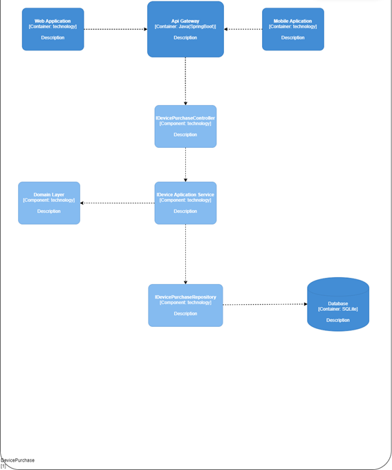
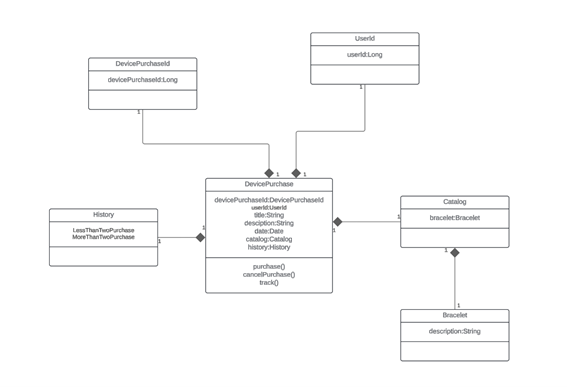
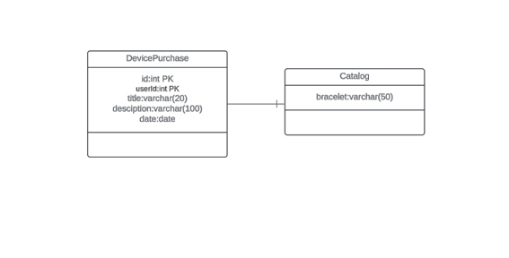

  

<h3 align="center"> Universidad Peruana de Ciencias Aplicadas</h3> 
<h4 align="center"> Ingeniería de Sistemas y Computación | Ingeniería de Software  </h4>
<h4 align="center"> Desarrollo de Soluciones IOT </h4>
<h4 align="center"> Informe de Trabajo Parcial  </h4>

### Startup: OneUp
#### Team Members 
+ Liberato Susanibar, Piero Anthony_U20181H057
+ Farro Caballero, Alfredo Nolberto_201911924
+ Orosco Orcotuma, Cristhian_U201921031 
+ Nuñez Martinez, Anthony Samir_U
+ Llatas Flores, Enrique Aldhair_U20201F172 
#### Sección: WS71
#### Profesor: Angel Augusto Velasquez Nuñez 
#### Producto: ElderlyCare                         
#### Ciclo: 2024-01
<h4 align="center "> Abril, 2024</h4>  

_____________________
## Registro de versiones del informe 
<table>
<thead>
  <tr>
    <th>Versión </th>
    <th>Fecha</th>
    <th>Autor</th>
    <th>Descripción de modificación</th>
  </tr>
</thead>
<tbody>
  <tr>
    <td>V1.0</td>
    <td>13/04/2024</td>
    <td>OneUp</td>
    <td>Se agregaron las siguientes secciones: 
  Contenido, Student Outcome, Capítulo I, Capítulo II, Capítulo III, Capítulo IV  
  </td>
  </tr>
  <tr>
    <td>V 1.1</td>
    <td>29/04/2024</td>
    <td>OneUp</td>
    <td>Se agrego el contenido que faltaba en la TB1 y se aplico del Capítulo I hasta el Capítulo IV las correcciones</td>
  </tr>
  <tr>
    <td>V2.0</td>
    <td>02/05/2024</td>
    <td>OneUp</td>
    <td>Se agregaron las siguientes secciones:
    Capítulo V, Capítulo VI, Avance de Conclusiones, Bibliografía y Anexos</td>
  </tr>
  <tr>
    <td></td>
    <td></td>
    <td></td>
    <td></td>
  </tr>
  <tr>
    <td></td>
    <td></td>
    <td></td>
    <td></td>
  </tr>
  <tr>
    <td></td>
    <td></td>
    <td></td>
    <td></td>
  </tr>
</tbody>
</table>

## Project Report Collaboration Insights
+ Link del repositorio Github:  [Github](https://github.com/OneUp-WS71) / https://github.com/OneUp-WS71 

  **Desarrollo de las actividades del informe:**  
  + TB1: Para esta entrega se desarrollaron las secciones del capitulo I al capitulo IV, cada miembro desarrollo el avance del infome en el repositorio de Github realizando sus commits en la rama respectivo de cada capitulo, luego se realizo el merge en la rama develop, a continuacion las capturas de imagen de los commits.
  
  + TP: Para la entrega del TP se desarrollo las secciones del capitulo V al capitulo VI, cada miembro desarrollo el avance del infome en el repositorio de Github realizando sus commits en la rama respectivo de cada capitulo, luego se realizo el merge en la rama develop, a continuacion las capturas de imagen de los commits.

## Contenido 
- [Capítulo I: Introducción](/README.md#capítulo-i-introducción)
  - [1.1. Startup Profile](/README.md#11-startup-profile)
    - [1.1.1. Descripción de la Startup](/README.md#111-descripción-de-la-startup)
    - [1.1.2. Perfiles de integrantes del equipo](/README.md#112-perfiles-de-integrantes-del-equipo)
  - [1.2. Solution Profile](/README.md#12-solution-profile)
    - [1.2.1 Antecedentes y problemática](/README.md#121-antecedentes-y-problemática)
    - [1.2.2 Lean UX Process](/README.md#122-lean-ux-process)
      - [1.2.2.1. Lean UX Problem Statements](/README.md#1221-lean-ux-problem-statements)
      - [1.2.2.2. Lean UX Assumptions](/README.md#1222-lean-ux-assumptions)
      - [1.2.2.3. Lean UX Hypothesis Statements](/README.md#1223-lean-ux-hypothesis-statements)
      - [1.2.2.4. Lean UX Canvas](/README.md#1224-lean-ux-canvas)
  - [1.3. Segmentos objetivo](/README.md#13-segmentos-objetivo)
- [Capítulo II: Requirements Elicitation \& Analysis](/README.md#capítulo-ii-requirements-elicitation--analysis)
  - [2.1. Competidores](/README.md#21-competidores)
    - [2.1.1. Análisis competitivo](/README.md#211-análisis-competitivo)
    - [2.1.2. Estrategias y tácticas frente a competidores](/README.md#212-estrategias-y-tácticas-frente-a-competidores)
  - [2.2. Entrevistas](/README.md#22-entrevistas)
    - [2.2.1. Diseño de entrevistas](/README.md#221-diseño-de-entrevistas)
    - [2.2.2. Registro de entrevistas](/README.md#222-registro-de-entrevistas)
    - [2.2.3. Análisis de entrevistas](/README.md#223-análisis-de-entrevistas)
  - [2.3. Needfinding](/README.md#23-needfinding)
    - [2.3.1. User Personas](/README.md#231-user-personas)
    - [2.3.2. User Task Matrix](/README.md#232-user-task-matrix)
    - [2.3.3. Empathy Mapping](/README.md#233-empathy-mapping)
    - [2.3.4. As-is Scenario Mapping](/README.md#234-as-is-scenario-mapping)
  - [2.4. Ubiquitous Language](/README.md#24-ubiquitous-language)
- [Capítulo III: Requirements Specification](/README.md#capítulo-iii-requirements-specification)
  - [3.1. To-Be Scenario Mapping](/README.md#31-to-be-scenario-mapping)
  - [3.2. User Stories](/README.md#32-user-stories)
  - [3.3. Impact Mapping](/README.md#33-impact-mapping)
  - [3.4. Product Backlog](/README.md#34-product-backlog)
- [Capítulo IV: Solution Software Design](/README.md#capítulo-iv-solution-software-design)
  - [4.1. Strategic-Level Domain-Driven Design](/README.md#41-strategic-level-domain-driven-design)
    - [4.1.1. EventStorming](/README.md#411-eventstorming)
      - [4.1.1.1 Candidate Context Discovery](/README.md#4111-candidate-context-discovery)
      - [4.1.1.2.  Domain Message Flows Modeling](/README.md#4112-domain-message-flows-modeling)
      - [4.1.1.3. Bounded Context Canvases](/README.md#4113-bounded-context-canvases)
    - [4.1.2. Context Mapping](/README.md#412-context-mapping)
    - [4.1.3. Software Architecture](/README.md#413-software-architecture)
    - [4.1.3.1. Software Architecture System Landscape Diagram](/README.md#4131-software-architecture-system-landscape-diagram)
    - [4.1.3.2. Software Architecture Context Level Diagrams](/README.md#4132-software-architecture-context-level-diagrams)
    - [4.1.3.3. Software Architecture Container Level Diagrams](/README.md#4133-software-architecture-container-level-diagrams)
    - [4.1.3.4. Software Architecture Deployment Diagrams](/README.md#4134-software-architecture-deployment-diagrams)
  - [4.2. Tactical-Level Domain-Driven Design](/README.md#42-tactical-level-domain-driven-design) 
## Student Outcome 
<table>
<thead>
  <tr>
    <th>Criterio específico</th>
    <th>Acciones realizada</th>
    <th>Conclusiones</th>
  </tr>
</thead>
<tbody>
  <tr>
    <td>Participa en equipos multidisciplinarios con eficacia, eficiencia y objetividad, en el marco de un proyecto en soluciones de ingeniería de software</td>
    <td>Orosco Orcotuma, Cristhian TB1:  Se identificaron diferentes problemas en base al desarrollo del trabajo tanto como la identificación del producto, como la elaboración del Lean ux y estructura de la aplicación, pero supimos implementar las soluciones con los compañeros a todas estas. Asimismo, Se modificó los diferentes puntos del lean Ux, el canvas, los assumptions y modificar nuestro objetivo   Liberato Susanibar, Piero Anthony   TB1:   Elabore el desarrrollo de la descripción de la startup, Antecedentes y problemática Lean UX Problem Statements, Análisis competitivo, Estrategias y tácticas frente a competidores y Software Architecture.  </td>
    <td></td>
  </tr>
  <tr>
    <td>Conoce al menos un sector empresarial o dominio de aplicación de soluciones de software.</td>
    <td>Orosco Orcotuma, Cristhian TB1: Para solucionar los problemas presentados en el trabajo se usó las metodologías ágiles de software para poder tener la mejor solución posible. Asimismo, se tuvieron que aprender nuevos conceptos acerca del Lean Ux, como mejorar en base al trabajo anterior puntos para definir mejor nuestra plataforma.   Liberato Susanibar, Piero Anthony   TB1:   Para este trabajo e realizado investigaciones apra conocer nuestro mercado, competidores, etc. Asi mismo entrevistar personas para conocer de primera mano sus necesidades y facilitarnos el proceso de desarrollo de nuestra organización.</td>
    <td></td>
  </tr>
</tbody>
</table>

## Capítulo I: Introducción

# 1.1. Startup Profile

## 1.1.1. Descripción de la Startup
Nuestra startup se enfoca en mejorar la calidad de vida y la seguridad de las personas mayores a través de una solución integral de cuidado y seguimiento. Desarrollamos una aplicación móvil y una pulsera inteligente que permiten el seguimiento de la salud, recordatorios de medicamentos, ubicación en tiempo real, recordatorios generales y acceso rápido a números de emergencia.

Nuestra solución no solo beneficia a las personas mayores, sino que también proporciona tranquilidad a sus familiares y cuidadores, quienes pueden estar al tanto del bienestar de sus seres queridos en todo momento. En caso de emergencia, nuestra
aplicación permite un acceso rápido a ayuda, lo que puede marcar la diferencia en situaciones críticas.

## 1.1.2. Perfiles de integrantes del equipo

+ **Piero Anthony Liberato Susanibar:**
Universitario que cursa el 8to ciclo de, teniendo 22 años. En mis ratos libres me pongo a desarrollar un startup, hacer ejercicio, escuchar música, estudiar sobre temas de desarrollo personal y rara vez jugar videojuegos. Para mí la honestidad es uno de los valores más importantes en toda persona, siendo uno de mis valores principales, trabajador, amable y colaborativo. Mis habilidades son sobre todo cognitivas para la programación en React, Next y Flutter, aparte tengo conocimientos de oratoria y crear y pitchear una startup.

 

+ **Cristhian Orosco Orcotuma:** Estudio la carrera de Ingeniería de Software en la UPC. Me considero una persona detallista, amante de los animales, la música, sobre todo la tecnología y los videojuegos, en el futuro me gustaría crear un videojuego y tener mi propia empresa de videojuegos. Soy un chico al cual le gusta aprender todo tipo de cosas, porque considero que siempre uno debe estar preparado para todo. 

     

+ **Anthony Samir Nuñez Martinez:**  
Estudiante de Ingeniería de Software de 19 años en la Universidad Peruana de Ciencias y Tecnología, nacido el 15 de julio del 2004. Me gusta la música punk y desarrollo videojuegos en mi tiempo libre. Me gusta resolver problemas y buscar soluciones creativas o únicas a las cosas, inclusive cuando no es la forma más eficiente de hacerla, y soy una persona muy obsecionada con la puntualidad.

      

+ **Enrique Aldhair Llatas Flores:**  
Mi nombre es Enrique Aldhair Llatas Flores , estoy en el 7mo ciclo de la carrera de Ingeniería de Software  tengo habilidades en frontend y backend, también cuento con conocimiento en margenes ágiles y otros lenguajes como C++ y C#. Espero seguir aumentando mis conocimientos durante este ciclo.En mis tiempos libres me gusta investigar sobre margenes agiles ,jugar  y hacer ejercicio. Me gusta escuchar rock

   

# 1.2. Solution Profile

## 1.2.1 Antecedentes y problemática

Nuestra startup se enfoca en mejorar la calidad de vida y la seguridad de las personas mayores a través de una solución integral de cuidado y seguimiento. Desarrollamos una aplicación móvil y una pulsera inteligente que permiten el seguimiento de la salud, recordatorios de medicamentos, ubicación en tiempo real, recordatorios generales y acceso rápido a números de emergencia.

Nuestra solución no solo beneficia a las personas mayores, sino que también proporciona tranquilidad a sus familiares y cuidadores, quienes pueden estar al tanto del bienestar de sus seres queridos en todo momento. En caso de emergencia, nuestra

aplicación permite un acceso rápido a ayuda, lo que puede marcar la diferencia en situaciones críticas.

Con respecto a nuestra propuesta, nuestra competencia es la siguiente:

MyTherapy es una aplicación útil tanto para cuidadores como para personas mayores. Actúa como un recordatorio de medicación, enviando alertas cuando es el momento de tomarla y manteniendo un registro de lo que ya se ha consumido. También almacena otros datos de salud importantes.

Safe365 es una aplicación de teleasistencia que permite mantener a las personas mayores localizadas en todo momento. En caso de emergencia, envía la posición con coordenadas GPS y crea alertas cuando entran o salen de áreas preestablecidas.

MiCuidum es una aplicación para familias que han contratado servicios de cuidado a domicilio. Ofrece un mayor control sobre las tareas diarias y la calidad de la asistencia, proporcionando diferentes planes de cuidado adaptados a las necesidades de cada persona mayor y facilitando el contacto con médicos especializados.

<u>**Problemática**</u>

**What(Qué)**

Deseamos crear una aplicación integral que combine las características de otras plataformas de cuidado para adultos mayores e incorpore dispositivos IoT para mejorar la vigilancia y el seguimiento de su salud.

**When(Cuándo)**

La necesidad de nuestra aplicación surge cuando las personas tienen a su cargo el cuidado de un adulto mayor y no pueden brindar una vigilancia continúa debido a errores de memoria o limitaciones de tiempo.

**Where(Donde)**

Esta problemática es global, ya que el envejecimiento de la población y la disminución de las tasas de natalidad están incrementando la demanda de cuidados para los adultos mayores.

**Who(quién)**

Los afectados son los cuidadores que no pueden llevar un registro y una vigilancia constante del adulto mayor, lo que puede llevar a equivocaciones y descuidos.

**Why(por qué)**

Esta causa surge porque los adultos mayores a menudo necesitan asistencia y cuidados constantes, incluso las 24 horas del día, y no pueden valerse por sí mismos.

**How (cómo)**

Nuestro objetivo es que tanto los cuidadores como los familiares puedan estar más tranquilos y seguir el estado del adulto mayor de manera continua, permitiéndoles tener más tiempo para dedicarse a sus actividades diarias.

**How much (cuánto)**

El cuidado del adulto mayor es una tarea frecuente y de gran magnitud. Por ejemplo:

 “En 2020, > 40 millones de cuidadores en los Estados Unidos proporcionaron atención no remunerada a un miembro de su familia o a otra persona ≥ 50 años”

Merckmanuals (abril 2023) Cuidado del anciano por parte de su familia. Recuperado el 1 de abril de 2024, de Cuidado del anciano por parte de su familia - Geriatría - Manual Merck versión para profesionales (merckmanuals.com)

Esto demuestra la importancia y la extensión de la problemática.

## 1.2.2 Lean UX Process.

### 1.2.2.1. Lean UX Problem Statements.
El estado actual del cuidado del adulto mayor se ha centrado principalmente en recordar, contratar cuidador y seguito a tiempo real, pero de forma individual.

Lo que los servicios existentes no abordan es un seguimiento mas completo e individual o colectivo, del adulto mayor.

Nuestro servicio e producto abordará esta carencia mediante una aplicación que posee todas estas funciones e conectarlo con dispositivos iot para el monitoreo.

Nuestro objetivo inicial será personas que cuidan del adulto mayor, tanto familiares como cuidadores.
sabremos que hemos tenido éxito cuando veamos un uso de nuestro producto por 3 o 4 meses.

### 1.2.2.2. Lean UX Assumptions.
**User Assumptions**
1. ¿Quiénes son nuestros usuarios?
    + Cuidadores de adultos mayores que buscan una solución práctica y efectiva para monitorear la salud y seguridad de sus seres queridos.

    + Familiares de adultos mayores que desean estar informados sobre el bienestar de sus seres queridos y poder actuar rápidamente en caso de emergencia.

2. ¿Dónde encaja nuestro servicio para los usuarios?
   + Nuestro servicio se integra perfectamente en la vida diaria de los cuidadores, proporcionándoles una herramienta fácil de usar para supervisar el bienestar de los adultos mayores a su cargo.

    + Para los familiares de adultos mayores, nuestro servicio representa una forma de mantenerse conectados y cuidar de sus seres queridos a pesar de las limitaciones de tiempo y distancia.

    + Para los profesionales de la salud, nuestra aplicación les brinda una herramienta adicional para monitorear la salud de sus pacientes y ofrecer un cuidado más personalizado.

3. ¿Qué problemas resuelve nuestro producto?
    + Simplifica el proceso de cuidado al proporcionar información en tiempo real sobre la salud y la ubicación del adulto mayor.

    + Brinda tranquilidad a los cuidadores al ofrecer un sistema confiable de alerta en caso de emergencia o anomalía en la salud del adulto mayor.

    + Facilita la coordinación entre los cuidadores y otros miembros de la familia, permitiendo una respuesta rápida y efectiva en situaciones de emergencia.

4. ¿Cuándo y cómo es usado nuestro producto?

   + Nuestro producto es utilizado por los cuidadores durante períodos en los que no pueden estar físicamente presentes con el adulto mayor, como durante el trabajo o cuando viajan.

    + Se utiliza a través de una aplicación móvil que permite a los cuidadores monitorear remotamente la salud y la ubicación del adulto mayor en tiempo real.

    + Por los familiares de adultos mayores para mantenerse informados sobre el bienestar de sus seres queridos, incluso cuando no pueden estar presentes físicamente.

5. ¿Qué características son importantes?

    + La precisión y confiabilidad de los datos recopilados por los sensores integrados en la pulsera inteligente.
    
    + La facilidad de uso de la aplicación móvil, con una interfaz intuitiva que permita a los usuarios acceder rápidamente a la información relevante.

    + La capacidad de personalización para adaptar el sistema a las necesidades específicas de cada usuario y adulto mayor.

    + La capacidad de personalización es esencial para adaptar el producto a las necesidades específicas de cada usuario y adulto mayor, asegurando así una experiencia de usuario óptima.

6.   ¿Cómo debe verse y comportarse nuestro producto?
     + La pulsera inteligente debe tener un diseño ergonómico y atractivo que la haga cómoda de llevar durante períodos prolongados.

     +  La aplicación móvil debe tener una interfaz intuitiva y fácil de usar, con características visuales claras y una navegación sencilla.

     +  Es importante que tanto la pulsera como la aplicación transmitan una sensación de seguridad y confianza, tanto en su diseño como en su funcionamiento.

**Business Assumptions**
+ Creo que mis clientes tienen la necesidad de una herramienta para mejorar la calidad de vida y la seguridad de las personas mayores, lo que puede resultar en una disminución de los incidentes médicos graves y una mayor tranquilidad para los cuidadores.
+ Estas necesidades se pueden solucionar con un software de uso seguro que permita a los miembros de la familia compartir información relevante y tomar decisiones informadas sobre alguna situacion de riesgo como caidas, cambios bruscos de temperatura, entre otros.
+ Mis clientes iniciales son familiares de adultos mayores que desean estar informados sobre el bienestar de sus seres queridos y poder actuar rápidamente en caso de emergencia. demás, incluimos a cuidadores de adultos mayores que buscan una solución práctica y efectiva para monitorear la salud y seguridad de los adultos mayores. 
+ El valor #1 que un cliente quiere obtener de mi servicio es la certeza de que el estado del adulto mayor monitoreado es preciso, confiable, seguro y en tiempo real.
+ También pueden obtener estos beneficios adicionales: Acceso a información detallada sobre la salud y bienestar del adulto mayor, mayor tranquilidad y seguridad al recibir alertas de emergencia en tiempo real, y facilitación de la coordinación y colaboración entre cuidadores familiares.
+ Adquiriré la mayoría de mis clientes a través de: La promoción del producto en redes sociales como TikTok, Facebook, Instagram y YouTube, la colaboración con residencias de ancianos y hospitales para promover la adopción del producto, y estrategias de marketing digital dirigidas a personas responsables del cuidado de adultos mayores.
+ Ganaré dinero de la siguiente manera: Ventas directas de pulseras inteligentes y suscripciones mensuales para obtener información sobre múltiples adultos mayores, y publicidad de otros productos y servicios relacionados con el cuidado de personas mayores en la aplicación.
+ Mi principal competencia en el mercado será: Aplicaciones similares como Medisafe, Life360 y FallSafety Pro, que también se centran en el cuidado del adulto mayor.
+ Les ganaremos debido a que nuestra aplicacion esta adaptado a las necesidades y  habilidades tecnológicas de nuestro público objetivo, ofreciendo un monitoreo en tiempo real comprensible y notificaciones de problemas inmediatas, y mejorando continuamente la seguridad y efectividad del producto.
+ Mi mayor riesgo de producto es que la pulsera se desprenda o se dañe, lo que podría impedir la detección oportuna de problemas y la notificación instantánea al cuidador.
+ Sabremos que tenemos éxito cuando veamos los siguientes cambios en el comportamiento de los clientes: Aumento en el número de usuarios que utilizan activamente la aplicación para monitorear la salud de adultos mayores, reducción en el número de incidentes médicos graves reportados por los usuarios, y mayor satisfacción y fidelidad del cliente.
+ Qué otros supuestos tenemos que, si se demuestra que son falsos, harán que nuestro negocio/proyecto fracase: 
 La aceptación del mercado para este tipo de solución tecnológica, la disposición de los usuarios para pagar por el servicio de monitoreo y cuidado de adultos mayores, y la capacidad de la pulsera inteligente para proporcionar datos precisos y confiables en tiempo real.

### 1.2.2.3. Lean UX Hypothesis Statements.

+  Creemos que si nuestra solución integral de cuidado y seguimiento mejora la calidad de vida y seguridad de los adultos mayores.Entonces veremos una disminución en los incidentes médicos graves y una mayor tranquilidad para los cuidadores.
+  Creemos que si nuestra plataforma permite a los miembros de la familia compartir información relevante y tomar decisiones informadas de manera conjunta sobre el cuidado de los adultos mayores,Entonces veremos una mejora en la coordinación y comunicación entre los cuidadores familiares, lo que resultará en un cuidado más efectivo.
+  Creemos que si nuestra solución reduce el tiempo dedicado a tareas administrativas y aumenta el enfoque en la atención directa y el bienestar de los adultos mayores,Entonces observaremos una mejora en la eficiencia del proceso de cuidado, liberando tiempo y recursos para una atención más personalizada

### 1.2.2.4. Lean UX Canvas.

El siguiente artefacto es la síntesis del Lean UX, este nos ayudará a identificar el problema que
tratamos de resolver, así como tener más claro nuestro modelo de negocio.

 

# 1.3. Segmentos objetivo.
La aplicación tiene como segmentos objetivos a dos grupos en particular: Personas responsables del cuidado de adultos mayores y Miembros de familias con adultos mayores a su cargo.
Inicialmente, la aplicación estará disponible únicamente en Perú.

+ **Personas responsables del cuidado de adultos mayores (Supervisores):**
 
    Este segmento comprende usuarios encargados del cuidado y atención de adultos mayores. Según datos del Instituto Nacional de Estadística e Informática (INEI), en Perú existen aproximadamente entre 410 y 415 geriatras. Estos usuarios, en su mayoría, son técnicos enfermeros con formación básica en diversas áreas relacionadas con el cuidado del paciente, incluyendo higiene, terapia ocupacional, prevención de accidentes y atención de emergencias.

+ **Personas que tienen un adulto mayor en su familia (Cuidadores):**
 
    Este grupo incluye a aquellos usuarios que conviven con adultos mayores en su entorno familiar y son responsables de su cuidado. Según el INEI, en Perú hay aproximadamente 4 millones 598,000 personas de 60 años en adelante. Los datos de la Encuesta Nacional de Hogares (ENAHO) indican que el 80% de los adultos mayores a nivel nacional sufren de problemas de salud crónicos, que incluyen artritis, hipertensión, asma, reumatismo, diabetes, tuberculosis, colesterol elevado, entre otros. Además, el 85.1% de las mujeres y el 74.2% de los hombres adultos mayores presentan al menos un problema de salud crónico.
## Capítulo II: Requirements Elicitation & Analysi

# 2.1. Competidores

+ **MyTherapy** 

    MyTherapy es una aplicación diseñada para asistir en el seguimiento del plan de medicación prescrito, ofreciendo recordatorios programados para tomar pastillas y comprimidos a tiempo. Además de los recordatorios, MyTherapy incluye un diario integrado que permite a los usuarios registrar mediciones, síntomas y citas médicas. Esta aplicación también ofrece la funcionalidad de recordar al usuario que controle su peso, mida su presión arterial o la saturación de oxígeno en sangre. Los datos de peso, presión arterial y saturación de oxígeno pueden ingresarse directamente en el diario de salud de MyTherapy.

    

+ **Safe365**

    Safe es una aplicación diseñada para brindar cuidado y atención a padres, abuelos y familiares mayores. Permite a los usuarios localizar a sus seres queridos en tiempo real, establecer rutinas diarias, fomentar hábitos saludables y mantenerse conectados con ellos. La aplicación también ofrece la función de recibir notificaciones cuando los familiares mayores ingresan o salen de ciertos lugares, así como un botón de emergencia/pánico para recibir alertas en caso de que necesiten ayuda urgente.

    
   
+ **MiCuidum** 

    La aplicación MiCuidum está especialmente diseñada para familias que necesitan cuidados domiciliarios para personas mayores. Sus diversas funciones permiten un seguimiento más detallado de las rutinas diarias y la calidad de la atención recibida. Ofrece una variedad de planes de cuidado adaptados a las necesidades específicas de cada adulto mayor y facilita la comunicación con profesionales médicos especializados para abordar cualquier preocupación o pregunta que surja.

    
## 2.1.1. Análisis competitivo
|                       | Competitive Analysis Landsacape                                                          |
| --------------------- | ---------------------------------------------------------------------------------------- |
| ¿Por qué llevar       | Escriba en el recuadro la pregunta que busca responder o el objetivo de este análisis.   |
| a cabo este análisis? | Conocer  las diferencias entre nuestro servicio brindado comparandola con la competencia |

|                     |                                                       | OneUp                                                                          | MyTherapy                                                                                                                                                                   | Safe365                                                                                                                                                             | MiCuidum                                                                                                                                                      |
| ------------------- | ----------------------------------------------------- | ------------------------------------------------------------------------------ | --------------------------------------------------------------------------------------------------------------------------------------------------------------------------- | ------------------------------------------------------------------------------------------------------------------------------------------------------------------- | ------------------------------------------------------------------------------------------------------------------------------------------------------------- |
| Perfil              | Overview                                              | Aplicación en seguimiento de salud del anciano con dispositivos iot            | Aplicación que brinda recordatorios medicos, enviando alertas cuando es el momento de tomarla y manteniendo un registro. También almacena otros datos de salud importantes. | Aplicación de teleasistencia que permite mantener a las personas mayores localizadas en todo momento. En caso de emergencia, envía la posición con coordenadas GPS. | Aplicación para familias que han contratado servicios de cuidado a domicilio. Ofrece un mayor control sobre las tareas diarias y la calidad de la asistencia. |
|                     | Ventaja competitiva ¿Qué valor ofrece a los clientes? | Seguimiento del estado del adulto mayor.                                       | Recordatorios medicos y seguimiento del tratamiento.                                                                                                                        | Ubicación a tiempo real, ante una emergencia o si se escapa.                                                                                                        | Seguimiento del cuidador a domicilio.                                                                                                                         |
| Perfil de Marketing | Mercado objetivo                                      | Personas que cuidan al adulto mayor                                            | Personas que cuidan al adulto mayor                                                                                                                                         | Personas que cuidan al adulto mayor                                                                                                                                 | Personas que cuidan al adulto mayor                                                                                                                           |
|                     | Estrategias de marketing                              | Publicidad por medio de las redes sociales                                     | Publicidad mediante su web                                                                                                                                                  | Publicidad mediante su web                                                                                                                                          | Publicidad mediante su web                                                                                                                                    |
| Perfil de Producto  | Productos & Servicios                                 | Servicio de seguimiento del estado de salud.                                   | Servicio de recordatorio medico y seguimiento                                                                                                                               | Servicio de ubicacion a tiempo real del adulto mayor                                                                                                                | Servicio de seguimiento del adulto mayor                                                                                                                      |
|                     | Precios & Costos                                      | -Pago inicial por la herramienta iot -Plan premium con mas funcionalidades | Gratuito                                                                                                                                                                    | Gratuita                                                                                                                                                            | 2.619,26 dolares mensuales por 40h semanales tratamiento interno                                                                                              |
|                     | Canales de distribución (Web y/o Móvil)               | Aplicación web                                                                 | Aplicación móvil                                                                                                                                                            | Redes sociales y pagina web.                                                                                                                                        | Redes sociales y pagina web.                                                                                                                                  |
| Análisis SWOT       | Fortalezas                                            | Permite realizar un seguimiento de salud a tiempo real.                        | Sistema de recordatorio de toma de medicinas y recordatorio de analisis que se ralizo                                                                                       | Seguimiento del adulto mayor las 24 horas del dia                                                                                                                   | Permite conseguir un cuidador a medida y con seguimiento de lo que realiza                                                                                    |
|                     | Debilidades                                           | Dependemos de un dispositivo externo                                           | Solo ofrece esas funciones y no hay otros planes al cual acceder                                                                                                            | No tiene otro plan o seguimiento por otro dispositivo                                                                                                               | No muestra el precio real de contratarlos                                                                                                                     |
|                     | Oportunidades                                         | Aplicamos seguimiento constante                                                | Aplica recordatorios de medicina y de tratamientos realizados                                                                                                               | Facilitar la tranquilidad de la familia que no se pierda                                                                                                            | Personal especializados en el cuidado y reporte.                                                                                                              |
|                     | Amenazas                                              | Que la pulsera iot fuera incomoda y no la quieran usar                         | Facilidad de copiar la aplicación.                                                                                                                                          | Es necesario que el adulto mayor tenga en todo momento su celular                                                                                                   | Su precio suele ser mas caro de lo usual                                                                                                                      |

## 2.1.2. Estrategias y tácticas frente a competidores

1. *Ventaja Competitiva*: OneUp ofrece un seguimiento del estado de salud del adulto mayor con dispositivos IoT. Esta característica puede destacarse como una ventaja clave sobre competidores como MyTherapy y Safe365, que se centran en recordatorios médicos y ubicación en tiempo real, respectivamente.

2. *Marketing*: Utilizar estrategias de marketing enfocadas en resaltar la capacidad de OneUp para ofrecer un seguimiento del estado de salud en tiempo real, lo cual brinda una mayor tranquilidad a los cuidadores. Publicitar en redes sociales y mediante la aplicación web para llegar al mercado objetivo.

3. *Desarrollo de Producto*: Continuar mejorando la integración y funcionalidades de los dispositivos IoT para ofrecer un seguimiento aún más detallado y efectivo del estado de salud del adulto mayor. Esto podría incluir la incorporación de sensores adicionales para monitorear otros aspectos de la salud.

4. *Precios y Costos*: Considerar la posibilidad de ofrecer planes más flexibles y accesibles para los cuidadores, como planes de suscripción mensuales o anuales, además del pago inicial por el dispositivo IoT.

# 2.2. Entrevistas

## 2.2.1. Diseño de entrevistas

Segmento principal: Cuidadores de adultos mayores 

1.	¿Cuál es tu nombre? ¿Cuál es tu edad?
2.	¿Estudias o trabajas?
3.	¿Cuántas horas al día estás alejado de tu hogar?
4.	¿Quién es la persona a la que estás cuidando o supervisando? ¿Cuántos años tiene?
5.	¿Esta persona cuenta con alguna discapacidad?
6.	¿Tienes alguien que te pueda ayudar? ¿Estas personas también tienen trabajos o estudios qué atender?
7.	Cuénteme sobre algún incidente que haya ocurrido con la persona que está cuidando.
8.	¿Qué tipo de tecnología usa frecuentemente? Algo así como celular, laptop o televisión.
*Luego de las preguntas anteriores, se le resume el proyecto*
9.	¿Qué opina del proyecto? ¿Le gustó la propuesta?
10.	¿Ha oído de alguna propuesta similar?
11.	Cuéntenos de alguna sugerencia o añadido que le gustaría ver en la propuesta.

## 2.2.2. Registro de entrevistas

En esta sección se presenta la información recolectada en las entrevistas realizadas a los usuarios de los segmentos objetivo.

### Segmento: Cuidadores
**Nombre y Apellidos :** Norma Ismary Martinez Lozano  
**Edad &nbsp; &nbsp; &nbsp; &nbsp; &nbsp; &nbsp; &nbsp; &nbsp; &nbsp; &nbsp; &nbsp; &nbsp; &nbsp;:** 51 años  
**Distrito &nbsp; &nbsp; &nbsp; &nbsp; &nbsp; &nbsp; &nbsp; &nbsp; &nbsp; &nbsp; &nbsp;:** Villa María, Nuevo Chimbote  

 

**Enlace &nbsp; &nbsp; &nbsp; &nbsp; &nbsp; &nbsp; &nbsp; &nbsp; &nbsp; &nbsp; &nbsp;:** [https://tinyurl.com/bdzku79j](https://tinyurl.com/bdzku79j) 
**Inicio &nbsp; &nbsp; &nbsp; &nbsp; &nbsp; &nbsp; &nbsp; &nbsp; &nbsp; &nbsp; &nbsp; &nbsp;:** Al minuto 30:57  
**Duración &nbsp; &nbsp; &nbsp; &nbsp; &nbsp; &nbsp; &nbsp; &nbsp; &nbsp;:** 5:41 minutos  

Norma es una profesora de primaria, que se mantiene trabajando 8 horas, que se acumulan con otras actividades por lo que 
no puede mantenerse mucho tiempo en su domicilio. La persona a su cuidado es su madre, la cual tiene presión alta 
y varias enfermedades degenerativas que han estado bajando su calidad de vida. Norma parece muy enfocada en que siempre 
exista alguien presente al lado de su madre para que la cuide en caso que algún incidente le ocurra para ella. 
Norma utiliza mayormente su celular, su laptop y una cámara que tiene en el centro de la sala para vigilar a su 
madre, y hablar con ella. 
Norma tiene un celular android y su explorador principal es Google Chrome. 

**Nombre y Apellidos :** Juan Diego Ponce Arasaki  
**Edad &nbsp; &nbsp; &nbsp; &nbsp; &nbsp; &nbsp; &nbsp; &nbsp; &nbsp; &nbsp; &nbsp; &nbsp; &nbsp;:** 21 años  
**Distrito &nbsp; &nbsp; &nbsp; &nbsp; &nbsp; &nbsp; &nbsp; &nbsp; &nbsp; &nbsp; &nbsp;:** Ancon, Lima  

  

**Enlace &nbsp; &nbsp; &nbsp; &nbsp; &nbsp; &nbsp; &nbsp; &nbsp; &nbsp; &nbsp; &nbsp;:** [https://tinyurl.com/bdzku79j](https://tinyurl.com/bdzku79j) 
**Inicio &nbsp; &nbsp; &nbsp; &nbsp; &nbsp; &nbsp; &nbsp; &nbsp; &nbsp; &nbsp; &nbsp; &nbsp;:** Al minuto 28:16  
**Duración &nbsp; &nbsp; &nbsp; &nbsp; &nbsp; &nbsp; &nbsp; &nbsp; &nbsp;:** 2:40 minutos  

Nuestro entrevistado fue Juan Ponce, estudiante de ingeniería de sistemas que está interesado en la propuesta ya que cuida a un adulto mayor. Nos explicó sobre su situación y la preocupacion que tiene al momento de salir ,dejando a su abuela sola .Por eso nos comento que si existiera una forma de mantener supervision constante sobre su abuela le serviria de mucha ayuda.Así mismo nos conto sobre una mala experiencia que tuvo cuando la dejo sola y  su abuela se cayo ,por suerte el habia avisado a un vecino si pudiera estar viendola cada cierto tiempo  siendo de mucha utilidad.Finalmente nos menciono el sistema operativo de su celular y el navegador de su preferencia siendo android y Google Chrome.

**Nombre y Apellidos :** Jonatan Curi 

**Edad &nbsp; &nbsp; &nbsp; &nbsp; &nbsp; &nbsp; &nbsp; &nbsp; &nbsp; &nbsp; &nbsp; &nbsp; &nbsp;:** 22 años 

**Distrito &nbsp; &nbsp; &nbsp; &nbsp; &nbsp; &nbsp; &nbsp; &nbsp; &nbsp; &nbsp; &nbsp;:** Carabayllo, Lima 

**Enlace &nbsp; &nbsp; &nbsp; &nbsp; &nbsp; &nbsp; &nbsp; &nbsp; &nbsp; &nbsp; &nbsp;:** [https://tinyurl.com/bdzku79j](https://tinyurl.com/bdzku79j) 
**Inicio &nbsp; &nbsp; &nbsp; &nbsp; &nbsp; &nbsp; &nbsp; &nbsp; &nbsp; &nbsp; &nbsp; &nbsp;:** Al minuto 07:30  
**Duración &nbsp; &nbsp; &nbsp; &nbsp; &nbsp; &nbsp; &nbsp; &nbsp; &nbsp;:** 6:13 minutos  

Jonatan, estudiante de la UPC, enfrenta el desafío de equilibrar sus estudios con el cuidado especializado de un familiar de edad avanzada. Aunque se compromete con esta responsabilidad debido a su estrecha relación con su ser querido, reconoce las limitaciones de tiempo que le impone. 

Jonatan sugiere mejoras para facilitar su situación, como la flexibilización de horarios académicos y el acceso a recursos de apoyo para estudiantes en circunstancias similares. Su experiencia resalta la importancia de considerar las necesidades de aquellos que enfrentan responsabilidades de cuidado familiar mientras persiguen sus objetivos educativos.

### Segmento: Supervisores
 
**Nombre y Apellidos :** Raquel Lili Melany Romero Martinez  
**Edad &nbsp; &nbsp; &nbsp; &nbsp; &nbsp; &nbsp; &nbsp; &nbsp; &nbsp; &nbsp; &nbsp; &nbsp; &nbsp;:** 24 años  
**Distrito &nbsp; &nbsp; &nbsp; &nbsp; &nbsp; &nbsp; &nbsp; &nbsp; &nbsp; &nbsp; &nbsp;:** Villa María, Nuevo Chimbote  

 

**Enlace &nbsp; &nbsp; &nbsp; &nbsp; &nbsp; &nbsp; &nbsp; &nbsp; &nbsp; &nbsp; &nbsp;:** [https://tinyurl.com/bdzku79j](https://tinyurl.com/bdzku79j) 
**Inicio &nbsp; &nbsp; &nbsp; &nbsp; &nbsp; &nbsp; &nbsp; &nbsp; &nbsp; &nbsp; &nbsp; &nbsp;:** Al minuto 22:53  
**Duración &nbsp; &nbsp; &nbsp; &nbsp; &nbsp; &nbsp; &nbsp; &nbsp; &nbsp;:** 4:04 minutos  

Raquel es una estudiante de medicina que está alrededor de 5 o 6 horas al día fuera de su domicilio. 
Actualmente está cuidando de su abuelo, que tiene 85 años y tiene problemas de movilidadad. 
Mientras conversaba con ella, se puede notar un tanto de melancolía al pensar en la situación de 
su padre, especialmente por su dificultad en moverse o levantarse de la cama. A pesar de estos 
problemas de movilidad, él siempre encuentra como escaparse. 
Raquel usa más frecuentemente su celular Android y su laptop, y su principal navegador de uso es Google Chrome. 

**Nombre y Apellidos :** Jordi Jesus Carhuachin  
**Edad &nbsp; &nbsp; &nbsp; &nbsp; &nbsp; &nbsp; &nbsp; &nbsp; &nbsp; &nbsp; &nbsp; &nbsp; &nbsp;:** 23 años  
**Distrito &nbsp; &nbsp; &nbsp; &nbsp; &nbsp; &nbsp; &nbsp; &nbsp; &nbsp; &nbsp; &nbsp;:** Huaral, Lima  

 

**Enlace &nbsp; &nbsp; &nbsp; &nbsp; &nbsp; &nbsp; &nbsp; &nbsp; &nbsp; &nbsp; &nbsp;:** [https://tinyurl.com/bdzku79j](https://tinyurl.com/bdzku79j) 
**Inicio &nbsp; &nbsp; &nbsp; &nbsp; &nbsp; &nbsp; &nbsp; &nbsp; &nbsp; &nbsp; &nbsp; &nbsp;:** Al minuto 00:00  
**Duración &nbsp; &nbsp; &nbsp; &nbsp; &nbsp; &nbsp; &nbsp; &nbsp; &nbsp;:** 7:30 minutos  

Jordi es un estudiante de enfermo (Universidad Jose Faustino Sanchez Carrión) en el ultimo ciclo de internado, con relacionado al adulto mayor, realizo practicas en un asilo San Judas Tadeo, en donde tenian los adultos mayores que ser cuidados por expertos, en el curso del cuidado del adulto mayor. Existian muchos tipos de personas mayores, donde guardan esa información es por historial clinicas , tiene el historial de la enfermedades, tratamientos y doctores, examenes auxiliares y entre otros. 
Lo importante a realizar a un abuelo es que no les genere ulceras por presión, esto sucede porque para mucho tiempo postrados en cama o sentados, sus huesos comiencen a rozar con su piel. Por eso si se usaran una pulsera deben ser productos no lacerantes, algodón estaria bien 
En caso de que los abuelos quieran irse es una constante cuando se les saca de paseo, ya que necesitan estimulación tanto fisica como mental.  
En caso del producto es necesario para los pacientes de hipertensión, ya que es necesario revisar su presión o que tomen sus pastillas a tiempo, sino podrian caer en un taquicardia o un paro cardiaco. En estos casos es una revisión cada 8 horas o 3 veces al dia.  
Ante la diferenciación la competencia dijo que serian los relojos pero algo que no tienen es la presión, eso seria relevante 

**Nombre y Apellidos :** Maryfe Pamela Cortez Menguay  
**Edad &nbsp; &nbsp; &nbsp; &nbsp; &nbsp; &nbsp; &nbsp; &nbsp; &nbsp; &nbsp; &nbsp; &nbsp; &nbsp;:** 26 años  
**Distrito &nbsp; &nbsp; &nbsp; &nbsp; &nbsp; &nbsp; &nbsp; &nbsp; &nbsp; &nbsp; &nbsp;:** Callao, Lima  

**Enlace &nbsp; &nbsp; &nbsp; &nbsp; &nbsp; &nbsp; &nbsp; &nbsp; &nbsp; &nbsp; &nbsp;:** [https://tinyurl.com/bdzku79j](https://tinyurl.com/bdzku79j) 
**Inicio &nbsp; &nbsp; &nbsp; &nbsp; &nbsp; &nbsp; &nbsp; &nbsp; &nbsp; &nbsp; &nbsp; &nbsp;:** Al minuto 13:43  
**Duración &nbsp; &nbsp; &nbsp; &nbsp; &nbsp; &nbsp; &nbsp; &nbsp; &nbsp;:** 10:30 minutos  

Maryfe es una enfermera que cuida a una paciente mayor con diversas complicaciones de salud, incluyendo fibrosis pulmonar. Maryfe trabaja junto a otra persona para atender las necesidades de la paciente las 24 horas del día. La paciente es dependiente de sus cuidadores debido a su condición médica y no puede caminar ni alimentarse sola.
Maryfe no observa ninguna discapacidad adicional en la paciente aparte de sus problemas de salud. Ella utiliza principalmente su teléfono celular para tecnología y encuentra interesante el proyecto, que propone una aplicación móvil y una pulsera inteligente para monitorear a adultos mayores. Sugiere que la aplicación también registre la frecuencia cardíaca, ya que es un indicador importante de la salud del paciente. 

## 2.2.3. Análisis de entrevistas.
De acuerdo a las entrevistas realizadas, los cuidadores de adultos mayores hacen uso de la tecnologia, se observa que los dispositivos que utilizan principalmente son las computadoras, laptops asi como los celulares. 

De la misma manera, se observa que los cuidadores de adultos mayores utilizan en su mayoria marcas de celulares con el sistema operativo Android.

En cuanto a los navegadores web, los cuidadores de adultos mayores utilizan principalmente Google Chrome.

En base las entrevistas se determino el segmento demografico de la siguiente manera: 

De la misma manera, se determino las habilidades personales de los segmentos objetivos en base a la observación y comportamiento en las entrevistas realizadas.

Asimismo, se destaca la importancia del monitoreo de diferentes aspectos de la salud de los adultos mayores, como la presión arterial y la frecuencia cardíaca. Los entrevistados resaltan la relevancia de incluir estos parámetros en la aplicación móvil y la pulsera inteligente para proporcionar un monitoreo integral de la salud de los pacientes. 
# 2.3. Needfinding

## 2.3.1. User Personas

A continuación, se construirán los User Persona de cada segmento objetivo de nuestra plataforma. Para ello, se utilizarán los datos recolectados de las entrevistas realizadas.

**User Persona – Cuidador**

**User Persona – Supervisor**

## 2.3.2. User Task Matrix

En esta sección, se describirán las actividades que realizarían los usuarios con respecto al cuidado de un adulto mayor. En el primer caso, se usa al user persona relacionado al cuidado de adultos en minorías. En el segundo aso, se usa al user persona relacionado al cuidado de adultos en mayorías.

 

<table><thead><tr><th rowspan="2">  User Task Matrix     </th><th colspan="2">Luisa Costa    </th><th colspan="2">Ana Contreras </th></tr><tr><th>Frecuencia </th><th>Importancia </th><th>Frecuencia </th><th>Importancia </th></tr></thead><tbody><tr><td> Monitorear signos vitales </td><td> Often</td><td> High</td><td> Often</td><td> High</td></tr><tr><td> Comunicarse con familiares y otros profesionales</td><td> Often </td><td> Medium</td><td> Often </td><td> Medium</td></tr><tr><td> Mantener registros y documentación </td><td> Often</td><td> High</td><td> Often</td><td> High</td></tr><tr><td> Administrar medicamentos </td><td> Often </td><td> High </td><td> Often </td><td> High </td></tr><tr><td> Facilitar actividades recreativas </td><td> Rarely </td><td> Medium </td><td> Rarely</td><td> Medium </td></tr></tbody></table>

 

## 2.3.3. User Journey Mapping

**User Journey Mapping – Cuidador**

**User Journey Mapping – Supervisor**

## 2.3.4. Empathy Mapping

**Empathy Mapping – Cuidador**

**Empathy Mapping – Supervisor**

## 2.3.5. As-is Scenario Mapping

User - Cuidador

User - Supervisor

# 2.4. Ubiquitous Language

+ **Elderly (Adulto mayor):**     
  Una persona de la tercera edad (60 años a más).

+ **Keeper (Cuidador):**     
  Persona individual responsable del cuidado y atención de un adulto mayor, principalmente un familiar.

+ **Supervisor (Supervisor):**     
  Persona individual responsable del cuidado y atención de varios adultos mayores, este supervisor representaría a un profesional de la salud.

+ **Real time ubication (Ubicación en Tiempo Real):**     
  Capacidad de rastrear la ubicación exacta del adulto mayor en todo momento, proporcionando tranquilidad al cuidador y permitiendo una respuesta rápida en caso de emergencia.

+ **Reminder (Recordatorio):**     
  Recordatorio constante del consumo de consumo de medicina o de asistencia a una cita médica. Este recordatorio puede ser ya sea cada día, cada mes, o cada año.

  + **Device purchase (Compra de dispositivo):**     
  Se refiere al proceso de compra del dispositivo a través de medios oficiales, como podría ser nuestra aplicación web.

  # Capítulo III: Requirements Specification

# 3.1. To-Be Scenario Mapping

User - Cuidador

User - Supervisor

# 3.2. User Stories

<table>
<thead>
  <tr>
    <th>&nbsp;&nbsp;&nbsp; Epic ID&nbsp;&nbsp;&nbsp;</th>
    <th>&nbsp;&nbsp;&nbsp; Título&nbsp;&nbsp;&nbsp;&nbsp;</th>
    <th>&nbsp;&nbsp;&nbsp; Descripción&nbsp;&nbsp;&nbsp;&nbsp;</th>
  </tr>
</thead>
<tbody>
  <tr>
    <td>&nbsp;&nbsp;&nbsp; EP01&nbsp;&nbsp;&nbsp;</td>
    <td>&nbsp;&nbsp;&nbsp; Desarrollo del Landing&nbsp;&nbsp;&nbsp;page&nbsp;&nbsp;&nbsp;&nbsp;</td>
    <td>&nbsp;&nbsp;&nbsp; Se centra en el&nbsp;&nbsp;&nbsp;desarrollo del sitio web estático para la empresa. Incluye la creación de las&nbsp;&nbsp;&nbsp;diferentes secciones y funcionalidades necesarias para proporcionar&nbsp;&nbsp;&nbsp;información relevante sobre la empresa y el producto.&nbsp;&nbsp;&nbsp;</td>
  </tr>
  <tr>
    <td>&nbsp;&nbsp;&nbsp; EP02&nbsp;&nbsp;&nbsp;</td>
    <td>&nbsp;&nbsp;&nbsp; Autenticación y&nbsp;&nbsp;&nbsp;Registro de Usuarios&nbsp;&nbsp;&nbsp;</td>
    <td>&nbsp;&nbsp;&nbsp; Abarca las&nbsp;&nbsp;&nbsp;funcionalidades relacionadas con la autenticación y el registro de usuarios&nbsp;&nbsp;&nbsp;en la aplicación, tanto en la versión web como móvil.&nbsp;&nbsp;&nbsp;</td>
  </tr>
  <tr>
    <td>&nbsp;&nbsp;&nbsp; EP03&nbsp;&nbsp;&nbsp;</td>
    <td>&nbsp;&nbsp;&nbsp; Monitorización y&nbsp;&nbsp;&nbsp;Seguimiento de la Persona Cuidada&nbsp;&nbsp;&nbsp;</td>
    <td>&nbsp;&nbsp;&nbsp; Se enfoca en las&nbsp;&nbsp;&nbsp;funcionalidades relacionadas con la monitorización y seguimiento en tiempo&nbsp;&nbsp;&nbsp;real de la persona a cuidar, así como la visualización de datos históricos y&nbsp;&nbsp;&nbsp;la configuración de alertas.&nbsp;&nbsp;&nbsp;</td>
  </tr>
  <tr>
    <td>&nbsp;&nbsp;&nbsp; EP04&nbsp;&nbsp;&nbsp;</td>
    <td>&nbsp;&nbsp;&nbsp; Gestión de&nbsp;&nbsp;&nbsp;Configuraciones y Notificaciones&nbsp;&nbsp;&nbsp;</td>
    <td>&nbsp;&nbsp;&nbsp; Las&nbsp;&nbsp;&nbsp;funcionalidades relacionadas con la configuración de notificaciones y alertas&nbsp;&nbsp;&nbsp;personalizadas, así como la gestión de configuraciones de cuenta y&nbsp;&nbsp;&nbsp;medicamentos.&nbsp;&nbsp;&nbsp;</td>
  </tr>
  <tr>
    <td>&nbsp;&nbsp;&nbsp; EP05&nbsp;&nbsp;&nbsp;</td>
    <td>&nbsp;&nbsp;&nbsp; Desarrollo del&nbsp;&nbsp;&nbsp;Back-end&nbsp;&nbsp;&nbsp;</td>
    <td>&nbsp;&nbsp;&nbsp; Se enfoca en el&nbsp;&nbsp;&nbsp;desarrollo del back-end de la aplicación&nbsp;&nbsp;&nbsp;</td>
  </tr>
  <tr>
    <td>&nbsp;&nbsp;&nbsp; EP06&nbsp;&nbsp;&nbsp;</td>
    <td>&nbsp;&nbsp;&nbsp; Conexión con&nbsp;&nbsp;&nbsp;Dispositivos de Monitoreo&nbsp;&nbsp;&nbsp;</td>
    <td>&nbsp;&nbsp;&nbsp; La integración con&nbsp;&nbsp;&nbsp;dispositivos de monitoreo de salud externos, así como la implementación de&nbsp;&nbsp;&nbsp;notificaciones push y análisis de datos.&nbsp;&nbsp;&nbsp;</td>
  </tr>
</tbody>
</table>

<table>
<thead>
  <tr>
    <th>&nbsp;&nbsp;&nbsp; User Story ID&nbsp;&nbsp;&nbsp;</th>
    <th>&nbsp;&nbsp;&nbsp; Título&nbsp;&nbsp;&nbsp;</th>
    <th>&nbsp;&nbsp;&nbsp; Descripción&nbsp;&nbsp;&nbsp;</th>
    <th>&nbsp;&nbsp;&nbsp; Criterios de Aceptación&nbsp;&nbsp;&nbsp;</th>
    <th>&nbsp;&nbsp;&nbsp; EPIC ID&nbsp;&nbsp;&nbsp;</th>
  </tr>
</thead>
<tbody>
  <tr>
    <td>&nbsp;&nbsp;&nbsp; US01&nbsp;&nbsp;&nbsp;</td>
    <td>&nbsp;&nbsp;&nbsp; Acceso a la cuenta &nbsp;&nbsp;&nbsp;(Web application)&nbsp;&nbsp;&nbsp;</td>
    <td>&nbsp;&nbsp;&nbsp; Como usuario de la aplicación. &nbsp;&nbsp;&nbsp;Quiero acceder a mi cuenta de usuario. &nbsp;&nbsp;&nbsp;Para poder verificar mi identidad &nbsp;&nbsp;&nbsp;Y ver los datos de la persona cuidada.&nbsp;&nbsp;&nbsp;</td>
    <td>    Escenario: Ingreso incorrecto de datos    Dado que el usuario está en la pantalla de acceso.    Cuando ingresa la contraseña y/o usuario incorrecto.    Entonces la página muestra un mensaje de    "Datos incorrectos".        Escenario: Ingreso correcto de datos    Dado que el usuario está en la pantalla de acceso.    Cuando ingresa la contraseña y/o usuario correcto.    Entonces el usuario es enviado a la página    principal.    Y se envia un mensaje al correo electrónico    afiliado.   </td>
    <td>&nbsp;&nbsp;&nbsp; EP02&nbsp;&nbsp;&nbsp;</td>
  </tr>
  <tr>
    <td>&nbsp;&nbsp;&nbsp; US02&nbsp;&nbsp;&nbsp;</td>
    <td>&nbsp;&nbsp;&nbsp; Acceso a la cuenta &nbsp;&nbsp;&nbsp;(Mobile application)&nbsp;&nbsp;&nbsp;</td>
    <td>&nbsp;&nbsp;&nbsp; Como usuario de la aplicación. &nbsp;&nbsp;&nbsp;Quiero acceder a mi cuenta de usuario. &nbsp;&nbsp;&nbsp;Para poder verificar mi identidad &nbsp;&nbsp;&nbsp;Y ver los datos de la persona cuidada.&nbsp;&nbsp;&nbsp;</td>
    <td>    Escenario: Ingreso incorrecto de datos    Dado que el usuario está en la pantalla de acceso.    Cuando ingresa la contraseña y/o usuario incorrecto.    Entonces la página mosuestra un mensaje de    "Datos incorrectos".        Escenario: Ingreso correcto de datos    Dado que el usuario está en la pantalla de acceso.    Cuando ingresa la contraseña y/o usuario correcto.    Entonces el usuario es enviado a la página    principal.    Y se envia un mensaje al correo electrónico    afiliado.   </td>
    <td>&nbsp;&nbsp;&nbsp; EP02&nbsp;&nbsp;&nbsp;</td>
  </tr>
  <tr>
    <td>&nbsp;&nbsp;&nbsp; US03&nbsp;&nbsp;&nbsp;</td>
    <td>&nbsp;&nbsp;&nbsp; Registro de cuenta. &nbsp;&nbsp;&nbsp;(Web Application)&nbsp;&nbsp;&nbsp;</td>
    <td>&nbsp;&nbsp;&nbsp; Como usuario de la aplicación. &nbsp;&nbsp;&nbsp;Quiero poder registrarme en la aplicación. &nbsp;&nbsp;&nbsp;Para poder comenzar con el monitoreo de &nbsp;&nbsp;&nbsp;la persona a cuidar.&nbsp;&nbsp;&nbsp;</td>
    <td>    Escenario: Creación de la cuenta    Dado que el usuario está en la pantalla de registro.    Cuando el usuario ingresa datos como correo    electrónico, nombre de usuario y contraseña    Entonces una nueva cuenta se crea    Y el usuario es llevado a la página principal.        Escenario: Activación de la pulsera.    Dado que el usuario tiene una cuenta    Y hay una pulsera afiliada a la cuenta.    Cuando la pulsera está prendida.    Entonces la pulsera actualiza los datos en la    base de datos.   </td>
    <td>&nbsp;&nbsp;&nbsp; EP02&nbsp;&nbsp;&nbsp;</td>
  </tr>
  <tr>
    <td>&nbsp;&nbsp;&nbsp; US04&nbsp;&nbsp;&nbsp;</td>
    <td>&nbsp;&nbsp;&nbsp; Registro de cuenta. &nbsp;&nbsp;&nbsp;(Mobile Application)&nbsp;&nbsp;&nbsp;</td>
    <td>&nbsp;&nbsp;&nbsp; Como usuario de la aplicación. &nbsp;&nbsp;&nbsp;Quiero poder registrarme en la aplicación. &nbsp;&nbsp;&nbsp;Para poder comenzar con el monitoreo de &nbsp;&nbsp;&nbsp;la persona a cuidar.&nbsp;&nbsp;&nbsp;</td>
    <td>    Escenario: Creación de la cuenta    Dado que el usuario está en la pantalla de registro.    Cuando el usuario ingresa datos como correo    electrónico, nombre de usuario y contraseña    Entonces una nueva cuenta se crea    Y el usuario es llevado a la página principal.        Escenario: Activación de la pulsera.    Dado que el usuario tiene una cuenta    Y hay una pulsera afiliada a la cuenta.    Cuando la pulsera está prendida.    Entonces la pulsera actualiza los datos en la    base de datos.   </td>
    <td>&nbsp;&nbsp;&nbsp; EP02&nbsp;&nbsp;&nbsp;</td>
  </tr>
  <tr>
    <td>&nbsp;&nbsp;&nbsp; US05&nbsp;&nbsp;&nbsp;</td>
    <td>&nbsp;&nbsp;&nbsp; Edición de datos de la cuenta.&nbsp;&nbsp;&nbsp;</td>
    <td>&nbsp;&nbsp;&nbsp; Como usuario de la aplicación. &nbsp;&nbsp;&nbsp;Quiero poder editar ciertos datos &nbsp;&nbsp;&nbsp;de mi cuenta como contraseña. &nbsp;&nbsp;&nbsp;Para poder corregir errores &nbsp;&nbsp;&nbsp;Y renovar la contraseña.&nbsp;&nbsp;&nbsp;</td>
    <td>&nbsp;&nbsp;&nbsp; Escenario: Editar nombre de usuario.&nbsp;&nbsp;&nbsp;Dado que el usuario está en la pantalla de actualización &nbsp;&nbsp;&nbsp;de datos. &nbsp;&nbsp;&nbsp;Cuando el usuario ingresa el nombre actualizado. &nbsp;&nbsp;&nbsp;Entonces el nombre del usuario es actualizado. &nbsp;&nbsp;&nbsp; &nbsp;&nbsp;&nbsp;Escenario: Editar contraseña. &nbsp;&nbsp;&nbsp;Dado que el usuario está en la pantalla de actualización &nbsp;&nbsp;&nbsp;de datos. &nbsp;&nbsp;&nbsp;Cuando el usuario ingresa la contraseña actualizada. &nbsp;&nbsp;&nbsp;Y ingresa la contraseña anterior &nbsp;&nbsp;&nbsp;Y verifica a través de un correo electrónico. &nbsp;&nbsp;&nbsp;Entonces se actualiza la contraseña de la cuenta. &nbsp;&nbsp;&nbsp; &nbsp;&nbsp;&nbsp;Escenario: Editar el correo electrónico &nbsp;&nbsp;&nbsp;afiliado. &nbsp;&nbsp;&nbsp;Dado que el usuario está en la pantalla de actualización &nbsp;&nbsp;&nbsp;de datos. &nbsp;&nbsp;&nbsp;Cuando el usuario reingrese el correo electrónico &nbsp;&nbsp;&nbsp;anterior &nbsp;&nbsp;&nbsp;Y ingrese la contraseña para verificar &nbsp;&nbsp;&nbsp;Entonces se actualizará el correo electrónico afiliado.&nbsp;&nbsp;&nbsp;</td>
    <td>&nbsp;&nbsp;&nbsp; EP04&nbsp;&nbsp;&nbsp;</td>
  </tr>
  <tr>
    <td>&nbsp;&nbsp;&nbsp; US06&nbsp;&nbsp;&nbsp;</td>
    <td>&nbsp;&nbsp;&nbsp; Obtención de la información &nbsp;&nbsp;&nbsp;sobre la persona cuidada.&nbsp;&nbsp;&nbsp;</td>
    <td>&nbsp;&nbsp;&nbsp; Como usuario de la aplicación. &nbsp;&nbsp;&nbsp;Quiero poder recibir información de la &nbsp;&nbsp;&nbsp;pulsera. &nbsp;&nbsp;&nbsp;Para poder tener constancia de la situación &nbsp;&nbsp;&nbsp;de la persona que estoy cuidando.&nbsp;&nbsp;&nbsp;</td>
    <td>    Escenario: Conexión con la pulsera.    Dado que la pulsera está prendida    Cuando recibe una confirmación de afiliación con    una cuenta de un usuario.    Entonces la pulsera se afilia con la cuenta de tal    usuario.        Escenario: Guardado de los datos    en una base de datos local.    Dado que la pulsera está afiliada a una cuenta    Y se encuentra prendida.    Cuando se detecta algún cambio en el pulso cardiaco,    presión arterial o distancia de cierto punto.    Entonces se actualizan los datos dentro de la base    de datos local.   </td>
    <td>&nbsp;&nbsp;&nbsp; EP03&nbsp;&nbsp;&nbsp;</td>
  </tr>
  <tr>
    <td>&nbsp;&nbsp;&nbsp; US07&nbsp;&nbsp;&nbsp;</td>
    <td>&nbsp;&nbsp;&nbsp; Visualización de la información sobre &nbsp;&nbsp;&nbsp;la persona cuidada. &nbsp;&nbsp;&nbsp;(Web application)&nbsp;&nbsp;&nbsp;</td>
    <td>&nbsp;&nbsp;&nbsp; Como usuario de la aplicación. &nbsp;&nbsp;&nbsp;Quiero poder visualizar la información de la &nbsp;&nbsp;&nbsp;pulsera. &nbsp;&nbsp;&nbsp;Para poder tener constancia de la situación &nbsp;&nbsp;&nbsp;de la persona que estoy cuidando &nbsp;&nbsp;&nbsp;Y poder tomar medidas al respecto.&nbsp;&nbsp;&nbsp;</td>
    <td>    Escenario: Acceso a la pantalla de datos    Dado a que el usuario se encuentra en la pantalla    principal.    Cuando el usuario seleccione la opción de visualizar la    información.    Entonces el usuario es enviado a una pantalla en dónde    de visualiza en tiempo real la presión arterial,    el pulso cardiaco y la distancia a cierto punto de la    pulsera.        Escenario: Línea de tiempo de presión arterial    Dado a que el usuario se encuentra en la pantalla de    visualización de datos.    Cuando presiona en la sección de presión arterial.    Entonces es llevado a una pantalla dónde hay una línea    de tiempo que recopila la presión arterial de los dos    últimos días.        Escenario: Línea de tiempo de pulso cardiaco    Dado a que el usuario se encuentra en la pantalla de    visualización de datos.    Cuando presiona en la sección de pulso cardiaco.    Entonces es llevado a una pantalla dónde hay    una línea de tiempo que recopila el pulso    cardiaco los dos últimos días.   </td>
    <td>&nbsp;&nbsp;&nbsp; EP03&nbsp;&nbsp;&nbsp;</td>
  </tr>
  <tr>
    <td>&nbsp;&nbsp;&nbsp; US08&nbsp;&nbsp;&nbsp;</td>
    <td>&nbsp;&nbsp;&nbsp; Visualización de la información sobre &nbsp;&nbsp;&nbsp;la persona cuidada. &nbsp;&nbsp;&nbsp;(Mobile application)&nbsp;&nbsp;&nbsp;</td>
    <td>&nbsp;&nbsp;&nbsp; Como usuario de la aplicación. &nbsp;&nbsp;&nbsp;Quiero poder visualizar la información de la &nbsp;&nbsp;&nbsp;pulsera. &nbsp;&nbsp;&nbsp;Para poder tener constancia de la situación &nbsp;&nbsp;&nbsp;de la persona que estoy cuidando &nbsp;&nbsp;&nbsp;Y poder tomar medidas al respecto.&nbsp;&nbsp;&nbsp;</td>
    <td>    Escenario: Acceso a la pantalla de datos    Dado a que el usuario se encuentra en la pantalla    principal.    Cuando el usuario seleccione la opción de visualizar la    información.    Entonces el usuario es enviado a una pantalla en dónde    de visualiza en tiempo real la presión arterial,    el pulso cardiaco y la distancia a cierto punto de la    pulsera.        Escenario: Línea de tiempo de presión arterial    Dado a que el usuario se encuentra en la pantalla de    visualización de datos.    Cuando presiona en la sección de presión arterial.    Entonces es llevado a una pantalla dónde hay una línea    de tiempo que recopila la presión arterial de los dos    últimos días.        Escenario: Línea de tiempo de pulso cardiaco    Dado a que el usuario se encuentra en la pantalla de    visualización de datos.    Cuando presiona en la sección de pulso cardiaco.    Entonces es llevado a una pantalla dónde hay    una línea de tiempo que recopila el pulso    cardiaco los dos últimos días.   </td>
    <td>&nbsp;&nbsp;&nbsp; EP03&nbsp;&nbsp;&nbsp;</td>
  </tr>
  <tr>
    <td>&nbsp;&nbsp;&nbsp; US09&nbsp;&nbsp;&nbsp;</td>
    <td>&nbsp;&nbsp;&nbsp; Generar alarmas cuando se detecten &nbsp;&nbsp;&nbsp;emergencias en la persona cuidada.&nbsp;&nbsp;&nbsp;</td>
    <td>&nbsp;&nbsp;&nbsp; Como usuario de la aplicación. &nbsp;&nbsp;&nbsp;Quiero recibir alarmas en caso que se suceda &nbsp;&nbsp;&nbsp;alguna emergencia. &nbsp;&nbsp;&nbsp;Para poder tomar medidas al respecto.&nbsp;&nbsp;&nbsp;</td>
    <td>    Escenario: Lectura anormal de pulso cardiaco.    Dado a que la pulsera se encuentra afiliada a una cuenta    Y está prendida.    Cuando detecta una pulso cardiaco alto o bajo    (mayor a 100bpm o menor a 60 bpm).    Entonces la pulsera envía una notificación con alarma    al usuario con detalles del incidente, incluyendo    posición, pulso cardiaco y hora del incidente.        Escenario: Lectura de presión arterial alta.    Dado a que la pulsera se encuentra afiliada a una cuenta    Y está prendida.    Cuando detecta una presión arterial alta o baja (mayor a    140/90 mmHG o menor a 90/60 mmHG)    Entonces la pulsera envía una notificación con alarma    al usuario con detalles del incidente, incluyendo    posición, presión arterial y hora del incidente.        Escenario: Lectura de distancia límite.    Dado a que la pulsera se encuentra afiliada a una cuenta    Y está prendida    Y tiene un punto de referencia al cual referir la    distancia.    Cuando detecta que el punto de referencia está a una    distancia mayor (alrededor de 15 metros, pero    depende del usuario)    Entonces la pulsera envía una notificación con alarma    al usuario con detalles del incidente, incluyendo posición    al momento de generarse la emergencia, presión arterial,    pulso cardiaco y hora del incidente.   </td>
    <td>&nbsp;&nbsp;&nbsp; EP03&nbsp;&nbsp;&nbsp;</td>
  </tr>
  <tr>
    <td>&nbsp;&nbsp;&nbsp; US10&nbsp;&nbsp;&nbsp;</td>
    <td>&nbsp;&nbsp;&nbsp; Sección About Us&nbsp;&nbsp;&nbsp;</td>
    <td>&nbsp;&nbsp;&nbsp; Como visitante de la página destino &nbsp;&nbsp;&nbsp;Quiero poder visualizar la información &nbsp;&nbsp;&nbsp;del grupo de desarrolladores &nbsp;&nbsp;&nbsp;Para poder confirmar que los desarrolladores &nbsp;&nbsp;&nbsp;tienen experiencia anterior en el &nbsp;&nbsp;&nbsp;desarrollo de software.&nbsp;&nbsp;&nbsp;</td>
    <td>    Escenario: Misión de la empresa    Dado a que el visitante se encuentra en la página    de destino    Cuando baja a la sección sobre la empresa    Entonces el visitante visualiza un párrafo sobre la    misión de la empresa.        Escenario: Visión de la empresa    Dado a que el visitante se encuentra en la página    de destino    Cuando baja a la sección sobre la empresa    Entonces el visitante visualiza un párrafo sobre    la visión de la empresa.        Escenario: Integrantes de la empresa    Dado a que el visitante se encuentra en la página    de destino    Cuando baja a la sección sobre la empresa    Entonces el visitante visualiza varios párrafos    sobre cada uno de los desarrolladores de la    aplicación.   </td>
    <td>&nbsp;&nbsp;&nbsp; EP01&nbsp;&nbsp;&nbsp;</td>
  </tr>
  <tr>
    <td>&nbsp;&nbsp;&nbsp; US11&nbsp;&nbsp;&nbsp;</td>
    <td>&nbsp;&nbsp;&nbsp; Sección About the Product&nbsp;&nbsp;&nbsp;</td>
    <td>&nbsp;&nbsp;&nbsp; Como visitante de la página de destino &nbsp;&nbsp;&nbsp;Quiero poder visualizar la información &nbsp;&nbsp;&nbsp;del producto &nbsp;&nbsp;&nbsp;Para poder verificar las funcionalidades de &nbsp;&nbsp;&nbsp;la aplicación antes de probarla.&nbsp;&nbsp;&nbsp;</td>
    <td>    Escenario: Descripción general de la aplicación    Dado a que el visitante se encuentra en la página    de destino    Cuando baja a la sección sobre la empresa    Entonces el visitante visualiza un párrafo corto    sobre el valor principal de la aplicación.        Escenario: Funcionalidades de la aplicación    Dado a que el visitante se encuentra en la página    de destino    Cuando baja a la sección sobre la empresa    Entonces el visitante visualiza varios párrafos sobre    funcionalidades de la aplicación.   </td>
    <td>&nbsp;&nbsp;&nbsp; EP01&nbsp;&nbsp;&nbsp;</td>
  </tr>
  <tr>
    <td>&nbsp;&nbsp;&nbsp; US12&nbsp;&nbsp;&nbsp;</td>
    <td>&nbsp;&nbsp;&nbsp; Sección Contacto&nbsp;&nbsp;&nbsp;</td>
    <td>&nbsp;&nbsp;&nbsp; Como visitante de la página de destino &nbsp;&nbsp;&nbsp;Quiero poder enviar un mensaje &nbsp;&nbsp;&nbsp;Para poder informar de errores o problemas &nbsp;&nbsp;&nbsp;con la aplicación con el equipo &nbsp;&nbsp;&nbsp;desarrollador.&nbsp;&nbsp;&nbsp;</td>
    <td>    Escenario: Insertar mensaje.    Dado a que el visitante se encuentra en la página    de destino    Cuando baja a la sección de contacto    E ingresa un texto    Y envía el mensaje    Entonces un mensaje es enviado   </td>
    <td>&nbsp;&nbsp;&nbsp; EP01&nbsp;&nbsp;&nbsp;</td>
  </tr>
  <tr>
    <td>&nbsp;&nbsp;&nbsp; US13&nbsp;&nbsp;&nbsp;</td>
    <td>&nbsp;&nbsp;&nbsp; Sección de Redes Sociales&nbsp;&nbsp;&nbsp;</td>
    <td>&nbsp;&nbsp;&nbsp; Como visitante de la página &nbsp;&nbsp;&nbsp;Quiero poder acceder a las redes sociales &nbsp;&nbsp;&nbsp;de la empresa &nbsp;&nbsp;&nbsp;Para poder ver distintas novedades &nbsp;&nbsp;&nbsp;relacionadas a políticas de la empresa &nbsp;&nbsp;&nbsp;o cambios en la aplicación.&nbsp;&nbsp;&nbsp;</td>
    <td>    Escenario: Facebook    Dado a que el visitante se encuentra en la página    de destino    Cuando baja al pie de la página    y seleccione la opción de Facebook    Entonces el visitante es dirigido a la página de Facebook    de la empresa.        Escenario: Instagram    Dado a que el visitante se encuentra en la página    de destino    Cuando baja al pie de la página    y seleccione la opción de Instagram    Entonces el visitante es dirigido a la página de    Instagram de la empresa.        Escenario: Twitter    Dado a que el visitante se encuentra en la página    de destino    Cuando baja al pie de la página    y seleccione la opción de Twitter    Entonces el visitante es dirigido a la página de Twitter    de la empresa.   </td>
    <td>&nbsp;&nbsp;&nbsp; EP01&nbsp;&nbsp;&nbsp;</td>
  </tr>
  <tr>
    <td>&nbsp;&nbsp;&nbsp; US014&nbsp;&nbsp;&nbsp;</td>
    <td>&nbsp;&nbsp;&nbsp; Configuración de Notificaciones de Medicamentos &nbsp;&nbsp;&nbsp;(Mobile application)&nbsp;&nbsp;&nbsp;</td>
    <td>&nbsp;&nbsp;&nbsp; Como usuario de la aplicación móvil,&nbsp;&nbsp;&nbsp;quiero poder configurar los recordatorios de medicamentos del adulto mayor,&nbsp;&nbsp;&nbsp;para asegurarme que se administren a tiempo.&nbsp;&nbsp;&nbsp;</td>
    <td>&nbsp;&nbsp;&nbsp; Escenario:&nbsp;&nbsp;&nbsp;Configurar Recordatorio &nbsp;&nbsp;&nbsp; Dado que&nbsp;&nbsp;&nbsp;el usuario está gestionando la lista de medicamentos. &nbsp;&nbsp;&nbsp; Cuando el&nbsp;&nbsp;&nbsp;usuario quiere modificar un recordatorio de algún medicamento. &nbsp;&nbsp;&nbsp; Entonces&nbsp;&nbsp;&nbsp;se le solicita modificar el nombre del medicamento, la dosis, la frecuencia y&nbsp;&nbsp;&nbsp;la hora de administración. &nbsp;&nbsp;&nbsp;   &nbsp;&nbsp;&nbsp; Escenario:&nbsp;&nbsp;&nbsp;Activar Notificaciones &nbsp;&nbsp;&nbsp; Dado que&nbsp;&nbsp;&nbsp;el usuario agrega un nuevo medicamento. &nbsp;&nbsp;&nbsp; Cuando el&nbsp;&nbsp;&nbsp;usuario activa las notificaciones para ese medicamento. &nbsp;&nbsp;&nbsp; Entonces&nbsp;&nbsp;&nbsp;se programan automáticamente notificaciones diarias para recordar la&nbsp;&nbsp;&nbsp;administración del medicamento.&nbsp;&nbsp;&nbsp;</td>
    <td>&nbsp;&nbsp;&nbsp; EP04&nbsp;&nbsp;&nbsp;</td>
  </tr>
  <tr>
    <td>&nbsp;&nbsp;&nbsp; US015&nbsp;&nbsp;&nbsp;</td>
    <td>&nbsp;&nbsp;&nbsp; Configuración de notificaciones &nbsp;&nbsp;&nbsp;(Mobile application)&nbsp;&nbsp;&nbsp;</td>
    <td>&nbsp;&nbsp;&nbsp; Como usuario de la aplicación móvil,&nbsp;&nbsp;&nbsp;quiero poder configurar las notificaciones de emergencia para adaptarlas a&nbsp;&nbsp;&nbsp;mis preferencias y necesidades específicas.&nbsp;&nbsp;&nbsp;</td>
    <td>&nbsp;&nbsp;&nbsp; Escenario:&nbsp;&nbsp;&nbsp;Configuración de Preferencias de Notificación &nbsp;&nbsp;&nbsp; Dado que&nbsp;&nbsp;&nbsp;el usuario está en la sección de configuración. &nbsp;&nbsp;&nbsp; Cuando&nbsp;&nbsp;&nbsp;ajusta las preferencias de notificación. &nbsp;&nbsp;&nbsp; Entonces&nbsp;&nbsp;&nbsp;se presenta la posibilidad de activar o desactivar notificaciones para&nbsp;&nbsp;&nbsp;diferentes tipos de emergencias. &nbsp;&nbsp;&nbsp;   &nbsp;&nbsp;&nbsp; Escenario:&nbsp;&nbsp;&nbsp;Guardado de Preferencias de Notificación &nbsp;&nbsp;&nbsp; Dado que&nbsp;&nbsp;&nbsp;el usuario configura sus preferencias de notificación. &nbsp;&nbsp;&nbsp; Cuando&nbsp;&nbsp;&nbsp;guarda los cambios realizados. &nbsp;&nbsp;&nbsp; Entonces&nbsp;&nbsp;&nbsp;las preferencias de notificación se guardan y se aplican en futuras&nbsp;&nbsp;&nbsp;situaciones de emergencia.&nbsp;&nbsp;&nbsp;</td>
    <td>&nbsp;&nbsp;&nbsp; EP04&nbsp;&nbsp;&nbsp;</td>
  </tr>
  <tr>
    <td>&nbsp;&nbsp;&nbsp; US016&nbsp;&nbsp;&nbsp;</td>
    <td>&nbsp;&nbsp;&nbsp; Acceso a registros históricos &nbsp;&nbsp;&nbsp;(Mobile application)&nbsp;&nbsp;&nbsp;</td>
    <td>&nbsp;&nbsp;&nbsp; Como usuario de la aplicación móvil,&nbsp;&nbsp;&nbsp;quiero  poder acceder a registros históricos de la salud del adulto&nbsp;&nbsp;&nbsp;mayor para realizar un seguimiento a largo plazo y detectar tendencias.&nbsp;&nbsp;&nbsp;</td>
    <td>&nbsp;&nbsp;&nbsp; Escenario:&nbsp;&nbsp;&nbsp;Acceder a Registros Históricos de Salud &nbsp;&nbsp;&nbsp; Dado que&nbsp;&nbsp;&nbsp;el usuario desea revisar datos históricos. &nbsp;&nbsp;&nbsp; Cuando&nbsp;&nbsp;&nbsp;busca los registros de salud. &nbsp;&nbsp;&nbsp; Entonces&nbsp;&nbsp;&nbsp;puede seleccionar una fecha para ver los datos registrados en esa fecha. &nbsp;&nbsp;&nbsp;   &nbsp;&nbsp;&nbsp; Escenario:&nbsp;&nbsp;&nbsp;Acceder a Registros Históricos de Ubicación &nbsp;&nbsp;&nbsp; Dado que&nbsp;&nbsp;&nbsp;el usuario desea revisar datos históricos. &nbsp;&nbsp;&nbsp; Cuando&nbsp;&nbsp;&nbsp;busca los registros de salud en una fecha que no tiene registros. &nbsp;&nbsp;&nbsp; Entonces&nbsp;&nbsp;&nbsp;el usuario deberá visualizar una advertencia que no se encuentra registrada&nbsp;&nbsp;&nbsp;en la fecha específica.&nbsp;&nbsp;&nbsp;</td>
    <td>&nbsp;&nbsp;&nbsp; EP02&nbsp;&nbsp;&nbsp;</td>
  </tr>
  <tr>
    <td>&nbsp;&nbsp;&nbsp; US017&nbsp;&nbsp;&nbsp;</td>
    <td>&nbsp;&nbsp;&nbsp; Registro de múltiples cuentas de cuidadores (Mobile application)&nbsp;&nbsp;&nbsp;</td>
    <td>&nbsp;&nbsp;&nbsp; Como usuario de la aplicación móvil ,&nbsp;&nbsp;&nbsp;quiero  poder registrar y alternar entre múltiples cuentas de cuidadores&nbsp;&nbsp;&nbsp;para supervisar a diferentes adultos mayores a mi cargo.&nbsp;&nbsp;&nbsp;</td>
    <td>&nbsp;&nbsp;&nbsp; Escenario:&nbsp;&nbsp;&nbsp;Registro de una Nueva Cuenta de Cuidador &nbsp;&nbsp;&nbsp; Dado que&nbsp;&nbsp;&nbsp;el usuario está gestionando cuentas. &nbsp;&nbsp;&nbsp; Cuando&nbsp;&nbsp;&nbsp;agrega una nueva cuenta de cuidador. &nbsp;&nbsp;&nbsp; Entonces&nbsp;&nbsp;&nbsp;se le solicitan los datos necesarios para crear la cuenta. &nbsp;&nbsp;&nbsp;   &nbsp;&nbsp;&nbsp; Escenario:&nbsp;&nbsp;&nbsp;Alternar entre Cuentas de Cuidadores &nbsp;&nbsp;&nbsp; Dado que&nbsp;&nbsp;&nbsp;el usuario tiene múltiples cuentas de cuidador registradas. &nbsp;&nbsp;&nbsp; Cuando selecciona&nbsp;&nbsp;&nbsp;la opción para cambiar de cuenta. &nbsp;&nbsp;&nbsp; Entonces&nbsp;&nbsp;&nbsp;se presenta una lista de las cuentas registradas y puede seleccionar la que&nbsp;&nbsp;&nbsp;desea utilizar.&nbsp;&nbsp;&nbsp;</td>
    <td>&nbsp;&nbsp;&nbsp; EP02&nbsp;&nbsp;&nbsp;</td>
  </tr>
  <tr>
    <td>&nbsp;&nbsp;&nbsp; US018&nbsp;&nbsp;&nbsp;</td>
    <td>&nbsp;&nbsp;&nbsp; Configurar alertas personalizadas &nbsp;&nbsp;&nbsp;(Mobile application)&nbsp;&nbsp;&nbsp;</td>
    <td>&nbsp;&nbsp;&nbsp; Como usuario de la&nbsp;&nbsp;&nbsp;aplicación móvil, quiero poder configurar las  alertas  para&nbsp;&nbsp;&nbsp;recibir notificaciones específicas sobre la salud y seguridad del adulto&nbsp;&nbsp;&nbsp;mayor según mis necesidades y preferencias.&nbsp;&nbsp;&nbsp;</td>
    <td>&nbsp;&nbsp;&nbsp; Escenario:&nbsp;&nbsp;&nbsp;Configurar Alertas de Medicamentos &nbsp;&nbsp;&nbsp; Dado que&nbsp;&nbsp;&nbsp;el usuario está en la sección de configuración. &nbsp;&nbsp;&nbsp; Cuando el&nbsp;&nbsp;&nbsp;usuario quiere modificar las alertas de medicamentos. &nbsp;&nbsp;&nbsp; Entonces&nbsp;&nbsp;&nbsp;se le presenta la posibilidad de cambiar el tono de la alerta en base a su&nbsp;&nbsp;&nbsp;preferencia. &nbsp;&nbsp;&nbsp;   &nbsp;&nbsp;&nbsp; Escenario:&nbsp;&nbsp;&nbsp;Configurar Alertas de Actividades &nbsp;&nbsp;&nbsp; Dado que&nbsp;&nbsp;&nbsp;el usuario está en la sección de configuración. &nbsp;&nbsp;&nbsp; Cuando&nbsp;&nbsp;&nbsp;quiere modificar las alertas de actividades, como citas médicas o ejercicios. &nbsp;&nbsp;&nbsp; Entonces&nbsp;&nbsp;&nbsp;se le presenta la posibilidad de ingresar los detalles de la actividad y&nbsp;&nbsp;&nbsp;recibir recordatorios en el momento deseado.&nbsp;&nbsp;&nbsp;</td>
    <td>&nbsp;&nbsp;&nbsp; EP04&nbsp;&nbsp;&nbsp;</td>
  </tr>
  <tr>
    <td>&nbsp;&nbsp;&nbsp; US019&nbsp;&nbsp;&nbsp;</td>
    <td>&nbsp;&nbsp;&nbsp; Seguimiento de la ubicación del adulto mayor &nbsp;&nbsp;&nbsp;(Mobile application)&nbsp;&nbsp;&nbsp;</td>
    <td>&nbsp;&nbsp;&nbsp; Como usuario de la aplicación móvil,&nbsp;&nbsp;&nbsp;quiero poder realizar un seguimiento de la ubicación del adulto mayor en&nbsp;&nbsp;&nbsp;tiempo real para garantizar su seguridad y poder responder rápidamente en&nbsp;&nbsp;&nbsp;caso de emergencia.&nbsp;&nbsp;&nbsp;</td>
    <td>&nbsp;&nbsp;&nbsp; Escenario:&nbsp;&nbsp;&nbsp;Visualizar Ubicación en el Mapa &nbsp;&nbsp;&nbsp; Dado que&nbsp;&nbsp;&nbsp;el usuario ha accedido a la aplicación. &nbsp;&nbsp;&nbsp; Cuando&nbsp;&nbsp;&nbsp;quiere visualizar la ubicación del adulto mayor. &nbsp;&nbsp;&nbsp; Entonces&nbsp;&nbsp;&nbsp;se muestra un mapa con la ubicación actual del adulto mayor en tiempo real. &nbsp;&nbsp;&nbsp;   &nbsp;&nbsp;&nbsp; Escenario:&nbsp;&nbsp;&nbsp;Notificación de Salida de Zona Segura &nbsp;&nbsp;&nbsp; Dado que&nbsp;&nbsp;&nbsp;el usuario ha establecido una zona segura para el adulto mayor. &nbsp;&nbsp;&nbsp; Cuando el&nbsp;&nbsp;&nbsp;adulto mayor sale de esta zona. &nbsp;&nbsp;&nbsp; Entonces&nbsp;&nbsp;&nbsp;el usuario recibe una notificación en su dispositivo móvil para informarle&nbsp;&nbsp;&nbsp;sobre la salida de la zona segura.&nbsp;&nbsp;&nbsp;</td>
    <td>&nbsp;&nbsp;&nbsp; EP03&nbsp;&nbsp;&nbsp;</td>
  </tr>
  <tr>
    <td>&nbsp;&nbsp;&nbsp; US020&nbsp;&nbsp;&nbsp;</td>
    <td>&nbsp;&nbsp;&nbsp; Agregar lista de medicamentos con recordatorio &nbsp;&nbsp;&nbsp;(Mobile application)&nbsp;&nbsp;&nbsp;</td>
    <td>&nbsp;&nbsp;&nbsp; Como usuario de la aplicación, quiero&nbsp;&nbsp;&nbsp;agregar y gestionar una lista de medicamentos del adulto mayor, para administrarlo&nbsp;&nbsp;&nbsp;correctamente a tiempo.&nbsp;&nbsp;&nbsp;</td>
    <td>&nbsp;&nbsp;&nbsp; Escenario:&nbsp;&nbsp;&nbsp;Agregar Medicamento a la Lista &nbsp;&nbsp;&nbsp; Dado que&nbsp;&nbsp;&nbsp;el usuario ingresa a la aplicación. &nbsp;&nbsp;&nbsp; Cuando el&nbsp;&nbsp;&nbsp;usuario quiere agregar un nuevo medicamento. &nbsp;&nbsp;&nbsp; Entonces&nbsp;&nbsp;&nbsp;se le solicita que ingrese el nombre del medicamento, la dosis, la frecuencia&nbsp;&nbsp;&nbsp;y los horarios de administración. &nbsp;&nbsp;&nbsp;   &nbsp;&nbsp;&nbsp; Escenario:&nbsp;&nbsp;&nbsp;Agregar Cita médica a la Lista &nbsp;&nbsp;&nbsp; Dado que&nbsp;&nbsp;&nbsp;el usuario ingresa a la aplicación. &nbsp;&nbsp;&nbsp; Cuando el&nbsp;&nbsp;&nbsp;usuario quiere agregar una cita médica. &nbsp;&nbsp;&nbsp; Entonces&nbsp;&nbsp;&nbsp;se le solicita que ingrese el horario de la cita, y detalles de este.&nbsp;&nbsp;&nbsp;</td>
    <td>&nbsp;&nbsp;&nbsp; EP04&nbsp;&nbsp;&nbsp;</td>
  </tr>
  <tr>
    <td>&nbsp;&nbsp;&nbsp; US021&nbsp;&nbsp;&nbsp;</td>
    <td>&nbsp;&nbsp;&nbsp; Historial de ubicaciones del adulto mayor &nbsp;&nbsp;&nbsp;(Mobile application)&nbsp;&nbsp;&nbsp;</td>
    <td>&nbsp;&nbsp;&nbsp; Como usuario de la aplicación móvil,&nbsp;&nbsp;&nbsp;quiero poder acceder al historial de ubicaciones del adulto mayor para poder&nbsp;&nbsp;&nbsp;realizar un seguimiento de sus movimientos y patrones de comportamiento a lo&nbsp;&nbsp;&nbsp;largo del tiempo.&nbsp;&nbsp;&nbsp;</td>
    <td>&nbsp;&nbsp;&nbsp; Escenario:&nbsp;&nbsp;&nbsp;Acceder al Historial de Ubicaciones &nbsp;&nbsp;&nbsp; Dado que&nbsp;&nbsp;&nbsp;el usuario desea revisar datos históricos. &nbsp;&nbsp;&nbsp; Cuando&nbsp;&nbsp;&nbsp;busca los registros de ubicaciones. &nbsp;&nbsp;&nbsp; Entonces&nbsp;&nbsp;&nbsp;puede elegir una fecha para ver el historial de ubicaciones del adulto mayor. &nbsp;&nbsp;&nbsp;   &nbsp;&nbsp;&nbsp; Escenario:&nbsp;&nbsp;&nbsp;Filtrar el Historial de Ubicaciones &nbsp;&nbsp;&nbsp; Dado que&nbsp;&nbsp;&nbsp;el usuario está revisando el historial de ubicaciones del adulto mayor. &nbsp;&nbsp;&nbsp; Cuando el&nbsp;&nbsp;&nbsp;usuario quiere filtrar por fecha o ubicación específica. &nbsp;&nbsp;&nbsp; Entonces&nbsp;&nbsp;&nbsp;se muestra una lista filtrada que cumple con los criterios seleccionados por&nbsp;&nbsp;&nbsp;el usuario.&nbsp;&nbsp;&nbsp;</td>
    <td>&nbsp;&nbsp;&nbsp; EP05&nbsp;&nbsp;&nbsp;</td>
  </tr>
  <tr>
    <td>&nbsp;&nbsp;&nbsp; US022&nbsp;&nbsp;&nbsp;</td>
    <td>&nbsp;&nbsp;&nbsp; Registrar un nuevo usuario(Back-end)&nbsp;&nbsp;&nbsp;</td>
    <td>&nbsp;&nbsp;&nbsp; Como desarrollador, quiero poder agregar un nuevo usuario al sistema&nbsp;&nbsp;&nbsp;mediante una solicitud POST “API/V1/user”, proporcionando detalles como&nbsp;&nbsp;&nbsp;nombre, correo electrónico y contraseña, para permitir el login de nuevos&nbsp;&nbsp;&nbsp;usuarios en la plataforma.&nbsp;&nbsp;&nbsp;</td>
    <td>&nbsp;&nbsp;&nbsp; Escenario:Ingreso de correo invalido &nbsp;&nbsp;&nbsp;Dado que el usuario está registrándose &nbsp;&nbsp;&nbsp;Cuando ingresa un correo invalido &nbsp;&nbsp;&nbsp;Entonces la página muestra un mensaje de"correo invalido ". &nbsp;&nbsp;&nbsp;Escenario: Ingreso correcto de correo. &nbsp;&nbsp;&nbsp;Dado que el usuario está registrándose. &nbsp;&nbsp;&nbsp;Cuando ingresa el correo correctamente. &nbsp;&nbsp;&nbsp;Entonces el usuario es enviado a la página &nbsp;&nbsp;&nbsp;principal. &nbsp;&nbsp;&nbsp;Y se envía un mensaje al correo electrónico afiliado.&nbsp;&nbsp;&nbsp;</td>
    <td>&nbsp;&nbsp;&nbsp; EP05&nbsp;&nbsp;&nbsp;</td>
  </tr>
  <tr>
    <td>&nbsp;&nbsp;&nbsp; US023&nbsp;&nbsp;&nbsp;</td>
    <td>&nbsp;&nbsp;&nbsp; Agregar personas enfermas (back-end)&nbsp;&nbsp;&nbsp;</td>
    <td>&nbsp;&nbsp;&nbsp; Como desarrollador, quiero poder agregar una persona al cuidado de un&nbsp;&nbsp;&nbsp;usuario mediante una solicitud POST “API/V1/user/patient”, proporcionando&nbsp;&nbsp;&nbsp;detalles como nombre, dirección, edad, sexo y enfermedad, para que el usuario&nbsp;&nbsp;&nbsp;pueda cuidar de ellos con mayor facilidad.&nbsp;&nbsp;&nbsp;</td>
    <td>&nbsp;&nbsp;&nbsp; Escenario: Ingreso de usuario &nbsp;&nbsp;&nbsp;Dado que el usuario está registrándose &nbsp;&nbsp;&nbsp;Cuando ingresa un correo invalido &nbsp;&nbsp;&nbsp;Entonces la página muestra un mensaje de"correo invalido ". &nbsp;&nbsp;&nbsp;Escenario: Ingreso correcto de correo. &nbsp;&nbsp;&nbsp;Dado que el usuario está registrándose. &nbsp;&nbsp;&nbsp;Cuando ingresa el correo correctamente. &nbsp;&nbsp;&nbsp;Entonces el usuario es enviado a la página principal. &nbsp;&nbsp;&nbsp;Y se envía un mensaje al correo electrónico afiliado.&nbsp;&nbsp;&nbsp;</td>
    <td>&nbsp;&nbsp;&nbsp; EP05&nbsp;&nbsp;&nbsp;</td>
  </tr>
  <tr>
    <td>&nbsp;&nbsp;&nbsp; US024&nbsp;&nbsp;&nbsp;</td>
    <td>&nbsp;&nbsp;&nbsp; Iniciar sesión (backend)&nbsp;&nbsp;&nbsp;</td>
    <td>&nbsp;&nbsp;&nbsp; Como desarrollador, quiero implementar un endpoint en el backend para&nbsp;&nbsp;&nbsp;que los usuarios inicien sesión enviando una solicitud POST a&nbsp;&nbsp;&nbsp;"/API/V1/usuarios/login", permitiendo un acceso seguro a la&nbsp;&nbsp;&nbsp;plataforma.&nbsp;&nbsp;&nbsp;</td>
    <td>&nbsp;&nbsp;&nbsp; Escenario: Inicio de sesión exitoso &nbsp;&nbsp;&nbsp;Dado que el usuario ha ingresado sus credenciales correctamente &nbsp;&nbsp;&nbsp;Cuando envía una solicitud POST a "/API/V1/usuarios/login" con su&nbsp;&nbsp;&nbsp;correo electrónico y contraseña válidos &nbsp;&nbsp;&nbsp;Entonces el backend verifica las credenciales &nbsp;&nbsp;&nbsp;Y devuelve un código de estado 200 junto con un token de sesión válido &nbsp;&nbsp;&nbsp;Escenario: Inicio de sesión fallido &nbsp;&nbsp;&nbsp;Dado que el usuario ha ingresado credenciales incorrectas &nbsp;&nbsp;&nbsp;Cuando envía una solicitud POST a "/API/V1/usuarios/login" con&nbsp;&nbsp;&nbsp;información incorrecta &nbsp;&nbsp;&nbsp;Entonces el backend rechaza la solicitud &nbsp;&nbsp;&nbsp;Y devuelve un mensaje de error indicando que las credenciales son inválidas&nbsp;&nbsp;&nbsp;</td>
    <td>&nbsp;&nbsp;&nbsp; EP05&nbsp;&nbsp;&nbsp;</td>
  </tr>
  <tr>
    <td>&nbsp;&nbsp;&nbsp; US025&nbsp;&nbsp;&nbsp;</td>
    <td>&nbsp;&nbsp;&nbsp; Recuperar contraseña (Backend)&nbsp;&nbsp;&nbsp;</td>
    <td>&nbsp;&nbsp;&nbsp; Como desarrollador, quiero diseñar un endpoint en el backend para&nbsp;&nbsp;&nbsp;permitir que los usuarios recuperen su contraseña mediante una solicitud POST&nbsp;&nbsp;&nbsp;a "/API/V1/usuarios/recuperar-contraseña", para proporcionar una&nbsp;&nbsp;&nbsp;solución efectiva en caso de olvido de la contraseña..&nbsp;&nbsp;&nbsp;</td>
    <td>&nbsp;&nbsp;&nbsp; Escenario: Recuperación de contraseña exitosa &nbsp;&nbsp;&nbsp;Dado que el usuario ha olvidado su contraseña y desea restablecerla.Cuando&nbsp;&nbsp;&nbsp;envía una solicitud POST a "/API/V1/usuarios/recuperar-contraseña"&nbsp;&nbsp;&nbsp;proporcionando su correo electrónico registrado &nbsp;&nbsp;&nbsp;Entonces el backend genera un enlace de restablecimiento de contraseña y lo&nbsp;&nbsp;&nbsp;envía al correo electrónico registrado del usuario &nbsp;&nbsp;&nbsp;Escenario: Correo electrónico no registrado &nbsp;&nbsp;&nbsp;Dado que el usuario proporciona un correo electrónico que no está registrado&nbsp;&nbsp;&nbsp;en la plataforma &nbsp;&nbsp;&nbsp;Cuando envía una solicitud POST a&nbsp;&nbsp;&nbsp;"/API/V1/usuarios/recuperar-contraseña".Entonces el backend&nbsp;&nbsp;&nbsp;responde con un mensaje indicando que el correo electrónico no está asociado&nbsp;&nbsp;&nbsp;a ninguna cuenta&nbsp;&nbsp;&nbsp;</td>
    <td>&nbsp;&nbsp;&nbsp; EP05&nbsp;&nbsp;&nbsp;</td>
  </tr>
  <tr>
    <td>&nbsp;&nbsp;&nbsp; US26&nbsp;&nbsp;&nbsp;</td>
    <td>&nbsp;&nbsp;&nbsp; Actualizar Información (backend)&nbsp;&nbsp;&nbsp;</td>
    <td>&nbsp;&nbsp;&nbsp; Como desarrollador, quiero crear&nbsp;&nbsp;&nbsp;un endpoint en el backend para permitir que los usuarios&nbsp;&nbsp;&nbsp;actualicen su información personal mediante una solicitud PUT a&nbsp;&nbsp;&nbsp;"/API/V1/usuarios/informacion", para mantener actualizados sus&nbsp;&nbsp;&nbsp;perfiles.&nbsp;&nbsp;&nbsp;</td>
    <td>&nbsp;&nbsp;&nbsp; Escenario: Actualización exitosa de información &nbsp;&nbsp;&nbsp; Dado que el usuario desea actualizar su información personal.Cuando&nbsp;&nbsp;&nbsp;envía una solicitud PUT a"/API/V1/usuarios/informacion" con los&nbsp;&nbsp;&nbsp;campos a actualizar &nbsp;&nbsp;&nbsp; Entonces el backend actualiza la información del usuario en la base de&nbsp;&nbsp;&nbsp;datos &nbsp;&nbsp;&nbsp; Y devuelve un código de estado 200 junto con un mensaje de éxito &nbsp;&nbsp;&nbsp; Escenario: Campos inválidos &nbsp;&nbsp;&nbsp; Dado que el usuario proporciona campos inválidos o incompletos para la actualización&nbsp;&nbsp;&nbsp;.Cuando envía una solicitud PUT a"/API/V1/usuarios/informacion" &nbsp;&nbsp;&nbsp; Entonces el backend responde con un mensaje de error indicando los&nbsp;&nbsp;&nbsp;campos que deben corregirse&nbsp;&nbsp;&nbsp;</td>
    <td>&nbsp;&nbsp;&nbsp; EP06&nbsp;&nbsp;&nbsp;</td>
  </tr>
  <tr>
    <td>&nbsp;&nbsp;&nbsp; US27&nbsp;&nbsp;&nbsp;</td>
    <td>&nbsp;&nbsp;&nbsp; Eliminar Cuenta(backend)&nbsp;&nbsp;&nbsp;</td>
    <td>&nbsp;&nbsp;&nbsp; Como desarrollador, quiero implementar&nbsp;&nbsp;&nbsp;un endpoint en el backend para permitir que los usuarios&nbsp;&nbsp;&nbsp;eliminen su cuenta mediante una solicitud DELETE a&nbsp;&nbsp;&nbsp;"/API/V1/usuarios/cuenta", asegurando la integridad de los datos y&nbsp;&nbsp;&nbsp;la privacidad del usuario.&nbsp;&nbsp;&nbsp;</td>
    <td>&nbsp;&nbsp;&nbsp; Escenario: Eliminación exitosa de la cuenta &nbsp;&nbsp;&nbsp; Dado que el usuario desea eliminar permanentemente su cuenta &nbsp;&nbsp;&nbsp; Cuando envía una solicitud DELETE a&nbsp;&nbsp;&nbsp;"/API/V1/usuarios/cuenta" &nbsp;&nbsp;&nbsp; Entonces el backend elimina todos los datos asociados con la cuenta&nbsp;&nbsp;&nbsp;del usuario &nbsp;&nbsp;&nbsp; Y devuelve un código de estado 200 junto con un mensaje de&nbsp;&nbsp;&nbsp;confirmación &nbsp;&nbsp;&nbsp; Escenario: Error en la eliminación de cuenta &nbsp;&nbsp;&nbsp; Dado que ocurre un error durante el proceso de eliminación de la&nbsp;&nbsp;&nbsp;cuenta &nbsp;&nbsp;&nbsp; Cuando envía una solicitud DELETE a "/API/V1/usuarios/cuenta" &nbsp;&nbsp;&nbsp; Entonces el backend responde con un mensaje de error indicando que la&nbsp;&nbsp;&nbsp;eliminación de la cuenta no fue exitosa&nbsp;&nbsp;&nbsp;</td>
    <td>&nbsp;&nbsp;&nbsp; EP06&nbsp;&nbsp;&nbsp;</td>
  </tr>
  <tr>
    <td>&nbsp;&nbsp;&nbsp; US28&nbsp;&nbsp;&nbsp;</td>
    <td>&nbsp;&nbsp;&nbsp; Endpoint Soporte (backend)&nbsp;&nbsp;&nbsp;</td>
    <td>&nbsp;&nbsp;&nbsp; Como desarrollador, quiero diseñar&nbsp;&nbsp;&nbsp;un endpoint en el backend para permitir que los usuarios&nbsp;&nbsp;&nbsp;envíen una solicitud de ayuda mediante una solicitud POST a&nbsp;&nbsp;&nbsp;"/API/V1/usuarios/solicitar-ayuda", para ofrecer un soporte&nbsp;&nbsp;&nbsp;eficiente y satisfactorio.&nbsp;&nbsp;&nbsp;</td>
    <td>&nbsp;&nbsp;&nbsp; Escenario: Solicitud de ayuda enviada con éxito &nbsp;&nbsp;&nbsp; Dado que el usuario necesita ayuda o asistencia técnica &nbsp;&nbsp;&nbsp; Cuando envía una solicitud POST a&nbsp;&nbsp;&nbsp;"/API/V1/usuarios/solicitar-ayuda" proporcionando detalles del&nbsp;&nbsp;&nbsp;problema &nbsp;&nbsp;&nbsp; Entonces el backend registra la solicitud de ayuda y la asigna al&nbsp;&nbsp;&nbsp;departamento correspondiente &nbsp;&nbsp;&nbsp; Y devuelve un código de estado 200 junto con un mensaje de&nbsp;&nbsp;&nbsp;confirmación &nbsp;&nbsp;&nbsp; Escenario: Campos vacíos en la solicitud de ayuda &nbsp;&nbsp;&nbsp; Dado que el usuario envía una solicitud de ayuda con campos vacíos &nbsp;&nbsp;&nbsp; Cuando envía una solicitud POST a&nbsp;&nbsp;&nbsp;"/API/V1/usuarios/solicitar-ayuda" sin proporcionar detalles del&nbsp;&nbsp;&nbsp;problema &nbsp;&nbsp;&nbsp; Entonces el backend responde con un mensaje de error indicando que los&nbsp;&nbsp;&nbsp;campos son obligatorios y deben completarse&nbsp;&nbsp;&nbsp;</td>
    <td>&nbsp;&nbsp;&nbsp; EP06&nbsp;&nbsp;&nbsp;</td>
  </tr>
  <tr>
    <td>&nbsp;&nbsp;&nbsp; US29&nbsp;&nbsp;&nbsp;</td>
    <td>&nbsp;&nbsp;&nbsp; Proceso de ventas&nbsp;&nbsp;&nbsp;</td>
    <td>&nbsp;&nbsp;&nbsp; Como desarrollador, quiero implementar&nbsp;&nbsp;&nbsp;un endpoint en el backend para procesar las ventas&nbsp;&nbsp;&nbsp;realizadas por los usuarios, de modo que se actualicen los registros de&nbsp;&nbsp;&nbsp;inventario y se registren las transacciones correspondientes en la base de&nbsp;&nbsp;&nbsp;datos.&nbsp;&nbsp;&nbsp;</td>
    <td>&nbsp;&nbsp;&nbsp; Escenario: Procesamiento exitoso de una venta &nbsp;&nbsp;&nbsp; Dado que un usuario realiza una compra de un producto en la plataforma &nbsp;&nbsp;&nbsp; Cuando se envía una solicitud POST a "/API/V1/ventas" con&nbsp;&nbsp;&nbsp;los detalles de la venta, incluyendo el ID del usuario, el ID del producto y&nbsp;&nbsp;&nbsp;la cantidad comprada &nbsp;&nbsp;&nbsp; Entonces el backend actualiza el inventario &nbsp;&nbsp;&nbsp; Y registra la transacción de venta en la base de datos, incluyendo&nbsp;&nbsp;&nbsp;detalles como el usuario que realizó la compra, el producto comprado, la&nbsp;&nbsp;&nbsp;cantidad adquirida y la dirección. &nbsp;&nbsp;&nbsp; Escenario: Error en el procesamiento de la venta &nbsp;&nbsp;&nbsp; Dado que ocurre un error durante el procesamiento de la venta, como un&nbsp;&nbsp;&nbsp;producto fuera de stock o un error interno del servidor &nbsp;&nbsp;&nbsp; Cuando se envía una solicitud POST a "/API/V1/ventas" con&nbsp;&nbsp;&nbsp;los detalles de la venta &nbsp;&nbsp;&nbsp; Entonces el backend responde con un código 400 &nbsp;&nbsp;&nbsp; Y devuelve un mensaje de error descriptivo indicando la causa del problema.&nbsp;&nbsp;&nbsp;</td>
    <td>&nbsp;&nbsp;&nbsp; EP06&nbsp;&nbsp;&nbsp;</td>
  </tr>
</tbody>
</table>

# 3.3. Impact Mapping

# 3.4. Product Backlog
<table>
<thead>
  <tr>
    <th>&nbsp;&nbsp;&nbsp; # Orden&nbsp;&nbsp;&nbsp;</th>
    <th>&nbsp;&nbsp;&nbsp; User Story Id&nbsp;&nbsp;&nbsp;</th>
    <th>&nbsp;&nbsp;&nbsp; Título&nbsp;&nbsp;&nbsp;</th>
    <th>&nbsp;&nbsp;&nbsp; Descripción&nbsp;&nbsp;&nbsp;&nbsp;</th>
    <th>&nbsp;&nbsp;&nbsp; Story Points&nbsp;&nbsp;&nbsp;(1/2/3/5/8)&nbsp;&nbsp;&nbsp;</th>
  </tr>
</thead>
<tbody>
  <tr>
    <td>&nbsp;&nbsp;&nbsp; 1&nbsp;&nbsp;&nbsp;</td>
    <td>&nbsp;&nbsp;&nbsp; US10&nbsp;&nbsp;&nbsp;</td>
    <td>&nbsp;&nbsp;&nbsp; Sección About Us&nbsp;&nbsp;&nbsp;</td>
    <td>&nbsp;&nbsp;&nbsp; Como&nbsp;&nbsp;&nbsp;visitante de la página destino &nbsp;&nbsp;&nbsp;Quiero poder visualizar la información &nbsp;&nbsp;&nbsp;del grupo de desarrolladores &nbsp;&nbsp;&nbsp;Para poder confirmar que los desarrolladores &nbsp;&nbsp;&nbsp;tienen experiencia anterior en el &nbsp;&nbsp;&nbsp;desarrollo de software.&nbsp;&nbsp;&nbsp;</td>
    <td>&nbsp;&nbsp;&nbsp; 3&nbsp;&nbsp;&nbsp;</td>
  </tr>
  <tr>
    <td>&nbsp;&nbsp;&nbsp; 2&nbsp;&nbsp;&nbsp;</td>
    <td>&nbsp;&nbsp;&nbsp; US11&nbsp;&nbsp;&nbsp;</td>
    <td>&nbsp;&nbsp;&nbsp; Sección About the&nbsp;&nbsp;&nbsp;Product&nbsp;&nbsp;&nbsp;</td>
    <td>&nbsp;&nbsp;&nbsp; Como visitante de la página de&nbsp;&nbsp;&nbsp;destino &nbsp;&nbsp;&nbsp;Quiero poder visualizar la información &nbsp;&nbsp;&nbsp;del producto &nbsp;&nbsp;&nbsp;Para poder verificar las funcionalidades de &nbsp;&nbsp;&nbsp;la aplicación antes de probarla.&nbsp;&nbsp;&nbsp;</td>
    <td>&nbsp;&nbsp;&nbsp; 3&nbsp;&nbsp;&nbsp;</td>
  </tr>
  <tr>
    <td>&nbsp;&nbsp;&nbsp; 3&nbsp;&nbsp;&nbsp;</td>
    <td>&nbsp;&nbsp;&nbsp; US12&nbsp;&nbsp;&nbsp;</td>
    <td>&nbsp;&nbsp;&nbsp; Sección Contacto&nbsp;&nbsp;&nbsp;</td>
    <td>&nbsp;&nbsp;&nbsp; Como visitante de la página de&nbsp;&nbsp;&nbsp;destino &nbsp;&nbsp;&nbsp;Quiero poder enviar un mensaje &nbsp;&nbsp;&nbsp;Para poder informar de errores o problemas &nbsp;&nbsp;&nbsp;con la aplicación con el equipo &nbsp;&nbsp;&nbsp;desarrollador.&nbsp;&nbsp;&nbsp;</td>
    <td>&nbsp;&nbsp;&nbsp; 3&nbsp;&nbsp;&nbsp;</td>
  </tr>
  <tr>
    <td>&nbsp;&nbsp;&nbsp; 4&nbsp;&nbsp;&nbsp;</td>
    <td>&nbsp;&nbsp;&nbsp; US13&nbsp;&nbsp;&nbsp;</td>
    <td>&nbsp;&nbsp;&nbsp; Sección de Redes&nbsp;&nbsp;&nbsp;Sociales&nbsp;&nbsp;&nbsp;</td>
    <td>&nbsp;&nbsp;&nbsp; Como visitante de la página &nbsp;&nbsp;&nbsp;Quiero poder acceder a las redes sociales &nbsp;&nbsp;&nbsp;de la empresa &nbsp;&nbsp;&nbsp;Para poder ver distintas novedades &nbsp;&nbsp;&nbsp;relacionadas a políticas de la empresa &nbsp;&nbsp;&nbsp;o cambios en la aplicación.&nbsp;&nbsp;&nbsp;</td>
    <td>&nbsp;&nbsp;&nbsp; 2&nbsp;&nbsp;&nbsp;</td>
  </tr>
  <tr>
    <td>&nbsp;&nbsp;&nbsp; 5&nbsp;&nbsp;&nbsp;</td>
    <td>&nbsp;&nbsp;&nbsp; US01&nbsp;&nbsp;&nbsp;</td>
    <td>&nbsp;&nbsp;&nbsp; Acceso a la cuenta&nbsp;&nbsp;&nbsp;(Web application)&nbsp;&nbsp;&nbsp;</td>
    <td>&nbsp;&nbsp;&nbsp; Como usuario de la aplicación. &nbsp;&nbsp;&nbsp;Quiero acceder a mi cuenta de usuario. &nbsp;&nbsp;&nbsp;Para poder verificar mi identidad &nbsp;&nbsp;&nbsp;Y ver los datos de la persona cuidada.&nbsp;&nbsp;&nbsp;</td>
    <td>&nbsp;&nbsp;&nbsp; 5&nbsp;&nbsp;&nbsp;</td>
  </tr>
  <tr>
    <td>&nbsp;&nbsp;&nbsp; 6&nbsp;&nbsp;&nbsp;</td>
    <td>&nbsp;&nbsp;&nbsp; US02&nbsp;&nbsp;&nbsp;</td>
    <td>&nbsp;&nbsp;&nbsp; Acceso a la cuenta&nbsp;&nbsp;&nbsp;(Mobile application)&nbsp;&nbsp;&nbsp;</td>
    <td>&nbsp;&nbsp;&nbsp; Como usuario de la aplicación. &nbsp;&nbsp;&nbsp;Quiero acceder a mi cuenta de usuario. &nbsp;&nbsp;&nbsp;Para poder verificar mi identidad &nbsp;&nbsp;&nbsp;Y ver los datos de la persona cuidada.&nbsp;&nbsp;&nbsp;</td>
    <td>&nbsp;&nbsp;&nbsp; 5&nbsp;&nbsp;&nbsp;</td>
  </tr>
  <tr>
    <td>&nbsp;&nbsp;&nbsp; 7&nbsp;&nbsp;&nbsp;</td>
    <td>&nbsp;&nbsp;&nbsp; US03&nbsp;&nbsp;&nbsp;</td>
    <td>&nbsp;&nbsp;&nbsp; Registro de cuenta&nbsp;&nbsp;&nbsp;(Web Application)&nbsp;&nbsp;&nbsp;</td>
    <td>&nbsp;&nbsp;&nbsp; Como usuario de la aplicación. &nbsp;&nbsp;&nbsp;Quiero poder registrarme en la aplicación. &nbsp;&nbsp;&nbsp;Para poder comenzar con el monitoreo de &nbsp;&nbsp;&nbsp;la persona a cuidar.&nbsp;&nbsp;&nbsp;</td>
    <td>&nbsp;&nbsp;&nbsp; 5&nbsp;&nbsp;&nbsp;</td>
  </tr>
  <tr>
    <td>&nbsp;&nbsp;&nbsp; 8&nbsp;&nbsp;&nbsp;</td>
    <td>&nbsp;&nbsp;&nbsp; US04&nbsp;&nbsp;&nbsp;</td>
    <td>&nbsp;&nbsp;&nbsp; Registro de cuenta&nbsp;&nbsp;&nbsp;(Mobile Application)&nbsp;&nbsp;&nbsp;</td>
    <td>&nbsp;&nbsp;&nbsp; Como usuario de la aplicación. &nbsp;&nbsp;&nbsp;Quiero poder registrarme en la aplicación. &nbsp;&nbsp;&nbsp;Para poder comenzar con el monitoreo de &nbsp;&nbsp;&nbsp;la persona a cuidar.&nbsp;&nbsp;&nbsp;</td>
    <td>&nbsp;&nbsp;&nbsp; 5&nbsp;&nbsp;&nbsp;</td>
  </tr>
  <tr>
    <td>&nbsp;&nbsp;&nbsp; 9&nbsp;&nbsp;&nbsp;</td>
    <td>&nbsp;&nbsp;&nbsp; US05&nbsp;&nbsp;&nbsp;</td>
    <td>&nbsp;&nbsp;&nbsp; Edición de datos&nbsp;&nbsp;&nbsp;de la cuenta&nbsp;&nbsp;&nbsp;</td>
    <td>&nbsp;&nbsp;&nbsp; Como usuario de la aplicación. &nbsp;&nbsp;&nbsp;Quiero poder editar ciertos datos &nbsp;&nbsp;&nbsp;de mi cuenta como contraseña. &nbsp;&nbsp;&nbsp;Para poder corregir errores &nbsp;&nbsp;&nbsp;Y renovar la contraseña.&nbsp;&nbsp;&nbsp;</td>
    <td>&nbsp;&nbsp;&nbsp; 3&nbsp;&nbsp;&nbsp;</td>
  </tr>
  <tr>
    <td>&nbsp;&nbsp;&nbsp; 10&nbsp;&nbsp;&nbsp;</td>
    <td>&nbsp;&nbsp;&nbsp; US06&nbsp;&nbsp;&nbsp;</td>
    <td>&nbsp;&nbsp;&nbsp; Obtención de la&nbsp;&nbsp;&nbsp;información sobre la persona cuidada&nbsp;&nbsp;&nbsp;</td>
    <td>&nbsp;&nbsp;&nbsp; Como usuario de la aplicación. &nbsp;&nbsp;&nbsp;Quiero poder recibir información de la &nbsp;&nbsp;&nbsp;pulsera. &nbsp;&nbsp;&nbsp;Para poder tener constancia de la situación &nbsp;&nbsp;&nbsp;de la persona que estoy cuidando.&nbsp;&nbsp;&nbsp;</td>
    <td>&nbsp;&nbsp;&nbsp; 8&nbsp;&nbsp;&nbsp;</td>
  </tr>
  <tr>
    <td>&nbsp;&nbsp;&nbsp; 11&nbsp;&nbsp;&nbsp;</td>
    <td>&nbsp;&nbsp;&nbsp; US07&nbsp;&nbsp;&nbsp;</td>
    <td>&nbsp;&nbsp;&nbsp; Visualización de&nbsp;&nbsp;&nbsp;la información sobre la persona cuidada (Web application)&nbsp;&nbsp;&nbsp;</td>
    <td>&nbsp;&nbsp;&nbsp; Como usuario de la aplicación. &nbsp;&nbsp;&nbsp;Quiero poder visualizar la información de la &nbsp;&nbsp;&nbsp;pulsera. &nbsp;&nbsp;&nbsp;Para poder tener constancia de la situación &nbsp;&nbsp;&nbsp;de la persona que estoy cuidando &nbsp;&nbsp;&nbsp;Y poder tomar medidas al respecto.&nbsp;&nbsp;&nbsp;</td>
    <td>&nbsp;&nbsp;&nbsp; 8&nbsp;&nbsp;&nbsp;</td>
  </tr>
  <tr>
    <td>&nbsp;&nbsp;&nbsp; 12&nbsp;&nbsp;&nbsp;</td>
    <td>&nbsp;&nbsp;&nbsp; US08&nbsp;&nbsp;&nbsp;</td>
    <td>&nbsp;&nbsp;&nbsp; Visualización de&nbsp;&nbsp;&nbsp;la información sobre la persona cuidada (Mobile application)&nbsp;&nbsp;&nbsp;</td>
    <td>&nbsp;&nbsp;&nbsp; Como usuario de la aplicación. &nbsp;&nbsp;&nbsp;Quiero poder visualizar la información de la &nbsp;&nbsp;&nbsp;pulsera. &nbsp;&nbsp;&nbsp;Para poder tener constancia de la situación &nbsp;&nbsp;&nbsp;de la persona que estoy cuidando &nbsp;&nbsp;&nbsp;Y poder tomar medidas al respecto.&nbsp;&nbsp;&nbsp;</td>
    <td>&nbsp;&nbsp;&nbsp; 8&nbsp;&nbsp;&nbsp;</td>
  </tr>
  <tr>
    <td>&nbsp;&nbsp;&nbsp; 13&nbsp;&nbsp;&nbsp;</td>
    <td>&nbsp;&nbsp;&nbsp; US09&nbsp;&nbsp;&nbsp;</td>
    <td>&nbsp;&nbsp;&nbsp; Generar alarmas&nbsp;&nbsp;&nbsp;cuando se detecten emergencias en la persona cuidada&nbsp;&nbsp;&nbsp;</td>
    <td>&nbsp;&nbsp;&nbsp; Como usuario de la aplicación. &nbsp;&nbsp;&nbsp;Quiero recibir alarmas en caso de que suceda &nbsp;&nbsp;&nbsp;alguna emergencia. &nbsp;&nbsp;&nbsp;Para poder tomar medidas al respecto.&nbsp;&nbsp;&nbsp;</td>
    <td>&nbsp;&nbsp;&nbsp; 8&nbsp;&nbsp;&nbsp;</td>
  </tr>
  <tr>
    <td>&nbsp;&nbsp;&nbsp; 14&nbsp;&nbsp;&nbsp;</td>
    <td>&nbsp;&nbsp;&nbsp; US14&nbsp;&nbsp;&nbsp;</td>
    <td>&nbsp;&nbsp;&nbsp; Configuración de&nbsp;&nbsp;&nbsp;Notificaciones de Medicamentos (Mobile application)&nbsp;&nbsp;&nbsp;</td>
    <td>&nbsp;&nbsp;&nbsp; Como&nbsp;&nbsp;&nbsp;usuario de la aplicación móvil, quiero poder configurar los recordatorios de&nbsp;&nbsp;&nbsp;medicamentos del adulto mayor, para asegurarme que se administren a tiempo.&nbsp;&nbsp;&nbsp;</td>
    <td>&nbsp;&nbsp;&nbsp; 5&nbsp;&nbsp;&nbsp;</td>
  </tr>
  <tr>
    <td>&nbsp;&nbsp;&nbsp; 15&nbsp;&nbsp;&nbsp;</td>
    <td>&nbsp;&nbsp;&nbsp; US15&nbsp;&nbsp;&nbsp;</td>
    <td>&nbsp;&nbsp;&nbsp; Configuración de&nbsp;&nbsp;&nbsp;notificaciones (Mobile application)&nbsp;&nbsp;&nbsp;</td>
    <td>&nbsp;&nbsp;&nbsp; Como&nbsp;&nbsp;&nbsp;usuario de la aplicación móvil, quiero poder configurar las notificaciones de&nbsp;&nbsp;&nbsp;emergencia para adaptarlas a mis preferencias y necesidades específicas.&nbsp;&nbsp;&nbsp;</td>
    <td>&nbsp;&nbsp;&nbsp; 5&nbsp;&nbsp;&nbsp;</td>
  </tr>
  <tr>
    <td>&nbsp;&nbsp;&nbsp; 16&nbsp;&nbsp;&nbsp;</td>
    <td>&nbsp;&nbsp;&nbsp; US16&nbsp;&nbsp;&nbsp;</td>
    <td>&nbsp;&nbsp;&nbsp; Acceso a registros&nbsp;&nbsp;&nbsp;históricos (Mobile application)&nbsp;&nbsp;&nbsp;</td>
    <td>&nbsp;&nbsp;&nbsp; Como&nbsp;&nbsp;&nbsp;usuario de la aplicación móvil, quiero  poder acceder a registros&nbsp;&nbsp;&nbsp;históricos de la salud del adulto mayor para realizar un seguimiento a largo&nbsp;&nbsp;&nbsp;plazo y detectar tendencias.&nbsp;&nbsp;&nbsp;</td>
    <td>&nbsp;&nbsp;&nbsp; 5&nbsp;&nbsp;&nbsp;</td>
  </tr>
  <tr>
    <td>&nbsp;&nbsp;&nbsp; 17&nbsp;&nbsp;&nbsp;</td>
    <td>&nbsp;&nbsp;&nbsp; US17&nbsp;&nbsp;&nbsp;</td>
    <td>&nbsp;&nbsp;&nbsp; Registro de&nbsp;&nbsp;&nbsp;múltiples cuentas de cuidadores (Mobile application)&nbsp;&nbsp;&nbsp;</td>
    <td>&nbsp;&nbsp;&nbsp; Como&nbsp;&nbsp;&nbsp;usuario de la aplicación móvil, quiero  poder registrar y alternar entre&nbsp;&nbsp;&nbsp;múltiples cuentas de cuidadores para supervisar a diferentes adultos mayores&nbsp;&nbsp;&nbsp;a mi cargo.&nbsp;&nbsp;&nbsp;</td>
    <td>&nbsp;&nbsp;&nbsp; 5&nbsp;&nbsp;&nbsp;</td>
  </tr>
  <tr>
    <td>&nbsp;&nbsp;&nbsp; 18&nbsp;&nbsp;&nbsp;</td>
    <td>&nbsp;&nbsp;&nbsp; US18&nbsp;&nbsp;&nbsp;</td>
    <td>&nbsp;&nbsp;&nbsp; Configurar alertas&nbsp;&nbsp;&nbsp;personalizadas (Mobile application)&nbsp;&nbsp;&nbsp;</td>
    <td>&nbsp;&nbsp;&nbsp; Como usuario de la aplicación móvil, quiero poder configurar las&nbsp;&nbsp;&nbsp;alertas  para recibir notificaciones específicas sobre la salud y&nbsp;&nbsp;&nbsp;seguridad del adulto mayor según mis necesidades y preferencias. &nbsp;&nbsp;&nbsp;  &nbsp;&nbsp;&nbsp;</td>
    <td>&nbsp;&nbsp;&nbsp; 5&nbsp;&nbsp;&nbsp;</td>
  </tr>
  <tr>
    <td>&nbsp;&nbsp;&nbsp; 19&nbsp;&nbsp;&nbsp;</td>
    <td>&nbsp;&nbsp;&nbsp; US19&nbsp;&nbsp;&nbsp;</td>
    <td>&nbsp;&nbsp;&nbsp; Seguimiento de la&nbsp;&nbsp;&nbsp;ubicación del adulto mayor (Mobile application)&nbsp;&nbsp;&nbsp;</td>
    <td>&nbsp;&nbsp;&nbsp; Como&nbsp;&nbsp;&nbsp;usuario de la aplicación móvil, quiero poder realizar un seguimiento de la&nbsp;&nbsp;&nbsp;ubicación del adulto mayor en tiempo real para garantizar su seguridad y&nbsp;&nbsp;&nbsp;poder responder rápidamente en caso de emergencia.&nbsp;&nbsp;&nbsp;</td>
    <td>&nbsp;&nbsp;&nbsp; 8&nbsp;&nbsp;&nbsp;</td>
  </tr>
  <tr>
    <td>&nbsp;&nbsp;&nbsp; 20&nbsp;&nbsp;&nbsp;</td>
    <td>&nbsp;&nbsp;&nbsp; US20&nbsp;&nbsp;&nbsp;</td>
    <td>&nbsp;&nbsp;&nbsp; Agregar lista de&nbsp;&nbsp;&nbsp;medicamentos con recordatorio (Mobile application)&nbsp;&nbsp;&nbsp;</td>
    <td>&nbsp;&nbsp;&nbsp; Como&nbsp;&nbsp;&nbsp;usuario de la aplicación, quiero agregar y gestionar una lista de&nbsp;&nbsp;&nbsp;medicamentos del adulto mayor, para administrarlo correctamente a tiempo.&nbsp;&nbsp;&nbsp;</td>
    <td>&nbsp;&nbsp;&nbsp; 5&nbsp;&nbsp;&nbsp;</td>
  </tr>
  <tr>
    <td>&nbsp;&nbsp;&nbsp; 21&nbsp;&nbsp;&nbsp;</td>
    <td>&nbsp;&nbsp;&nbsp; US21&nbsp;&nbsp;&nbsp;</td>
    <td>&nbsp;&nbsp;&nbsp; Historial de&nbsp;&nbsp;&nbsp;ubicaciones del adulto mayor (Mobile application)&nbsp;&nbsp;&nbsp;</td>
    <td>&nbsp;&nbsp;&nbsp; Como&nbsp;&nbsp;&nbsp;usuario de la aplicación móvil, quiero poder acceder al historial de&nbsp;&nbsp;&nbsp;ubicaciones del adulto mayor para poder realizar un seguimiento de sus&nbsp;&nbsp;&nbsp;movimientos y patrones de comportamiento a lo largo del tiempo.&nbsp;&nbsp;&nbsp;</td>
    <td>&nbsp;&nbsp;&nbsp; 5&nbsp;&nbsp;&nbsp;</td>
  </tr>
  <tr>
    <td>&nbsp;&nbsp;&nbsp; 22&nbsp;&nbsp;&nbsp;</td>
    <td>&nbsp;&nbsp;&nbsp; US29&nbsp;&nbsp;&nbsp;</td>
    <td>&nbsp;&nbsp;&nbsp; Proceso de ventas&nbsp;&nbsp;&nbsp;</td>
    <td>&nbsp;&nbsp;&nbsp; Como desarrollador, quiero implementar&nbsp;&nbsp;&nbsp;un endpoint en el backend para procesar las ventas&nbsp;&nbsp;&nbsp;realizadas por los usuarios, de modo que se actualicen los registros de&nbsp;&nbsp;&nbsp;inventario y se registren las transacciones correspondientes en la base de&nbsp;&nbsp;&nbsp;datos.&nbsp;&nbsp;&nbsp;</td>
    <td>&nbsp;&nbsp;&nbsp; 8&nbsp;&nbsp;&nbsp;</td>
  </tr>
  <tr>
    <td>&nbsp;&nbsp;&nbsp; 23&nbsp;&nbsp;&nbsp;</td>
    <td>&nbsp;&nbsp;&nbsp; US24&nbsp;&nbsp;&nbsp;</td>
    <td>&nbsp;&nbsp;&nbsp; Iniciar sesión de&nbsp;&nbsp;&nbsp;usuario (Back-end)&nbsp;&nbsp;&nbsp;</td>
    <td>&nbsp;&nbsp;&nbsp; Como desarrollador, quiero&nbsp;&nbsp;&nbsp;implementar un endpoint en el backend para que los usuarios inicien sesión&nbsp;&nbsp;&nbsp;enviando una solicitud POST a "/API/V1/usuarios/login", permitiendo&nbsp;&nbsp;&nbsp;un acceso seguro a la plataforma.&nbsp;&nbsp;&nbsp;</td>
    <td>&nbsp;&nbsp;&nbsp; 3&nbsp;&nbsp;&nbsp;</td>
  </tr>
  <tr>
    <td>&nbsp;&nbsp;&nbsp; 24&nbsp;&nbsp;&nbsp;</td>
    <td>&nbsp;&nbsp;&nbsp; US23&nbsp;&nbsp;&nbsp;</td>
    <td>&nbsp;&nbsp;&nbsp; Agregar personas enfermas&nbsp;&nbsp;&nbsp;(back-end)&nbsp;&nbsp;&nbsp;</td>
    <td>&nbsp;&nbsp;&nbsp; Como desarrollador, quiero&nbsp;&nbsp;&nbsp;poder agregar una persona al cuidado de un usuario mediante una solicitud&nbsp;&nbsp;&nbsp;POST “API/V1/user/patient”, proporcionando detalles como nombre, dirección,&nbsp;&nbsp;&nbsp;edad, sexo y enfermedad, para que el usuario pueda cuidar de ellos con mayor facilidad.&nbsp;&nbsp;&nbsp;</td>
    <td>&nbsp;&nbsp;&nbsp; 3&nbsp;&nbsp;&nbsp;</td>
  </tr>
  <tr>
    <td>&nbsp;&nbsp;&nbsp; 25&nbsp;&nbsp;&nbsp;</td>
    <td>&nbsp;&nbsp;&nbsp; US25&nbsp;&nbsp;&nbsp;</td>
    <td>&nbsp;&nbsp;&nbsp; Recuperar contraseña (Backend)&nbsp;&nbsp;&nbsp;</td>
    <td>&nbsp;&nbsp;&nbsp; Como desarrollador, quiero&nbsp;&nbsp;&nbsp;diseñar un endpoint en el backend para permitir que los usuarios recuperen su&nbsp;&nbsp;&nbsp;contraseña mediante una solicitud POST a&nbsp;&nbsp;&nbsp;"/API/V1/usuarios/recuperar-contraseña", para proporcionar una&nbsp;&nbsp;&nbsp;solución efectiva en caso de olvido de la contraseña.&nbsp;&nbsp;&nbsp;</td>
    <td>&nbsp;&nbsp;&nbsp; 5&nbsp;&nbsp;&nbsp;</td>
  </tr>
  <tr>
    <td>&nbsp;&nbsp;&nbsp; 26&nbsp;&nbsp;&nbsp;</td>
    <td>&nbsp;&nbsp;&nbsp; US26&nbsp;&nbsp;&nbsp;</td>
    <td>&nbsp;&nbsp;&nbsp; Actualizar Información&nbsp;&nbsp;&nbsp;(backend)&nbsp;&nbsp;&nbsp;</td>
    <td>&nbsp;&nbsp;&nbsp; Como desarrollador, quiero crear&nbsp;&nbsp;&nbsp;un endpoint en el backend para permitir que los usuarios&nbsp;&nbsp;&nbsp;actualicen su información personal mediante una solicitud PUT a&nbsp;&nbsp;&nbsp;"/API/V1/usuarios/informacion", para mantener actualizados sus&nbsp;&nbsp;&nbsp;perfiles.&nbsp;&nbsp;&nbsp;</td>
    <td>&nbsp;&nbsp;&nbsp; 8&nbsp;&nbsp;&nbsp;</td>
  </tr>
  <tr>
    <td>&nbsp;&nbsp;&nbsp; 27&nbsp;&nbsp;&nbsp;</td>
    <td>&nbsp;&nbsp;&nbsp; US27&nbsp;&nbsp;&nbsp;</td>
    <td>&nbsp;&nbsp;&nbsp; Eliminar Cuenta(backend)&nbsp;&nbsp;&nbsp;</td>
    <td>&nbsp;&nbsp;&nbsp; Como desarrollador, quiero implementar&nbsp;&nbsp;&nbsp;un endpoint en el backend para permitir que los usuarios&nbsp;&nbsp;&nbsp;eliminen su cuenta mediante una solicitud DELETE a&nbsp;&nbsp;&nbsp;"/API/V1/usuarios/cuenta", asegurando la integridad de los datos y&nbsp;&nbsp;&nbsp;la privacidad del usuario.&nbsp;&nbsp;&nbsp;</td>
    <td>&nbsp;&nbsp;&nbsp; 5&nbsp;&nbsp;&nbsp;</td>
  </tr>
  <tr>
    <td>&nbsp;&nbsp;&nbsp; 28&nbsp;&nbsp;&nbsp;</td>
    <td>&nbsp;&nbsp;&nbsp; US28&nbsp;&nbsp;&nbsp;</td>
    <td>&nbsp;&nbsp;&nbsp; Endpoint Soporte (backend)&nbsp;&nbsp;&nbsp;</td>
    <td>&nbsp;&nbsp;&nbsp; Como desarrollador, quiero diseñar&nbsp;&nbsp;&nbsp;un endpoint en el backend para permitir que los usuarios&nbsp;&nbsp;&nbsp;envíen una solicitud de ayuda mediante una solicitud POST a&nbsp;&nbsp;&nbsp;"/API/V1/usuarios/solicitar-ayuda", para ofrecer un soporte&nbsp;&nbsp;&nbsp;eficiente y satisfactorio.&nbsp;&nbsp;&nbsp;</td>
    <td>&nbsp;&nbsp;&nbsp; 8&nbsp;&nbsp;&nbsp;</td>
  </tr>
  <tr>
    <td>&nbsp;&nbsp;&nbsp; 29&nbsp;&nbsp;&nbsp;</td>
    <td>&nbsp;&nbsp;&nbsp; US22&nbsp;&nbsp;&nbsp;</td>
    <td>&nbsp;&nbsp;&nbsp; Registrar un nuevo&nbsp;&nbsp;&nbsp;usuario (Back-end)&nbsp;&nbsp;&nbsp;</td>
    <td>&nbsp;&nbsp;&nbsp; Como desarrollador, quiero&nbsp;&nbsp;&nbsp;poder agregar un nuevo usuario al sistema mediante una solicitud POST&nbsp;&nbsp;&nbsp;“API/V1/user”, proporcionando detalles como nombre, correo electrónico y&nbsp;&nbsp;&nbsp;contraseña, para permitir el login de nuevos usuarios en la plataforma.&nbsp;&nbsp;&nbsp;</td>
    <td>&nbsp;&nbsp;&nbsp; 3&nbsp;&nbsp;&nbsp;</td>
  </tr>
</tbody>
</table>

## Capítulo IV: Solution Software Design

# 4.1. Strategic-Level Domain-Driven Design.

## 4.1.1. EventStorming.
 

### 4.1.1.1 Candidate Context Discovery.

### 4.1.1.2 Domain Message Flows Modeling.

### Leyenda 
 

### Scenario: Inicio de sesión (Móvil).
 

### Scenario: Inicio de sesión (Web).
 

### Scenario: Registro de usuario (Móvil).
 

### Scenario: Registro de usuario (Web).
 

### Scenario: Visualización de datos de la pulsera en la aplicación (Móvil).
 

### Scenario: Visualización de datos de la pulsera en la aplicación (Web).
 

### Scenario: Visualización de datos del historial médico del adulto mayor (Web).
 

### Scenario: Recordatorio de Cita médica activada.
 

### Scenario: Recordatorio sobre consumo de medicina activada.
 

### Scenario: Alarma de Emergencia activada.
 

### 4.1.1.3 Bounded Context Canvases.

## 4.1.2. Context Mapping

## 4.1.3. Software Architecture.

### 4.1.3.1. Software Architecture System Landscape Diagram.
 

### 4.1.3.2. Software Architecture Context Level Diagrams.
 
### 4.1.3.3. Software Architecture Container Level Diagrams.
 

### 4.1.3.4. Software Architecture Deployment Diagrams.
En esta sección nos enfocamos en modelar la distribución física de los componentes de un sistema de
software en un entorno de ejecución. 

# 4.2. Tactical-Level Domain-Driven Design

## 4.2.1. Bounded Context: Device
Este bounded context abarca todas las funcionalidades relacionadas con la pulsera de monitoreo. Incluye la gestión de sensores, recolección y envío de datos, así como la sincronización con la aplicación móvil y web.

<table class="tg">
<thead>
  <tr>
    <th class="tg-fymr" colspan="2">Nombre</th>
    <th class="tg-0pky" colspan="2">Device</th>
    <th class="tg-0pky"></th>
  </tr>
</thead>
<tbody>
  <tr>
    <td class="tg-fymr" colspan="2">Descripción</td>
    <td class="tg-0pky" colspan="2">Representa el dispositivo de monitoreo(pulsera)</td>
    <td class="tg-0pky"></td>
  </tr>
  <tr>
    <td class="tg-fymr" colspan="2">Atributos</td>
    <td class="tg-fymr" colspan="2">Relaciones</td>
    <td class="tg-fymr" rowspan="2">Metodos</td>
  </tr>
  <tr>
    <td class="tg-1wig">Nombre</td>
    <td class="tg-1wig">Tipo de dato</td>
    <td class="tg-1wig">Tipo</td>
    <td class="tg-1wig">Clases/Enums</td>
  </tr>
  <tr>
    <td class="tg-0lax">deviceID</td>
    <td class="tg-0lax">String</td>
    <td class="tg-0lax">Composicón</td>
    <td class="tg-0lax">BatteryDevice</td>
    <td class="tg-0lax">connect()</td>
  </tr>
  <tr>
    <td class="tg-0lax">deviceName</td>
    <td class="tg-0lax">String</td>
    <td class="tg-0lax">Composición</td>
    <td class="tg-0lax">LocationSensor</td>
    <td class="tg-0lax">disconnect()</td>
  </tr>
  <tr>
    <td class="tg-0lax">deviceType</td>
    <td class="tg-0lax">String</td>
    <td class="tg-0lax">Agregación</td>
    <td class="tg-0lax">DataManager</td>
    <td class="tg-0lax">activate()</td>
  </tr>
  <tr>
    <td class="tg-0lax">bateryDevice</td>
    <td class="tg-0lax">BatteryDevice</td>
    <td class="tg-0lax"></td>
    <td class="tg-0lax"></td>
    <td class="tg-0lax">deactivate()</td>
  </tr>
  <tr>
    <td class="tg-0lax">locationSensor</td>
    <td class="tg-0lax">LocationSensor</td>
    <td class="tg-0lax"></td>
    <td class="tg-0lax"></td>
    <td class="tg-0lax">sendData()</td>
  </tr>
  <tr>
    <td class="tg-0pky">dataManager</td>
    <td class="tg-0pky">DataManager</td>
    <td class="tg-0pky"></td>
    <td class="tg-0pky"></td>
    <td class="tg-0pky">updateBatteryStatus()</td>
  </tr>
  <tr>
    <td class="tg-0lax">lastConnectionTime</td>
    <td class="tg-0lax">Date</td>
    <td class="tg-0lax"></td>
    <td class="tg-0lax"></td>
    <td class="tg-0lax">visualizeData()</td>
  </tr>
  <tr>
    <td class="tg-0lax">isConnected</td>
    <td class="tg-0lax">boolean</td>
    <td class="tg-0lax"></td>
    <td class="tg-0lax"></td>
    <td class="tg-0lax">processData()</td>
  </tr>
  <tr>
    <td class="tg-0lax">isActive</td>
    <td class="tg-0lax">boolean</td>
    <td class="tg-0lax"></td>
    <td class="tg-0lax"></td>
    <td class="tg-0lax"></td>
  </tr>
</tbody>
</table>

<table class="tg">
<thead>
  <tr>
    <th class="tg-0pky">Nombre</th>
    <th class="tg-0pky" colspan="2">BatteryDevice</th>
  </tr>
</thead>
<tbody>
  <tr>
    <td class="tg-0pky">Descripcion</td>
    <td class="tg-0pky" colspan="2">Representa el nivel de batería de la pulsera </td>
  </tr>
  <tr>
    <td class="tg-c3ow" colspan="2">Atributos </td>
    <td class="tg-0pky" rowspan="2">Metodos</td>
  </tr>
  <tr>
    <td class="tg-0pky">Nombre</td>
    <td class="tg-0pky">Tipo de dato</td>
  </tr>
  <tr>
    <td class="tg-0lax">batteryLevel</td>
    <td class="tg-0lax">int</td>
    <td class="tg-0lax">getBatteryLevel()</td>
  </tr>
  <tr>
    <td class="tg-0lax"></td>
    <td class="tg-0lax"></td>
    <td class="tg-0lax">setBatteryLevel()</td>
  </tr>
</tbody>
</table>

<table class="tg">
<thead>
  <tr>
    <th class="tg-0pky">Nombre</th>
    <th class="tg-0pky" colspan="4">DataManager</th>
  </tr>
</thead>
<tbody>
  <tr>
    <td class="tg-0pky">Descripcion</td>
    <td class="tg-0pky" colspan="4">Representa la gestión de los datos del sensor</td>
  </tr>
  <tr>
    <td class="tg-c3ow" colspan="2">Atributos </td>
    <td class="tg-c3ow" rowspan="2">Metodos</td>
    <td class="tg-baqh" colspan="2" rowspan="2">Relaciones</td>
  </tr>
  <tr>
    <td class="tg-0pky">Nombre</td>
    <td class="tg-0pky">Tipo de dato</td>
  </tr>
  <tr>
    <td class="tg-0pky">sensor</td>
    <td class="tg-0pky">Sensor</td>
    <td class="tg-0pky">removeSensor()</td>
    <td class="tg-0lax">Sensor</td>
    <td class="tg-0lax">Agregación</td>
  </tr>
  <tr>
    <td class="tg-0pky"></td>
    <td class="tg-0pky"></td>
    <td class="tg-0pky">getSensors()</td>
    <td class="tg-0lax"></td>
    <td class="tg-0lax"></td>
  </tr>
  <tr>
    <td class="tg-0lax"></td>
    <td class="tg-0lax"></td>
    <td class="tg-0lax">getData(String)</td>
    <td class="tg-0lax"></td>
    <td class="tg-0lax"></td>
  </tr>
  <tr>
    <td class="tg-0lax"></td>
    <td class="tg-0lax"></td>
    <td class="tg-0lax">generateReport()</td>
    <td class="tg-0lax"></td>
    <td class="tg-0lax"></td>
  </tr>
</tbody>
</table>

<table class="tg">
<thead>
  <tr>
    <th class="tg-0pky">Nombre</th>
    <th class="tg-0pky" colspan="2">Sensor</th>
  </tr>
</thead>
<tbody>
  <tr>
    <td class="tg-0pky">Descripcion</td>
    <td class="tg-0pky" colspan="2">Representa los datos&nbsp;&nbsp;obtenidos del sensor</td>
  </tr>
  <tr>
    <td class="tg-c3ow" colspan="2">Atributos </td>
    <td class="tg-c3ow" rowspan="2">Metodos</td>
  </tr>
  <tr>
    <td class="tg-0pky">Nombre</td>
    <td class="tg-0pky">Tipo de dato</td>
  </tr>
  <tr>
    <td class="tg-0pky">sensorType</td>
    <td class="tg-0pky">String</td>
    <td class="tg-0pky">getSensorType</td>
  </tr>
  <tr>
    <td class="tg-0pky">status</td>
    <td class="tg-0pky">String</td>
    <td class="tg-0pky">getData</td>
  </tr>
  <tr>
    <td class="tg-0lax">data</td>
    <td class="tg-0lax">Object</td>
    <td class="tg-0lax">updateStatus</td>
  </tr>
  <tr>
    <td class="tg-0lax">sensorID</td>
    <td class="tg-0lax">String</td>
    <td class="tg-0lax">updateData</td>
  </tr>
</tbody>
</table>

<table class="tg">
<thead>
  <tr>
    <th class="tg-0pky">Nombre</th>
    <th class="tg-0pky" colspan="2">LocationSensor</th>
  </tr>
</thead>
<tbody>
  <tr>
    <td class="tg-0pky">Descripcion</td>
    <td class="tg-0pky" colspan="2">Representa la localización de la pulsera</td>
  </tr>
  <tr>
    <td class="tg-c3ow" colspan="2">Atributos </td>
    <td class="tg-0pky" rowspan="2">Metodos</td>
  </tr>
  <tr>
    <td class="tg-0pky">Nombre</td>
    <td class="tg-0pky">Tipo de dato</td>
  </tr>
  <tr>
    <td class="tg-0lax">longitude</td>
    <td class="tg-0lax">double</td>
    <td class="tg-0lax">getLocation()</td>
  </tr>
  <tr>
    <td class="tg-0lax">latitude</td>
    <td class="tg-0lax">double</td>
    <td class="tg-0lax">setLocation()</td>
  </tr>
</tbody>
</table>

### 4.2.1.1. Domain Layer.
Se identificó que la única clase que es parte del core del negocio es la clase Device, la cual es la representacion la pulsera en el sistema de monitoreo. Las reglas de negocio, es que la pulsera debe tener un sensor de localización y un sensor de batería como tambien sensores para los diferentes datos que se va a obtener como la temperatura, ritmo cardiaco, etc. Los datos siempre se van a gestionar cuando la pulsera este conectada a la aplicación móvil y este conectada con internet.

### 4.2.1.2. Interface Layer.
**Entites**
+ Device: Representa el dispositivo de monitoreo(pulsera)

**Value Objects**
+ BatteryLevel: Representa el nivel de la batería de un dispositivo.
+ Location: Representa la ubicación geográfica de un dispositivo.

**Enums**
+ SensorType: Enumera los tipos de sensores disponibles.

**Factories**
+ DeviceFactory: Fabrica para crear instancias de dispositivos.

**Interfaces**
+ DeviceRepository: Interfaz para la gestión de datos. 
### 4.2.1.3. Application Layer.
En esta sección se presentan las interfaces serán consumidas por la aplicación cliente para realizar cambios relacionados a los datos de la pulsera.

+ DeviceController: Define las funciones que serán consumidos por la aplicación cliente para realizar cambios relacionados a los datos de la pulsera.

**Aplicacition Layer**
En esta sección presentamos los commandHandlers y EventHandlers encargados de manejar los comandos y eventos respectivos tras las solicitudes realizadas a las implementaciones de las interfaces del ítem anterior.
+ CreateDeviceCommandHandler: Maneja el comando de crear un nuevo dispositivo.
+ DeviceCreatedEventHandler: Maneja el evento de creación de un nuevo dispositivo.

### 4.2.1.4. Infrastructure Layer.
En esta sección presentamos las clases que se encargan de conectar con servicios externos:

+ LocationServiceProvider: Proveedor de servicios externos para obtener datos de ubicación.

+ NotificationServiceProvider: Proveedor de servicios externos para enviar notificaciones

### 4.2.1.6. Bounded Context Software Architecture Component Level Diagrams.
A continuación, presentamos el component level diagram considerado para el Device.

### 4.2.1.7. Bounded Context Software Architecture Code Level Diagrams.

#### 4.2.1.7.1. Bounded Context Domain Layer Class Diagrams.
A continuación, presentamos el diagrama de clases del dominio considerado para el Device.

#### 4.2.1.7.2. Bounded Context Database Design Diagram.

## 4.2.2. Bounded Context: Reminder

#### **Reminder**
<table><thead><tr><th>Nombre</th><th colspan="4">Reminder</th></tr></thead><tbody><tr><td>Descripción</td><td colspan="4">Representa los recordatorios de la aplicación en general.</td></tr><tr><td colspan="2">Atributos</td><td colspan="2">Relaciones</td><td rowspan="2">Métodos </td></tr><tr><td>Nombre</td><td>Tipo de Dato</td><td>Tipo</td><td>Clases/Enums</td></tr><tr><td>ReminderID</td><td>ReminderID</td><td>Composition</td><td>ReminderID</td><td>Edit()</td></tr><tr><td>UserID</td><td>UserID</td><td>Composition</td><td>User</td><td>Remove()</td></tr><tr><td>Date</td><td>Date</td><td>Composition</td><td></td><td>Activate()</td></tr></tbody></table>

#### **ReminderMedicine**
<table><thead><tr><th>Nombre</th><th colspan="3">ReminderMedicine</th><th></th></tr></thead><tbody><tr><td>Descripción</td><td colspan="3">Representa los recordatorios de la aplicación en cuanto al consumo de medicamentos.</td><td></td></tr><tr><td colspan="2">Atributos</td><td colspan="2">Relaciones</td><td rowspan="2"> Métodos</td></tr><tr><td>Nombre</td><td>Tipo de Dato</td><td>Tipo</td><td>Classes/Enums</td></tr><tr><td>ReminderID</td><td>ReminderID</td><td>Inheritance</td><td>Reminder</td><td>Edit()</td></tr><tr><td>UserID</td><td>UserID</td><td>Inheritance</td><td>Reminder</td><td>Remove()</td></tr><tr><td>Medicine</td><td>Medicine</td><td>Composition</td><td>Medicine</td><td>ChangeMedication()</td></tr><tr><td>Date</td><td>Date</td><td>Inheritance</td><td>Reminder</td><td></td></tr></tbody></table>

#### **ReminderAppointment**
<table><thead><tr><th>Nombre</th><th colspan="3">ReminderAppointment</th><th></th></tr></thead><tbody><tr><td>Descripción</td><td colspan="3">Representa los recordatorios de la aplicación en cuanto a la asistencia a citas médicas.</td><td></td></tr><tr><td colspan="2">Atributos</td><td colspan="2">Relaciones</td><td rowspan="2"> Métodos</td></tr><tr><td>Nombre</td><td>Tipo de Dato</td><td>Tipo</td><td>Clases/Enums</td></tr><tr><td>ReminderID</td><td>ReminderID</td><td>Inheritance</td><td>Reminder</td><td>Edit()</td></tr><tr><td>UserID</td><td>UserID</td><td>Inheritance</td><td>Reminder</td><td>Remove()</td></tr><tr><td>Appointment</td><td>Appointment</td><td>Composition</td><td>Appointment</td><td>EditApointment()</td></tr><tr><td>Date</td><td>Date</td><td>Inheritance</td><td>Reminder</td><td></td></tr></tbody></table>

#### **Date**
<table><thead><tr><th>Nombre</th><th>Date</th></tr></thead><tbody><tr><td>Descripción</td><td>Representa la fecha y hora del recordatorio.</td></tr><tr><td colspan="2">Atributos</td></tr><tr><td>Nombre</td><td>Tipo de Dato</td></tr><tr><td>Day</td><td>Int</td></tr><tr><td>Month</td><td>Int</td></tr><tr><td>Year</td><td>Int</td></tr><tr><td>Hour</td><td>Int</td></tr><tr><td>Minute</td><td>Int</td></tr></tbody></table>

#### **Medicine**
<table><thead><tr><th>Nombre</th><th>Medicine</th></tr></thead><tbody><tr><td>Descripción</td><td>Representa el tipo de medicamento a tomar</td></tr><tr><td colspan="2">Atributos</td></tr><tr><td>Nombre</td><td>Tipo de Dato</td></tr><tr><td>MedicineID</td><td>Long</td></tr><tr><td>Name</td><td>String</td></tr><tr><td>Quantity</td><td>Int</td></tr></tbody></table>

#### **Appointment**
<table><thead><tr><th>Nombre</th><th colspan="3">Appointment</th></tr></thead><tbody><tr><td>Descripción</td><td colspan="3">Representa la información de la cita médica.</td></tr><tr><td colspan="2">Atributos</td><td colspan="2">Relaciones</td></tr><tr><td>Nombre</td><td>Tipo de Dato</td><td>Tipo</td><td>Classes/Enums</td></tr><tr><td>AppointmentID</td><td>Long</td><td></td><td></td></tr><tr><td>Location</td><td>Location</td><td>Association</td><td>Location</td></tr><tr><td>Repetition</td><td>Frequency</td><td>Composition</td><td>Frequency</td></tr><tr><td>Description</td><td>String</td><td></td><td></td></tr></tbody></table>

#### **UserID**
<table><thead><tr><th>Nombre</th><th>UserID</th></tr></thead><tbody><tr><td>Descripción</td><td>Representación del usuario de la aplicación</td></tr><tr><td colspan="2">Atributos</td></tr><tr><td>Nombre</td><td>Tipo de Dato</td></tr><tr><td>UserID</td><td>Long</td></tr></tbody></table>

#### **ReminderID**
<table><thead><tr><th>Nombre</th><th>ReminderID</th></tr></thead><tbody><tr><td>Descripción</td><td>Representación del identificador del recordatorio</td></tr><tr><td colspan="2">Atributos</td></tr><tr><td>Nombre</td><td>Tipo de Dato</td></tr><tr><td>ReminderID</td><td>Long</td></tr></tbody></table>

#### **Location**
<table><thead><tr><th>Nombre</th><th>Location</th></tr></thead><tbody><tr><td>Descripción</td><td>Representa el lugar de la cita médica</td></tr><tr><td colspan="2">Atributos</td></tr><tr><td>Nombre</td><td>Tipo de Dato</td></tr><tr><td>Country</td><td>String</td></tr><tr><td>City</td><td>String</td></tr><tr><td>Address</td><td>String</td></tr></tbody></table>

#### **Frequency**
<table><thead><tr><th>Nombre</th><th colspan="3">Frequency</th></tr></thead><tbody><tr><td>Descripción</td><td colspan="3">Representa la frecuencia de una cita. O mejor dicho, si la cita se hace anualmente o solo una vez.</td></tr><tr><td colspan="4">Valores</td></tr><tr><td colspan="4">Annual</td></tr><tr><td colspan="4">Once</td></tr></tbody></table>

### 4.2.2.1. Domain Layer.

Para el negocio, dos entidades son de suma relevancia: ReminderMedicine y ReminderAppointment, ambos clases que heredan atributos de la clase Reminder, debido a que ambos son en su núcleo, recordatorios. El objeto ReminderMedicine engloba a aquellos recordatorios enfocados en el consumo del medicamento por parte del adulto mayor a cuidar. El objeto ReminderAppointment se refiere a la fecha de una cita médica.

**Entities:**
+ Reminder (**Aggregate**): Representa los recordatorios de la aplicación en general.
+ ReminderMedicine (**Aggregate**): Representa los recordatorios de la aplicación en cuanto al consumo de medicamentos.
+ ReminderAppointment (**Aggregate**): Representa los recordatorios de la aplicación en cuanto a la asistencia a citas médicas.

**Value Objects:**
+ ReminderID (**Aggregate**): Representación del identificador del recordatorio.
+ User (**Aggregate**): Representación del usuario de la aplicación.
+ Location: Representa el lugar de la cita médica.

**Enums:**
+ Frequency: Representa la frecuencia de una cita. O mejor dicho, si la cita se hace anualmente o solo una vez.

**Factories:**
+ ReminderMedicineFactory: Nos permitirá crear un nuevo recordatorio de consumo de medicamentos.
+ ReminderAppointmentFactory: Nos permitirá crear un nuevo recordatorio de consumo de medicamentos.

**Interfaces:**
+ IReminderRepository: Interfaz del repositorio de los recordatorios.

<table><thead><tr><th>Nombre</th><th colspan="3">IReminderRepository</th></tr></thead><tbody><tr><td>Descripción</td><td colspan="3">permite la conexión con la base de datos</td></tr><tr><td colspan="4">Métodos</td></tr><tr><td colspan="4">GetAllReminder()</td></tr><tr><td colspan="4">GetByDateReminder()</td></tr><tr><td colspan="4">CreateReminder()</td></tr><tr><td colspan="4">DeleteReminder()</td></tr><tr><td colspan="4">UpdateReminder()</td></tr><tr><td colspan="4">GetReminderByID()</td></tr></tbody></table>

+ IReminderService: Interfaz del servicio de los recordatorios.

<table><thead><tr><th>Nombre</th><th colspan="3">IReminderService</th></tr></thead><tbody><tr><td>Descripción</td><td colspan="3">permite la conexión con la base de datos</td></tr><tr><td colspan="4">Métodos</td></tr><tr><td colspan="4">GetAllReminder()</td></tr><tr><td colspan="4">GetByDateReminder()</td></tr><tr><td colspan="4">CreateReminder()</td></tr><tr><td colspan="4">DeleteReminder()</td></tr><tr><td colspan="4">UpdateReminder()</td></tr><tr><td colspan="4">GetReminderByID()</td></tr></tbody></table>

### 4.2.2.2. Interface Layer.

A continuación se mostrarán interfaces utilizadas por el Backend de la aplicación, que representan el core del negocio con respecto a este Bounded Context.

+ **IReminderController:** Interfaz del repositorio de los recordatorios.

<table><thead><tr><th>Nombre</th><th colspan="3">IReminderController</th></tr></thead><tbody><tr><td>Descripción</td><td colspan="3">permite la conexión con la base de datos</td></tr><tr><td colspan="4">Métodos</td></tr><tr><td colspan="4">GetAllReminder()</td></tr><tr><td colspan="4">GetByDateReminder()</td></tr><tr><td colspan="4">CreateReminder()</td></tr><tr><td colspan="4">DeleteReminder()</td></tr><tr><td colspan="4">UpdateReminder()</td></tr><tr><td colspan="4">GetReminderByID()</td></tr></tbody></table>

### 4.2.2.3. Application Layer.

En esta sección presentamos commandHandlers y EventHandlers para hacer control de eventos y comandos para realizar a las implementaciones de las interfaces del subdominio de los reminders.

+ **CreateReminderCommandHandler**: Controla la creación y configuración de recordatorios.
+ **ReminderCreatedEventHandler**: Se encarga del evento de creación de recordatorios.

### 4.2.2.4. Infrastructure Layer.

A continuación se les presentan las clases encargadas de conectar el Frontend con los servicios del repositorio del Backend:
+ **ReminderRepository:** Intercambio de datos entre la entidad Offer con la base de datos.

### 4.2.2.6. Bounded Context Software Architecture Component Level Diagrams.

### 4.2.2.7. Bounded Context Software Architecture Code Level Diagrams.

#### 4.2.2.7.1. Bounded Context Domain Layer Class Diagrams.

#### 4.2.2.7.2. Bounded Context Database Design Diagram.

## 4.2.3. Bounded Context: Device Purchase

<table>
<thead>
  <tr>
    <th>&nbsp;&nbsp;&nbsp; Nombre&nbsp;&nbsp;&nbsp;</th>
    <th colspan="3">&nbsp;&nbsp;&nbsp; DevicePurchase&nbsp;&nbsp;&nbsp;</th>
    <th></th>
  </tr>
</thead>
<tbody>
  <tr>
    <td>&nbsp;&nbsp;&nbsp; Descripción&nbsp;&nbsp;&nbsp;</td>
    <td colspan="3">&nbsp;&nbsp;&nbsp; Representa la compra de la pulsera&nbsp;&nbsp;&nbsp;</td>
    <td></td>
  </tr>
  <tr>
    <td colspan="2">&nbsp;&nbsp;&nbsp; Atributos&nbsp;&nbsp;&nbsp;</td>
    <td colspan="2">&nbsp;&nbsp;&nbsp; Relaciones&nbsp;&nbsp;&nbsp;</td>
    <td rowspan="2">&nbsp;&nbsp;&nbsp;   &nbsp;&nbsp;&nbsp; Métodos&nbsp;&nbsp;&nbsp;</td>
  </tr>
  <tr>
    <td>&nbsp;&nbsp;&nbsp; Nombre&nbsp;&nbsp;&nbsp;</td>
    <td>&nbsp;&nbsp;&nbsp; Tipo de Dato&nbsp;&nbsp;&nbsp;</td>
    <td>&nbsp;&nbsp;&nbsp; Tipo&nbsp;&nbsp;&nbsp;</td>
    <td>&nbsp;&nbsp;&nbsp; Clases/Enums&nbsp;&nbsp;&nbsp;</td>
  </tr>
  <tr>
    <td>&nbsp;&nbsp;&nbsp; devicePurchaseId&nbsp;&nbsp;&nbsp;</td>
    <td>&nbsp;&nbsp;&nbsp; DevicePurchaseId&nbsp;&nbsp;&nbsp;</td>
    <td>&nbsp;&nbsp;&nbsp; Composición&nbsp;&nbsp;&nbsp;</td>
    <td>&nbsp;&nbsp;&nbsp; DevicePurchaseId&nbsp;&nbsp;&nbsp;</td>
    <td>&nbsp;&nbsp;&nbsp; purchase()&nbsp;&nbsp;&nbsp;</td>
  </tr>
  <tr>
    <td>&nbsp;&nbsp;&nbsp; userId&nbsp;&nbsp;&nbsp;</td>
    <td>&nbsp;&nbsp;&nbsp; UserId&nbsp;&nbsp;&nbsp;</td>
    <td>&nbsp;&nbsp;&nbsp; Composición&nbsp;&nbsp;&nbsp;</td>
    <td>&nbsp;&nbsp;&nbsp; UserId&nbsp;&nbsp;&nbsp;</td>
    <td>&nbsp;&nbsp;&nbsp; cancelPurchase ()&nbsp;&nbsp;&nbsp;</td>
  </tr>
  <tr>
    <td>&nbsp;&nbsp;&nbsp; title&nbsp;&nbsp;&nbsp;</td>
    <td>&nbsp;&nbsp;&nbsp; string&nbsp;&nbsp;&nbsp;</td>
    <td>&nbsp;&nbsp;&nbsp; Composición&nbsp;&nbsp;&nbsp;</td>
    <td>&nbsp;&nbsp;&nbsp; Catalog&nbsp;&nbsp;&nbsp;</td>
    <td>&nbsp;&nbsp;&nbsp; track()&nbsp;&nbsp;&nbsp;</td>
  </tr>
  <tr>
    <td>&nbsp;&nbsp;&nbsp; description&nbsp;&nbsp;&nbsp;</td>
    <td>&nbsp;&nbsp;&nbsp; String&nbsp;&nbsp;&nbsp;</td>
    <td>&nbsp;&nbsp;&nbsp; Composición&nbsp;&nbsp;&nbsp;</td>
    <td>&nbsp;&nbsp;&nbsp; History&nbsp;&nbsp;&nbsp;</td>
    <td></td>
  </tr>
  <tr>
    <td>&nbsp;&nbsp;&nbsp; date&nbsp;&nbsp;&nbsp;</td>
    <td>&nbsp;&nbsp;&nbsp; Date&nbsp;&nbsp;&nbsp;</td>
    <td></td>
    <td></td>
    <td></td>
  </tr>
  <tr>
    <td>&nbsp;&nbsp;&nbsp; catalog&nbsp;&nbsp;&nbsp;</td>
    <td>&nbsp;&nbsp;&nbsp; Catalog&nbsp;&nbsp;&nbsp;</td>
    <td></td>
    <td></td>
    <td></td>
  </tr>
  <tr>
    <td>&nbsp;&nbsp;&nbsp; history&nbsp;&nbsp;&nbsp;</td>
    <td>&nbsp;&nbsp;&nbsp; History&nbsp;&nbsp;&nbsp;</td>
    <td></td>
    <td></td>
    <td></td>
  </tr>
</tbody>
</table>

<table>
<thead>
  <tr>
    <th>&nbsp;&nbsp;&nbsp; Nombre&nbsp;&nbsp;&nbsp;</th>
    <th>&nbsp;&nbsp;&nbsp; Catalog&nbsp;&nbsp;&nbsp;</th>
    <th colspan="2" rowspan="2"></th>
  </tr>
  <tr>
    <th>&nbsp;&nbsp;&nbsp; Descripción&nbsp;&nbsp;&nbsp;</th>
    <th>&nbsp;&nbsp;&nbsp; Representar el catálogo de pulseras&nbsp;&nbsp;&nbsp;</th>
  </tr>
</thead>
<tbody>
  <tr>
    <td colspan="2">&nbsp;&nbsp;&nbsp; Atributos&nbsp;&nbsp;&nbsp;</td>
    <td colspan="2">&nbsp;&nbsp;&nbsp; Relaciones&nbsp;&nbsp;&nbsp;</td>
  </tr>
  <tr>
    <td>&nbsp;&nbsp;&nbsp; Nombre&nbsp;&nbsp;&nbsp;</td>
    <td>&nbsp;&nbsp;&nbsp; Tipo de Dato&nbsp;&nbsp;&nbsp;</td>
    <td></td>
    <td></td>
  </tr>
  <tr>
    <td>&nbsp;&nbsp;&nbsp; bracelet&nbsp;&nbsp;&nbsp;</td>
    <td>&nbsp;&nbsp;&nbsp; Bracelet&nbsp;&nbsp;&nbsp;</td>
    <td>&nbsp;&nbsp;&nbsp; Composición &nbsp;&nbsp;&nbsp;</td>
    <td>&nbsp;&nbsp;&nbsp; Bracelet&nbsp;&nbsp;&nbsp;</td>
  </tr>
</tbody>
</table>

<table>
<thead>
  <tr>
    <th>&nbsp;&nbsp;&nbsp; Nombre&nbsp;&nbsp;&nbsp;</th>
    <th>&nbsp;&nbsp;&nbsp; Bracelet&nbsp;&nbsp;&nbsp;</th>
  </tr>
</thead>
<tbody>
  <tr>
    <td>&nbsp;&nbsp;&nbsp; Descripción&nbsp;&nbsp;&nbsp;</td>
    <td>&nbsp;&nbsp;&nbsp; Representar una pulsera&nbsp;&nbsp;&nbsp;</td>
  </tr>
  <tr>
    <td colspan="2">&nbsp;&nbsp;&nbsp; Atributos&nbsp;&nbsp;&nbsp;</td>
  </tr>
  <tr>
    <td>&nbsp;&nbsp;&nbsp; Nombre&nbsp;&nbsp;&nbsp;</td>
    <td>&nbsp;&nbsp;&nbsp; Tipo de Dato&nbsp;&nbsp;&nbsp;</td>
  </tr>
  <tr>
    <td>&nbsp;&nbsp;&nbsp; description&nbsp;&nbsp;&nbsp;</td>
    <td>&nbsp;&nbsp;&nbsp; string&nbsp;&nbsp;&nbsp;</td>
  </tr>
</tbody>
</table>

<table>
<thead>
  <tr>
    <th>&nbsp;&nbsp;&nbsp; Nombre&nbsp;&nbsp;&nbsp;</th>
    <th>&nbsp;&nbsp;&nbsp; History&nbsp;&nbsp;&nbsp;</th>
  </tr>
</thead>
<tbody>
  <tr>
    <td>&nbsp;&nbsp;&nbsp; Descripción&nbsp;&nbsp;&nbsp;</td>
    <td>&nbsp;&nbsp;&nbsp; Representar el historial de compras&nbsp;&nbsp;&nbsp;</td>
  </tr>
  <tr>
    <td colspan="2">&nbsp;&nbsp;&nbsp; Valores&nbsp;&nbsp;&nbsp;</td>
  </tr>
  <tr>
    <td colspan="2">&nbsp;&nbsp;&nbsp; LessThanTwoPurchase&nbsp;&nbsp;&nbsp;</td>
  </tr>
  <tr>
    <td colspan="2">&nbsp;&nbsp;&nbsp; MoreThanTwoPurchase&nbsp;&nbsp;&nbsp;</td>
  </tr>
</tbody>
</table>

<table>
<thead>
  <tr>
    <th>&nbsp;&nbsp;&nbsp; Nombre&nbsp;&nbsp;&nbsp;</th>
    <th>&nbsp;&nbsp;&nbsp; UserId&nbsp;&nbsp;&nbsp;</th>
  </tr>
</thead>
<tbody>
  <tr>
    <td>&nbsp;&nbsp;&nbsp; Descripción&nbsp;&nbsp;&nbsp;</td>
    <td>&nbsp;&nbsp;&nbsp; Representa el identificador del usuario&nbsp;&nbsp;&nbsp;</td>
  </tr>
  <tr>
    <td colspan="2">&nbsp;&nbsp;&nbsp; Atributos&nbsp;&nbsp;&nbsp;</td>
  </tr>
  <tr>
    <td>&nbsp;&nbsp;&nbsp; Nombre&nbsp;&nbsp;&nbsp;</td>
    <td>&nbsp;&nbsp;&nbsp; Tipo de Dato&nbsp;&nbsp;&nbsp;</td>
  </tr>
  <tr>
    <td>&nbsp;&nbsp;&nbsp; userId&nbsp;&nbsp;&nbsp;</td>
    <td>&nbsp;&nbsp;&nbsp; long&nbsp;&nbsp;&nbsp;</td>
  </tr>
</tbody>
</table>

<table>
<thead>
  <tr>
    <th>&nbsp;&nbsp;&nbsp; Nombre&nbsp;&nbsp;&nbsp;</th>
    <th>&nbsp;&nbsp;&nbsp; DevicePurchaseId&nbsp;&nbsp;&nbsp;</th>
  </tr>
</thead>
<tbody>
  <tr>
    <td>&nbsp;&nbsp;&nbsp; Descripción&nbsp;&nbsp;&nbsp;</td>
    <td>&nbsp;&nbsp;&nbsp; Representar el identificador&nbsp;&nbsp;&nbsp;de la compra&nbsp;&nbsp;&nbsp;</td>
  </tr>
  <tr>
    <td colspan="2">&nbsp;&nbsp;&nbsp; Atributos&nbsp;&nbsp;&nbsp;</td>
  </tr>
  <tr>
    <td>&nbsp;&nbsp;&nbsp; Nombre&nbsp;&nbsp;&nbsp;</td>
    <td>&nbsp;&nbsp;&nbsp; Tipo de Dato&nbsp;&nbsp;&nbsp;</td>
  </tr>
  <tr>
    <td>&nbsp;&nbsp;&nbsp; devicePurchaseId&nbsp;&nbsp;&nbsp;</td>
    <td>&nbsp;&nbsp;&nbsp; long&nbsp;&nbsp;&nbsp;</td>
  </tr>
</tbody>
</table>

### 4.2.3.1. Domain Layer.

Se identificó que la única clase que es parte del core del negocio es la clase Device Purchase, la cual es la compra de una pulsera. Las reglas de negocio, es que el cuidador del adulto mayor puede solicitar una o mas pulseras dependiendo de su situación. 

**Entities:**
+ DevicePurchase(**Agregate**): Representa la compra de la pulsera

**Value Objects:**
+ UserId (**Agregate**): Representa el identificador del usuario
+ DevicePurchaseId (**Agregate**): Representar el identificador de la compra
+ Bracelet: Representar una pulsera
+ Catalog (**Agregate**): Representar el catálogo de pulseras

**Enums:**
+ History (Agregate): Representar el historial de compras

**Factories:**
+ DevicePurchaseFactory: ayuda a la creación de una orden de compra

**Interfaces:**
+ IDevicePurchaserRepository: interfaz de la clase DevicePurchaseRepository, ayuda a mantener un bajo acoplamiento

<table>
<thead>
  <tr>
    <th>&nbsp;&nbsp;&nbsp; Nombre&nbsp;&nbsp;&nbsp;</th>
    <th>&nbsp;&nbsp;&nbsp; IDevicePurchaseRepository&nbsp;&nbsp;&nbsp;</th>
  </tr>
</thead>
<tbody>
  <tr>
    <td>&nbsp;&nbsp;&nbsp; Descripción&nbsp;&nbsp;&nbsp;</td>
    <td>&nbsp;&nbsp;&nbsp; permite la conexión con la base de datos&nbsp;&nbsp;&nbsp;</td>
  </tr>
  <tr>
    <td colspan="2">&nbsp;&nbsp;&nbsp; Métodos&nbsp;&nbsp;&nbsp;</td>
  </tr>
  <tr>
    <td colspan="2">&nbsp;&nbsp;&nbsp; findAll()&nbsp;&nbsp;&nbsp;</td>
  </tr>
  <tr>
    <td colspan="2">&nbsp;&nbsp;&nbsp; findById()&nbsp;&nbsp;&nbsp;</td>
  </tr>
  <tr>
    <td colspan="2">&nbsp;&nbsp;&nbsp; findByUserId()&nbsp;&nbsp;&nbsp;</td>
  </tr>
  <tr>
    <td colspan="2">&nbsp;&nbsp;&nbsp; create()&nbsp;&nbsp;&nbsp;</td>
  </tr>
  <tr>
    <td colspan="2">&nbsp;&nbsp;&nbsp; update()&nbsp;&nbsp;&nbsp;</td>
  </tr>
  <tr>
    <td colspan="2">&nbsp;&nbsp;&nbsp; delete()&nbsp;&nbsp;&nbsp;</td>
  </tr>
</tbody>
</table>

+ IDevicePurchaseServices: interfaz de la clase DevicePurchaseService, ayuda a mantener un bajo acoplamiento.

<table>
<thead>
  <tr>
    <th>&nbsp;&nbsp;&nbsp; Nombre&nbsp;&nbsp;&nbsp;</th>
    <th>&nbsp;&nbsp;&nbsp; IDevicePurchaseService&nbsp;&nbsp;&nbsp;</th>
  </tr>
</thead>
<tbody>
  <tr>
    <td>&nbsp;&nbsp;&nbsp; Descripción&nbsp;&nbsp;&nbsp;</td>
    <td>&nbsp;&nbsp;&nbsp; Declara las funciones que contiene las reglas de&nbsp;&nbsp;&nbsp;negocio&nbsp;&nbsp;&nbsp;</td>
  </tr>
  <tr>
    <td colspan="2">&nbsp;&nbsp;&nbsp; Métodos&nbsp;&nbsp;&nbsp;</td>
  </tr>
  <tr>
    <td colspan="2">&nbsp;&nbsp;&nbsp; getAll()&nbsp;&nbsp;&nbsp;</td>
  </tr>
  <tr>
    <td colspan="2">&nbsp;&nbsp;&nbsp; geById()&nbsp;&nbsp;&nbsp;</td>
  </tr>
  <tr>
    <td colspan="2">&nbsp;&nbsp;&nbsp; getByUserId()&nbsp;&nbsp;&nbsp;</td>
  </tr>
  <tr>
    <td colspan="2">&nbsp;&nbsp;&nbsp; create()&nbsp;&nbsp;&nbsp;</td>
  </tr>
  <tr>
    <td colspan="2">&nbsp;&nbsp;&nbsp; delete()&nbsp;&nbsp;&nbsp;</td>
  </tr>
  <tr>
    <td colspan="2">&nbsp;&nbsp;&nbsp; purchase()&nbsp;&nbsp;&nbsp;</td>
  </tr>
  <tr>
    <td colspan="2">&nbsp;&nbsp;&nbsp; cancelPurchase ()&nbsp;&nbsp;&nbsp;</td>
  </tr>
  <tr>
    <td colspan="2">&nbsp;&nbsp;&nbsp; track()&nbsp;&nbsp;&nbsp;</td>
  </tr>
</tbody>
</table>

### 4.2.3.2. Interface Layer.

En esta sección se presentan las interfaces serán consumidas por la aplicación cliente para realizar cambios relacionados a las ofertas de empleos.

+ IDevicePurchaseController:
Define las funciones que reciben las solicitudes relacionadas a la administración de órdenes.

<table>
<thead>
  <tr>
    <th>&nbsp;&nbsp;&nbsp; Nombre&nbsp;&nbsp;&nbsp;</th>
    <th>&nbsp;&nbsp;&nbsp; IDevicePurchaseController&nbsp;&nbsp;&nbsp;</th>
  </tr>
</thead>
<tbody>
  <tr>
    <td>&nbsp;&nbsp;&nbsp; Descripción&nbsp;&nbsp;&nbsp;</td>
    <td>&nbsp;&nbsp;&nbsp; define las funciones que reciben las solicitudes&nbsp;&nbsp;&nbsp;relacionadas a la administración de órdenes&nbsp;&nbsp;&nbsp;</td>
  </tr>
  <tr>
    <td colspan="2">&nbsp;&nbsp;&nbsp; Métodos&nbsp;&nbsp;&nbsp;</td>
  </tr>
  <tr>
    <td colspan="2">&nbsp;&nbsp;&nbsp; getAll()&nbsp;&nbsp;&nbsp;</td>
  </tr>
  <tr>
    <td colspan="2">&nbsp;&nbsp;&nbsp; geById()&nbsp;&nbsp;&nbsp;</td>
  </tr>
  <tr>
    <td colspan="2">&nbsp;&nbsp;&nbsp; getByUserId()&nbsp;&nbsp;&nbsp;</td>
  </tr>
  <tr>
    <td colspan="2">&nbsp;&nbsp;&nbsp; create()&nbsp;&nbsp;&nbsp;</td>
  </tr>
  <tr>
    <td colspan="2">&nbsp;&nbsp;&nbsp; delete()&nbsp;&nbsp;&nbsp;</td>
  </tr>
  <tr>
    <td colspan="2">&nbsp;&nbsp;&nbsp; purchase()&nbsp;&nbsp;&nbsp;</td>
  </tr>
  <tr>
    <td colspan="2">&nbsp;&nbsp;&nbsp; cancelPurchase ()&nbsp;&nbsp;&nbsp;</td>
  </tr>
  <tr>
    <td colspan="2">&nbsp;&nbsp;&nbsp; track()&nbsp;&nbsp;&nbsp;</td>
  </tr>
</tbody>
</table>

### 4.2.3.3. Application Layer.

En esta sección presentamos los commandHandlers y EventHandlers encargados de manejar los comandos y eventos respectivos tras las solicitudes realizadas a las implementaciones de las interfaces del ítem anterior.

+ CreateDevicePurchaseCommandHandler: Maneja el comando de crear ordenes
+ DevicePurchaseCreatedEventHandler: Maneja el evento de orden creada

### 4.2.3.4. Infrastructure Layer.

En esta sección presentamos las clases que se encargan de conectar con servicios externos:

+ DevicePurchaseRepository: establece la conexión del componente DevicePurchase con la base de datos, permitiendo el intercambio de datos entre ambas partes
+ DevicePurchaseMailService: establece la conexión con el sistema de emails notifications.

### 4.2.3.6. Bounded Context Software Architecture Component Level Diagrams.

A continuación, presentamos el component level diagram considerado para el DevicePurchaseContext.

### 4.2.3.7. Bounded Context Software Architecture Code Level Diagrams.

#### 4.2.3.7.1. Bounded Context Domain Layer Class Diagrams.

A continuación, presentamos el diagrama de clases del dominio considerado para el DevicePurchaseContext.

#### 4.2.3.7.2. Bounded Context Database Design Diagram.

A continuación, presentamos el diagrama de base de datos considerado para el DevicePurchaseContext.

4\.2.4. Bounded Context: Elderly Profile

<table>
<thead>
  <tr>
    <th>    Nombre   </th>
    <th>    Elderly Profile   </th>
    <th></th>
    <th></th>
    <th>        </th>
  </tr>
</thead>
<tbody>
  <tr>
    <td>    Descripción   </td>
    <td>    Representa a los adultos mayores   </td>
    <td></td>
    <td></td>
    <td>        </td>
  </tr>
  <tr>
    <td>    Atributos   </td>
    <td></td>
    <td>    Relaciones   </td>
    <td></td>
    <td>          Métodos   </td>
  </tr>
  <tr>
    <td>    Nombre   </td>
    <td>    Tipo de Dato   </td>
    <td>    Tipo   </td>
    <td>    Clases/Enums   </td>
    <td></td>
  </tr>
  <tr>
    <td>    ElderlyProfileId   </td>
    <td>    ElderlyProfileId   </td>
    <td>    Composición   </td>
    <td>    JobOfferId   </td>
    <td>    apply()   </td>
  </tr>
  <tr>
    <td>    UserrId   </td>
    <td>    UserrId   </td>
    <td>    Composición   </td>
    <td>    RecruiterId   </td>
    <td>    cancelApply()   </td>
  </tr>
  <tr>
    <td>    name   </td>
    <td>    string   </td>
    <td>    Composición   </td>
    <td>    Money   </td>
    <td>    disable()   </td>
  </tr>
  <tr>
    <td>              direction   </td>
    <td>    String   </td>
    <td>    Composición   </td>
    <td>    Availability   </td>
    <td>    seedirection()   </td>
  </tr>
  <tr>
    <td>    initialDate   </td>
    <td>    Date   </td>
    <td>    Composición   </td>
    <td>    UserProfile   </td>
    <td>        </td>
  </tr>
  <tr>
    <td>    endDate   </td>
    <td>    Date   </td>
    <td>        </td>
    <td>        </td>
    <td>        </td>
  </tr>
  <tr>
    <td>    age   </td>
    <td>    string   </td>
    <td>        </td>
    <td>        </td>
    <td>        </td>
  </tr>
  <tr>
    <td>    disease   </td>
    <td>    int   </td>
    <td>        </td>
    <td>        </td>
    <td>        </td>
  </tr>
</tbody>
</table>

<table>
<thead>
  <tr>
    <th>    Nombre   </th>
    <th>    Elderly Profile   </th>
    <th></th>
    <th></th>
    <th>        </th>
  </tr>
</thead>
<tbody>
  <tr>
    <td>    Descripción   </td>
    <td>    Representa a los adultos mayores   </td>
    <td></td>
    <td></td>
    <td>        </td>
  </tr>
  <tr>
    <td>    Atributos   </td>
    <td></td>
    <td>    Relaciones   </td>
    <td></td>
    <td>          Métodos   </td>
  </tr>
  <tr>
    <td>    Nombre   </td>
    <td>    Tipo de Dato   </td>
    <td>    Tipo   </td>
    <td>    Clases/Enums   </td>
    <td></td>
  </tr>
  <tr>
    <td>    ElderlyProfileId   </td>
    <td>    ElderlyProfileId   </td>
    <td>    Composición   </td>
    <td>    JobOfferId   </td>
    <td>    apply()   </td>
  </tr>
  <tr>
    <td>    UserrId   </td>
    <td>    UserrId   </td>
    <td>    Composición   </td>
    <td>    RecruiterId   </td>
    <td>    cancelApply()   </td>
  </tr>
  <tr>
    <td>    name   </td>
    <td>    string   </td>
    <td>    Composición   </td>
    <td>    Money   </td>
    <td>    disable()   </td>
  </tr>
  <tr>
    <td>              direction   </td>
    <td>    String   </td>
    <td>    Composición   </td>
    <td>    Availability   </td>
    <td>    seedirection()   </td>
  </tr>
  <tr>
    <td>    initialDate   </td>
    <td>    Date   </td>
    <td>    Composición   </td>
    <td>    UserProfile   </td>
    <td>        </td>
  </tr>
  <tr>
    <td>    endDate   </td>
    <td>    Date   </td>
    <td>        </td>
    <td>        </td>
    <td>        </td>
  </tr>
  <tr>
    <td>    age   </td>
    <td>    string   </td>
    <td>        </td>
    <td>        </td>
    <td>        </td>
  </tr>
  <tr>
    <td>    disease   </td>
    <td>    int   </td>
    <td>        </td>
    <td>        </td>
    <td>        </td>
  </tr>
</tbody>
</table>

<table>
<thead>
  <tr>
    <th>&nbsp;&nbsp;&nbsp; Nombre&nbsp;&nbsp;&nbsp;</th>
    <th>&nbsp;&nbsp;&nbsp; Experience&nbsp;&nbsp;&nbsp;</th>
  </tr>
</thead>
<tbody>
  <tr>
    <td>&nbsp;&nbsp;&nbsp; Descripción&nbsp;&nbsp;&nbsp;</td>
    <td>&nbsp;&nbsp;&nbsp; Representar la experiencia necesaria para postular a una oferta&nbsp;&nbsp;&nbsp;</td>
  </tr>
  <tr>
    <td colspan="2">&nbsp;&nbsp;&nbsp; Valores&nbsp;&nbsp;&nbsp;</td>
  </tr>
  <tr>
    <td colspan="2">&nbsp;&nbsp;&nbsp; Practice&nbsp;&nbsp;&nbsp;</td>
  </tr>
  <tr>
    <td colspan="2">&nbsp;&nbsp;&nbsp; Nonel&nbsp;&nbsp;&nbsp;</td>
  </tr>
  <tr>
    <td colspan="2">&nbsp;&nbsp;&nbsp; LessThanThreeYears&nbsp;&nbsp;&nbsp;</td>
  </tr>
  <tr>
    <td colspan="2">&nbsp;&nbsp;&nbsp; MoreThanThreeYears&nbsp;&nbsp;&nbsp;</td>
  </tr>
</tbody>
</table>

<table>
<thead>
  <tr>
    <th>&nbsp;&nbsp;&nbsp; Nombre&nbsp;&nbsp;&nbsp;</th>
    <th>&nbsp;&nbsp;&nbsp; Availability&nbsp;&nbsp;&nbsp;</th>
  </tr>
</thead>
<tbody>
  <tr>
    <td>&nbsp;&nbsp;&nbsp; Descripción&nbsp;&nbsp;&nbsp;</td>
    <td>&nbsp;&nbsp;&nbsp; Representar la disponibilidad del usuario&nbsp;&nbsp;&nbsp;</td>
  </tr>
  <tr>
    <td colspan="2">&nbsp;&nbsp;&nbsp; Valores&nbsp;&nbsp;&nbsp;</td>
  </tr>
  <tr>
    <td colspan="2">&nbsp;&nbsp;&nbsp; Available&nbsp;&nbsp;&nbsp;</td>
  </tr>
  <tr>
    <td colspan="2">&nbsp;&nbsp;&nbsp; Unavailable&nbsp;&nbsp;&nbsp;</td>
  </tr>
</tbody>
</table>

<table>
<thead>
  <tr>
    <th>&nbsp;&nbsp;&nbsp; Nombre&nbsp;&nbsp;&nbsp;</th>
    <th>&nbsp;&nbsp;&nbsp; UserInfo&nbsp;&nbsp;&nbsp;</th>
  </tr>
</thead>
<tbody>
  <tr>
    <td>&nbsp;&nbsp;&nbsp; Descripción&nbsp;&nbsp;&nbsp;</td>
    <td>&nbsp;&nbsp;&nbsp; Representa la información del usuario cuidador&nbsp;&nbsp;&nbsp;</td>
  </tr>
  <tr>
    <td colspan="2">&nbsp;&nbsp;&nbsp; Valores&nbsp;&nbsp;&nbsp;</td>
  </tr>
  <tr>
    <td colspan="2">&nbsp;&nbsp;&nbsp; name&nbsp;&nbsp;&nbsp;</td>
  </tr>
  <tr>
    <td colspan="2">&nbsp;&nbsp;&nbsp; age&nbsp;&nbsp;&nbsp;</td>
  </tr>
  <tr>
    <td colspan="2">&nbsp;&nbsp;&nbsp; relation&nbsp;&nbsp;&nbsp;</td>
  </tr>
</tbody>
</table>

<table>
<thead>
  <tr>
    <th>&nbsp;&nbsp;&nbsp; Nombre&nbsp;&nbsp;&nbsp;</th>
    <th colspan="2">&nbsp;&nbsp;&nbsp; ElderlyAdulId&nbsp;&nbsp;&nbsp;</th>
  </tr>
</thead>
<tbody>
  <tr>
    <td>&nbsp;&nbsp;&nbsp; Descripción&nbsp;&nbsp;&nbsp;</td>
    <td colspan="2">&nbsp;&nbsp;&nbsp; Representa a la persona que necesita cuidados&nbsp;&nbsp;&nbsp;</td>
  </tr>
  <tr>
    <td colspan="3">&nbsp;&nbsp;&nbsp; Atributos&nbsp;&nbsp;&nbsp;</td>
  </tr>
  <tr>
    <td colspan="2">&nbsp;&nbsp;&nbsp; Nombre&nbsp;&nbsp;&nbsp;</td>
    <td>&nbsp;&nbsp;&nbsp; Tipo&nbsp;&nbsp;&nbsp;de Dato &nbsp;&nbsp;&nbsp;  &nbsp;&nbsp;&nbsp;</td>
  </tr>
  <tr>
    <td colspan="2">&nbsp;&nbsp;&nbsp; ElderlyAdultid&nbsp;&nbsp;&nbsp;</td>
    <td>&nbsp;&nbsp;&nbsp; int&nbsp;&nbsp;&nbsp;</td>
  </tr>
</tbody>
</table>

<table>
<thead>
  <tr>
    <th>&nbsp;&nbsp;&nbsp; Nombre&nbsp;&nbsp;&nbsp;</th>
    <th colspan="2">&nbsp;&nbsp;&nbsp; UserId&nbsp;&nbsp;&nbsp;</th>
  </tr>
</thead>
<tbody>
  <tr>
    <td>&nbsp;&nbsp;&nbsp; Descripción&nbsp;&nbsp;&nbsp;</td>
    <td colspan="2">&nbsp;&nbsp;&nbsp; Representa el identificador del cuidador&nbsp;&nbsp;&nbsp;</td>
  </tr>
  <tr>
    <td colspan="3">&nbsp;&nbsp;&nbsp; Atributos&nbsp;&nbsp;&nbsp;</td>
  </tr>
  <tr>
    <td colspan="2">&nbsp;&nbsp;&nbsp; Nombre&nbsp;&nbsp;&nbsp;</td>
    <td>&nbsp;&nbsp;&nbsp; Tipo&nbsp;&nbsp;&nbsp;de Dato &nbsp;&nbsp;&nbsp;  &nbsp;&nbsp;&nbsp;</td>
  </tr>
  <tr>
    <td colspan="2">&nbsp;&nbsp;&nbsp; UserId&nbsp;&nbsp;&nbsp;</td>
    <td>&nbsp;&nbsp;&nbsp; long&nbsp;&nbsp;&nbsp;</td>
  </tr>
</tbody>
</table>

4\.2.4.1. Domain Layer. 

Se identificó que una clase que es parte del core del negocio es la clase Elderly Adult, la cual es la cual es la persona que es cuidada por el usuario. Las reglas de negocio, es que  el usuario registra a su cuidado al Elderly Adult donde  registra su información a excepción de la fecha de inicio que se autogenera con la fecha en la que se agrega.

**Entidades:**

- ElderlyAdult **(Agregate)**: Es la representación de un adulto mayor que necesita cuidados.

**Value Objects:**

- ElderlyAdultId **(Agregate)**: Es la representación del adulto mayor que necesita cuidados.
- UserId **(Agregate)**: Es la representación del identificador del cuidador del ElderlyAdult.
- Time: Es la representación del tiempo que cuidara al ElderlyAdult.

**Enums:**

- Availability **(Agregate)**: Es la representación de la disposición que tiene el usuario con el Elderly Adult
- Experience: Es la representación de la experiencia mínima necesaria para aplicar al cuidado del ElderlyAdult
- Userinfo: Es la representación de la información del usuario cuidador.

**Interfaces:**

- ElderlyAdultRepository: interfaz de la clase ElderlyAdultRepository, ayuda a mantener un bajo acoplamiento

<table>
<thead>
  <tr>
    <th>&nbsp;&nbsp;&nbsp; Nombre&nbsp;&nbsp;&nbsp;</th>
    <th>&nbsp;&nbsp;&nbsp; ElderlyAdultRepository&nbsp;&nbsp;&nbsp;</th>
  </tr>
</thead>
<tbody>
  <tr>
    <td>&nbsp;&nbsp;&nbsp; Descripción&nbsp;&nbsp;&nbsp;</td>
    <td>&nbsp;&nbsp;&nbsp; permite la conexión con la base de datos&nbsp;&nbsp;&nbsp;</td>
  </tr>
  <tr>
    <td colspan="2">&nbsp;&nbsp;&nbsp; Métodos&nbsp;&nbsp;&nbsp;</td>
  </tr>
  <tr>
    <td colspan="2">&nbsp;&nbsp;&nbsp; findAll()&nbsp;&nbsp;&nbsp;</td>
  </tr>
  <tr>
    <td colspan="2">&nbsp;&nbsp;&nbsp; findById()&nbsp;&nbsp;&nbsp;</td>
  </tr>
  <tr>
    <td colspan="2">&nbsp;&nbsp;&nbsp; findByUserId()&nbsp;&nbsp;&nbsp;</td>
  </tr>
  <tr>
    <td colspan="2">&nbsp;&nbsp;&nbsp; create()&nbsp;&nbsp;&nbsp;</td>
  </tr>
  <tr>
    <td colspan="2">&nbsp;&nbsp;&nbsp; update()&nbsp;&nbsp;&nbsp;</td>
  </tr>
</tbody>
</table>

- IElderlyAdultServices: interfaz de la clase IElderlyAdultService, ayuda a mantener un bajo acoplamiento.

<table>
<thead>
  <tr>
    <th>&nbsp;&nbsp;&nbsp; Nombre&nbsp;&nbsp;&nbsp;</th>
    <th>&nbsp;&nbsp;&nbsp; ElderlyAdultRepository&nbsp;&nbsp;&nbsp;</th>
  </tr>
</thead>
<tbody>
  <tr>
    <td>&nbsp;&nbsp;&nbsp; Descripción&nbsp;&nbsp;&nbsp;</td>
    <td>&nbsp;&nbsp;&nbsp; permite la conexión con la base de datos&nbsp;&nbsp;&nbsp;</td>
  </tr>
  <tr>
    <td colspan="2">&nbsp;&nbsp;&nbsp; Métodos&nbsp;&nbsp;&nbsp;</td>
  </tr>
  <tr>
    <td colspan="2">&nbsp;&nbsp;&nbsp; findAll()&nbsp;&nbsp;&nbsp;</td>
  </tr>
  <tr>
    <td colspan="2">&nbsp;&nbsp;&nbsp; findById()&nbsp;&nbsp;&nbsp;</td>
  </tr>
  <tr>
    <td colspan="2">&nbsp;&nbsp;&nbsp; findByUserId()&nbsp;&nbsp;&nbsp;</td>
  </tr>
  <tr>
    <td colspan="2">&nbsp;&nbsp;&nbsp; create()&nbsp;&nbsp;&nbsp;</td>
  </tr>
  <tr>
    <td colspan="2">&nbsp;&nbsp;&nbsp; update()&nbsp;&nbsp;&nbsp;</td>
  </tr>
  <tr>
    <td colspan="2">&nbsp;&nbsp;&nbsp; delete()&nbsp;&nbsp;&nbsp;</td>
  </tr>
</tbody>
</table>
<table>
<thead>
  <tr>
    <th>&nbsp;&nbsp;&nbsp; Nombre&nbsp;&nbsp;&nbsp;</th>
    <th>&nbsp;&nbsp;&nbsp; IElderlyAdultController&nbsp;&nbsp;&nbsp;</th>
  </tr>
</thead>
<tbody>
  <tr>
    <td>&nbsp;&nbsp;&nbsp; Descripción&nbsp;&nbsp;&nbsp;</td>
    <td>&nbsp;&nbsp;&nbsp; Define las funciones que reciben las solicitudes relacionadas al&nbsp;&nbsp;&nbsp;cuidado de ElderlyAdult.&nbsp;&nbsp;&nbsp;</td>
  </tr>
  <tr>
    <td colspan="2">&nbsp;&nbsp;&nbsp; Métodos&nbsp;&nbsp;&nbsp;</td>
  </tr>
  <tr>
    <td colspan="2">&nbsp;&nbsp;&nbsp; getAll()&nbsp;&nbsp;&nbsp;</td>
  </tr>
  <tr>
    <td colspan="2">&nbsp;&nbsp;&nbsp; geById()&nbsp;&nbsp;&nbsp;</td>
  </tr>
  <tr>
    <td colspan="2">&nbsp;&nbsp;&nbsp; getByUserId()&nbsp;&nbsp;&nbsp;</td>
  </tr>
  <tr>
    <td colspan="2">&nbsp;&nbsp;&nbsp; state()&nbsp;&nbsp;&nbsp;</td>
  </tr>
  <tr>
    <td colspan="2">&nbsp;&nbsp;&nbsp; create()&nbsp;&nbsp;&nbsp;</td>
  </tr>
  <tr>
    <td colspan="2">&nbsp;&nbsp;&nbsp; delete()&nbsp;&nbsp;&nbsp;</td>
  </tr>
  <tr>
    <td colspan="2">&nbsp;&nbsp;&nbsp; apply()&nbsp;&nbsp;&nbsp;</td>
  </tr>
  <tr>
    <td colspan="2">&nbsp;&nbsp;&nbsp; renew()&nbsp;&nbsp;&nbsp;</td>
  </tr>
  <tr>
    <td colspan="2">&nbsp;&nbsp;&nbsp; enable()&nbsp;&nbsp;&nbsp;</td>
  </tr>
  <tr>
    <td colspan="2">&nbsp;&nbsp;&nbsp; disable()&nbsp;&nbsp;&nbsp;</td>
  </tr>
  <tr>
    <td colspan="2">&nbsp;&nbsp;&nbsp; update()&nbsp;&nbsp;&nbsp;</td>
  </tr>
</tbody>
</table>

4\.2.4.2. Interface Layer. 

En esta sección se presentan las interfaces serán consumidas por la aplicación cliente para realizar cambios relacionados al estado de salud del ElderlyAdult.

- **IElderlyAdultController:**

- Define las funciones que reciben las solicitudes relacionadas al cuidado de ElderlyAdult.
  
<table>
<thead>
  <tr>
    <th>&nbsp;&nbsp;&nbsp; Nombre&nbsp;&nbsp;&nbsp;</th>
    <th>&nbsp;&nbsp;&nbsp; IElderlyAdultController&nbsp;&nbsp;&nbsp;</th>
  </tr>
</thead>
<tbody>
  <tr>
    <td>&nbsp;&nbsp;&nbsp; Descripción&nbsp;&nbsp;&nbsp;</td>
    <td>&nbsp;&nbsp;&nbsp; Define las funciones que reciben las solicitudes relacionadas al&nbsp;&nbsp;&nbsp;cuidado de ElderlyAdult.&nbsp;&nbsp;&nbsp;</td>
  </tr>
  <tr>
    <td colspan="2">&nbsp;&nbsp;&nbsp; Métodos&nbsp;&nbsp;&nbsp;</td>
  </tr>
  <tr>
    <td colspan="2">&nbsp;&nbsp;&nbsp; getAll()&nbsp;&nbsp;&nbsp;</td>
  </tr>
  <tr>
    <td colspan="2">&nbsp;&nbsp;&nbsp; geById()&nbsp;&nbsp;&nbsp;</td>
  </tr>
  <tr>
    <td colspan="2">&nbsp;&nbsp;&nbsp; getByUserId()&nbsp;&nbsp;&nbsp;</td>
  </tr>
  <tr>
    <td colspan="2">&nbsp;&nbsp;&nbsp; state()&nbsp;&nbsp;&nbsp;</td>
  </tr>
  <tr>
    <td colspan="2">&nbsp;&nbsp;&nbsp; create()&nbsp;&nbsp;&nbsp;</td>
  </tr>
  <tr>
    <td colspan="2">&nbsp;&nbsp;&nbsp; delete()&nbsp;&nbsp;&nbsp;</td>
  </tr>
  <tr>
    <td colspan="2">&nbsp;&nbsp;&nbsp; apply()&nbsp;&nbsp;&nbsp;</td>
  </tr>
  <tr>
    <td colspan="2">&nbsp;&nbsp;&nbsp; renew()&nbsp;&nbsp;&nbsp;</td>
  </tr>
  <tr>
    <td colspan="2">&nbsp;&nbsp;&nbsp; enable()&nbsp;&nbsp;&nbsp;</td>
  </tr>
  <tr>
    <td colspan="2">&nbsp;&nbsp;&nbsp; disable()&nbsp;&nbsp;&nbsp;</td>
  </tr>
  <tr>
    <td colspan="2">&nbsp;&nbsp;&nbsp; update()&nbsp;&nbsp;&nbsp;</td>
  </tr>
</tbody>
</table>

4\.2.4.3. Application Layer.

En esta sección presentamos los commandHandlers y EventHandlers encargados de manejar los comandos y eventos respectivos tras las solicitudes realizadas a las implementaciones de las interfaces del ítem anterior.

- **RegisterElderAdultCommandHandler**: Maneja el comando de registrar Adultos mayores
- **ElderAdultRegisteredEventHandler**: Maneja el evento de registro de un Adulto mayor

4\.2.4.4. Infrastructure Layer. 

En esta sección presentamos las clases que se encargan de conectar con servicios externos:

- **ElderlyAdultRegisterRepository**: establece la conexión del componente Offer con la base de datos, permitiendo el intercambio de datos entre ambas partes
- **ElderlyAdultRegisterMailService**: establece la conexión con el sistema de emails notifications.

4\.2.4.6. Bounded Context Software Architecture Component Level Diagrams. 

A continuación, presentamos el component level diagram considerado para el ElderlyAdultOfferContext.

 

4\.2.4.7. Bounded Context Software Architecture Code Level Diagrams. 

4\.3.4.7.1. Bounded Context Domain Layer Class Diagrams.

` `A continuación, presentamos el diagrama de clases del dominio considerado para el ElderlyAdultContext.

 

4\.3.4.7.2. Bounded Context Database Design Diagram. 

A continuación, presentamos el diagrama de base de datos considerado para el ElderlyAdultRegisterContext.

 

