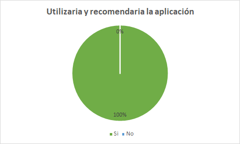

## Capítulo I: Introducción

# 1.1. Startup Profile

## 1.1.1. Descripción de la Startup
Nuestra startup se enfoca en mejorar la calidad de vida y la seguridad de las personas mayores a través de una solución integral de cuidado y seguimiento. Desarrollamos una aplicación móvil y una pulsera inteligente que permiten el seguimiento de la salud, recordatorios de medicamentos, ubicación en tiempo real, recordatorios generales y acceso rápido a números de emergencia.

Nuestra solución no solo beneficia a las personas mayores, sino que también proporciona tranquilidad a sus familiares y cuidadores, quienes pueden estar al tanto del bienestar de sus seres queridos en todo momento. En caso de emergencia, nuestra
aplicación permite un acceso rápido a ayuda, lo que puede marcar la diferencia en situaciones críticas.

## 1.1.2. Perfiles de integrantes del equipo

+ **Piero Anthony Liberato Susanibar:**
Universitario que cursa el 8to ciclo de, teniendo 22 años. En mis ratos libres me pongo a desarrollar un startup, hacer ejercicio, escuchar música, estudiar sobre temas de desarrollo personal y rara vez jugar videojuegos. Para mí la honestidad es uno de los valores más importantes en toda persona, siendo uno de mis valores principales, trabajador, amable y colaborativo. Mis habilidades son sobre todo cognitivas para la programación en React, Next y Flutter, aparte tengo conocimientos de oratoria y crear y pitchear una startup.

+ **Cristhian Orosco Orcotuma:** Estudio la carrera de Ingeniería de Software en la UPC. Me considero una persona detallista, amante de los animales, la música, sobre todo la tecnología y los videojuegos, en el futuro me gustaría crear un videojuego y tener mi propia empresa de videojuegos. Soy un chico al cual le gusta aprender todo tipo de cosas, porque considero que siempre uno debe estar preparado para todo. 

    

+ **Anthony Samir Nuñez Martinez:**  
Estudiante de Ingeniería de Software de 19 años en la Universidad Peruana de Ciencias y Tecnología, nacido el 15 de julio del 2004. 
Me gusta la música punk y desarrollo videojuegos en mi tiempo libre. Me gusta resolver problemas y buscar soluciones creativas o únicas a las cosas, inclusive cuando no es la forma más eficiente de hacerla, y soy una persona muy obsecionada con la puntualidad.

     

+ **Enrique Aldhair Llatas Flores:**  
Mi nombre es Enrique Aldhair Llatas Flores , estoy en el 7mo ciclo de la carrera de Ingeniería de Software  tengo habilidades en frontend y backend, también cuento con conocimiento en margenes ágiles y otros lenguajes como C++ y C#. Espero seguir aumentando mis conocimientos durante este ciclo.En mis tiempos libres me gusta investigar sobre margenes agiles ,jugar  y hacer ejercicio.Me gusta escuchar rock

   

+ Completar
+ Completar 
# 1.2. Solution Profile

## 1.2.1 Antecedentes y problemática

Nuestra startup se enfoca en mejorar la calidad de vida y la seguridad de las personas mayores a través de una solución integral de cuidado y seguimiento. Desarrollamos una aplicación móvil y una pulsera inteligente que permiten el seguimiento de la salud, recordatorios de medicamentos, ubicación en tiempo real, recordatorios generales y acceso rápido a números de emergencia.

Nuestra solución no solo beneficia a las personas mayores, sino que también proporciona tranquilidad a sus familiares y cuidadores, quienes pueden estar al tanto del bienestar de sus seres queridos en todo momento. En caso de emergencia, nuestra

aplicación permite un acceso rápido a ayuda, lo que puede marcar la diferencia en situaciones críticas.

Con respecto a nuestra propuesta, nuestra competencia es la siguiente:

MyTherapy es una aplicación útil tanto para cuidadores como para personas mayores. Actúa como un recordatorio de medicación, enviando alertas cuando es el momento de tomarla y manteniendo un registro de lo que ya se ha consumido. También almacena otros datos de salud importantes.

Safe365 es una aplicación de teleasistencia que permite mantener a las personas mayores localizadas en todo momento. En caso de emergencia, envía la posición con coordenadas GPS y crea alertas cuando entran o salen de áreas preestablecidas.

MiCuidum es una aplicación para familias que han contratado servicios de cuidado a domicilio. Ofrece un mayor control sobre las tareas diarias y la calidad de la asistencia, proporcionando diferentes planes de cuidado adaptados a las necesidades de cada persona mayor y facilitando el contacto con médicos especializados.

<u>**Problemática**</u>

**What(Qué)**

Deseamos crear una aplicación integral que combine las características de otras plataformas de cuidado para adultos mayores e incorpore dispositivos IoT para mejorar la vigilancia y el seguimiento de su salud.

**When(Cuándo)**

La necesidad de nuestra aplicación surge cuando las personas tienen a su cargo el cuidado de un adulto mayor y no pueden brindar una vigilancia continúa debido a errores de memoria o limitaciones de tiempo.

**Where(Donde)**

Esta problemática es global, ya que el envejecimiento de la población y la disminución de las tasas de natalidad están incrementando la demanda de cuidados para los adultos mayores.

**Who(quién)**

Los afectados son los cuidadores que no pueden llevar un registro y una vigilancia constante del adulto mayor, lo que puede llevar a equivocaciones y descuidos.

**Why(por qué)**

Esta causa surge porque los adultos mayores a menudo necesitan asistencia y cuidados constantes, incluso las 24 horas del día, y no pueden valerse por sí mismos.

**How (cómo)**

Nuestro objetivo es que tanto los cuidadores como los familiares puedan estar más tranquilos y seguir el estado del adulto mayor de manera continua, permitiéndoles tener más tiempo para dedicarse a sus actividades diarias.

**How much (cuánto)**

El cuidado del adulto mayor es una tarea frecuente y de gran magnitud. Por ejemplo:

 “En 2020, > 40 millones de cuidadores en los Estados Unidos proporcionaron atención no remunerada a un miembro de su familia o a otra persona ≥ 50 años”

Merckmanuals (abril 2023) Cuidado del anciano por parte de su familia. Recuperado el 1 de abril de 2024, de Cuidado del anciano por parte de su familia - Geriatría - Manual Merck versión para profesionales (merckmanuals.com)

Esto demuestra la importancia y la extensión de la problemática.

## 1.2.2 Lean UX Process.

### 1.2.2.1. Lean UX Problem Statements.
En el servicio del cuidado del adulto mayor es una actividad que nos afecta indirectamente a todas las personas naturales, esto tanto que seamos los que cuidemos del ser querido o contratemos a alguien para que la cuide por nosotros. 
¿Cómo aseguramos la seguridad del adulto mayor para las personas que las cuidan?
(Alfredo)
### 1.2.2.2. Lean UX Assumptions.
**Business Outcomes**
1. Buscamos mejorar la calidad de vida y la seguridad de las personas mayores mediante una solución integral de cuidado y seguimiento, lo que puede resultar en una disminución de los incidentes médicos graves y una mayor tranquilidad para los cuidadores.

2. Queremos facilitar la coordinación y comunicación entre miembros de la familia encargados del cuidado de adultos mayores, permitiéndoles compartir información relevante y tomar decisiones informadas de manera conjunta. 

3. Buscamos aumentar la eficiencia del proceso de cuidado de adultos mayores al reducir el tiempo dedicado a tareas administrativas y aumentar el enfoque en la atención directa y el bienestar del adulto mayor.

4. Queremos mejorar la seguridad de los adultos mayores al detectar y responder rápidamente a situaciones de emergencia o riesgo, como caídas, cambios bruscos en la salud o la salida del área designada.

5. El valor principal que un cliente busca es la certeza de que el estado del adulto mayor monitoreado es preciso, confiable, seguro y en tiempo real.

6. Las ganancias se generarán mediante la venta de las pulseras inteligentes vinculadas a la aplicación movil y  web, así como la suscripcion mensual para obtener la informacion de mas personas mayores.

7. Obtendré a mis clientes a través de la promoción del producto en redes sociales como tiktok, facebook, instagram y youtube.

8. Tomaremos ventaja sobre la competencia adaptando  la aplicación a las necesidades y habilidades tecnológicas de nuestro público objetivo, asegurando que el monitoreo en tiempo real sea comprensible y los avisos de problemas sean inmediatos.

 9. El riesgo con el producto es que la pulsera se desprenda o se dañe, lo que podría impedir la detección oportuna de problemas y la notificación instantánea al cuidador.

10.  Se resolverá mediante un mecanismo de seguridad robusto en la pulsera, junto con pruebas exhaustivas y mejoras iterativas hasta lograr un alto nivel de efectividad.

**User Outcomes**
1. ¿Quiénes son nuestros usuarios?
    + Cuidadores de adultos mayores que buscan una solución práctica y efectiva para monitorear la salud y seguridad de sus seres queridos.

    + Familiares de adultos mayores que desean estar informados sobre el bienestar de sus seres queridos y poder actuar rápidamente en caso de emergencia.

2. ¿Dónde encaja nuestro servicio para los usuarios?
   + Nuestro servicio se integra perfectamente en la vida diaria de los cuidadores, proporcionándoles una herramienta fácil de usar para supervisar el bienestar de los adultos mayores a su cargo.

    + Para los familiares de adultos mayores, nuestro servicio representa una forma de mantenerse conectados y cuidar de sus seres queridos a pesar de las limitaciones de tiempo y distancia.

    + Para los profesionales de la salud, nuestra aplicación les brinda una herramienta adicional para monitorear la salud de sus pacientes y ofrecer un cuidado más personalizado.

3. ¿Qué problemas resuelve nuestro producto?
    + Simplifica el proceso de cuidado al proporcionar información en tiempo real sobre la salud y la ubicación del adulto mayor.

    + Brinda tranquilidad a los cuidadores al ofrecer un sistema confiable de alerta en caso de emergencia o anomalía en la salud del adulto mayor.

    + Facilita la coordinación entre los cuidadores y otros miembros de la familia, permitiendo una respuesta rápida y efectiva en situaciones de emergencia.

4. ¿Cuándo y cómo es usado nuestro producto?

   + Nuestro producto es utilizado por los cuidadores durante períodos en los que no pueden estar físicamente presentes con el adulto mayor, como durante el trabajo o cuando viajan.

    + Se utiliza a través de una aplicación móvil que permite a los cuidadores monitorear remotamente la salud y la ubicación del adulto mayor en tiempo real.

    + Por los familiares de adultos mayores para mantenerse informados sobre el bienestar de sus seres queridos, incluso cuando no pueden estar presentes físicamente.

5. ¿Qué características son importantes?

    + La precisión y confiabilidad de los datos recopilados por los sensores integrados en la pulsera inteligente.
    
    + La facilidad de uso de la aplicación móvil, con una interfaz intuitiva que permita a los usuarios acceder rápidamente a la información relevante.

    + La capacidad de personalización para adaptar el sistema a las necesidades específicas de cada usuario y adulto mayor.

    + La capacidad de personalización es esencial para adaptar el producto a las necesidades específicas de cada usuario y adulto mayor, asegurando así una experiencia de usuario óptima.

6.   ¿Cómo debe verse y comportarse nuestro producto?
     + La pulsera inteligente debe tener un diseño ergonómico y atractivo que la haga cómoda de llevar durante períodos prolongados.

     +  La aplicación móvil debe tener una interfaz intuitiva y fácil de usar, con características visuales claras y una navegación sencilla.

     +  Es importante que tanto la pulsera como la aplicación transmitan una sensación de seguridad y confianza, tanto en su diseño como en su funcionamiento.

### 1.2.2.3. Lean UX Hypothesis Statements.
(Enrique)
+  Creemos que si nuestra solución integral de cuidado y seguimiento mejora la calidad de vida y seguridad de los adultos mayores.Entonces veremos una disminución en los incidentes médicos graves y una mayor tranquilidad para los cuidadores.
+  Creemos que si nuestra plataforma permite a los miembros de la familia compartir información relevante y tomar decisiones informadas de manera conjunta sobre el cuidado de los adultos mayores,Entonces veremos una mejora en la coordinación y comunicación entre los cuidadores familiares, lo que resultará en un cuidado más efectivo.
+  Creemos que si nuestra solución reduce el tiempo dedicado a tareas administrativas y aumenta el enfoque en la atención directa y el bienestar de los adultos mayores,Entonces observaremos una mejora en la eficiencia del proceso de cuidado, liberando tiempo y recursos para una atención más personalizada

### 1.2.2.4. Lean UX Canvas.
(cristian y enrique)
El siguiente artefacto es la síntesis del Lean UX, este nos ayudará a identificar el problema que
tratamos de resolver, así como tener más claro nuestro modelo de negocio.
[Canvas LINK ](https://docs.google.com/presentation/d/1I53KZ_e-K7dpT-oVvup2YSNQh47FEEui/edit#slide=id.p1 )

# 1.3. Segmentos objetivo.
La aplicación tiene como segmentos objetivos a dos grupos en particular: Personas responsables del cuidado de adultos mayores y Miembros de familias con adultos mayores a su cargo.
Inicialmente, la aplicación estará disponible únicamente en Perú.

+ **Personas responsables del cuidado de adultos mayores:**
 
    Este segmento comprende usuarios encargados del cuidado y atención de adultos mayores. Según datos del Instituto Nacional de Estadística e Informática (INEI), en Perú existen aproximadamente entre 410 y 415 geriatras. Estos usuarios, en su mayoría, son técnicos enfermeros con formación básica en diversas áreas relacionadas con el cuidado del paciente, incluyendo higiene, terapia ocupacional, prevención de accidentes y atención de emergencias.

+ **Personas que tienen un adulto mayor en su familia:**
 
    Este grupo incluye a aquellos usuarios que conviven con adultos mayores en su entorno familiar y son responsables de su cuidado. Según el INEI, en Perú hay aproximadamente 4 millones 598,000 personas de 60 años en adelante. Los datos de la Encuesta Nacional de Hogares (ENAHO) indican que el 80% de los adultos mayores a nivel nacional sufren de problemas de salud crónicos, que incluyen artritis, hipertensión, asma, reumatismo, diabetes, tuberculosis, colesterol elevado, entre otros. Además, el 85.1% de las mujeres y el 74.2% de los hombres adultos mayores presentan al menos un problema de salud crónico.
## Capítulo II: Requirements Elicitation & Analysi

# 2.1. Competidores

+ **MyTherapy** 

    MyTherapy es una aplicación diseñada para asistir en el seguimiento del plan de medicación prescrito, ofreciendo recordatorios programados para tomar pastillas y comprimidos a tiempo. Además de los recordatorios, MyTherapy incluye un diario integrado que permite a los usuarios registrar mediciones, síntomas y citas médicas. Esta aplicación también ofrece la funcionalidad de recordar al usuario que controle su peso, mida su presión arterial o la saturación de oxígeno en sangre. Los datos de peso, presión arterial y saturación de oxígeno pueden ingresarse directamente en el diario de salud de MyTherapy.

    

+ **Safe365**

    Safe es una aplicación diseñada para brindar cuidado y atención a padres, abuelos y familiares mayores. Permite a los usuarios localizar a sus seres queridos en tiempo real, establecer rutinas diarias, fomentar hábitos saludables y mantenerse conectados con ellos. La aplicación también ofrece la función de recibir notificaciones cuando los familiares mayores ingresan o salen de ciertos lugares, así como un botón de emergencia/pánico para recibir alertas en caso de que necesiten ayuda urgente.

    
   
+ **MiCuidum** 

    La aplicación MiCuidum está especialmente diseñada para familias que necesitan cuidados domiciliarios para personas mayores. Sus diversas funciones permiten un seguimiento más detallado de las rutinas diarias y la calidad de la atención recibida. Ofrece una variedad de planes de cuidado adaptados a las necesidades específicas de cada adulto mayor y facilita la comunicación con profesionales médicos especializados para abordar cualquier preocupación o pregunta que surja.

    
## 2.1.1. Análisis competitivo
|                       | Competitive Analysis Landsacape                                                          |
| --------------------- | ---------------------------------------------------------------------------------------- |
| ¿Por qué llevar       | Escriba en el recuadro la pregunta que busca responder o el objetivo de este análisis.   |
| a cabo este análisis? | Conocer  las diferencias entre nuestro servicio brindado comparandola con la competencia |

|                     |                                                       | OneUp                                                                          | MyTherapy                                                                                                                                                                   | Safe365                                                                                                                                                             | MiCuidum                                                                                                                                                      |
| ------------------- | ----------------------------------------------------- | ------------------------------------------------------------------------------ | --------------------------------------------------------------------------------------------------------------------------------------------------------------------------- | ------------------------------------------------------------------------------------------------------------------------------------------------------------------- | ------------------------------------------------------------------------------------------------------------------------------------------------------------- |
| Perfil              | Overview                                              | Aplicación en seguimiento de salud del anciano con dispositivos iot            | Aplicación que brinda recordatorios medicos, enviando alertas cuando es el momento de tomarla y manteniendo un registro. También almacena otros datos de salud importantes. | Aplicación de teleasistencia que permite mantener a las personas mayores localizadas en todo momento. En caso de emergencia, envía la posición con coordenadas GPS. | Aplicación para familias que han contratado servicios de cuidado a domicilio. Ofrece un mayor control sobre las tareas diarias y la calidad de la asistencia. |
|                     | Ventaja competitiva ¿Qué valor ofrece a los clientes? | Seguimiento del estado del adulto mayor.                                       | Recordatorios medicos y seguimiento del tratamiento.                                                                                                                        | Ubicación a tiempo real, ante una emergencia o si se escapa.                                                                                                        | Seguimiento del cuidador a domicilio.                                                                                                                         |
| Perfil de Marketing | Mercado objetivo                                      | Personas que cuidan al adulto mayor                                            | Personas que cuidan al adulto mayor                                                                                                                                         | Personas que cuidan al adulto mayor                                                                                                                                 | Personas que cuidan al adulto mayor                                                                                                                           |
|                     | Estrategias de marketing                              | Publicidad por medio de las redes sociales                                     | Publicidad mediante su web                                                                                                                                                  | Publicidad mediante su web                                                                                                                                          | Publicidad mediante su web                                                                                                                                    |
| Perfil de Producto  | Productos & Servicios                                 | Servicio de seguimiento del estado de salud.                                   | Servicio de recordatorio medico y seguimiento                                                                                                                               | Servicio de ubicacion a tiempo real del adulto mayor                                                                                                                | Servicio de seguimiento del adulto mayor                                                                                                                      |
|                     | Precios & Costos                                      | -Pago inicial por la herramienta iot -Plan premium con mas funcionalidades | Gratuito                                                                                                                                                                    | Gratuita                                                                                                                                                            | 2.619,26 dolares mensuales por 40h semanales tratamiento interno                                                                                              |
|                     | Canales de distribución (Web y/o Móvil)               | Aplicación web                                                                 | Aplicación móvil                                                                                                                                                            | Redes sociales y pagina web.                                                                                                                                        | Redes sociales y pagina web.                                                                                                                                  |
| Análisis SWOT       | Fortalezas                                            | Permite realizar un seguimiento de salud a tiempo real.                        | Sistema de recordatorio de toma de medicinas y recordatorio de analisis que se ralizo                                                                                       | Seguimiento del adulto mayor las 24 horas del dia                                                                                                                   | Permite conseguir un cuidador a medida y con seguimiento de lo que realiza                                                                                    |
|                     | Debilidades                                           | Dependemos de un dispositivo externo                                           | Solo ofrece esas funciones y no hay otros planes al cual acceder                                                                                                            | No tiene otro plan o seguimiento por otro dispositivo                                                                                                               | No muestra el precio real de contratarlos                                                                                                                     |
|                     | Oportunidades                                         | Aplicamos seguimiento constante                                                | Aplica recordatorios de medicina y de tratamientos realizados                                                                                                               | Facilitar la tranquilidad de la familia que no se pierda                                                                                                            | Personal especializados en el cuidado y reporte.                                                                                                              |
|                     | Amenazas                                              | Que la pulsera iot fuera incomoda y no la quieran usar                         | Facilidad de copiar la aplicación.                                                                                                                                          | Es necesario que el adulto mayor tenga en todo momento su celular                                                                                                   | Su precio suele ser mas caro de lo usual                                                                                                                      |

## 2.1.2. Estrategias y tácticas frente a competidores

1. *Ventaja Competitiva*: OneUp ofrece un seguimiento del estado de salud del adulto mayor con dispositivos IoT. Esta característica puede destacarse como una ventaja clave sobre competidores como MyTherapy y Safe365, que se centran en recordatorios médicos y ubicación en tiempo real, respectivamente.

2. *Marketing*: Utilizar estrategias de marketing enfocadas en resaltar la capacidad de OneUp para ofrecer un seguimiento del estado de salud en tiempo real, lo cual brinda una mayor tranquilidad a los cuidadores. Publicitar en redes sociales y mediante la aplicación web para llegar al mercado objetivo.

3. *Desarrollo de Producto*: Continuar mejorando la integración y funcionalidades de los dispositivos IoT para ofrecer un seguimiento aún más detallado y efectivo del estado de salud del adulto mayor. Esto podría incluir la incorporación de sensores adicionales para monitorear otros aspectos de la salud.

4. *Precios y Costos*: Considerar la posibilidad de ofrecer planes más flexibles y accesibles para los cuidadores, como planes de suscripción mensuales o anuales, además del pago inicial por el dispositivo IoT.

# 2.2. Entrevistas

## 2.2.1. Diseño de entrevistas

Segmento principal: Cuidadores de adultos mayores 

1.	¿Cuál es tu nombre? ¿Cuál es tu edad?
2.	¿Estudias o trabajas?
3.	¿Cuántas horas al día estás alejado de tu hogar?
4.	¿Quién es la persona a la que estás cuidando o supervisando? ¿Cuántos años tiene?
5.	¿Esta persona cuenta con alguna discapacidad?
6.	¿Tienes alguien que te pueda ayudar? ¿Estas personas también tienen trabajos o estudios qué atender?
7.	Cuénteme sobre algún incidente que haya ocurrido con la persona que está cuidando.
8.	¿Qué tipo de tecnología usa frecuentemente? Algo así como celular, laptop o televisión.
*Luego de las preguntas anteriores, se le resume el proyecto*
9.	¿Qué opina del proyecto? ¿Le gustó la propuesta?
10.	¿Ha oído de alguna propuesta similar?
11.	Cuéntenos de alguna sugerencia o añadido que le gustaría ver en la propuesta.

## 2.2.2. Registro de entrevistas

En esta sección se presenta la información recolectada en las entrevistas realizadas a los usuarios de los segmentos objetivo.

### Segmento: Cuidadores
 
**Nombre y Apellidos :** Raquel Lili Melany Romero Martinez  
**Edad &nbsp; &nbsp; &nbsp; &nbsp; &nbsp; &nbsp; &nbsp; &nbsp; &nbsp; &nbsp; &nbsp; &nbsp; &nbsp;:** 24 años  
**Distrito &nbsp; &nbsp; &nbsp; &nbsp; &nbsp; &nbsp; &nbsp; &nbsp; &nbsp; &nbsp; &nbsp;:** Villa María, Nuevo Chimbote  

 

**Enlace &nbsp; &nbsp; &nbsp; &nbsp; &nbsp; &nbsp; &nbsp; &nbsp; &nbsp; &nbsp; &nbsp;:** [Video de entrevistas](https://upcedupe-my.sharepoint.com/personal/u202119276_upc_edu_pe/_layouts/15/stream.aspx?id=%2Fpersonal%2Fu202119276%5Fupc%5Fedu%5Fpe%2FDocuments%2FCiclo%207%2FSoluciones%20IOT%2FTF%2FSubir%20videos%20de%20entrevistas%2FEntrevistas%5FIOT%2Emp4&ga=1&referrer=StreamWebApp%2EWeb&referrerScenario=AddressBarCopied%2Eview) Al minuto 22:53  

Raquel es una estudiante de medicina que está alrededor de 5 o 6 horas al día fuera de su domicilio. 
Actualmente está cuidando de su abuelo, que tiene 85 años y tiene problemas de movilidadad. 
Mientras conversaba con ella, se puede notar un tanto de melancolía al pensar en la situación de 
su padre, especialmente por su dificultad en moverse o levantarse de la cama. A pesar de estos 
problemas de movilidad, él siempre encuentra como escaparse. 
Raquel usa más frecuentemente su celular Android y su laptop, y su principal navegador de uso es Google Chrome. 

**Nombre y Apellidos :** Norma Ismary Martinez Lozano  
**Edad &nbsp; &nbsp; &nbsp; &nbsp; &nbsp; &nbsp; &nbsp; &nbsp; &nbsp; &nbsp; &nbsp; &nbsp; &nbsp;:** 51 años  
**Distrito &nbsp; &nbsp; &nbsp; &nbsp; &nbsp; &nbsp; &nbsp; &nbsp; &nbsp; &nbsp; &nbsp;:** Villa María, Nuevo Chimbote  

 

**Enlace &nbsp; &nbsp; &nbsp; &nbsp; &nbsp; &nbsp; &nbsp; &nbsp; &nbsp; &nbsp; &nbsp;:** [Video de entrevistas](https://upcedupe-my.sharepoint.com/personal/u202119276_upc_edu_pe/_layouts/15/stream.aspx?id=%2Fpersonal%2Fu202119276%5Fupc%5Fedu%5Fpe%2FDocuments%2FCiclo%207%2FSoluciones%20IOT%2FTF%2FSubir%20videos%20de%20entrevistas%2FEntrevistas%5FIOT%2Emp4&ga=1&referrer=StreamWebApp%2EWeb&referrerScenario=AddressBarCopied%2Eview) Al minuto 30:57  

Norma es una profesora de primaria, que se mantiene trabajando 8 horas, que se acumulan con otras actividades por lo que 
no puede mantenerse mucho tiempo en su domicilio. La persona a su cuidado es su madre, la cual tiene presión alta 
y varias enfermedades degenerativas que han estado bajando su calidad de vida. Norma parece muy enfocada en que siempre 
exista alguien presente al lado de su madre para que la cuide en caso que algún incidente le ocurra para ella. 
Norma utiliza mayormente su celular, su laptop y una cámara que tiene en el centro de la sala para vigilar a su 
madre, y hablar con ella. 
Norma tiene un celular android y su explorador principal es Google Chrome. 

**Nombre y Apellidos :** Juan Diego Ponce Arasaki  
**Edad &nbsp; &nbsp; &nbsp; &nbsp; &nbsp; &nbsp; &nbsp; &nbsp; &nbsp; &nbsp; &nbsp; &nbsp; &nbsp;:** 21 años  
**Distrito &nbsp; &nbsp; &nbsp; &nbsp; &nbsp; &nbsp; &nbsp; &nbsp; &nbsp; &nbsp; &nbsp;:** Ancon, Lima  

  

**Enlace &nbsp; &nbsp; &nbsp; &nbsp; &nbsp; &nbsp; &nbsp; &nbsp; &nbsp; &nbsp; &nbsp;:** [Video de entrevistas](https://upcedupe-my.sharepoint.com/personal/u202119276_upc_edu_pe/_layouts/15/stream.aspx?id=%2Fpersonal%2Fu202119276%5Fupc%5Fedu%5Fpe%2FDocuments%2FCiclo%207%2FSoluciones%20IOT%2FTF%2FSubir%20videos%20de%20entrevistas%2FEntrevistas%5FIOT%2Emp4&ga=1&referrer=StreamWebApp%2EWeb&referrerScenario=AddressBarCopied%2Eview) Al minuto 28:16  

Nuestro entrevistado fue Juan Ponce, estudiante de ingeniería de sistemas que está interesado en la propuesta ya que cuida a un adulto mayor. Nos explicó sobre su situación y la preocupacion que tiene al momento de salir ,dejando a su abuela sola .Por eso nos comento que si existiera una forma de mantener supervision constante sobre su abuela le serviria de mucha ayuda.Así mismo nos conto sobre una mala experiencia que tuvo cuando la dejo sola y  su abuela se cayo ,por suerte el habia avisado a un vecino si pudiera estar viendola cada cierto tiempo  siendo de mucha utilidad.Finalmente nos menciono el sistema operativo de su celular y el navegador de su preferencia siendo android y Google Chrome.
 

**Nombre y Apellidos :** Jordi Jesus Carhuachin  
**Edad &nbsp; &nbsp; &nbsp; &nbsp; &nbsp; &nbsp; &nbsp; &nbsp; &nbsp; &nbsp; &nbsp; &nbsp; &nbsp;:** 23 años  
**Distrito &nbsp; &nbsp; &nbsp; &nbsp; &nbsp; &nbsp; &nbsp; &nbsp; &nbsp; &nbsp; &nbsp;:** Huaral, Lima  

 

**Enlace &nbsp; &nbsp; &nbsp; &nbsp; &nbsp; &nbsp; &nbsp; &nbsp; &nbsp; &nbsp; &nbsp;:** [Video de entrevistas](https://upcedupe-my.sharepoint.com/personal/u202119276_upc_edu_pe/_layouts/15/stream.aspx?id=%2Fpersonal%2Fu202119276%5Fupc%5Fedu%5Fpe%2FDocuments%2FCiclo%207%2FSoluciones%20IOT%2FTF%2FSubir%20videos%20de%20entrevistas%2FEntrevistas%5FIOT%2Emp4&ga=1&referrer=StreamWebApp%2EWeb&referrerScenario=AddressBarCopied%2Eview) Al minuto 00:00  

Jordi es un estudiante de enfermo (Universidad Jose Faustino Sanchez Carrión) en el ultimo ciclo de internado, con relacionado al adulto mayor, realizo practicas en un asilo San Judas Tadeo, en donde tenian los adultos mayores que ser cuidados por expertos, en el curso del cuidado del adulto mayor. Existian muchos tipos de personas mayores, donde guardan esa información es por historial clinicas , tiene el historial de la enfermedades, tratamientos y doctores, examenes auxiliares y entre otros. 
Lo importante a realizar a un abuelo es que no les genere ulceras por presión, esto sucede porque para mucho tiempo postrados en cama o sentados, sus huesos comiencen a rozar con su piel. Por eso si se usaran una pulsera deben ser productos no lacerantes, algodón estaria bien 
En caso de que los abuelos quieran irse es una constante cuando se les saca de paseo, ya que necesitan estimulación tanto fisica como mental.  
En caso del producto es necesario para los pacientes de hipertensión, ya que es necesario revisar su presión o que tomen sus pastillas a tiempo, sino podrian caer en un taquicardia o un paro cardiaco. En estos casos es una revisión cada 8 horas o 3 veces al dia.  
Ante la diferenciación la competencia dijo que serian los relojos pero algo que no tienen es la presión, eso seria relevante 

**Nombre y Apellidos :** Jonatan Curi 

**Edad &nbsp; &nbsp; &nbsp; &nbsp; &nbsp; &nbsp; &nbsp; &nbsp; &nbsp; &nbsp; &nbsp; &nbsp; &nbsp;:** 22 años 

**Distrito &nbsp; &nbsp; &nbsp; &nbsp; &nbsp; &nbsp; &nbsp; &nbsp; &nbsp; &nbsp; &nbsp;:** Carabayllo, Lima 

**Enlace &nbsp; &nbsp; &nbsp; &nbsp; &nbsp; &nbsp; &nbsp; &nbsp; &nbsp; &nbsp; &nbsp;:** [Video de entrevistas](https://upcedupe-my.sharepoint.com/personal/u202119276_upc_edu_pe/_layouts/15/stream.aspx?id=%2Fpersonal%2Fu202119276%5Fupc%5Fedu%5Fpe%2FDocuments%2FCiclo%207%2FSoluciones%20IOT%2FTF%2FSubir%20videos%20de%20entrevistas%2FEntrevistas%5FIOT%2Emp4&ga=1&referrer=StreamWebApp%2EWeb&referrerScenario=AddressBarCopied%2Eview) Al minuto 07:30 

Jonatan, estudiante de la UPC, enfrenta el desafío de equilibrar sus estudios con el cuidado especializado de un familiar de edad avanzada. Aunque se compromete con esta responsabilidad debido a su estrecha relación con su ser querido, reconoce las limitaciones de tiempo que le impone. 

Jonatan sugiere mejoras para facilitar su situación, como la flexibilización de horarios académicos y el acceso a recursos de apoyo para estudiantes en circunstancias similares. Su experiencia resalta la importancia de considerar las necesidades de aquellos que enfrentan responsabilidades de cuidado familiar mientras persiguen sus objetivos educativos.

**Nombre y Apellidos :** Maryfe Pamela Cortez Menguay  
**Edad &nbsp; &nbsp; &nbsp; &nbsp; &nbsp; &nbsp; &nbsp; &nbsp; &nbsp; &nbsp; &nbsp; &nbsp; &nbsp;:** 26 años  
**Distrito &nbsp; &nbsp; &nbsp; &nbsp; &nbsp; &nbsp; &nbsp; &nbsp; &nbsp; &nbsp; &nbsp;:** Callao, Lima  

**Enlace &nbsp; &nbsp; &nbsp; &nbsp; &nbsp; &nbsp; &nbsp; &nbsp; &nbsp; &nbsp; &nbsp;:** [Entrevista de Cristhian](https://upcedupe-my.sharepoint.com/personal/u202119276_upc_edu_pe/_layouts/15/stream.aspx?id=%2Fpersonal%2Fu202119276%5Fupc%5Fedu%5Fpe%2FDocuments%2FCiclo%207%2FSoluciones%20IOT%2FTF%2FSubir%20videos%20de%20entrevistas%2FEntrevistas%5FIOT%2Emp4&ga=1&referrer=StreamWebApp%2EWeb&referrerScenario=AddressBarCopied%2Eview) Al minuto 13:43  

Maryfe es una enfermera que cuida a una paciente mayor con diversas complicaciones de salud, incluyendo fibrosis pulmonar. Maryfe trabaja junto a otra persona para atender las necesidades de la paciente las 24 horas del día. La paciente es dependiente de sus cuidadores debido a su condición médica y no puede caminar ni alimentarse sola.
Maryfe no observa ninguna discapacidad adicional en la paciente aparte de sus problemas de salud. Ella utiliza principalmente su teléfono celular para tecnología y encuentra interesante el proyecto, que propone una aplicación móvil y una pulsera inteligente para monitorear a adultos mayores. Sugiere que la aplicación también registre la frecuencia cardíaca, ya que es un indicador importante de la salud del paciente. 

## 2.2.3. Análisis de entrevistas.
De acuerdo a las entrevistas realizadas, los cuidadores de adultos mayores hacen uso de la tecnologia, se observa que los dispositivos que utilizan principalmente son las computadoras, laptops asi como los celulares. 

De la misma manera, se observa que los cuidadores de adultos mayores utilizan en su mayoria marcas de celulares con el sistema operativo Android.

La mayoría de los entrevistados muestra interés y aceptación hacia el proyecto propuesto de una aplicación móvil y pulsera inteligente para el monitoreo de adultos mayores.

En cuanto a los navegadores web, los cuidadores de adultos mayores utilizan principalmente Google Chrome.

Asimismo, se destaca la importancia del monitoreo de diferentes aspectos de la salud de los adultos mayores, como la presión arterial y la frecuencia cardíaca. Los entrevistados resaltan la relevancia de incluir estos parámetros en la aplicación móvil y la pulsera inteligente para proporcionar un monitoreo integral de la salud de los pacientes. 
# 2.3. Needfinding

## 2.3.1. User Personas

A continuación, se construirán los User Persona de cada segmento objetivo de nuestra plataforma. Para ello, se utilizarán los datos recolectados de las entrevistas realizadas.

**User Persona – Cuidador de adulto mayor en minorias.**

**User Persona – Cuidador de adulto mayor en mayorias.**

## 2.3.2. User Task Matrix

**User Persona – Cuidador de adulto mayor en minorias.**

<table>
<thead>
  <tr>
    <th rowspan="2">&nbsp;&nbsp;&nbsp;   &nbsp;&nbsp;&nbsp; User Task Matrix&nbsp;&nbsp;&nbsp;</th>
    <th colspan="2">&nbsp;&nbsp;&nbsp; Luisa Costa&nbsp;&nbsp;&nbsp;</th>
  </tr>
  <tr>
    <th>&nbsp;&nbsp;&nbsp; Frecuencia&nbsp;&nbsp;&nbsp;</th>
    <th>&nbsp;&nbsp;&nbsp; Importancia&nbsp;&nbsp;&nbsp;</th>
  </tr>
</thead>
<tbody>
  <tr>
    <td>&nbsp;&nbsp;&nbsp; Monitorear signos vitales&nbsp;&nbsp;&nbsp;</td>
    <td>&nbsp;&nbsp;&nbsp; Often&nbsp;&nbsp;&nbsp;</td>
    <td>&nbsp;&nbsp;&nbsp; High&nbsp;&nbsp;&nbsp;</td>
  </tr>
  <tr>
    <td>&nbsp;&nbsp;&nbsp; Comunicarse con familiares y&nbsp;&nbsp;&nbsp;otros profesionales&nbsp;&nbsp;&nbsp;</td>
    <td>&nbsp;&nbsp;&nbsp; Often&nbsp;&nbsp;&nbsp;</td>
    <td>&nbsp;&nbsp;&nbsp; Medium&nbsp;&nbsp;&nbsp;</td>
  </tr>
  <tr>
    <td>&nbsp;&nbsp;&nbsp; Mantener registros y&nbsp;&nbsp;&nbsp;documentación&nbsp;&nbsp;&nbsp;</td>
    <td>&nbsp;&nbsp;&nbsp; Often&nbsp;&nbsp;&nbsp;</td>
    <td>&nbsp;&nbsp;&nbsp; High&nbsp;&nbsp;&nbsp;</td>
  </tr>
  <tr>
    <td>&nbsp;&nbsp;&nbsp; Administrar medicamentos&nbsp;&nbsp;&nbsp;</td>
    <td>&nbsp;&nbsp;&nbsp; Often&nbsp;&nbsp;&nbsp;</td>
    <td>&nbsp;&nbsp;&nbsp; High&nbsp;&nbsp;&nbsp;</td>
  </tr>
  <tr>
    <td>&nbsp;&nbsp;&nbsp; Facilitar actividades&nbsp;&nbsp;&nbsp;recreativas&nbsp;&nbsp;&nbsp;</td>
    <td>&nbsp;&nbsp;&nbsp; Rarely&nbsp;&nbsp;&nbsp;</td>
    <td>&nbsp;&nbsp;&nbsp; Medium&nbsp;&nbsp;&nbsp;</td>
  </tr>
</tbody>
</table>

**User Persona – Cuidador de adulto mayor en mayorias.**

<table>
<thead>
  <tr>
    <th rowspan="2">&nbsp;&nbsp;&nbsp;   &nbsp;&nbsp;&nbsp; User Task Matrix&nbsp;&nbsp;&nbsp;</th>
    <th colspan="2">    Ana Contreras</th>
  </tr>
  <tr>
    <th>&nbsp;&nbsp;&nbsp; Frecuencia&nbsp;&nbsp;&nbsp;</th>
    <th>&nbsp;&nbsp;&nbsp; Importancia&nbsp;&nbsp;&nbsp;</th>
  </tr>
</thead>
<tbody>
  <tr>
    <td>&nbsp;&nbsp;&nbsp; Monitorear signos vitales&nbsp;&nbsp;&nbsp;</td>
    <td>&nbsp;&nbsp;&nbsp; Often&nbsp;&nbsp;&nbsp;</td>
    <td>&nbsp;&nbsp;&nbsp; High&nbsp;&nbsp;&nbsp;</td>
  </tr>
  <tr>
    <td>&nbsp;&nbsp;&nbsp; Comunicarse con familiares y&nbsp;&nbsp;&nbsp;otros profesionales&nbsp;&nbsp;&nbsp;</td>
    <td>&nbsp;&nbsp;&nbsp; Often&nbsp;&nbsp;&nbsp;</td>
    <td>&nbsp;&nbsp;&nbsp; Medium&nbsp;&nbsp;&nbsp;</td>
  </tr>
  <tr>
    <td>&nbsp;&nbsp;&nbsp; Mantener registros y&nbsp;&nbsp;&nbsp;documentación&nbsp;&nbsp;&nbsp;</td>
    <td>&nbsp;&nbsp;&nbsp; Often&nbsp;&nbsp;&nbsp;</td>
    <td>&nbsp;&nbsp;&nbsp; High&nbsp;&nbsp;&nbsp;</td>
  </tr>
  <tr>
    <td>&nbsp;&nbsp;&nbsp; Administrar medicamentos&nbsp;&nbsp;&nbsp;</td>
    <td>&nbsp;&nbsp;&nbsp; Often&nbsp;&nbsp;&nbsp;</td>
    <td>&nbsp;&nbsp;&nbsp; High&nbsp;&nbsp;&nbsp;</td>
  </tr>
  <tr>
    <td>&nbsp;&nbsp;&nbsp; Facilitar actividades&nbsp;&nbsp;&nbsp;recreativas&nbsp;&nbsp;&nbsp;</td>
    <td>&nbsp;&nbsp;&nbsp; Rarely&nbsp;&nbsp;&nbsp;</td>
    <td>&nbsp;&nbsp;&nbsp; Medium&nbsp;&nbsp;&nbsp;</td>
  </tr>
</tbody>
</table>

## 2.3.3. User Journey Mapping

**User Journey Mapping – Cuidador de adulto mayor en minorias.**

**User Journey Mapping – Cuidador de adulto mayor en mayorias.**

## 2.3.4. Empathy Mapping

**Empathy Mapping – Cuidador de adulto mayor en minorias.**

**Empathy Mapping – Cuidador de adulto mayor en mayorias.**

## 2.3.5. As-is Scenario Mapping

# 2.4. Ubiquitous Language
(colocar 2 cada uno )
+ **Pulsera Inteligente:**  
Se refiere al dispositivo wearable que se utilizará para recopilar datos biométricos y de ubicación del adulto mayor en tiempo real.

+ **Cuidador:**     
  Persona responsable del cuidado y atención del adulto mayor, puede ser un familiar o un profesional de la salud.

+ **Ubicación en Tiempo Real:**     
  Capacidad de rastrear la ubicación exacta del adulto mayor en todo momento, proporcionando tranquilidad al cuidador y permitiendo una respuesta rápida en caso de emergencia.

