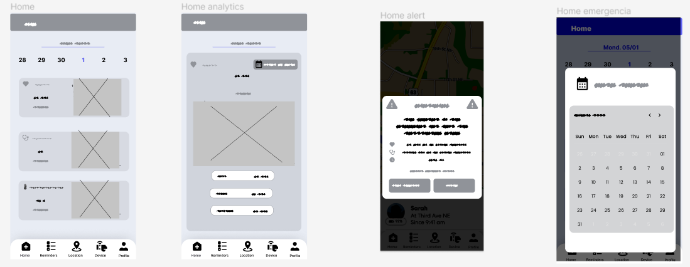
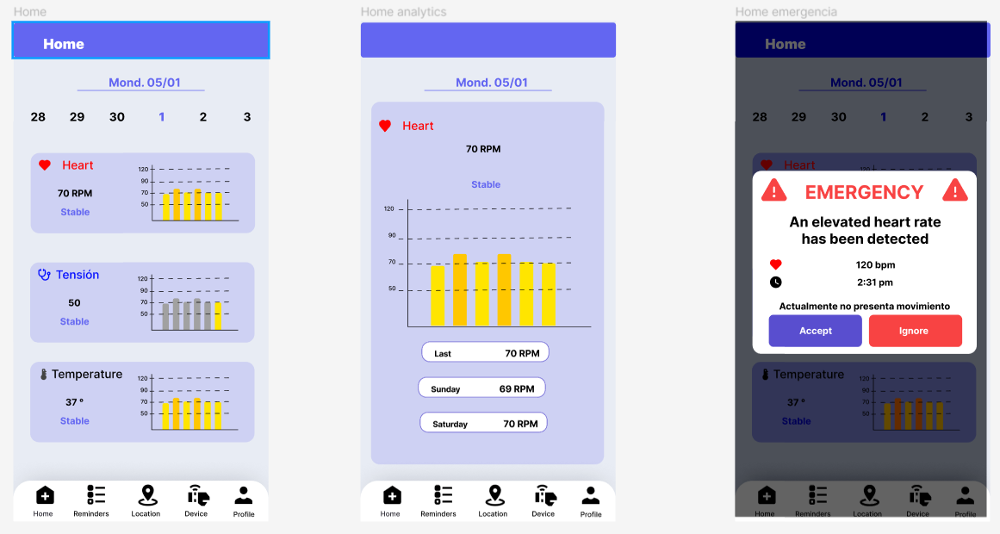

## Capítulo I: Introducción

# 1.1. Startup Profile

## 1.1.1. Descripción de la Startup
Nuestra startup se enfoca en mejorar la calidad de vida y la seguridad de las personas mayores a través de una solución integral de cuidado y seguimiento. Desarrollamos una aplicación móvil y una pulsera inteligente que permiten el seguimiento de la salud, recordatorios de medicamentos, ubicación en tiempo real, recordatorios generales y acceso rápido a números de emergencia.

Nuestra solución no solo beneficia a las personas mayores, sino que también proporciona tranquilidad a sus familiares y cuidadores, quienes pueden estar al tanto del bienestar de sus seres queridos en todo momento. En caso de emergencia, nuestra
aplicación permite un acceso rápido a ayuda, lo que puede marcar la diferencia en situaciones críticas.

## 1.1.2. Perfiles de integrantes del equipo

+ **Piero Anthony Liberato Susanibar:**
Universitario que cursa el 8to ciclo de, teniendo 22 años. En mis ratos libres me pongo a desarrollar un startup, hacer ejercicio, escuchar música, estudiar sobre temas de desarrollo personal y rara vez jugar videojuegos. Para mí la honestidad es uno de los valores más importantes en toda persona, siendo uno de mis valores principales, trabajador, amable y colaborativo. Mis habilidades son sobre todo cognitivas para la programación en React, Next y Flutter, aparte tengo conocimientos de oratoria y crear y pitchear una startup.

+ **Cristhian Orosco Orcotuma:** Estudio la carrera de Ingeniería de Software en la UPC. Me considero una persona detallista, amante de los animales, la música, sobre todo la tecnología y los videojuegos, en el futuro me gustaría crear un videojuego y tener mi propia empresa de videojuegos. Soy un chico al cual le gusta aprender todo tipo de cosas, porque considero que siempre uno debe estar preparado para todo. 

    

+ **Anthony Samir Nuñez Martinez:**  
Estudiante de Ingeniería de Software de 19 años en la Universidad Peruana de Ciencias y Tecnología, nacido el 15 de julio del 2004. 
Me gusta la música punk y desarrollo videojuegos en mi tiempo libre. Me gusta resolver problemas y buscar soluciones creativas o únicas a las cosas, inclusive cuando no es la forma más eficiente de hacerla, y soy una persona muy obsecionada con la puntualidad.

     

+ **Enrique Aldhair Llatas Flores:**  
Mi nombre es Enrique Aldhair Llatas Flores , estoy en el 7mo ciclo de la carrera de Ingeniería de Software  tengo habilidades en frontend y backend, también cuento con conocimiento en margenes ágiles y otros lenguajes como C++ y C#. Espero seguir aumentando mis conocimientos durante este ciclo.En mis tiempos libres me gusta investigar sobre margenes agiles ,jugar  y hacer ejercicio.Me gusta escuchar rock

   

+ Completar
+ Completar 
# 1.2. Solution Profile

## 1.2.1 Antecedentes y problemática

Nuestra startup se enfoca en mejorar la calidad de vida y la seguridad de las personas mayores a través de una solución integral de cuidado y seguimiento. Desarrollamos una aplicación móvil y una pulsera inteligente que permiten el seguimiento de la salud, recordatorios de medicamentos, ubicación en tiempo real, recordatorios generales y acceso rápido a números de emergencia.

Nuestra solución no solo beneficia a las personas mayores, sino que también proporciona tranquilidad a sus familiares y cuidadores, quienes pueden estar al tanto del bienestar de sus seres queridos en todo momento. En caso de emergencia, nuestra

aplicación permite un acceso rápido a ayuda, lo que puede marcar la diferencia en situaciones críticas.

Con respecto a nuestra propuesta, nuestra competencia es la siguiente:

MyTherapy es una aplicación útil tanto para cuidadores como para personas mayores. Actúa como un recordatorio de medicación, enviando alertas cuando es el momento de tomarla y manteniendo un registro de lo que ya se ha consumido. También almacena otros datos de salud importantes.

Safe365 es una aplicación de teleasistencia que permite mantener a las personas mayores localizadas en todo momento. En caso de emergencia, envía la posición con coordenadas GPS y crea alertas cuando entran o salen de áreas preestablecidas.

MiCuidum es una aplicación para familias que han contratado servicios de cuidado a domicilio. Ofrece un mayor control sobre las tareas diarias y la calidad de la asistencia, proporcionando diferentes planes de cuidado adaptados a las necesidades de cada persona mayor y facilitando el contacto con médicos especializados.

<u>**Problemática**</u>

**What(Qué)**

Deseamos crear una aplicación integral que combine las características de otras plataformas de cuidado para adultos mayores e incorpore dispositivos IoT para mejorar la vigilancia y el seguimiento de su salud.

**When(Cuándo)**

La necesidad de nuestra aplicación surge cuando las personas tienen a su cargo el cuidado de un adulto mayor y no pueden brindar una vigilancia continúa debido a errores de memoria o limitaciones de tiempo.

**Where(Donde)**

Esta problemática es global, ya que el envejecimiento de la población y la disminución de las tasas de natalidad están incrementando la demanda de cuidados para los adultos mayores.

**Who(quién)**

Los afectados son los cuidadores que no pueden llevar un registro y una vigilancia constante del adulto mayor, lo que puede llevar a equivocaciones y descuidos.

**Why(por qué)**

Esta causa surge porque los adultos mayores a menudo necesitan asistencia y cuidados constantes, incluso las 24 horas del día, y no pueden valerse por sí mismos.

**How (cómo)**

Nuestro objetivo es que tanto los cuidadores como los familiares puedan estar más tranquilos y seguir el estado del adulto mayor de manera continua, permitiéndoles tener más tiempo para dedicarse a sus actividades diarias.

**How much (cuánto)**

El cuidado del adulto mayor es una tarea frecuente y de gran magnitud. Por ejemplo:

 “En 2020, > 40 millones de cuidadores en los Estados Unidos proporcionaron atención no remunerada a un miembro de su familia o a otra persona ≥ 50 años”

Merckmanuals (abril 2023) Cuidado del anciano por parte de su familia. Recuperado el 1 de abril de 2024, de Cuidado del anciano por parte de su familia - Geriatría - Manual Merck versión para profesionales (merckmanuals.com)

Esto demuestra la importancia y la extensión de la problemática.

## 1.2.2 Lean UX Process.

### 1.2.2.1. Lean UX Problem Statements.
En el servicio del cuidado del adulto mayor es una actividad que nos afecta indirectamente a todas las personas naturales, esto tanto que seamos los que cuidemos del ser querido o contratemos a alguien para que la cuide por nosotros. 
¿Cómo aseguramos la seguridad del adulto mayor para las personas que las cuidan?
(Alfredo)
### 1.2.2.2. Lean UX Assumptions.
**Business Outcomes**
1. Buscamos mejorar la calidad de vida y la seguridad de las personas mayores mediante una solución integral de cuidado y seguimiento, lo que puede resultar en una disminución de los incidentes médicos graves y una mayor tranquilidad para los cuidadores.

2. Queremos facilitar la coordinación y comunicación entre miembros de la familia encargados del cuidado de adultos mayores, permitiéndoles compartir información relevante y tomar decisiones informadas de manera conjunta. 

3. Buscamos aumentar la eficiencia del proceso de cuidado de adultos mayores al reducir el tiempo dedicado a tareas administrativas y aumentar el enfoque en la atención directa y el bienestar del adulto mayor.

4. Queremos mejorar la seguridad de los adultos mayores al detectar y responder rápidamente a situaciones de emergencia o riesgo, como caídas, cambios bruscos en la salud o la salida del área designada.

5. El valor principal que un cliente busca es la certeza de que el estado del adulto mayor monitoreado es preciso, confiable, seguro y en tiempo real.

6. Las ganancias se generarán mediante la venta de las pulseras inteligentes vinculadas a la aplicación movil y  web, así como la suscripcion mensual para obtener la informacion de mas personas mayores.

7. Obtendré a mis clientes a través de la promoción del producto en redes sociales como tiktok, facebook, instagram y youtube.

8. Tomaremos ventaja sobre la competencia adaptando  la aplicación a las necesidades y habilidades tecnológicas de nuestro público objetivo, asegurando que el monitoreo en tiempo real sea comprensible y los avisos de problemas sean inmediatos.

 9. El riesgo con el producto es que la pulsera se desprenda o se dañe, lo que podría impedir la detección oportuna de problemas y la notificación instantánea al cuidador.

10.  Se resolverá mediante un mecanismo de seguridad robusto en la pulsera, junto con pruebas exhaustivas y mejoras iterativas hasta lograr un alto nivel de efectividad.

**User Outcomes**
1. ¿Quiénes son nuestros usuarios?
    + Cuidadores de adultos mayores que buscan una solución práctica y efectiva para monitorear la salud y seguridad de sus seres queridos.

    + Familiares de adultos mayores que desean estar informados sobre el bienestar de sus seres queridos y poder actuar rápidamente en caso de emergencia.

2. ¿Dónde encaja nuestro servicio para los usuarios?
   + Nuestro servicio se integra perfectamente en la vida diaria de los cuidadores, proporcionándoles una herramienta fácil de usar para supervisar el bienestar de los adultos mayores a su cargo.

    + Para los familiares de adultos mayores, nuestro servicio representa una forma de mantenerse conectados y cuidar de sus seres queridos a pesar de las limitaciones de tiempo y distancia.

    + Para los profesionales de la salud, nuestra aplicación les brinda una herramienta adicional para monitorear la salud de sus pacientes y ofrecer un cuidado más personalizado.

3. ¿Qué problemas resuelve nuestro producto?
    + Simplifica el proceso de cuidado al proporcionar información en tiempo real sobre la salud y la ubicación del adulto mayor.

    + Brinda tranquilidad a los cuidadores al ofrecer un sistema confiable de alerta en caso de emergencia o anomalía en la salud del adulto mayor.

    + Facilita la coordinación entre los cuidadores y otros miembros de la familia, permitiendo una respuesta rápida y efectiva en situaciones de emergencia.

4. ¿Cuándo y cómo es usado nuestro producto?

   + Nuestro producto es utilizado por los cuidadores durante períodos en los que no pueden estar físicamente presentes con el adulto mayor, como durante el trabajo o cuando viajan.

    + Se utiliza a través de una aplicación móvil que permite a los cuidadores monitorear remotamente la salud y la ubicación del adulto mayor en tiempo real.

    + Por los familiares de adultos mayores para mantenerse informados sobre el bienestar de sus seres queridos, incluso cuando no pueden estar presentes físicamente.

5. ¿Qué características son importantes?

    + La precisión y confiabilidad de los datos recopilados por los sensores integrados en la pulsera inteligente.
    
    + La facilidad de uso de la aplicación móvil, con una interfaz intuitiva que permita a los usuarios acceder rápidamente a la información relevante.

    + La capacidad de personalización para adaptar el sistema a las necesidades específicas de cada usuario y adulto mayor.

    + La capacidad de personalización es esencial para adaptar el producto a las necesidades específicas de cada usuario y adulto mayor, asegurando así una experiencia de usuario óptima.

6.   ¿Cómo debe verse y comportarse nuestro producto?
     + La pulsera inteligente debe tener un diseño ergonómico y atractivo que la haga cómoda de llevar durante períodos prolongados.

     +  La aplicación móvil debe tener una interfaz intuitiva y fácil de usar, con características visuales claras y una navegación sencilla.

     +  Es importante que tanto la pulsera como la aplicación transmitan una sensación de seguridad y confianza, tanto en su diseño como en su funcionamiento.

### 1.2.2.3. Lean UX Hypothesis Statements.
(Enrique)
+  Creemos que si nuestra solución integral de cuidado y seguimiento mejora la calidad de vida y seguridad de los adultos mayores.Entonces veremos una disminución en los incidentes médicos graves y una mayor tranquilidad para los cuidadores.
+  Creemos que si nuestra plataforma permite a los miembros de la familia compartir información relevante y tomar decisiones informadas de manera conjunta sobre el cuidado de los adultos mayores,Entonces veremos una mejora en la coordinación y comunicación entre los cuidadores familiares, lo que resultará en un cuidado más efectivo.
+  Creemos que si nuestra solución reduce el tiempo dedicado a tareas administrativas y aumenta el enfoque en la atención directa y el bienestar de los adultos mayores,Entonces observaremos una mejora en la eficiencia del proceso de cuidado, liberando tiempo y recursos para una atención más personalizada

### 1.2.2.4. Lean UX Canvas.
(cristian y enrique)
El siguiente artefacto es la síntesis del Lean UX, este nos ayudará a identificar el problema que
tratamos de resolver, así como tener más claro nuestro modelo de negocio.
[Canvas LINK ](https://docs.google.com/presentation/d/1I53KZ_e-K7dpT-oVvup2YSNQh47FEEui/edit#slide=id.p1 )

# 1.3. Segmentos objetivo.
La aplicación tiene como segmentos objetivos a dos grupos en particular: Personas responsables del cuidado de adultos mayores y Miembros de familias con adultos mayores a su cargo.
Inicialmente, la aplicación estará disponible únicamente en Perú.

+ **Personas responsables del cuidado de adultos mayores:**
 
    Este segmento comprende usuarios encargados del cuidado y atención de adultos mayores. Según datos del Instituto Nacional de Estadística e Informática (INEI), en Perú existen aproximadamente entre 410 y 415 geriatras. Estos usuarios, en su mayoría, son técnicos enfermeros con formación básica en diversas áreas relacionadas con el cuidado del paciente, incluyendo higiene, terapia ocupacional, prevención de accidentes y atención de emergencias.

+ **Personas que tienen un adulto mayor en su familia:**
 
    Este grupo incluye a aquellos usuarios que conviven con adultos mayores en su entorno familiar y son responsables de su cuidado. Según el INEI, en Perú hay aproximadamente 4 millones 598,000 personas de 60 años en adelante. Los datos de la Encuesta Nacional de Hogares (ENAHO) indican que el 80% de los adultos mayores a nivel nacional sufren de problemas de salud crónicos, que incluyen artritis, hipertensión, asma, reumatismo, diabetes, tuberculosis, colesterol elevado, entre otros. Además, el 85.1% de las mujeres y el 74.2% de los hombres adultos mayores presentan al menos un problema de salud crónico.
## Capítulo II: Requirements Elicitation & Analysi

# 2.1. Competidores

+ **MyTherapy** 

    MyTherapy es una aplicación diseñada para asistir en el seguimiento del plan de medicación prescrito, ofreciendo recordatorios programados para tomar pastillas y comprimidos a tiempo. Además de los recordatorios, MyTherapy incluye un diario integrado que permite a los usuarios registrar mediciones, síntomas y citas médicas. Esta aplicación también ofrece la funcionalidad de recordar al usuario que controle su peso, mida su presión arterial o la saturación de oxígeno en sangre. Los datos de peso, presión arterial y saturación de oxígeno pueden ingresarse directamente en el diario de salud de MyTherapy.

    

+ **Safe365**

    Safe es una aplicación diseñada para brindar cuidado y atención a padres, abuelos y familiares mayores. Permite a los usuarios localizar a sus seres queridos en tiempo real, establecer rutinas diarias, fomentar hábitos saludables y mantenerse conectados con ellos. La aplicación también ofrece la función de recibir notificaciones cuando los familiares mayores ingresan o salen de ciertos lugares, así como un botón de emergencia/pánico para recibir alertas en caso de que necesiten ayuda urgente.

    
   
+ **MiCuidum** 

    La aplicación MiCuidum está especialmente diseñada para familias que necesitan cuidados domiciliarios para personas mayores. Sus diversas funciones permiten un seguimiento más detallado de las rutinas diarias y la calidad de la atención recibida. Ofrece una variedad de planes de cuidado adaptados a las necesidades específicas de cada adulto mayor y facilita la comunicación con profesionales médicos especializados para abordar cualquier preocupación o pregunta que surja.

    
## 2.1.1. Análisis competitivo
|                       | Competitive Analysis Landsacape                                                          |
| --------------------- | ---------------------------------------------------------------------------------------- |
| ¿Por qué llevar       | Escriba en el recuadro la pregunta que busca responder o el objetivo de este análisis.   |
| a cabo este análisis? | Conocer  las diferencias entre nuestro servicio brindado comparandola con la competencia |

|                     |                                                       | OneUp                                                                          | MyTherapy                                                                                                                                                                   | Safe365                                                                                                                                                             | MiCuidum                                                                                                                                                      |
| ------------------- | ----------------------------------------------------- | ------------------------------------------------------------------------------ | --------------------------------------------------------------------------------------------------------------------------------------------------------------------------- | ------------------------------------------------------------------------------------------------------------------------------------------------------------------- | ------------------------------------------------------------------------------------------------------------------------------------------------------------- |
| Perfil              | Overview                                              | Aplicación en seguimiento de salud del anciano con dispositivos iot            | Aplicación que brinda recordatorios medicos, enviando alertas cuando es el momento de tomarla y manteniendo un registro. También almacena otros datos de salud importantes. | Aplicación de teleasistencia que permite mantener a las personas mayores localizadas en todo momento. En caso de emergencia, envía la posición con coordenadas GPS. | Aplicación para familias que han contratado servicios de cuidado a domicilio. Ofrece un mayor control sobre las tareas diarias y la calidad de la asistencia. |
|                     | Ventaja competitiva ¿Qué valor ofrece a los clientes? | Seguimiento del estado del adulto mayor.                                       | Recordatorios medicos y seguimiento del tratamiento.                                                                                                                        | Ubicación a tiempo real, ante una emergencia o si se escapa.                                                                                                        | Seguimiento del cuidador a domicilio.                                                                                                                         |
| Perfil de Marketing | Mercado objetivo                                      | Personas que cuidan al adulto mayor                                            | Personas que cuidan al adulto mayor                                                                                                                                         | Personas que cuidan al adulto mayor                                                                                                                                 | Personas que cuidan al adulto mayor                                                                                                                           |
|                     | Estrategias de marketing                              | Publicidad por medio de las redes sociales                                     | Publicidad mediante su web                                                                                                                                                  | Publicidad mediante su web                                                                                                                                          | Publicidad mediante su web                                                                                                                                    |
| Perfil de Producto  | Productos & Servicios                                 | Servicio de seguimiento del estado de salud.                                   | Servicio de recordatorio medico y seguimiento                                                                                                                               | Servicio de ubicacion a tiempo real del adulto mayor                                                                                                                | Servicio de seguimiento del adulto mayor                                                                                                                      |
|                     | Precios & Costos                                      | -Pago inicial por la herramienta iot -Plan premium con mas funcionalidades | Gratuito                                                                                                                                                                    | Gratuita                                                                                                                                                            | 2.619,26 dolares mensuales por 40h semanales tratamiento interno                                                                                              |
|                     | Canales de distribución (Web y/o Móvil)               | Aplicación web                                                                 | Aplicación móvil                                                                                                                                                            | Redes sociales y pagina web.                                                                                                                                        | Redes sociales y pagina web.                                                                                                                                  |
| Análisis SWOT       | Fortalezas                                            | Permite realizar un seguimiento de salud a tiempo real.                        | Sistema de recordatorio de toma de medicinas y recordatorio de analisis que se ralizo                                                                                       | Seguimiento del adulto mayor las 24 horas del dia                                                                                                                   | Permite conseguir un cuidador a medida y con seguimiento de lo que realiza                                                                                    |
|                     | Debilidades                                           | Dependemos de un dispositivo externo                                           | Solo ofrece esas funciones y no hay otros planes al cual acceder                                                                                                            | No tiene otro plan o seguimiento por otro dispositivo                                                                                                               | No muestra el precio real de contratarlos                                                                                                                     |
|                     | Oportunidades                                         | Aplicamos seguimiento constante                                                | Aplica recordatorios de medicina y de tratamientos realizados                                                                                                               | Facilitar la tranquilidad de la familia que no se pierda                                                                                                            | Personal especializados en el cuidado y reporte.                                                                                                              |
|                     | Amenazas                                              | Que la pulsera iot fuera incomoda y no la quieran usar                         | Facilidad de copiar la aplicación.                                                                                                                                          | Es necesario que el adulto mayor tenga en todo momento su celular                                                                                                   | Su precio suele ser mas caro de lo usual                                                                                                                      |

## 2.1.2. Estrategias y tácticas frente a competidores

1. *Ventaja Competitiva*: OneUp ofrece un seguimiento del estado de salud del adulto mayor con dispositivos IoT. Esta característica puede destacarse como una ventaja clave sobre competidores como MyTherapy y Safe365, que se centran en recordatorios médicos y ubicación en tiempo real, respectivamente.

2. *Marketing*: Utilizar estrategias de marketing enfocadas en resaltar la capacidad de OneUp para ofrecer un seguimiento del estado de salud en tiempo real, lo cual brinda una mayor tranquilidad a los cuidadores. Publicitar en redes sociales y mediante la aplicación web para llegar al mercado objetivo.

3. *Desarrollo de Producto*: Continuar mejorando la integración y funcionalidades de los dispositivos IoT para ofrecer un seguimiento aún más detallado y efectivo del estado de salud del adulto mayor. Esto podría incluir la incorporación de sensores adicionales para monitorear otros aspectos de la salud.

4. *Precios y Costos*: Considerar la posibilidad de ofrecer planes más flexibles y accesibles para los cuidadores, como planes de suscripción mensuales o anuales, además del pago inicial por el dispositivo IoT.

# 2.2. Entrevistas

## 2.2.1. Diseño de entrevistas

Segmento principal: Cuidadores de adultos mayores 

1.	¿Cuál es tu nombre? ¿Cuál es tu edad?
2.	¿Estudias o trabajas?
3.	¿Cuántas horas al día estás alejado de tu hogar?
4.	¿Quién es la persona a la que estás cuidando o supervisando? ¿Cuántos años tiene?
5.	¿Esta persona cuenta con alguna discapacidad?
6.	¿Tienes alguien que te pueda ayudar? ¿Estas personas también tienen trabajos o estudios qué atender?
7.	Cuénteme sobre algún incidente que haya ocurrido con la persona que está cuidando.
8.	¿Qué tipo de tecnología usa frecuentemente? Algo así como celular, laptop o televisión.
*Luego de las preguntas anteriores, se le resume el proyecto*
9.	¿Qué opina del proyecto? ¿Le gustó la propuesta?
10.	¿Ha oído de alguna propuesta similar?
11.	Cuéntenos de alguna sugerencia o añadido que le gustaría ver en la propuesta.

## 2.2.2. Registro de entrevistas

En esta sección se presenta la información recolectada en las entrevistas realizadas a los usuarios de los segmentos objetivo.

### Segmento: Cuidadores
 
**Nombre y Apellidos :** Raquel Lili Melany Romero Martinez  
**Edad &nbsp; &nbsp; &nbsp; &nbsp; &nbsp; &nbsp; &nbsp; &nbsp; &nbsp; &nbsp; &nbsp; &nbsp; &nbsp;:** 24 años  
**Distrito &nbsp; &nbsp; &nbsp; &nbsp; &nbsp; &nbsp; &nbsp; &nbsp; &nbsp; &nbsp; &nbsp;:** Villa María, Nuevo Chimbote  

 

**Enlace &nbsp; &nbsp; &nbsp; &nbsp; &nbsp; &nbsp; &nbsp; &nbsp; &nbsp; &nbsp; &nbsp;:** [Video de entrevistas](https://upcedupe-my.sharepoint.com/personal/u202119276_upc_edu_pe/_layouts/15/stream.aspx?id=%2Fpersonal%2Fu202119276%5Fupc%5Fedu%5Fpe%2FDocuments%2FCiclo%207%2FSoluciones%20IOT%2FTF%2FSubir%20videos%20de%20entrevistas%2FEntrevistas%5FIOT%2Emp4&ga=1&referrer=StreamWebApp%2EWeb&referrerScenario=AddressBarCopied%2Eview) Al minuto 22:53  

Raquel es una estudiante de medicina que está alrededor de 5 o 6 horas al día fuera de su domicilio. 
Actualmente está cuidando de su abuelo, que tiene 85 años y tiene problemas de movilidadad. 
Mientras conversaba con ella, se puede notar un tanto de melancolía al pensar en la situación de 
su padre, especialmente por su dificultad en moverse o levantarse de la cama. A pesar de estos 
problemas de movilidad, él siempre encuentra como escaparse. 
Raquel usa más frecuentemente su celular Android y su laptop, y su principal navegador de uso es Google Chrome. 

**Nombre y Apellidos :** Norma Ismary Martinez Lozano  
**Edad &nbsp; &nbsp; &nbsp; &nbsp; &nbsp; &nbsp; &nbsp; &nbsp; &nbsp; &nbsp; &nbsp; &nbsp; &nbsp;:** 51 años  
**Distrito &nbsp; &nbsp; &nbsp; &nbsp; &nbsp; &nbsp; &nbsp; &nbsp; &nbsp; &nbsp; &nbsp;:** Villa María, Nuevo Chimbote  

 

**Enlace &nbsp; &nbsp; &nbsp; &nbsp; &nbsp; &nbsp; &nbsp; &nbsp; &nbsp; &nbsp; &nbsp;:** [Video de entrevistas](https://upcedupe-my.sharepoint.com/personal/u202119276_upc_edu_pe/_layouts/15/stream.aspx?id=%2Fpersonal%2Fu202119276%5Fupc%5Fedu%5Fpe%2FDocuments%2FCiclo%207%2FSoluciones%20IOT%2FTF%2FSubir%20videos%20de%20entrevistas%2FEntrevistas%5FIOT%2Emp4&ga=1&referrer=StreamWebApp%2EWeb&referrerScenario=AddressBarCopied%2Eview) Al minuto 30:57  

Norma es una profesora de primaria, que se mantiene trabajando 8 horas, que se acumulan con otras actividades por lo que 
no puede mantenerse mucho tiempo en su domicilio. La persona a su cuidado es su madre, la cual tiene presión alta 
y varias enfermedades degenerativas que han estado bajando su calidad de vida. Norma parece muy enfocada en que siempre 
exista alguien presente al lado de su madre para que la cuide en caso que algún incidente le ocurra para ella. 
Norma utiliza mayormente su celular, su laptop y una cámara que tiene en el centro de la sala para vigilar a su 
madre, y hablar con ella. 
Norma tiene un celular android y su explorador principal es Google Chrome. 

**Nombre y Apellidos :** Juan Diego Ponce Arasaki  
**Edad &nbsp; &nbsp; &nbsp; &nbsp; &nbsp; &nbsp; &nbsp; &nbsp; &nbsp; &nbsp; &nbsp; &nbsp; &nbsp;:** 21 años  
**Distrito &nbsp; &nbsp; &nbsp; &nbsp; &nbsp; &nbsp; &nbsp; &nbsp; &nbsp; &nbsp; &nbsp;:** Ancon, Lima  

  

**Enlace &nbsp; &nbsp; &nbsp; &nbsp; &nbsp; &nbsp; &nbsp; &nbsp; &nbsp; &nbsp; &nbsp;:** [Video de entrevistas](https://upcedupe-my.sharepoint.com/personal/u202119276_upc_edu_pe/_layouts/15/stream.aspx?id=%2Fpersonal%2Fu202119276%5Fupc%5Fedu%5Fpe%2FDocuments%2FCiclo%207%2FSoluciones%20IOT%2FTF%2FSubir%20videos%20de%20entrevistas%2FEntrevistas%5FIOT%2Emp4&ga=1&referrer=StreamWebApp%2EWeb&referrerScenario=AddressBarCopied%2Eview) Al minuto 28:16  

Nuestro entrevistado fue Juan Ponce, estudiante de ingeniería de sistemas que está interesado en la propuesta ya que cuida a un adulto mayor. Nos explicó sobre su situación y la preocupacion que tiene al momento de salir ,dejando a su abuela sola .Por eso nos comento que si existiera una forma de mantener supervision constante sobre su abuela le serviria de mucha ayuda.Así mismo nos conto sobre una mala experiencia que tuvo cuando la dejo sola y  su abuela se cayo ,por suerte el habia avisado a un vecino si pudiera estar viendola cada cierto tiempo  siendo de mucha utilidad.Finalmente nos menciono el sistema operativo de su celular y el navegador de su preferencia siendo android y Google Chrome.
 

**Nombre y Apellidos :** Jordi Jesus Carhuachin  
**Edad &nbsp; &nbsp; &nbsp; &nbsp; &nbsp; &nbsp; &nbsp; &nbsp; &nbsp; &nbsp; &nbsp; &nbsp; &nbsp;:** 23 años  
**Distrito &nbsp; &nbsp; &nbsp; &nbsp; &nbsp; &nbsp; &nbsp; &nbsp; &nbsp; &nbsp; &nbsp;:** Huaral, Lima  

 

**Enlace &nbsp; &nbsp; &nbsp; &nbsp; &nbsp; &nbsp; &nbsp; &nbsp; &nbsp; &nbsp; &nbsp;:** [Video de entrevistas](https://upcedupe-my.sharepoint.com/personal/u202119276_upc_edu_pe/_layouts/15/stream.aspx?id=%2Fpersonal%2Fu202119276%5Fupc%5Fedu%5Fpe%2FDocuments%2FCiclo%207%2FSoluciones%20IOT%2FTF%2FSubir%20videos%20de%20entrevistas%2FEntrevistas%5FIOT%2Emp4&ga=1&referrer=StreamWebApp%2EWeb&referrerScenario=AddressBarCopied%2Eview) Al minuto 00:00  

Jordi es un estudiante de enfermo (Universidad Jose Faustino Sanchez Carrión) en el ultimo ciclo de internado, con relacionado al adulto mayor, realizo practicas en un asilo San Judas Tadeo, en donde tenian los adultos mayores que ser cuidados por expertos, en el curso del cuidado del adulto mayor. Existian muchos tipos de personas mayores, donde guardan esa información es por historial clinicas , tiene el historial de la enfermedades, tratamientos y doctores, examenes auxiliares y entre otros. 
Lo importante a realizar a un abuelo es que no les genere ulceras por presión, esto sucede porque para mucho tiempo postrados en cama o sentados, sus huesos comiencen a rozar con su piel. Por eso si se usaran una pulsera deben ser productos no lacerantes, algodón estaria bien 
En caso de que los abuelos quieran irse es una constante cuando se les saca de paseo, ya que necesitan estimulación tanto fisica como mental.  
En caso del producto es necesario para los pacientes de hipertensión, ya que es necesario revisar su presión o que tomen sus pastillas a tiempo, sino podrian caer en un taquicardia o un paro cardiaco. En estos casos es una revisión cada 8 horas o 3 veces al dia.  
Ante la diferenciación la competencia dijo que serian los relojos pero algo que no tienen es la presión, eso seria relevante 

**Nombre y Apellidos :** Jonatan Curi 

**Edad &nbsp; &nbsp; &nbsp; &nbsp; &nbsp; &nbsp; &nbsp; &nbsp; &nbsp; &nbsp; &nbsp; &nbsp; &nbsp;:** 22 años 

**Distrito &nbsp; &nbsp; &nbsp; &nbsp; &nbsp; &nbsp; &nbsp; &nbsp; &nbsp; &nbsp; &nbsp;:** Carabayllo, Lima 

**Enlace &nbsp; &nbsp; &nbsp; &nbsp; &nbsp; &nbsp; &nbsp; &nbsp; &nbsp; &nbsp; &nbsp;:** [Video de entrevistas](https://upcedupe-my.sharepoint.com/personal/u202119276_upc_edu_pe/_layouts/15/stream.aspx?id=%2Fpersonal%2Fu202119276%5Fupc%5Fedu%5Fpe%2FDocuments%2FCiclo%207%2FSoluciones%20IOT%2FTF%2FSubir%20videos%20de%20entrevistas%2FEntrevistas%5FIOT%2Emp4&ga=1&referrer=StreamWebApp%2EWeb&referrerScenario=AddressBarCopied%2Eview) Al minuto 07:30 

Jonatan, estudiante de la UPC, enfrenta el desafío de equilibrar sus estudios con el cuidado especializado de un familiar de edad avanzada. Aunque se compromete con esta responsabilidad debido a su estrecha relación con su ser querido, reconoce las limitaciones de tiempo que le impone. 

Jonatan sugiere mejoras para facilitar su situación, como la flexibilización de horarios académicos y el acceso a recursos de apoyo para estudiantes en circunstancias similares. Su experiencia resalta la importancia de considerar las necesidades de aquellos que enfrentan responsabilidades de cuidado familiar mientras persiguen sus objetivos educativos.

**Nombre y Apellidos :** Maryfe Pamela Cortez Menguay  
**Edad &nbsp; &nbsp; &nbsp; &nbsp; &nbsp; &nbsp; &nbsp; &nbsp; &nbsp; &nbsp; &nbsp; &nbsp; &nbsp;:** 26 años  
**Distrito &nbsp; &nbsp; &nbsp; &nbsp; &nbsp; &nbsp; &nbsp; &nbsp; &nbsp; &nbsp; &nbsp;:** Callao, Lima  

**Enlace &nbsp; &nbsp; &nbsp; &nbsp; &nbsp; &nbsp; &nbsp; &nbsp; &nbsp; &nbsp; &nbsp;:** [Entrevista de Cristhian](https://upcedupe-my.sharepoint.com/personal/u202119276_upc_edu_pe/_layouts/15/stream.aspx?id=%2Fpersonal%2Fu202119276%5Fupc%5Fedu%5Fpe%2FDocuments%2FCiclo%207%2FSoluciones%20IOT%2FTF%2FSubir%20videos%20de%20entrevistas%2FEntrevistas%5FIOT%2Emp4&ga=1&referrer=StreamWebApp%2EWeb&referrerScenario=AddressBarCopied%2Eview) Al minuto 13:43  

Maryfe es una enfermera que cuida a una paciente mayor con diversas complicaciones de salud, incluyendo fibrosis pulmonar. Maryfe trabaja junto a otra persona para atender las necesidades de la paciente las 24 horas del día. La paciente es dependiente de sus cuidadores debido a su condición médica y no puede caminar ni alimentarse sola.
Maryfe no observa ninguna discapacidad adicional en la paciente aparte de sus problemas de salud. Ella utiliza principalmente su teléfono celular para tecnología y encuentra interesante el proyecto, que propone una aplicación móvil y una pulsera inteligente para monitorear a adultos mayores. Sugiere que la aplicación también registre la frecuencia cardíaca, ya que es un indicador importante de la salud del paciente. 

## 2.2.3. Análisis de entrevistas.
De acuerdo a las entrevistas realizadas, los cuidadores de adultos mayores hacen uso de la tecnologia, se observa que los dispositivos que utilizan principalmente son las computadoras, laptops asi como los celulares. 

De la misma manera, se observa que los cuidadores de adultos mayores utilizan en su mayoria marcas de celulares con el sistema operativo Android.

La mayoría de los entrevistados muestra interés y aceptación hacia el proyecto propuesto de una aplicación móvil y pulsera inteligente para el monitoreo de adultos mayores.

En cuanto a los navegadores web, los cuidadores de adultos mayores utilizan principalmente Google Chrome.

Asimismo, se destaca la importancia del monitoreo de diferentes aspectos de la salud de los adultos mayores, como la presión arterial y la frecuencia cardíaca. Los entrevistados resaltan la relevancia de incluir estos parámetros en la aplicación móvil y la pulsera inteligente para proporcionar un monitoreo integral de la salud de los pacientes. 
# 2.3. Needfinding

## 2.3.1. User Personas

A continuación, se construirán los User Persona de cada segmento objetivo de nuestra plataforma. Para ello, se utilizarán los datos recolectados de las entrevistas realizadas.

**User Persona – Cuidador de adulto mayor en minorias.**

**User Persona – Cuidador de adulto mayor en mayorias.**

## 2.3.2. User Task Matrix

**User Persona – Cuidador de adulto mayor en minorias.**

<table>
<thead>
  <tr>
    <th rowspan="2">&nbsp;&nbsp;&nbsp;   &nbsp;&nbsp;&nbsp; User Task Matrix&nbsp;&nbsp;&nbsp;</th>
    <th colspan="2">&nbsp;&nbsp;&nbsp; Luisa Costa&nbsp;&nbsp;&nbsp;</th>
  </tr>
  <tr>
    <th>&nbsp;&nbsp;&nbsp; Frecuencia&nbsp;&nbsp;&nbsp;</th>
    <th>&nbsp;&nbsp;&nbsp; Importancia&nbsp;&nbsp;&nbsp;</th>
  </tr>
</thead>
<tbody>
  <tr>
    <td>&nbsp;&nbsp;&nbsp; Monitorear signos vitales&nbsp;&nbsp;&nbsp;</td>
    <td>&nbsp;&nbsp;&nbsp; Often&nbsp;&nbsp;&nbsp;</td>
    <td>&nbsp;&nbsp;&nbsp; High&nbsp;&nbsp;&nbsp;</td>
  </tr>
  <tr>
    <td>&nbsp;&nbsp;&nbsp; Comunicarse con familiares y&nbsp;&nbsp;&nbsp;otros profesionales&nbsp;&nbsp;&nbsp;</td>
    <td>&nbsp;&nbsp;&nbsp; Often&nbsp;&nbsp;&nbsp;</td>
    <td>&nbsp;&nbsp;&nbsp; Medium&nbsp;&nbsp;&nbsp;</td>
  </tr>
  <tr>
    <td>&nbsp;&nbsp;&nbsp; Mantener registros y&nbsp;&nbsp;&nbsp;documentación&nbsp;&nbsp;&nbsp;</td>
    <td>&nbsp;&nbsp;&nbsp; Often&nbsp;&nbsp;&nbsp;</td>
    <td>&nbsp;&nbsp;&nbsp; High&nbsp;&nbsp;&nbsp;</td>
  </tr>
  <tr>
    <td>&nbsp;&nbsp;&nbsp; Administrar medicamentos&nbsp;&nbsp;&nbsp;</td>
    <td>&nbsp;&nbsp;&nbsp; Often&nbsp;&nbsp;&nbsp;</td>
    <td>&nbsp;&nbsp;&nbsp; High&nbsp;&nbsp;&nbsp;</td>
  </tr>
  <tr>
    <td>&nbsp;&nbsp;&nbsp; Facilitar actividades&nbsp;&nbsp;&nbsp;recreativas&nbsp;&nbsp;&nbsp;</td>
    <td>&nbsp;&nbsp;&nbsp; Rarely&nbsp;&nbsp;&nbsp;</td>
    <td>&nbsp;&nbsp;&nbsp; Medium&nbsp;&nbsp;&nbsp;</td>
  </tr>
</tbody>
</table>

**User Persona – Cuidador de adulto mayor en mayorias.**

<table>
<thead>
  <tr>
    <th rowspan="2">&nbsp;&nbsp;&nbsp;   &nbsp;&nbsp;&nbsp; User Task Matrix&nbsp;&nbsp;&nbsp;</th>
    <th colspan="2">    Ana Contreras</th>
  </tr>
  <tr>
    <th>&nbsp;&nbsp;&nbsp; Frecuencia&nbsp;&nbsp;&nbsp;</th>
    <th>&nbsp;&nbsp;&nbsp; Importancia&nbsp;&nbsp;&nbsp;</th>
  </tr>
</thead>
<tbody>
  <tr>
    <td>&nbsp;&nbsp;&nbsp; Monitorear signos vitales&nbsp;&nbsp;&nbsp;</td>
    <td>&nbsp;&nbsp;&nbsp; Often&nbsp;&nbsp;&nbsp;</td>
    <td>&nbsp;&nbsp;&nbsp; High&nbsp;&nbsp;&nbsp;</td>
  </tr>
  <tr>
    <td>&nbsp;&nbsp;&nbsp; Comunicarse con familiares y&nbsp;&nbsp;&nbsp;otros profesionales&nbsp;&nbsp;&nbsp;</td>
    <td>&nbsp;&nbsp;&nbsp; Often&nbsp;&nbsp;&nbsp;</td>
    <td>&nbsp;&nbsp;&nbsp; Medium&nbsp;&nbsp;&nbsp;</td>
  </tr>
  <tr>
    <td>&nbsp;&nbsp;&nbsp; Mantener registros y&nbsp;&nbsp;&nbsp;documentación&nbsp;&nbsp;&nbsp;</td>
    <td>&nbsp;&nbsp;&nbsp; Often&nbsp;&nbsp;&nbsp;</td>
    <td>&nbsp;&nbsp;&nbsp; High&nbsp;&nbsp;&nbsp;</td>
  </tr>
  <tr>
    <td>&nbsp;&nbsp;&nbsp; Administrar medicamentos&nbsp;&nbsp;&nbsp;</td>
    <td>&nbsp;&nbsp;&nbsp; Often&nbsp;&nbsp;&nbsp;</td>
    <td>&nbsp;&nbsp;&nbsp; High&nbsp;&nbsp;&nbsp;</td>
  </tr>
  <tr>
    <td>&nbsp;&nbsp;&nbsp; Facilitar actividades&nbsp;&nbsp;&nbsp;recreativas&nbsp;&nbsp;&nbsp;</td>
    <td>&nbsp;&nbsp;&nbsp; Rarely&nbsp;&nbsp;&nbsp;</td>
    <td>&nbsp;&nbsp;&nbsp; Medium&nbsp;&nbsp;&nbsp;</td>
  </tr>
</tbody>
</table>

## 2.3.3. User Journey Mapping

**User Journey Mapping – Cuidador de adulto mayor en minorias.**

**User Journey Mapping – Cuidador de adulto mayor en mayorias.**

## 2.3.4. Empathy Mapping

**Empathy Mapping – Cuidador de adulto mayor en minorias.**

**Empathy Mapping – Cuidador de adulto mayor en mayorias.**

## 2.3.5. As-is Scenario Mapping

# 2.4. Ubiquitous Language
(colocar 2 cada uno )
+ **Pulsera Inteligente:**  
Se refiere al dispositivo wearable que se utilizará para recopilar datos biométricos y de ubicación del adulto mayor en tiempo real.

+ **Cuidador:**     
  Persona responsable del cuidado y atención del adulto mayor, puede ser un familiar o un profesional de la salud.

+ **Ubicación en Tiempo Real:**     
  Capacidad de rastrear la ubicación exacta del adulto mayor en todo momento, proporcionando tranquilidad al cuidador y permitiendo una respuesta rápida en caso de emergencia.
  # Capítulo III: Requirements Specification

# 3.1. To-Be Scenario Mapping

# 3.2. User Stories

| **User Story ID** | **Título**                                                                           | **Descripción**                                                                                                                                                                                                               | **Criterios de Aceptación**                                                                                                                                                                                                                                                                                                                                                                                                                                                                                                                                                                                                                                                                                                                                                                                                                                                                                                                                                                                                                                                                                                                                                                                                                                                                                                                                          | **EPIC ID** |
|-------------------|--------------------------------------------------------------------------------------|-------------------------------------------------------------------------------------------------------------------------------------------------------------------------------------------------------------------------------|----------------------------------------------------------------------------------------------------------------------------------------------------------------------------------------------------------------------------------------------------------------------------------------------------------------------------------------------------------------------------------------------------------------------------------------------------------------------------------------------------------------------------------------------------------------------------------------------------------------------------------------------------------------------------------------------------------------------------------------------------------------------------------------------------------------------------------------------------------------------------------------------------------------------------------------------------------------------------------------------------------------------------------------------------------------------------------------------------------------------------------------------------------------------------------------------------------------------------------------------------------------------------------------------------------------------------------------------------------------------|-------------|
| US01              | Acceso a la cuenta (Web application)                                              | Como usuario de la aplicación. Quiero acceder a mi cuenta de usuario. Para poder verificar mi identidad Y ver los datos de la persona cuidada.                                                                       | **Escenario: Ingreso incorrecto de datos** Dado que el usuario está en la pantalla de acceso. Cuando ingresa la contraseña y/o usuario incorrecto. Entonces la página mosuestra un mensaje de "Datos incorrectos".  **Escenario: Ingreso correcto de datos** Dado que el usuario está en la pantalla de acceso. Cuando ingresa la contraseña y/o usuario correcto. Entonces el usuario es enviado a la página principal. Y se envia un mensaje al correo electrónico afiliado.                                                                                                                                                                                                                                                                                                                                                                                                                                                                                                                                                                                                                                                                                                                                                                                                                                                   |             |
| US02              | Acceso a la cuenta (Mobile application)                                           | Como usuario de la aplicación. Quiero acceder a mi cuenta de usuario. Para poder verificar mi identidad Y ver los datos de la persona cuidada.                                                                       | **Escenario: Ingreso incorrecto de datos** Dado que el usuario está en la pantalla de acceso. Cuando ingresa la contraseña y/o usuario incorrecto. Entonces la página mosuestra un mensaje de "Datos incorrectos".  **Escenario: Ingreso correcto de datos** Dado que el usuario está en la pantalla de acceso. Cuando ingresa la contraseña y/o usuario correcto. Entonces el usuario es enviado a la página principal. Y se envia un mensaje al correo electrónico afiliado.                                                                                                                                                                                                                                                                                                                                                                                                                                                                                                                                                                                                                                                                                                                                                                                                                                                   |             |
| US03              | Registro de cuenta. (Web Application)                                             | Como usuario de la aplicación. Quiero poder registrarme en la aplicación. Para poder comenzar con el monitoreo de la persona a cuidar.                                                                               | **Escenario: Creación de la cuenta** Dado que el usuario está en la pantalla de registro. Cuando el usuario ingresa datos como correo electrónico, nombre de usuario y contraseña Entonces una nueva cuenta se crea Y el usuario es llevado a la página principal.  **Escenario: Activación de la pulsera.** Dado que el usuario tiene una cuenta Y hay una pulsera afiliada a la cuenta. Cuando la pulsera está prendida. Entonces la pulsera actualiza los datos en la base de datos.                                                                                                                                                                                                                                                                                                                                                                                                                                                                                                                                                                                                                                                                                                                                                                                                                                          |             |
| US04              | Registro de cuenta. (Mobile Application)                                          | Como usuario de la aplicación. Quiero poder registrarme en la aplicación. Para poder comenzar con el monitoreo de la persona a cuidar.                                                                               | **Escenario: Creación de la cuenta** Dado que el usuario está en la pantalla de registro. Cuando el usuario ingresa datos como correo electrónico, nombre de usuario y contraseña Entonces una nueva cuenta se crea Y el usuario es llevado a la página principal.  **Escenario: Activación de la pulsera.** Dado que el usuario tiene una cuenta Y hay una pulsera afiliada a la cuenta. Cuando la pulsera está prendida. Entonces la pulsera actualiza los datos en la base de datos.                                                                                                                                                                                                                                                                                                                                                                                                                                                                                                                                                                                                                                                                                                                                                                                                                                          |             |
| US05              | Edición de datos de la cuenta.                                                       | Como usuario de la aplicación. Quiero poder editar ciertos datos de mi cuenta como contraseña. Para poder corregir errores Y renovar la contraseña.                                                               | **Escenario: Editar nombre de usuario.** Dado que el usuario está en la pantalla de actualización de datos. Cuando el usuario ingresa el nombre actualizado. Entonces el nombre del usuario es actualizado.  **Escenario: Editar contraseña.** Dado que el usuario está en la pantalla de actualización de datos. Cuando el usuario ingresa la contraseña actualizada. Y ingresa la contraseña anterior Y verifica a través de un correo electrónico. Entonces se actualiza la contraseña de la cuenta.  **Escenario: Editar el correo electrónico afiliado.** Dado que el usuario está en la pantalla de actualización de datos. Cuando el usuario reingrese el correo electrónico anterior  Y ingrese la contraseña para verificar Entonces se actualizará el correo electrónico afiliado.                                                                                                                                                                                                                                                                                                                                                                                                                                                                                                          |             |
| US06              | Obtención de la información sobre la persona cuidada.                             | Como usuario de la aplicación. Quiero poder recibir información de la pulsera. Para poder tener constancia de la situación de la persona que estoy cuidando.                                                      | **Escenario: Conexión con la pulsera.** Dado que la pulsera está prendida Cuando recibe una confirmación de afiliación con una cuenta de un usuario. Entonces la pulsera se afilia con la cuenta de tal usuario.  **Escenario: Guardado de los datos en una base de datos local.** Dado que la pulsera está afiliada a una cuenta Y se encuentra prendida. Cuando se detecta algún cambio en el pulso cardiaco,  presión arterial o distancia de cierto punto. Entonces se actualizan los datos dentro de la base de datos local.                                                                                                                                                                                                                                                                                                                                                                                                                                                                                                                                                                                                                                                                                                                                                                                          |             |
| US07              | Visualización de la información sobre la persona cuidada. (Web application)    | Como usuario de la aplicación. Quiero poder visualizar la información de la pulsera. Para poder tener constancia de la situación de la persona que estoy cuidando Y poder tomar medidas al respecto.           | **Escenario: Acceso a la pantalla de datos** Dado a que el usuario se encuentra en la pantalla principal. Cuando el usuario seleccione la opción de visualizar la información. Entonces el usuario es enviado a una pantalla en dónde de visualiza en tiempo real la presión arterial, el pulso cardiaco y la distancia a cierto punto de la pulsera.  **Escenario: Línea de tiempo de presión arterial** Dado a que el usuario se encuentra en la pantalla de visualización de datos. Cuando presiona en la sección de presión arterial. Entonces es llevado a una pantalla dónde hay una línea de tiempo que recopila la presión arterial de los dos últimos días.  **Escenario: Línea de tiempo de pulso cardiaco** Dado a que el usuario se encuentra en la pantalla de visualización de datos. Cuando presiona en la sección de pulso cardiaco. Entonces es llevado a una pantalla dónde hay una línea de tiempo que recopila el pulso cardiaco los dos últimos días.                                                                                                                                                                                                                                                                                                                   |             |
| US08              | Visualización de la información sobre la persona cuidada. (Mobile application) | Como usuario de la aplicación. Quiero poder visualizar la información de la pulsera. Para poder tener constancia de la situación de la persona que estoy cuidando Y poder tomar medidas al respecto.           | **Escenario: Acceso a la pantalla de datos** Dado a que el usuario se encuentra en la pantalla principal. Cuando el usuario seleccione la opción de visualizar la información. Entonces el usuario es enviado a una pantalla en dónde de visualiza en tiempo real la presión arterial, el pulso cardiaco y la distancia a cierto punto de la pulsera.  **Escenario: Línea de tiempo de presión arterial** Dado a que el usuario se encuentra en la pantalla de visualización de datos. Cuando presiona en la sección de presión arterial. Entonces es llevado a una pantalla dónde hay una línea de tiempo que recopila la presión arterial de los dos últimos días.  **Escenario: Línea de tiempo de pulso cardiaco** Dado a que el usuario se encuentra en la pantalla de visualización de datos. Cuando presiona en la sección de pulso cardiaco. Entonces es llevado a una pantalla dónde hay una línea de tiempo que recopila el pulso cardiaco los dos últimos días.                                                                                                                                                                                                                                                                                                                   |             |
| US09              | Generar alarmas cuando se detecten emergencias en la persona cuidada.             | Como usuario de la aplicación. Quiero recibir alarmas en caso que se suceda alguna emergencia. Para poder tomar medidas al respecto.                                                                                 | **Escenario: Lectura anormal de pulso cardiaco.** Dado a que la pulsera se encuentra afiliada a una cuenta Y está prendida. Cuando detecta una pulso cardiaco alto o bajo (mayor a 100bpm o menor a 60 bpm). Entonces la pulsera envía una notificación con alarma al usuario con detalles del incidente, incluyendo posición, pulso cardiaco y hora del incidente.  **Escenario: Lectura de presión arterial alta.** Dado a que la pulsera se encuentra afiliada a una cuenta Y está prendida. Cuando detecta una presión arterial alta o baja (mayor a 140/90 mmHG o menor a 90/60 mmHG) Entonces la pulsera envía una notificación con alarma al usuario con detalles del incidente, incluyendo posición, presión arterial y hora del incidente.  **Escenario: Lectura de distancia límite.** Dado a que la pulsera se encuentra afiliada a una cuenta Y está prendida Y tiene un punto de referencia al cual referir la distancia. Cuando detecta que el punto de referencia está a una distancia mayor (alrededor de 15 metros, pero depende del usuario) Entonces la pulsera envía una notificación con alarma al usuario con detalles del incidente, incluyendo posición al momento de generarse la emergencia, presión arterial, pulso cardiaco y hora del incidente. |             |
| US10              | Sección About Us                                                                     | Como visitante de la página destino Quiero poder visualizar la información del grupo de desarrolladores Para poder confirmar que los desarrolladores tienen experiencia anterior en el desarrollo de software. | **Escenario: Misión de la empresa** Dado a que el visitante se encuentra en la página de destino Cuando baja a la sección sobre la empresa Entonces el visitante visualiza un párrafo sobre la misión de la empresa.  **Escenario: Visión de la empresa** Dado a que el visitante se encuentra en la página de destino Cuando baja a la sección sobre la empresa Entonces el visitante visualiza un párrafo sobre la visión de la empresa.  **Escenario: Integrantes de la empresa** Dado a que el visitante se encuentra en la página de destino Cuando baja a la sección sobre la empresa Entonces el visitante visualiza varios párrafos sobre cada uno de los desarrolladores de la aplicación.                                                                                                                                                                                                                                                                                                                                                                                                                                                                                                                                                                                                      |             |
| US11              | Sección About the Product                                                            | Como visitante de la página de destino Quiero poder visualizar la información del producto Para poder verificar las funcionalidades de la aplicación antes de probarla.                                           | **Escenario: Descripción general de la aplicación** Dado a que el visitante se encuentra en la página de destino Cuando baja a la sección sobre la empresa Entonces el visitante visualiza un párrafo corto sobre el valor principal de la aplicación.  **Escenario: Funcionalidades de la aplicación** Dado a que el visitante se encuentra en la página de destino Cuando baja a la sección sobre la empresa Entonces el visitante visualiza varios párrafos sobre funcionalidades de la aplicación.                                                                                                                                                                                                                                                                                                                                                                                                                                                                                                                                                                                                                                                                                                                                                                                                                           |             |
| US12              | Sección Contacto                                                                     | Como visitante de la página de destino Quiero poder enviar un mensaje  Para poder informar de errores o problemas con la aplicación con el equipo desarrollador.                                                  | **Escenario: Insertar mensaje.** Dado a que el visitante se encuentra en la página de destino Cuando baja a la sección de contacto E ingresa un texto Y envía el mensaje Entonces un mensaje es enviado                                                                                                                                                                                                                                                                                                                                                                                                                                                                                                                                                                                                                                                                                                                                                                                                                                                                                                                                                                                                                                                                                                                                            |             |
| US13              | Sección de Redes Sociales                                                            | Como visitante de la página Quiero poder acceder a las redes sociales de la empresa Para poder ver distintas novedades relacionadas a políticas de la empresa o cambios en la aplicación.                      | **Escenario: Facebook** Dado a que el visitante se encuentra en la página de destino Cuando baja al pie de la página y seleccione la opción de Facebook Entonces el visitante es dirigido a la página de Facebook de la empresa.  **Escenario: Instagram** Dado a que el visitante se encuentra en la página de destino Cuando baja al pie de la página y seleccione la opción de Instagram Entonces el visitante es dirigido a la página de Instagram de la empresa.  **Escenario: Twitter** Dado a que el visitante se encuentra en la página de destino Cuando baja al pie de la página y seleccione la opción de Twitter Entonces el visitante es dirigido a la página de Twitter de la empresa.                                                    |       |             |
| US014 	| Configuración de Notificaciones de Medicamentos (Mobile application) 	| Como usuario de la aplicación móvil, quiero poder configurar recordatorios para los medicamentos del adulto mayor, para asegurarme de que se administren a tiempo. 	| Escenario: Configurar recordatorio Dado que el usuario está en la pantalla de gestión de medicamentos. Cuando selecciona la opción para agregar un nuevo medicamento. Entonces se le solicita ingresar detalles como el nombre del medicamento, la dosis, la frecuencia y la hora de administración.  Escenario: Activar notificaciones Dado que el usuario ha agregado un nuevo medicamento. Cuando activa la opción para recibir notificaciones para ese medicamento. Entonces se programan automáticamente notificaciones diarias en la hora especificada para recordar la administración del medicamento. 	|
| US015	| Configuración de notificaciones  (Mobile application)  	| Como usuario de la aplicación, quiero poder configurar las notificaciones de emergencia para adaptarlas a mis preferencias y necesidades específicas.  	| Escenario: Configuración de preferencias de notificación   Dado que el usuario está en la pantalla de configuración de notificaciones.   Cuando selecciona la opción para configurar las preferencias de notificación.   Entonces se le presenta la posibilidad de activar o desactivar notificaciones para diferentes tipos de emergencias, como lecturas anormales de pulso cardiaco, presión arterial alta, o distancias límite.    Escenario: Guardado de preferencias de notificación   Dado que el usuario ha configurado sus preferencias de notificación.   Cuando guarda los cambios realizados.   Entonces las preferencias de notificación se guardan en la cuenta del usuario y se aplican en futuras situaciones de emergencia. 	|
| US016 	| Acceso a registros históricos (Mobile application) 	| Como usuario de la aplicación, quiero  poder acceder a registros históricos de la salud y ubicación del adulto mayor para realizar un seguimiento a largo plazo y detectar tendencias. 	| Escenario: Acceso a registros históricos de salud Dado que el usuario está en la pantalla de visualización de datos. Cuando selecciona la opción para ver registros históricos de salud. Entonces se le muestra una lista de fechas y puede seleccionar una para ver los datos de salud registrados en esa fecha.  Escenario: Acceso a registros históricos de ubicación Dado que el usuario está en la pantalla de visualización de datos. Cuando selecciona la opción para ver registros históricos de ubicación. Entonces se le muestra una lista de fechas y puede seleccionar una para ver la ubicación registrada del adulto mayor en esa fecha. 	|
| US017 	| Registro de múltiples cuentas de cuidadores (Mobile application) 	| Como usuario de la aplicación, quiero  poder registrar y alternar entre múltiples cuentas de cuidadores para supervisar a diferentes adultos mayores a mi cargo.  	| Escenario: Registro de una nueva cuenta de cuidador   Dado que el usuario está en la pantalla de gestión de cuentas.   Cuando selecciona la opción para agregar una nueva cuenta de cuidador.   Entonces se le solicitan los datos necesarios para crear una nueva cuenta, como correo electrónico, nombre de usuario y contraseña.    Escenario: Alternar entre cuentas de cuidadores   Dado que el usuario tiene múltiples cuentas de cuidador registradas.   Cuando selecciona la opción para cambiar de cuenta.   Entonces se le presenta una lista de las cuentas registradas y puede seleccionar la que desea utilizar en ese momento. 	|
| US018 	| Configurar alertas personalizadas (Mobile application) 	| Como usuario de la aplicación, quiero  poder configurar alertas personalizadas para recibir notificaciones específicas sobre la salud y seguridad del adulto mayor según mis necesidades y preferencias. 	| Escenario: Configurar alertas de medicamentos Dado que el usuario está en la pantalla de configuración de alertas. Cuando selecciona la opción para configurar alertas de medicamentos. Entonces se le presenta la posibilidad de ingresar los horarios y nombres de los medicamentos, así como la dosis, para recibir recordatorios personalizados.  Escenario: Configurar alertas de actividades Dado que el usuario está en la pantalla de configuración de alertas. Cuando selecciona la opción para configurar alertas de actividades, como citas médicas o ejercicios. Entonces se le presenta la posibilidad de ingresar los detalles de la actividad y recibir recordatorios en el momento deseado. 	|
| US019 	| Seguimiento de la ubicación del adulto mayor (Mobile application) 	| Como usuario de la aplicación, quiero  poder realizar un seguimiento de la ubicación del adulto mayor en tiempo real para garantizar su seguridad y poder responder rápidamente en caso de emergencia. 	| Escenario: Visualizar ubicación en el mapa Dado que el usuario está en la pantalla principal de la aplicación. Cuando selecciona la opción para ver la ubicación del adulto mayor. Entonces se muestra un mapa con la ubicación actual del adulto mayor en tiempo real.  Escenario: Notificación de salida de zona segura Dado que el usuario ha establecido una zona segura para el adulto mayor. Cuando el adulto mayor sale de esta zona. Entonces el usuario recibe una notificación en su dispositivo móvil para informarle sobre la salida de la zona segura. 	|
| US020 	| Agregar lista de medicamentos con recordatorio (Mobile application) 	| Como usuario de la aplicación, quiero  poder crear y gestionar una lista de medicamentos para el adulto mayor, así como recibir recordatorios para administrarlos correctamente y a tiempo. 	| Escenario: Agregar medicamento a la lista Dado que el usuario está en la pantalla de gestión de medicamentos. Cuando selecciona la opción para agregar un nuevo medicamento. Entonces se le solicita que ingrese el nombre del medicamento, la dosis, la frecuencia y los horarios de administración.  Escenario: Configurar recordatorio para el medicamento Dado que el usuario ha agregado un nuevo medicamento a la lista. Cuando selecciona la opción para configurar un recordatorio para ese medicamento. Entonces se le permite establecer el horario y la frecuencia de los recordatorios para garantizar que el medicamento se administre puntualmente. 	|
| US021 	| Historial de ubicaciones del adulto mayor (Mobile application) 	| Como usuario de la aplicación, quiero  poder acceder al historial de ubicaciones del adulto mayor para poder realizar un seguimiento de sus movimientos y patrones de comportamiento a lo largo del tiempo. 	| Escenario: Acceder al historial de ubicaciones Dado que el usuario está en la pantalla de visualización de ubicaciones. Cuando selecciona la opción para ver el historial de ubicaciones del adulto mayor. Entonces se muestra una lista cronológica de todas las ubicaciones registradas del adulto mayor, con detalles como fecha, hora y descripción de la ubicación.  Escenario: Filtrar el historial de ubicaciones Dado que el usuario está viendo el historial de ubicaciones del adulto mayor. Cuando selecciona la opción para aplicar filtros, como fecha o ubicación específica. Entonces se muestra una lista filtrada que cumple con los criterios seleccionados por el usuario. 	|
| US022 	| Registrar un nuevo usuario(Back-end)| Como desarrollador, quiero poder agregar un nuevo usuario al sistema mediante una solicitud POST “API/V1/user”, proporcionando detalles como nombre, correo electrónico y contraseña, para permitir el login de nuevos usuarios en la plataforma. 	| Escenario:Ingreso de correo invalido  Dado que el usuario está registrándose Cuando ingresa un correo invalido Entonces la página muestra un mensaje de"correo invalido ". Escenario: Ingreso correcto de correo. Dado que el usuario está registrándose. Cuando ingresa el correo correctamente. Entonces el usuario es enviado a la página principal. Y se envía un mensaje al correo electrónico afiliado.|
| US023 	| Agregar personas enfermas (back-end)|  Como desarrollador, quiero poder agregar una persona al cuidado de un usuario mediante una solicitud POST “API/V1/user/patient”, proporcionando detalles como nombre, dirección, edad, sexo y enfermedad, para que el usuario pueda cuidar de ellos con mayor facilidad.	|  <b>Escenario:</b> Ingreso de usuario Dado que el usuario está registrándose Cuando ingresa un correo invalido Entonces la página muestra un mensaje de"correo invalido ". Escenario: Ingreso correcto de correo. Dado que el usuario está registrándose. Cuando ingresa el correo correctamente. Entonces el usuario es enviado a la página principal. Y se envía un mensaje al correo electrónico afiliado.|
| US024 	| Iniciar sesión (backend)|  Como desarrollador, quiero implementar un endpoint en el backend para que los usuarios inicien sesión enviando una solicitud POST a "/API/V1/usuarios/login", permitiendo un acceso seguro a la plataforma.	| Escenario: Inicio de sesión exitoso Dado que el usuario ha ingresado sus credenciales correctamente Cuando envía una solicitud POST a "/API/V1/usuarios/login" con su correo electrónico y contraseña válidos Entonces el backend verifica las credenciales Y devuelve un código de estado 200 junto con un token de sesión válido Escenario: Inicio de sesión fallido Dado que el usuario ha ingresado credenciales incorrectas Cuando envía una solicitud POST a "/API/V1/usuarios/login" con información incorrecta Entonces el backend rechaza la solicitud Y devuelve un mensaje de error indicando que las credenciales son inválidas|
| US025 	| Recuperar contraseña (Backend)| Como desarrollador, quiero diseñar un endpoint en el backend para permitir que los usuarios recuperen su contraseña mediante una solicitud POST a "/API/V1/usuarios/recuperar-contraseña", para proporcionar una solución efectiva en caso de olvido de la contraseña..|  Escenario: Recuperación de contraseña exitosa Dado que el usuario ha olvidado su contraseña y desea restablecerla.Cuando envía una solicitud POST a "/API/V1/usuarios/recuperar-contraseña" proporcionando su correo electrónico registrado Entonces el backend genera un enlace de restablecimiento de contraseña y lo envía al correo electrónico registrado del usuario Escenario: Correo electrónico no registrado Dado que el usuario proporciona un correo electrónico que no está registrado en la plataforma Cuando envía una solicitud POST a "/API/V1/usuarios/recuperar-contraseña".Entonces el backend responde con un mensaje indicando que el correo electrónico no está asociado a ninguna cuenta|
|US26|Actualizar Información (backend)|
**Como** desarrollador, **quiero** crear un endpoint en el backend **para** permitir que los usuarios actualicen su información personal mediante una solicitud PUT a "/API/V1/usuarios/informacion", para mantener actualizados sus perfiles.

|
**Escenario: Actualización exitosa de información**

Dado que el usuario desea actualizar su información personal.Cuando envía una solicitud PUT a"/API/V1/usuarios/informacion" con los campos a actualizar

Entonces el backend actualiza la información del usuario en la base de datos

Y devuelve un código de estado 200 junto con un mensaje de éxito

**Escenario: Campos inválidos**

**Dado que el usuario** proporciona campos inválidos o incompletos para la actualización .Cuando envía una solicitud PUT a"/API/V1/usuarios/informacion"

Entonces el backend responde con un mensaje de error indicando los campos que deben corregirse
|
|US27|Eliminar Cuenta(backend)|
**Como** desarrollador, **quiero** implementar un endpoint en el backend **para** permitir que los usuarios eliminen su cuenta mediante una solicitud DELETE a "/API/V1/usuarios/cuenta", asegurando la integridad de los datos y la privacidad del usuario.

|
**Escenario: Eliminación exitosa de la cuenta**

Dado que el usuario desea eliminar permanentemente su cuenta

Cuando envía una solicitud DELETE a "/API/V1/usuarios/cuenta"

Entonces el backend elimina todos los datos asociados con la cuenta del usuario

Y devuelve un código de estado 200 junto con un mensaje de confirmación

**Escenario: Error en la eliminación de cuenta**

Dado que ocurre un error durante el proceso de eliminación de la cuenta

Cuando envía una solicitud DELETE a "/API/V1/usuarios/cuenta"

Entonces el backend responde con un mensaje de error indicando que la eliminación de la cuenta no fue exitosa
|
|US28|Endpoint Soporte (backend)|
**Como** desarrollador, **quiero** diseñar un endpoint en el backend **para** permitir que los usuarios envíen una solicitud de ayuda mediante una solicitud POST a "/API/V1/usuarios/solicitar-ayuda", para ofrecer un soporte eficiente y satisfactorio.

|
**Escenario: Solicitud de ayuda enviada con éxito**

Dado que el usuario necesita ayuda o asistencia técnica

Cuando envía una solicitud POST a "/API/V1/usuarios/solicitar-ayuda" proporcionando detalles del problema

Entonces el backend registra la solicitud de ayuda y la asigna al departamento correspondiente

Y devuelve un código de estado 200 junto con un mensaje de confirmación

**Escenario: Campos vacíos en la solicitud de ayuda**

Dado que el usuario envía una solicitud de ayuda con campos vacíos

Cuando envía una solicitud POST a "/API/V1/usuarios/solicitar-ayuda" sin proporcionar detalles del problema

Entonces el backend responde con un mensaje de error indicando que los campos son obligatorios y deben completarse
|
|US29|Proceso de ventas|**Como** desarrollador, **quiero** implementar un endpoint en el backend **para** procesar las ventas realizadas por los usuarios, de modo que se actualicen los registros de inventario y se registren las transacciones correspondientes en la base de datos.|
**Escenario: Procesamiento exitoso de una venta**

Dado que un usuario realiza una compra de un producto en la plataforma

Cuando se envía una solicitud POST a "/API/V1/ventas" con los detalles de la venta, incluyendo el ID del usuario, el ID del producto y la cantidad comprada

Entonces el backend actualiza el inventario 

Y registra la transacción de venta en la base de datos, incluyendo detalles como el usuario que realizó la compra, el producto comprado, la cantidad adquirida y la dirección.

Escenario: Error en el procesamiento de la venta

Dado que ocurre un error durante el procesamiento de la venta, como un producto fuera de stock o un error interno del servidor

Cuando se envía una solicitud POST a "/API/V1/ventas" con los detalles de la venta

Entonces el backend responde con un código 400

Y devuelve un mensaje de error descriptivo indicando la causa del problema .
|

# 3.3. Impact Mapping

# 3.4. Product Backlog
## Capítulo IV: Solution Software Design

# 4.1. Strategic-Level Domain-Driven Design.

## 4.1.1. EventStorming.
 

### 4.1.1.1 Candidate Context Discovery.

### 4.1.1.2 Domain Message Flows Modeling.

### Leyenda 
 

### Scenario: Inicio de sesión (Móvil).
 

### Scenario: Inicio de sesión (Web).
 

### Scenario: Registro de usuario (Móvil).
 

### Scenario: Registro de usuario (Web).
 

### Scenario: Visualización de datos de la pulsera en la aplicación (Móvil).
 

### Scenario: Visualización de datos de la pulsera en la aplicación (Web).
 

### Scenario: Visualización de datos del historial médico del adulto mayor (Web).
 

### Scenario: Recordatorio de Cita médica activada.
 

### Scenario: Recordatorio sobre consumo de medicina activada.
 

### Scenario: Alarma de Emergencia activada.
 

### 4.1.1.3 Bounded Context Canvases.

## 4.1.2. Context Mapping

## 4.1.3. Software Architecture.

### 4.1.3.1. Software Architecture System Landscape Diagram.
 

### 4.1.3.2. Software Architecture Context Level Diagrams.
 
### 4.1.3.2. Software Architecture Container Level Diagrams.
 
### 4.1.3.3. Software Architecture Deployment Diagrams.

# 4.2. Tactical-Level Domain-Driven Design

## 4.2.1. Bounded Context: Device
Este bounded context abarca todas las funcionalidades relacionadas con la pulsera de monitoreo. Incluye la gestión de sensores, recolección y envío de datos, así como la sincronización con la aplicación móvil y web.

 
<table class="tg">
<thead>
  <tr>
    <th class="tg-fymr" colspan="2">Nombre</th>
    <th class="tg-0pky" colspan="2">Device</th>
    <th class="tg-0pky"></th>
  </tr>
</thead>
<tbody>
  <tr>
    <td class="tg-fymr" colspan="2">Descripción</td>
    <td class="tg-0pky" colspan="2">Representa el dispositivo de monitoreo(pulsera)</td>
    <td class="tg-0pky"></td>
  </tr>
  <tr>
    <td class="tg-fymr" colspan="2">Atributos</td>
    <td class="tg-fymr" colspan="2">Relaciones</td>
    <td class="tg-fymr" rowspan="2">Metodos</td>
  </tr>
  <tr>
    <td class="tg-1wig">Nombre</td>
    <td class="tg-1wig">Tipo de dato</td>
    <td class="tg-1wig">Tipo</td>
    <td class="tg-1wig">Clases/Enums</td>
  </tr>
  <tr>
    <td class="tg-0lax">deviceID</td>
    <td class="tg-0lax">String</td>
    <td class="tg-0lax">Composicón</td>
    <td class="tg-0lax">BatteryDevice</td>
    <td class="tg-0lax">connect()</td>
  </tr>
  <tr>
    <td class="tg-0lax">deviceName</td>
    <td class="tg-0lax">String</td>
    <td class="tg-0lax">Composición</td>
    <td class="tg-0lax">LocationSensor</td>
    <td class="tg-0lax">disconnect()</td>
  </tr>
  <tr>
    <td class="tg-0lax">deviceType</td>
    <td class="tg-0lax">String</td>
    <td class="tg-0lax">Agregación</td>
    <td class="tg-0lax">DataManager</td>
    <td class="tg-0lax">activate()</td>
  </tr>
  <tr>
    <td class="tg-0lax">bateryDevice</td>
    <td class="tg-0lax">BatteryDevice</td>
    <td class="tg-0lax"></td>
    <td class="tg-0lax"></td>
    <td class="tg-0lax">deactivate()</td>
  </tr>
  <tr>
    <td class="tg-0lax">locationSensor</td>
    <td class="tg-0lax">LocationSensor</td>
    <td class="tg-0lax"></td>
    <td class="tg-0lax"></td>
    <td class="tg-0lax">sendData()</td>
  </tr>
  <tr>
    <td class="tg-0pky">dataManager</td>
    <td class="tg-0pky">DataManager</td>
    <td class="tg-0pky"></td>
    <td class="tg-0pky"></td>
    <td class="tg-0pky">updateBatteryStatus()</td>
  </tr>
  <tr>
    <td class="tg-0lax">lastConnectionTime</td>
    <td class="tg-0lax">Date</td>
    <td class="tg-0lax"></td>
    <td class="tg-0lax"></td>
    <td class="tg-0lax">visualizeData()</td>
  </tr>
  <tr>
    <td class="tg-0lax">isConnected</td>
    <td class="tg-0lax">boolean</td>
    <td class="tg-0lax"></td>
    <td class="tg-0lax"></td>
    <td class="tg-0lax">processData()</td>
  </tr>
  <tr>
    <td class="tg-0lax">isActive</td>
    <td class="tg-0lax">boolean</td>
    <td class="tg-0lax"></td>
    <td class="tg-0lax"></td>
    <td class="tg-0lax"></td>
  </tr>
</tbody>
</table>

<table class="tg">
<thead>
  <tr>
    <th class="tg-0pky">Nombre</th>
    <th class="tg-0pky" colspan="2">BatteryDevice</th>
  </tr>
</thead>
<tbody>
  <tr>
    <td class="tg-0pky">Descripcion</td>
    <td class="tg-0pky" colspan="2">Representa el nivel de batería de la pulsera </td>
  </tr>
  <tr>
    <td class="tg-c3ow" colspan="2">Atributos </td>
    <td class="tg-0pky" rowspan="2">Metodos</td>
  </tr>
  <tr>
    <td class="tg-0pky">Nombre</td>
    <td class="tg-0pky">Tipo de dato</td>
  </tr>
  <tr>
    <td class="tg-0lax">batteryLevel</td>
    <td class="tg-0lax">int</td>
    <td class="tg-0lax">getBatteryLevel()</td>
  </tr>
  <tr>
    <td class="tg-0lax"></td>
    <td class="tg-0lax"></td>
    <td class="tg-0lax">setBatteryLevel()</td>
  </tr>
</tbody>
</table>

<table class="tg">
<thead>
  <tr>
    <th class="tg-0pky">Nombre</th>
    <th class="tg-0pky" colspan="4">DataManager</th>
  </tr>
</thead>
<tbody>
  <tr>
    <td class="tg-0pky">Descripcion</td>
    <td class="tg-0pky" colspan="4">Representa la gestión de los datos del sensor</td>
  </tr>
  <tr>
    <td class="tg-c3ow" colspan="2">Atributos </td>
    <td class="tg-c3ow" rowspan="2">Metodos</td>
    <td class="tg-baqh" colspan="2" rowspan="2">Relaciones</td>
  </tr>
  <tr>
    <td class="tg-0pky">Nombre</td>
    <td class="tg-0pky">Tipo de dato</td>
  </tr>
  <tr>
    <td class="tg-0pky">sensor</td>
    <td class="tg-0pky">Sensor</td>
    <td class="tg-0pky">removeSensor()</td>
    <td class="tg-0lax">Sensor</td>
    <td class="tg-0lax">Agregación</td>
  </tr>
  <tr>
    <td class="tg-0pky"></td>
    <td class="tg-0pky"></td>
    <td class="tg-0pky">getSensors()</td>
    <td class="tg-0lax"></td>
    <td class="tg-0lax"></td>
  </tr>
  <tr>
    <td class="tg-0lax"></td>
    <td class="tg-0lax"></td>
    <td class="tg-0lax">getData(String)</td>
    <td class="tg-0lax"></td>
    <td class="tg-0lax"></td>
  </tr>
  <tr>
    <td class="tg-0lax"></td>
    <td class="tg-0lax"></td>
    <td class="tg-0lax">generateReport()</td>
    <td class="tg-0lax"></td>
    <td class="tg-0lax"></td>
  </tr>
</tbody>
</table>

<table class="tg">
<thead>
  <tr>
    <th class="tg-0pky">Nombre</th>
    <th class="tg-0pky" colspan="2">Sensor</th>
  </tr>
</thead>
<tbody>
  <tr>
    <td class="tg-0pky">Descripcion</td>
    <td class="tg-0pky" colspan="2">Representa los datos&nbsp;&nbsp;obtenidos del sensor</td>
  </tr>
  <tr>
    <td class="tg-c3ow" colspan="2">Atributos </td>
    <td class="tg-c3ow" rowspan="2">Metodos</td>
  </tr>
  <tr>
    <td class="tg-0pky">Nombre</td>
    <td class="tg-0pky">Tipo de dato</td>
  </tr>
  <tr>
    <td class="tg-0pky">sensorType</td>
    <td class="tg-0pky">String</td>
    <td class="tg-0pky">getSensorType</td>
  </tr>
  <tr>
    <td class="tg-0pky">status</td>
    <td class="tg-0pky">String</td>
    <td class="tg-0pky">getData</td>
  </tr>
  <tr>
    <td class="tg-0lax">data</td>
    <td class="tg-0lax">Object</td>
    <td class="tg-0lax">updateStatus</td>
  </tr>
  <tr>
    <td class="tg-0lax">sensorID</td>
    <td class="tg-0lax">String</td>
    <td class="tg-0lax">updateData</td>
  </tr>
</tbody>
</table>

<table class="tg">
<thead>
  <tr>
    <th class="tg-0pky">Nombre</th>
    <th class="tg-0pky" colspan="2">LocationSensor</th>
  </tr>
</thead>
<tbody>
  <tr>
    <td class="tg-0pky">Descripcion</td>
    <td class="tg-0pky" colspan="2">Representa la localización de la pulsera</td>
  </tr>
  <tr>
    <td class="tg-c3ow" colspan="2">Atributos </td>
    <td class="tg-0pky" rowspan="2">Metodos</td>
  </tr>
  <tr>
    <td class="tg-0pky">Nombre</td>
    <td class="tg-0pky">Tipo de dato</td>
  </tr>
  <tr>
    <td class="tg-0lax">longitude</td>
    <td class="tg-0lax">double</td>
    <td class="tg-0lax">getLocation()</td>
  </tr>
  <tr>
    <td class="tg-0lax">latitude</td>
    <td class="tg-0lax">double</td>
    <td class="tg-0lax">setLocation()</td>
  </tr>
</tbody>
</table>

### 4.2.1.1. Domain Layer.
Se identificó que la única clase que es parte del core del negocio es la clase Device, la cual es la representacion la pulsera en el sistema de monitoreo. Las reglas de negocio, es que la pulsera debe tener un sensor de localización y un sensor de batería como tambien sensores para los diferentes datos que se va a obtener como la temperatura, ritmo cardiaco, etc. Los datos siempre se van a gestionar cuando la pulsera este conectada a la aplicación móvil y este conectada con internet.

### 4.2.1.2. Interface Layer.
**Entites**
+ Device: Representa el dispositivo de monitoreo(pulsera)

**Value Objects**
+ BatteryLevel: Representa el nivel de la batería de un dispositivo.
+ Location: Representa la ubicación geográfica de un dispositivo.

**Enums**
+ SensorType: Enumera los tipos de sensores disponibles.
**Factories**
+ DeviceFactory: Fabrica para crear instancias de dispositivos.
**Interfaces**
+ DeviceRepository: Interfaz para la gestión de datos. 
### 4.2.1.3. Application Layer.
En esta sección se presentan las interfaces serán consumidas por la aplicación cliente para realizar cambios relacionados a los datos de la pulsera.

+ DeviceController: Define las funciones que serán consumidos por la aplicación cliente para realizar cambios relacionados a los datos de la pulsera.

**Aplicacition Layer**
En esta sección presentamos los commandHandlers y EventHandlers encargados de manejar los comandos y eventos respectivos tras las solicitudes realizadas a las implementaciones de las interfaces del ítem anterior.
+ CreateDeviceCommandHandler: Maneja el comando de crear un nuevo dispositivo.
+ DeviceCreatedEventHandler: Maneja el evento de creación de un nuevo dispositivo.

### 4.2.1.4. Infrastructure Layer.
En esta sección presentamos las clases que se encargan de conectar con servicios externos:

+ LocationServiceProvider: Proveedor de servicios externos para obtener datos de ubicación.

+ NotificationServiceProvider: Proveedor de servicios externos para enviar notificaciones

### 4.2.1.6. Bounded Context Software Architecture Component Level Diagrams.
A continuación, presentamos el component level diagram considerado para el Device.

### 4.2.1.7. Bounded Context Software Architecture Code Level Diagrams.

#### 4.2.1.7.1. Bounded Context Domain Layer Class Diagrams.
A continuación, presentamos el diagrama de clases del dominio considerado para el Device.

#### 4.2.1.7.2. Bounded Context Database Design Diagram.

## 4.2.2. Bounded Context: Reminder

#### **Reminder**
<table><thead><tr><th>Nombre</th><th colspan="4">Reminder</th></tr></thead><tbody><tr><td>Descripción</td><td colspan="4">Representa los recordatorios de la aplicación en general.</td></tr><tr><td colspan="2">Atributos</td><td colspan="2">Relaciones</td><td rowspan="2">Métodos </td></tr><tr><td>Nombre</td><td>Tipo de Dato</td><td>Tipo</td><td>Clases/Enums</td></tr><tr><td>ReminderID</td><td>ReminderID</td><td>Composition</td><td>ReminderID</td><td>Edit()</td></tr><tr><td>UserID</td><td>UserID</td><td>Composition</td><td>User</td><td>Remove()</td></tr><tr><td>Date</td><td>Date</td><td>Composition</td><td></td><td>Activate()</td></tr></tbody></table>

#### **ReminderMedicine**
<table><thead><tr><th>Nombre</th><th colspan="3">ReminderMedicine</th><th></th></tr></thead><tbody><tr><td>Descripción</td><td colspan="3">Representa los recordatorios de la aplicación en cuanto al consumo de medicamentos.</td><td></td></tr><tr><td colspan="2">Atributos</td><td colspan="2">Relaciones</td><td rowspan="2"> Métodos</td></tr><tr><td>Nombre</td><td>Tipo de Dato</td><td>Tipo</td><td>Classes/Enums</td></tr><tr><td>ReminderID</td><td>ReminderID</td><td>Inheritance</td><td>Reminder</td><td>Edit()</td></tr><tr><td>UserID</td><td>UserID</td><td>Inheritance</td><td>Reminder</td><td>Remove()</td></tr><tr><td>Medicine</td><td>Medicine</td><td>Composition</td><td>Medicine</td><td>ChangeMedication()</td></tr><tr><td>Date</td><td>Date</td><td>Inheritance</td><td>Reminder</td><td></td></tr></tbody></table>

#### **ReminderAppointment**
<table><thead><tr><th>Nombre</th><th colspan="3">ReminderAppointment</th><th></th></tr></thead><tbody><tr><td>Descripción</td><td colspan="3">Representa los recordatorios de la aplicación en cuanto a la asistencia a citas médicas.</td><td></td></tr><tr><td colspan="2">Atributos</td><td colspan="2">Relaciones</td><td rowspan="2"> Métodos</td></tr><tr><td>Nombre</td><td>Tipo de Dato</td><td>Tipo</td><td>Clases/Enums</td></tr><tr><td>ReminderID</td><td>ReminderID</td><td>Inheritance</td><td>Reminder</td><td>Edit()</td></tr><tr><td>UserID</td><td>UserID</td><td>Inheritance</td><td>Reminder</td><td>Remove()</td></tr><tr><td>Appointment</td><td>Appointment</td><td>Composition</td><td>Appointment</td><td>EditApointment()</td></tr><tr><td>Date</td><td>Date</td><td>Inheritance</td><td>Reminder</td><td></td></tr></tbody></table>

#### **Date**
<table><thead><tr><th>Nombre</th><th>Date</th></tr></thead><tbody><tr><td>Descripción</td><td>Representa la fecha y hora del recordatorio.</td></tr><tr><td colspan="2">Atributos</td></tr><tr><td>Nombre</td><td>Tipo de Dato</td></tr><tr><td>Day</td><td>Int</td></tr><tr><td>Month</td><td>Int</td></tr><tr><td>Year</td><td>Int</td></tr><tr><td>Hour</td><td>Int</td></tr><tr><td>Minute</td><td>Int</td></tr></tbody></table>

#### **Medicine**
<table><thead><tr><th>Nombre</th><th>Medicine</th></tr></thead><tbody><tr><td>Descripción</td><td>Representa el tipo de medicamento a tomar</td></tr><tr><td colspan="2">Atributos</td></tr><tr><td>Nombre</td><td>Tipo de Dato</td></tr><tr><td>MedicineID</td><td>Long</td></tr><tr><td>Name</td><td>String</td></tr><tr><td>Quantity</td><td>Int</td></tr></tbody></table>

#### **Appointment**
<table><thead><tr><th>Nombre</th><th colspan="3">Appointment</th></tr></thead><tbody><tr><td>Descripción</td><td colspan="3">Representa la información de la cita médica.</td></tr><tr><td colspan="2">Atributos</td><td colspan="2">Relaciones</td></tr><tr><td>Nombre</td><td>Tipo de Dato</td><td>Tipo</td><td>Classes/Enums</td></tr><tr><td>AppointmentID</td><td>Long</td><td></td><td></td></tr><tr><td>Location</td><td>Location</td><td>Association</td><td>Location</td></tr><tr><td>Repetition</td><td>Frequency</td><td>Composition</td><td>Frequency</td></tr><tr><td>Description</td><td>String</td><td></td><td></td></tr></tbody></table>

#### **UserID**
<table><thead><tr><th>Nombre</th><th>UserID</th></tr></thead><tbody><tr><td>Descripción</td><td>Representación del usuario de la aplicación</td></tr><tr><td colspan="2">Atributos</td></tr><tr><td>Nombre</td><td>Tipo de Dato</td></tr><tr><td>UserID</td><td>Long</td></tr></tbody></table>

#### **ReminderID**
<table><thead><tr><th>Nombre</th><th>ReminderID</th></tr></thead><tbody><tr><td>Descripción</td><td>Representación del identificador del recordatorio</td></tr><tr><td colspan="2">Atributos</td></tr><tr><td>Nombre</td><td>Tipo de Dato</td></tr><tr><td>ReminderID</td><td>Long</td></tr></tbody></table>

#### **Location**
<table><thead><tr><th>Nombre</th><th>Location</th></tr></thead><tbody><tr><td>Descripción</td><td>Representa el lugar de la cita médica</td></tr><tr><td colspan="2">Atributos</td></tr><tr><td>Nombre</td><td>Tipo de Dato</td></tr><tr><td>Country</td><td>String</td></tr><tr><td>City</td><td>String</td></tr><tr><td>Address</td><td>String</td></tr></tbody></table>

#### **Frequency**
<table><thead><tr><th>Nombre</th><th colspan="3">Frequency</th></tr></thead><tbody><tr><td>Descripción</td><td colspan="3">Representa la frecuencia de una cita. O mejor dicho, si la cita se hace anualmente o solo una vez.</td></tr><tr><td colspan="4">Valores</td></tr><tr><td colspan="4">Annual</td></tr><tr><td colspan="4">Once</td></tr></tbody></table>

### 4.2.2.1. Domain Layer.

Para el negocio, dos entidades son de suma relevancia: ReminderMedicine y ReminderAppointment, ambos clases que heredan atributos de la clase Reminder, debido a que ambos son en su núcleo, recordatorios. El objeto ReminderMedicine engloba a aquellos recordatorios enfocados en el consumo del medicamento por parte del adulto mayor a cuidar. El objeto ReminderAppointment se refiere a la fecha de una cita médica.

**Entities:**
+ Reminder (**Aggregate**): Representa los recordatorios de la aplicación en general.
+ ReminderMedicine (**Aggregate**): Representa los recordatorios de la aplicación en cuanto al consumo de medicamentos.
+ ReminderAppointment (**Aggregate**): Representa los recordatorios de la aplicación en cuanto a la asistencia a citas médicas.

**Value Objects:**
+ ReminderID (**Aggregate**): Representación del identificador del recordatorio.
+ User (**Aggregate**): Representación del usuario de la aplicación.
+ Location: Representa el lugar de la cita médica.

**Enums:**
+ Frequency: Representa la frecuencia de una cita. O mejor dicho, si la cita se hace anualmente o solo una vez.

**Factories:**
+ ReminderMedicineFactory: Nos permitirá crear un nuevo recordatorio de consumo de medicamentos.
+ ReminderAppointmentFactory: Nos permitirá crear un nuevo recordatorio de consumo de medicamentos.

**Interfaces:**
+ IReminderRepository: Interfaz del repositorio de los recordatorios.

<table><thead><tr><th>Nombre</th><th colspan="3">IReminderRepository</th></tr></thead><tbody><tr><td>Descripción</td><td colspan="3">permite la conexión con la base de datos</td></tr><tr><td colspan="4">Métodos</td></tr><tr><td colspan="4">GetAllReminder()</td></tr><tr><td colspan="4">GetByDateReminder()</td></tr><tr><td colspan="4">CreateReminder()</td></tr><tr><td colspan="4">DeleteReminder()</td></tr><tr><td colspan="4">UpdateReminder()</td></tr><tr><td colspan="4">GetReminderByID()</td></tr></tbody></table>

+ IReminderService: Interfaz del servicio de los recordatorios.

<table><thead><tr><th>Nombre</th><th colspan="3">IReminderService</th></tr></thead><tbody><tr><td>Descripción</td><td colspan="3">permite la conexión con la base de datos</td></tr><tr><td colspan="4">Métodos</td></tr><tr><td colspan="4">GetAllReminder()</td></tr><tr><td colspan="4">GetByDateReminder()</td></tr><tr><td colspan="4">CreateReminder()</td></tr><tr><td colspan="4">DeleteReminder()</td></tr><tr><td colspan="4">UpdateReminder()</td></tr><tr><td colspan="4">GetReminderByID()</td></tr></tbody></table>

### 4.2.2.2. Interface Layer.

A continuación se mostrarán interfaces utilizadas por el Backend de la aplicación, que representan el core del negocio con respecto a este Bounded Context.

+ **IReminderController:** Interfaz del repositorio de los recordatorios.

<table><thead><tr><th>Nombre</th><th colspan="3">IReminderController</th></tr></thead><tbody><tr><td>Descripción</td><td colspan="3">permite la conexión con la base de datos</td></tr><tr><td colspan="4">Métodos</td></tr><tr><td colspan="4">GetAllReminder()</td></tr><tr><td colspan="4">GetByDateReminder()</td></tr><tr><td colspan="4">CreateReminder()</td></tr><tr><td colspan="4">DeleteReminder()</td></tr><tr><td colspan="4">UpdateReminder()</td></tr><tr><td colspan="4">GetReminderByID()</td></tr></tbody></table>

### 4.2.2.3. Application Layer.

En esta sección presentamos commandHandlers y EventHandlers para hacer control de eventos y comandos para realizar a las implementaciones de las interfaces del subdominio de los reminders.

+ **CreateReminderCommandHandler**: Controla la creación y configuración de recordatorios.
+ **ReminderCreatedEventHandler**: Se encarga del evento de creación de recordatorios.

### 4.2.2.4. Infrastructure Layer.

A continuación se les presentan las clases encargadas de conectar el Frontend con los servicios del repositorio del Backend:
+ **ReminderRepository:** Intercambio de datos entre la entidad Offer con la base de datos.

### 4.2.2.6. Bounded Context Software Architecture Component Level Diagrams.

### 4.2.2.7. Bounded Context Software Architecture Code Level Diagrams.

#### 4.2.2.7.1. Bounded Context Domain Layer Class Diagrams.

#### 4.2.2.7.2. Bounded Context Database Design Diagram.

## 4.2.3. Bounded Context: Device Purchase

<table>
<thead>
  <tr>
    <th>&nbsp;&nbsp;&nbsp; Nombre&nbsp;&nbsp;&nbsp;</th>
    <th colspan="3">&nbsp;&nbsp;&nbsp; DevicePurchase&nbsp;&nbsp;&nbsp;</th>
    <th></th>
  </tr>
</thead>
<tbody>
  <tr>
    <td>&nbsp;&nbsp;&nbsp; Descripción&nbsp;&nbsp;&nbsp;</td>
    <td colspan="3">&nbsp;&nbsp;&nbsp; Representa la compra de la pulsera&nbsp;&nbsp;&nbsp;</td>
    <td></td>
  </tr>
  <tr>
    <td colspan="2">&nbsp;&nbsp;&nbsp; Atributos&nbsp;&nbsp;&nbsp;</td>
    <td colspan="2">&nbsp;&nbsp;&nbsp; Relaciones&nbsp;&nbsp;&nbsp;</td>
    <td rowspan="2">&nbsp;&nbsp;&nbsp;   &nbsp;&nbsp;&nbsp; Métodos&nbsp;&nbsp;&nbsp;</td>
  </tr>
  <tr>
    <td>&nbsp;&nbsp;&nbsp; Nombre&nbsp;&nbsp;&nbsp;</td>
    <td>&nbsp;&nbsp;&nbsp; Tipo de Dato&nbsp;&nbsp;&nbsp;</td>
    <td>&nbsp;&nbsp;&nbsp; Tipo&nbsp;&nbsp;&nbsp;</td>
    <td>&nbsp;&nbsp;&nbsp; Clases/Enums&nbsp;&nbsp;&nbsp;</td>
  </tr>
  <tr>
    <td>&nbsp;&nbsp;&nbsp; devicePurchaseId&nbsp;&nbsp;&nbsp;</td>
    <td>&nbsp;&nbsp;&nbsp; DevicePurchaseId&nbsp;&nbsp;&nbsp;</td>
    <td>&nbsp;&nbsp;&nbsp; Composición&nbsp;&nbsp;&nbsp;</td>
    <td>&nbsp;&nbsp;&nbsp; DevicePurchaseId&nbsp;&nbsp;&nbsp;</td>
    <td>&nbsp;&nbsp;&nbsp; purchase()&nbsp;&nbsp;&nbsp;</td>
  </tr>
  <tr>
    <td>&nbsp;&nbsp;&nbsp; userId&nbsp;&nbsp;&nbsp;</td>
    <td>&nbsp;&nbsp;&nbsp; UserId&nbsp;&nbsp;&nbsp;</td>
    <td>&nbsp;&nbsp;&nbsp; Composición&nbsp;&nbsp;&nbsp;</td>
    <td>&nbsp;&nbsp;&nbsp; UserId&nbsp;&nbsp;&nbsp;</td>
    <td>&nbsp;&nbsp;&nbsp; cancelPurchase ()&nbsp;&nbsp;&nbsp;</td>
  </tr>
  <tr>
    <td>&nbsp;&nbsp;&nbsp; title&nbsp;&nbsp;&nbsp;</td>
    <td>&nbsp;&nbsp;&nbsp; string&nbsp;&nbsp;&nbsp;</td>
    <td>&nbsp;&nbsp;&nbsp; Composición&nbsp;&nbsp;&nbsp;</td>
    <td>&nbsp;&nbsp;&nbsp; Catalog&nbsp;&nbsp;&nbsp;</td>
    <td>&nbsp;&nbsp;&nbsp; track()&nbsp;&nbsp;&nbsp;</td>
  </tr>
  <tr>
    <td>&nbsp;&nbsp;&nbsp; description&nbsp;&nbsp;&nbsp;</td>
    <td>&nbsp;&nbsp;&nbsp; String&nbsp;&nbsp;&nbsp;</td>
    <td>&nbsp;&nbsp;&nbsp; Composición&nbsp;&nbsp;&nbsp;</td>
    <td>&nbsp;&nbsp;&nbsp; History&nbsp;&nbsp;&nbsp;</td>
    <td></td>
  </tr>
  <tr>
    <td>&nbsp;&nbsp;&nbsp; date&nbsp;&nbsp;&nbsp;</td>
    <td>&nbsp;&nbsp;&nbsp; Date&nbsp;&nbsp;&nbsp;</td>
    <td></td>
    <td></td>
    <td></td>
  </tr>
  <tr>
    <td>&nbsp;&nbsp;&nbsp; catalog&nbsp;&nbsp;&nbsp;</td>
    <td>&nbsp;&nbsp;&nbsp; Catalog&nbsp;&nbsp;&nbsp;</td>
    <td></td>
    <td></td>
    <td></td>
  </tr>
  <tr>
    <td>&nbsp;&nbsp;&nbsp; history&nbsp;&nbsp;&nbsp;</td>
    <td>&nbsp;&nbsp;&nbsp; History&nbsp;&nbsp;&nbsp;</td>
    <td></td>
    <td></td>
    <td></td>
  </tr>
</tbody>
</table>

<table>
<thead>
  <tr>
    <th>&nbsp;&nbsp;&nbsp; Nombre&nbsp;&nbsp;&nbsp;</th>
    <th>&nbsp;&nbsp;&nbsp; Catalog&nbsp;&nbsp;&nbsp;</th>
    <th colspan="2" rowspan="2"></th>
  </tr>
  <tr>
    <th>&nbsp;&nbsp;&nbsp; Descripción&nbsp;&nbsp;&nbsp;</th>
    <th>&nbsp;&nbsp;&nbsp; Representar el catálogo de pulseras&nbsp;&nbsp;&nbsp;</th>
  </tr>
</thead>
<tbody>
  <tr>
    <td colspan="2">&nbsp;&nbsp;&nbsp; Atributos&nbsp;&nbsp;&nbsp;</td>
    <td colspan="2">&nbsp;&nbsp;&nbsp; Relaciones&nbsp;&nbsp;&nbsp;</td>
  </tr>
  <tr>
    <td>&nbsp;&nbsp;&nbsp; Nombre&nbsp;&nbsp;&nbsp;</td>
    <td>&nbsp;&nbsp;&nbsp; Tipo de Dato&nbsp;&nbsp;&nbsp;</td>
    <td></td>
    <td></td>
  </tr>
  <tr>
    <td>&nbsp;&nbsp;&nbsp; bracelet&nbsp;&nbsp;&nbsp;</td>
    <td>&nbsp;&nbsp;&nbsp; Bracelet&nbsp;&nbsp;&nbsp;</td>
    <td>&nbsp;&nbsp;&nbsp; Composición &nbsp;&nbsp;&nbsp;</td>
    <td>&nbsp;&nbsp;&nbsp; Bracelet&nbsp;&nbsp;&nbsp;</td>
  </tr>
</tbody>
</table>

<table>
<thead>
  <tr>
    <th>&nbsp;&nbsp;&nbsp; Nombre&nbsp;&nbsp;&nbsp;</th>
    <th>&nbsp;&nbsp;&nbsp; Bracelet&nbsp;&nbsp;&nbsp;</th>
  </tr>
</thead>
<tbody>
  <tr>
    <td>&nbsp;&nbsp;&nbsp; Descripción&nbsp;&nbsp;&nbsp;</td>
    <td>&nbsp;&nbsp;&nbsp; Representar una pulsera&nbsp;&nbsp;&nbsp;</td>
  </tr>
  <tr>
    <td colspan="2">&nbsp;&nbsp;&nbsp; Atributos&nbsp;&nbsp;&nbsp;</td>
  </tr>
  <tr>
    <td>&nbsp;&nbsp;&nbsp; Nombre&nbsp;&nbsp;&nbsp;</td>
    <td>&nbsp;&nbsp;&nbsp; Tipo de Dato&nbsp;&nbsp;&nbsp;</td>
  </tr>
  <tr>
    <td>&nbsp;&nbsp;&nbsp; description&nbsp;&nbsp;&nbsp;</td>
    <td>&nbsp;&nbsp;&nbsp; string&nbsp;&nbsp;&nbsp;</td>
  </tr>
</tbody>
</table>

<table>
<thead>
  <tr>
    <th>&nbsp;&nbsp;&nbsp; Nombre&nbsp;&nbsp;&nbsp;</th>
    <th>&nbsp;&nbsp;&nbsp; History&nbsp;&nbsp;&nbsp;</th>
  </tr>
</thead>
<tbody>
  <tr>
    <td>&nbsp;&nbsp;&nbsp; Descripción&nbsp;&nbsp;&nbsp;</td>
    <td>&nbsp;&nbsp;&nbsp; Representar el historial de compras&nbsp;&nbsp;&nbsp;</td>
  </tr>
  <tr>
    <td colspan="2">&nbsp;&nbsp;&nbsp; Valores&nbsp;&nbsp;&nbsp;</td>
  </tr>
  <tr>
    <td colspan="2">&nbsp;&nbsp;&nbsp; LessThanTwoPurchase&nbsp;&nbsp;&nbsp;</td>
  </tr>
  <tr>
    <td colspan="2">&nbsp;&nbsp;&nbsp; MoreThanTwoPurchase&nbsp;&nbsp;&nbsp;</td>
  </tr>
</tbody>
</table>

<table>
<thead>
  <tr>
    <th>&nbsp;&nbsp;&nbsp; Nombre&nbsp;&nbsp;&nbsp;</th>
    <th>&nbsp;&nbsp;&nbsp; UserId&nbsp;&nbsp;&nbsp;</th>
  </tr>
</thead>
<tbody>
  <tr>
    <td>&nbsp;&nbsp;&nbsp; Descripción&nbsp;&nbsp;&nbsp;</td>
    <td>&nbsp;&nbsp;&nbsp; Representa el identificador del usuario&nbsp;&nbsp;&nbsp;</td>
  </tr>
  <tr>
    <td colspan="2">&nbsp;&nbsp;&nbsp; Atributos&nbsp;&nbsp;&nbsp;</td>
  </tr>
  <tr>
    <td>&nbsp;&nbsp;&nbsp; Nombre&nbsp;&nbsp;&nbsp;</td>
    <td>&nbsp;&nbsp;&nbsp; Tipo de Dato&nbsp;&nbsp;&nbsp;</td>
  </tr>
  <tr>
    <td>&nbsp;&nbsp;&nbsp; userId&nbsp;&nbsp;&nbsp;</td>
    <td>&nbsp;&nbsp;&nbsp; long&nbsp;&nbsp;&nbsp;</td>
  </tr>
</tbody>
</table>

<table>
<thead>
  <tr>
    <th>&nbsp;&nbsp;&nbsp; Nombre&nbsp;&nbsp;&nbsp;</th>
    <th>&nbsp;&nbsp;&nbsp; DevicePurchaseId&nbsp;&nbsp;&nbsp;</th>
  </tr>
</thead>
<tbody>
  <tr>
    <td>&nbsp;&nbsp;&nbsp; Descripción&nbsp;&nbsp;&nbsp;</td>
    <td>&nbsp;&nbsp;&nbsp; Representar el identificador&nbsp;&nbsp;&nbsp;de la compra&nbsp;&nbsp;&nbsp;</td>
  </tr>
  <tr>
    <td colspan="2">&nbsp;&nbsp;&nbsp; Atributos&nbsp;&nbsp;&nbsp;</td>
  </tr>
  <tr>
    <td>&nbsp;&nbsp;&nbsp; Nombre&nbsp;&nbsp;&nbsp;</td>
    <td>&nbsp;&nbsp;&nbsp; Tipo de Dato&nbsp;&nbsp;&nbsp;</td>
  </tr>
  <tr>
    <td>&nbsp;&nbsp;&nbsp; devicePurchaseId&nbsp;&nbsp;&nbsp;</td>
    <td>&nbsp;&nbsp;&nbsp; long&nbsp;&nbsp;&nbsp;</td>
  </tr>
</tbody>
</table>

### 4.2.3.1. Domain Layer.

Se identificó que la única clase que es parte del core del negocio es la clase Device Purchase, la cual es la compra de una pulsera. Las reglas de negocio, es que el cuidador del adulto mayor puede solicitar una o mas pulseras dependiendo de su situación. 

**Entities:**
+ DevicePurchase(**Agregate**): Representa la compra de la pulsera

**Value Objects:**
+ UserId (**Agregate**): Representa el identificador del usuario
+ DevicePurchaseId (**Agregate**): Representar el identificador de la compra
+ Bracelet: Representar una pulsera
+ Catalog (**Agregate**): Representar el catálogo de pulseras

**Enums:**
+ History (Agregate): Representar el historial de compras

**Factories:**
+ DevicePurchaseFactory: ayuda a la creación de una orden de compra

**Interfaces:**
+ IDevicePurchaserRepository: interfaz de la clase DevicePurchaseRepository, ayuda a mantener un bajo acoplamiento

<table>
<thead>
  <tr>
    <th>&nbsp;&nbsp;&nbsp; Nombre&nbsp;&nbsp;&nbsp;</th>
    <th>&nbsp;&nbsp;&nbsp; IDevicePurchaseRepository&nbsp;&nbsp;&nbsp;</th>
  </tr>
</thead>
<tbody>
  <tr>
    <td>&nbsp;&nbsp;&nbsp; Descripción&nbsp;&nbsp;&nbsp;</td>
    <td>&nbsp;&nbsp;&nbsp; permite la conexión con la base de datos&nbsp;&nbsp;&nbsp;</td>
  </tr>
  <tr>
    <td colspan="2">&nbsp;&nbsp;&nbsp; Métodos&nbsp;&nbsp;&nbsp;</td>
  </tr>
  <tr>
    <td colspan="2">&nbsp;&nbsp;&nbsp; findAll()&nbsp;&nbsp;&nbsp;</td>
  </tr>
  <tr>
    <td colspan="2">&nbsp;&nbsp;&nbsp; findById()&nbsp;&nbsp;&nbsp;</td>
  </tr>
  <tr>
    <td colspan="2">&nbsp;&nbsp;&nbsp; findByUserId()&nbsp;&nbsp;&nbsp;</td>
  </tr>
  <tr>
    <td colspan="2">&nbsp;&nbsp;&nbsp; create()&nbsp;&nbsp;&nbsp;</td>
  </tr>
  <tr>
    <td colspan="2">&nbsp;&nbsp;&nbsp; update()&nbsp;&nbsp;&nbsp;</td>
  </tr>
  <tr>
    <td colspan="2">&nbsp;&nbsp;&nbsp; delete()&nbsp;&nbsp;&nbsp;</td>
  </tr>
</tbody>
</table>

+ IDevicePurchaseServices: interfaz de la clase DevicePurchaseService, ayuda a mantener un bajo acoplamiento.

<table>
<thead>
  <tr>
    <th>&nbsp;&nbsp;&nbsp; Nombre&nbsp;&nbsp;&nbsp;</th>
    <th>&nbsp;&nbsp;&nbsp; IDevicePurchaseService&nbsp;&nbsp;&nbsp;</th>
  </tr>
</thead>
<tbody>
  <tr>
    <td>&nbsp;&nbsp;&nbsp; Descripción&nbsp;&nbsp;&nbsp;</td>
    <td>&nbsp;&nbsp;&nbsp; Declara las funciones que contiene las reglas de&nbsp;&nbsp;&nbsp;negocio&nbsp;&nbsp;&nbsp;</td>
  </tr>
  <tr>
    <td colspan="2">&nbsp;&nbsp;&nbsp; Métodos&nbsp;&nbsp;&nbsp;</td>
  </tr>
  <tr>
    <td colspan="2">&nbsp;&nbsp;&nbsp; getAll()&nbsp;&nbsp;&nbsp;</td>
  </tr>
  <tr>
    <td colspan="2">&nbsp;&nbsp;&nbsp; geById()&nbsp;&nbsp;&nbsp;</td>
  </tr>
  <tr>
    <td colspan="2">&nbsp;&nbsp;&nbsp; getByUserId()&nbsp;&nbsp;&nbsp;</td>
  </tr>
  <tr>
    <td colspan="2">&nbsp;&nbsp;&nbsp; create()&nbsp;&nbsp;&nbsp;</td>
  </tr>
  <tr>
    <td colspan="2">&nbsp;&nbsp;&nbsp; delete()&nbsp;&nbsp;&nbsp;</td>
  </tr>
  <tr>
    <td colspan="2">&nbsp;&nbsp;&nbsp; purchase()&nbsp;&nbsp;&nbsp;</td>
  </tr>
  <tr>
    <td colspan="2">&nbsp;&nbsp;&nbsp; cancelPurchase ()&nbsp;&nbsp;&nbsp;</td>
  </tr>
  <tr>
    <td colspan="2">&nbsp;&nbsp;&nbsp; track()&nbsp;&nbsp;&nbsp;</td>
  </tr>
</tbody>
</table>

### 4.2.3.2. Interface Layer.

En esta sección se presentan las interfaces serán consumidas por la aplicación cliente para realizar cambios relacionados a las ofertas de empleos.

+ IDevicePurchaseController:
Define las funciones que reciben las solicitudes relacionadas a la administración de órdenes.

<table>
<thead>
  <tr>
    <th>&nbsp;&nbsp;&nbsp; Nombre&nbsp;&nbsp;&nbsp;</th>
    <th>&nbsp;&nbsp;&nbsp; IDevicePurchaseController&nbsp;&nbsp;&nbsp;</th>
  </tr>
</thead>
<tbody>
  <tr>
    <td>&nbsp;&nbsp;&nbsp; Descripción&nbsp;&nbsp;&nbsp;</td>
    <td>&nbsp;&nbsp;&nbsp; define las funciones que reciben las solicitudes&nbsp;&nbsp;&nbsp;relacionadas a la administración de órdenes&nbsp;&nbsp;&nbsp;</td>
  </tr>
  <tr>
    <td colspan="2">&nbsp;&nbsp;&nbsp; Métodos&nbsp;&nbsp;&nbsp;</td>
  </tr>
  <tr>
    <td colspan="2">&nbsp;&nbsp;&nbsp; getAll()&nbsp;&nbsp;&nbsp;</td>
  </tr>
  <tr>
    <td colspan="2">&nbsp;&nbsp;&nbsp; geById()&nbsp;&nbsp;&nbsp;</td>
  </tr>
  <tr>
    <td colspan="2">&nbsp;&nbsp;&nbsp; getByUserId()&nbsp;&nbsp;&nbsp;</td>
  </tr>
  <tr>
    <td colspan="2">&nbsp;&nbsp;&nbsp; create()&nbsp;&nbsp;&nbsp;</td>
  </tr>
  <tr>
    <td colspan="2">&nbsp;&nbsp;&nbsp; delete()&nbsp;&nbsp;&nbsp;</td>
  </tr>
  <tr>
    <td colspan="2">&nbsp;&nbsp;&nbsp; purchase()&nbsp;&nbsp;&nbsp;</td>
  </tr>
  <tr>
    <td colspan="2">&nbsp;&nbsp;&nbsp; cancelPurchase ()&nbsp;&nbsp;&nbsp;</td>
  </tr>
  <tr>
    <td colspan="2">&nbsp;&nbsp;&nbsp; track()&nbsp;&nbsp;&nbsp;</td>
  </tr>
</tbody>
</table>

### 4.2.3.3. Application Layer.

En esta sección presentamos los commandHandlers y EventHandlers encargados de manejar los comandos y eventos respectivos tras las solicitudes realizadas a las implementaciones de las interfaces del ítem anterior.

+ CreateDevicePurchaseCommandHandler: Maneja el comando de crear ordenes
+ DevicePurchaseCreatedEventHandler: Maneja el evento de orden creada

### 4.2.3.4. Infrastructure Layer.

En esta sección presentamos las clases que se encargan de conectar con servicios externos:

+ DevicePurchaseRepository: establece la conexión del componente DevicePurchase con la base de datos, permitiendo el intercambio de datos entre ambas partes
+ DevicePurchaseMailService: establece la conexión con el sistema de emails notifications.

### 4.2.3.6. Bounded Context Software Architecture Component Level Diagrams.

A continuación, presentamos el component level diagram considerado para el DevicePurchaseContext.

### 4.2.3.7. Bounded Context Software Architecture Code Level Diagrams.

#### 4.2.3.7.1. Bounded Context Domain Layer Class Diagrams.

A continuación, presentamos el diagrama de clases del dominio considerado para el DevicePurchaseContext.

#### 4.2.3.7.2. Bounded Context Database Design Diagram.

A continuación, presentamos el diagrama de base de datos considerado para el DevicePurchaseContext.

4\.2.4. Bounded Context: Elderly Profile

 

(Aspose.Words.2227f55b-24bb-45df-ae5a-5d64f316230e.001.png)

 

 

 

 

 

4\.2.4.1. Domain Layer. 

Se identificó que una clase que es parte del core del negocio es la clase Elderly Adult, la cual es la cual es la persona que es cuidada por el usuario. Las reglas de negocio, es que  el usuario registra a su cuidado al Elderly Adult donde  registra su información a excepción de la fecha de inicio que se autogenera con la fecha en la que se agrega.

**Entidades:**

- ElderlyAdult **(Agregate)**: Es la representación de un adulto mayor que necesita cuidados.

**Value Objects:**

- ElderlyAdultId **(Agregate)**: Es la representación del adulto mayor que necesita cuidados.
- UserId **(Agregate)**: Es la representación del identificador del cuidador del ElderlyAdult.
- Time: Es la representación del tiempo que cuidara al ElderlyAdult.

**Enums:**

- Availability **(Agregate)**: Es la representación de la disposición que tiene el usuario con el Elderly Adult
- Experience: Es la representación de la experiencia mínima necesaria para aplicar al cuidado del ElderlyAdult
- Userinfo: Es la representación de la información del usuario cuidador.

**Interfaces:**

- ElderlyAdultRepository: interfaz de la clase ElderlyAdultRepository, ayuda a mantener un bajo acoplamiento

 

- IElderlyAdultServices: interfaz de la clase IElderlyAdultService, ayuda a mantener un bajo acoplamiento.

 

 

4\.2.4.2. Interface Layer. 

En esta sección se presentan las interfaces serán consumidas por la aplicación cliente para realizar cambios relacionados al estado de salud del ElderlyAdult.

- **IElderlyAdultController:**

  
Define las funciones que reciben las solicitudes relacionadas al cuidado de ElderlyAdult.
**

**

4\.2.4.3. Application Layer.

En esta sección presentamos los commandHandlers y EventHandlers encargados de manejar los comandos y eventos respectivos tras las solicitudes realizadas a las implementaciones de las interfaces del ítem anterior.

- **RegisterElderAdultCommandHandler**: Maneja el comando de registrar Adultos mayores
- **ElderAdultRegisteredEventHandler**: Maneja el evento de registro de un Adulto mayor

4\.2.4.4. Infrastructure Layer. 

En esta sección presentamos las clases que se encargan de conectar con servicios externos:

- **ElderlyAdultRegisterRepository**: establece la conexión del componente Offer con la base de datos, permitiendo el intercambio de datos entre ambas partes
- **ElderlyAdultRegisterMailService**: establece la conexión con el sistema de emails notifications.

4\.2.4.6. Bounded Context Software Architecture Component Level Diagrams. 

A continuación, presentamos el component level diagram considerado para el ElderlyAdultOfferContext.

 

4\.2.4.7. Bounded Context Software Architecture Code Level Diagrams. 

4\.3.4.7.1. Bounded Context Domain Layer Class Diagrams.

` `A continuación, presentamos el diagrama de clases del dominio considerado para el ElderlyAdultContext.

 

4\.3.4.7.2. Bounded Context Database Design Diagram. 

A continuación, presentamos el diagrama de base de datos considerado para el ElderlyAdultRegisterContext.

 

## 5.1. Style Guidelines.

## 5.1.1. General Style Guidelines.
## Introducción

Las siguientes pautas de estilo han sido diseñadas para garantizar la coherencia y la claridad en la interfaz de usuario de la aplicación de cuidado de personas mayores. Estas pautas abarcan aspectos como tipografía, colores, escritura y espaciado, con el objetivo de proporcionar una experiencia de usuario intuitiva y fácil de usar para los cuidadores.

## Tipografía

- **Fuente:** Inter
- **Tamaños:** Seleccionar entre los tamaños disponibles para asegurar una legibilidad adecuada en diferentes dispositivos y tamaños de pantalla.
- **Estilos:** Utilizar estilos como negrita o cursiva para resaltar información importante.
- **Espaciado entre letras y líneas:** Ajustar según sea necesario para mejorar la legibilidad, especialmente en textos largos.

 

## Colores

- **Significado del color:** El índigo representa la intuición, la sabiduría y la percepción psíquica, lo que refleja la naturaleza sensible y empática del cuidado de personas mayores.
- **Paleta de colores:** Utilizar la paleta de colores Indigo 50/100/200/300/400/500/600/700/800/900 para elementos visuales como botones, barras de progreso y fondos.

 

## Espaciado

- **Espaciado entre componentes:** Utilizar un espaciado con métricas de 4^n (por ejemplo, 8px, 12px, 16px, 24px, 32px) para garantizar una disposición equilibrada y armoniosa de los elementos en la interfaz de usuario.

Estas pautas de estilo deben aplicarse de manera consistente en toda la aplicación para garantizar una experiencia de usuario coherente y fácil de usar para los cuidadores.

 

## Escritura

- **Estilo de escritura:** Utilizar una escritura clara y concisa para comunicar de manera efectiva información relevante a los cuidadores.
- **Lenguaje:** Evitar jergas o términos técnicos que puedan resultar confusos para los usuarios no especializados en el cuidado de personas mayores.
- **Consistencia:** Mantener un tono y estilo de escritura coherentes en toda la aplicación para una experiencia de usuario unificada.

## Branding

Para representar nuestro producto, se decantó por el siguiente logo, el cual representa a la pulsera inteligente cuidando de los adultos mayores que tiene encerrados. El corazón encima representaría tanto a la detección de pulso cardiaco como al cuidado que busca.

 

A partir de este logo, se diseñaron distintas variaciones de colores que se aplicarían de acuerdo al color que se tenga en el fondo.

 

Por último, también se diseño un banner que contendría el logo y nombre del producto. Para este banner, se combinaron ambos aspectos para mantener continuidad entre ambos aspectos, otorgando un logo interesante de ver.

 

 

## 5.1.2. Web, Mobile and IoT Style Guidelines.

Debido a como se maneja la aplicación, se va a tener en cuenta adaptar funcionalidades a las dos plataformas principales. Estas plataformas serían Windows en Desktop y Android en Mobile.

Para la lectura de la información, se tiene previsto que se manejará una cantidad de información que es preferible que se visualize en forma de lista. Por lo tanto, se aplicará un patrón de diseño en F. Aunque se tiene previsto también utilizar el patrón Z para visualización del landing page.

 

Los elementos a utilizar para las aplicación son los siguientes:

  

  

  

  

  

  

  

# 5.2. Information Architecture.
En este capítulo, exploraremos cómo la Information Architecture puede mejorar la experiencia de usuario y la eficacia de sistemas relacionados con el cuidado de personas mayores.

En particular, nos enfocaremos en cinco excepciones clave dentro de la Information Architecture aplicadas al cuidado de personas mayores:

## 5.2.1. Organization Systems.

En Organization System nos enfocamos en mejorar la calidad de vida y seguridad de las personas mayores con soluciones innovadoras. Nuestro sistema integral ofrece funciones como recordatorios de medicamentos, seguimiento de salud, ubicación en tiempo real y acceso a números de emergencia. Buscamos brindar tranquilidad a familiares y cuidadores, garantizando una atención excepcional a las necesidades de los adultos mayores.
A continuación, les presentaremos la imagen que representa visualmente el funcionamiento y beneficios de Organization System.

 

## 5.2.2. Labeling Systems.

Esta sección se enfoca en las etiquetas utilizadas para guiar a los posibles usuarios de las plataformas asociadas a nuestro producto, ElderlyCare.

### Landing Page

En el encabezado de la página, se pueden encontrar las siguientes opciones. Cada opción redirige a una sección específica del Landing Page.

- **Home :** Redirecciona al banner del landing page. Esta sección permitirá al usuario con solo un par de palabras y una imagen atrayente poder captar su atención, y comunicar el tipo de producto que es ElderlyCare.

- **About :** Redirecciona a la sección de About the Product. En esta sección se describe de una forma más detallada de que trata Elderlycare, el núcleo del negocio y en especial sus puntos diferenciadores de la competencia.

- **Features :** Redirecciona a la sección de features, la cual señala los diferentes servicios asociados al producto, otras funcionalidades y diversas comodidades asociadas a este. Esta sección, además de señalar beneficios globales, también señala los beneficios respectivos para cada tipo de usuario, como el keeper y el supervisor.

- **Download :** Redirecciona a la sección de descarga de la aplicación, en la cual el usuario podrá elegir que plataforma le conviene para obtener el producto promocionado.

- **Team :** Redirige a la sección "About the Team", la cual describe a los integrantes del equipo de desarrollo del producto.

- **Contact :** Redirige a la seccion de contacto, en la cual el usuario podrá enviar un correo electrónico directamente al equipo de desarrollo para esclarecer dudas.

### Web application

En el menú lateral de la aplicación web, se pueden acceder a las siguientes secciones de la aplicación:

- **Dashboard :** Es la sección correspondiente a la página principal de la aplicación, la cual muestra datos correspondientes a las personas con las pulseras asociados a la aplicación, importante especialmente para los supervisors, y las transacciones relacionadas con la compra de productos de OneUp.

- **Profile :** Es la sección relacionada a los datos del perfil del usuario, y su edición.

- **Patients :** Esta sección está relacionada a los datos de los adultos mayores que utilizan el dispositivo, como sería verificar la actividad de la pulsera y los datos recopilados.

- **Products :** Esta sección se relaciona con los productos que OneUp tiene a la venta relacionados con los servicios de ElderlyCare. El único producto que se tiene previsto es la pulsera inteligente.

- **Orders :** Esta sección permite visualizar en tiempo real el estado de la transacción y envío de los productos. Esta sección es de principal importancia para los Supervisors.

### Mobile application

En el menú inferior de la aplicación móvil, se pueden acceder a las siguientes secciones de la aplicación:

- **Home :** Zona principal la cual permite al usuario ver los datos recolectados por la pulsera. Estos datos se refieren a la rensión, temperatura y pulso cardiaco.

- **Reminders :** Es la sección para visualizar y configurar los recordatorios correspondientes al medicamento o citas médicas.

- **Location :** Sección reservada para visualizar en tiempo real la posición del adulto mayor en el mapa.

- **Device :** En esta sección se puede gestionar la conección con la pulsera.

- **Profile :** Es la sección relacionada a los datos del perfil del usuario, y su edición.

## 5.2.3. SEO Tags and Meta Tags

 

1. `<meta charset="utf-8">`: Esta línea especifica la codificación de caracteres utilizada en la página web, en este caso, UTF-8, que es ampliamente compatible y permite mostrar caracteres especiales y emojis correctamente.
2. `<meta content="width=device-width, initial-scale=1.0" name="viewport">`: Esta línea establece las dimensiones de la ventana gráfica (viewport) para que se ajuste al ancho del dispositivo y tenga una escala inicial de 1.0, lo que garantiza una correcta visualización en dispositivos móviles y tablets.
3. `<meta content="startup: elderly, designer: Piero Liberato, category: app" name="description">`: Aquí se proporciona una descripción de la página web, indicando que se trata de una startup enfocada en el cuidado de personas mayores, diseñada por Piero Liberato y categorizada como una aplicación.
4. `<meta content="index, nofollow, translate, snippet" name="robots">`: Esta línea especifica cómo los robots de los motores de búsqueda deben interactuar con la página. En este caso, se indica que la página puede ser indexada, pero no seguida, y puede ser traducida y mostrada como un fragmento (snippet) en los resultados de búsqueda.
5. `<meta content="ElderlyCare, TechCompany" name="copyright">`: Aquí se especifica la información de derechos de autor para la página, indicando que los derechos pertenecen a ElderlyCare y TechCompany.
6. `<meta content="elderly, supervisor, healthy, treatment, reminder, security" name="keywords">`: Esta línea proporciona una lista de palabras clave que son relevantes para la página. Estas palabras clave ayudan a los motores de búsqueda a entender de qué trata la página y a mostrarla en los resultados relevantes.
7. `<meta content="adult" name="rating">`: Esta línea especifica la clasificación de contenido de la página, indicando que es apta para adultos. Esto puede ser útil para los motores de búsqueda y los filtros de contenido.

## 5.2.4. Searching Systems.
Para mejorar la experiencia del usuario al buscar recordatorios de medicación o citas médicas, así como datos históricos de salud del adulto mayor en nuestra aplicación móvil, hemos implementado un sistema de búsqueda. Este sistema proporciona a los usuarios opciones principales para encontrar la información que necesitan de manera eficiente.
**Búsqueda por nombre de recordatorio:** Los usuarios pueden buscar recordatorios de medicación o citas médicas específicos ingresando el nombre asociado al recordatorio. Esta función permite a los usuarios encontrar rápidamente los recordatorios relacionados con un medicamento o una cita médica en particular.

**Filtro de búsqueda por fecha de los datos historicos de salud del adulto mayor:** Utilizando los datos de salud recopilados por la pulsera del adulto mayor, hemos integrado un filtro de búsqueda por fecha. Los usuarios pueden especificar un rango de fechas para buscar registros históricos de presión arterial, temperatura corporal, nivel de actividad, entre otros datos biométricos. Este filtro de búsqueda permite a los usuarios obtener información detallada sobre la salud del adulto mayor en un período específico, lo que puede ser útil para el seguimiento y la gestión de su bienestar.

Estas funciones de búsquedase han agregaron para mejorar la accesibilidad y la eficiencia en la recuperación de información relevante para el cuidado del adulto mayor. Al proporcionar tanto la opción de búsqueda por nombre como el filtro por fecha, garantizamos que los usuarios puedan acceder fácilmente a los datos específicos que necesitan, ya sea para administrar la medicación, programar citas médicas o monitorear la salud general del adulto mayor.

## 5.2.5. Navigation Systems.

# 5.3. Landing Page UI Design.

Las Landing Pages se utilizan para convertir a los visitantes en clientes potenciales mediante mensajes atractivos y detalles sobre el producto, entre otras estrategias. Por eso, decidimos utilizar esta herramienta y desarrollar una versión preliminar tanto para dispositivos móviles como para computadoras.

## 5.3.1. Landing Page Wireframe.
En esta sección, vamos a establecer los fundamentos para el diseño del sitio web de nuestro software, asegurando que el contenido se presente de manera clara tanto en la versión de escritorio como en la móvil.

El diseño del Landing Page se adaptará a las diferentes pantallas de los dispositivos, asegurando que la información sea fácilmente visible para el usuario.

Nuestro objetivo es proporcionar información precisa sin abrumar al usuario. Para lograrlo, implementaremos una barra de navegación fija que facilite la exploración de la Landing Page.

 
 
 
 

## 5.3.2. Landing Page Mock-up.
Se mostrará la versión preliminar de nuestro sitio web, detallando su contenido y aplicando los colores de nuestra guía de estilos. También se incluirán imágenes relevantes para complementar la información y ofrecer una comprensión más clara de los conceptos que estamos comunicando.

 
 
 
 

# 5.4. Applications UX/UI Design.

## 5.4.1. Applications Wireframes.
A continuación, se muestran los diseños elaborados de acuerdo a las funcionalidades de la aplicación.

**Mobile Application Wireframes**  
Registro de Usuario (Cuidador)

Inicio de Sesión 

Seccion Home donde se visualiza los datos biométricos del adulto mayor

Ubicacion del Adulto Mayor

Recordatorios de las citas medicas y medicamentos

Perfil del adulto mayor

Sincronización de la pulsera

## 5.4.2. Applications Wireflow Diagrams.

## 5.4.2. Applications Mock-ups.
A continuación, se presentan los mock-ups de la aplicación ElderlyCare, diseñados para brindar una experiencia de usuario intuitiva y atractiva.
**Mobile Application Mock-ups**  
Registro de Usuario (Cuidador)

Inicio de Sesión 

Seccion Home donde se visualiza los datos biométricos del adulto mayor

Ubicaion del Adulto Mayor

Recordatorios de las citas medicas y medicamentos

Perfil del adulto mayor

Sincronización de la pulsera

## 5.4.3. Applications User Flow Diagrams.

Para esta sección se visualizarán los flujos y las posibles opciones dentro del flujo para cada User Goal.

**User Goal 1 : Verificar ritmo cardiaco**

- Happy Path:  Visualización regular. No se genera una alarma

- Unhappy Path:  Se ha generado una alarma de ritmo cardiaco no regular.

 

**User Goal 2 : Ver localización del adulto mayor**

- Happy Path:  Se llega a ver la posición del adulto mayor en el mapa

- Unhappy Path:  No se puede detectar la posición del adulto mayor, ya que este está afuera del área restringida.

 

**User Goal 3 : Añadir un recordatorio de medicamento**

- Happy Path:  Se puede añadir el recordatorio exitosamente al recordatorio.

- Unhappy Path:  Se cancela el añadido del recordatorio.

 

**User Goal 4 : Añadir un recordatorio de cita médica**

- Happy Path:  Se puede añadir el recordatorio exitosamente al recordatorio.

- Unhappy Path:  Se cancela el añadido del recordatorio.

 

**User Goal 5 : Connección con el dispositivo**

- Happy Path:  Se puede conectar exitosamente con el dispositivo

- Unhappy Path:  El dispositivo no llega a conectarse.

 

# 5.5. Applications Prototyping

### Prototype Mobile Application  

**User Goal 1 : Verificar ritmo cardiaco**

 

[https://tinyurl.com/4w5vfwht](https://tinyurl.com/4w5vfwht)

**User Goal 2 : Ver localización del adulto mayor**

 

[https://tinyurl.com/5x259srr](https://tinyurl.com/5x259srr)

**User Goal 3 : Añadir un recordatorio de medicamento**

 

[https://tinyurl.com/5n977ufv](https://tinyurl.com/5n977ufv)

**User Goal 4 : Añadir un recordatorio de cita médica**

 

[https://tinyurl.com/9uywjux7](https://tinyurl.com/9uywjux7)

**User Goal 5 : Connección con el dispositivo**

 

[https://tinyurl.com/bdzfrurf](https://tinyurl.com/bdzfrurf)
